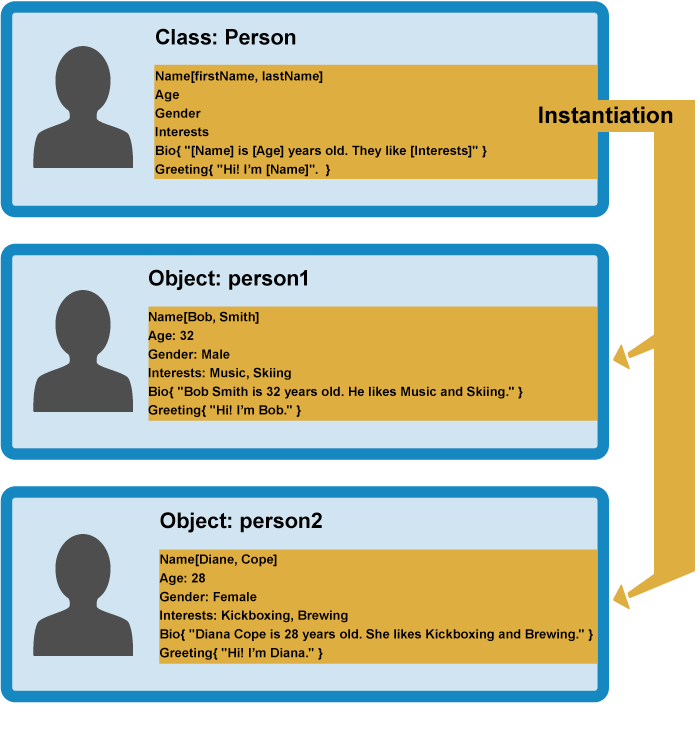
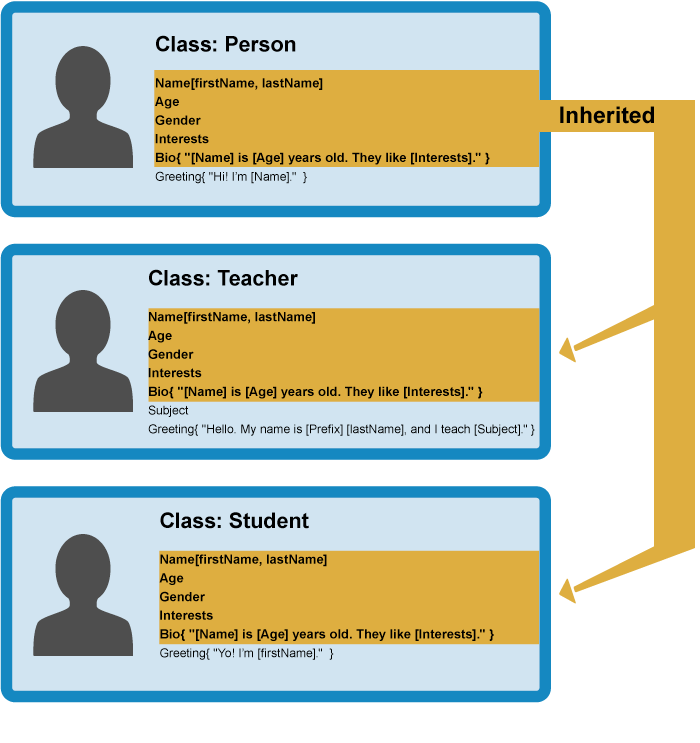

{{LearnSidebar}}{{PreviousMenuNext("Learn/JavaScript/Objects/Basics", "Learn/JavaScript/Objects/Object_prototypes", "Learn/JavaScript/Objects")}}

Разобравшись с основами, сосредоточимся на объектно-ориентированном JavaScript (OOJS) — данная статья даёт базовое представление о теории объектно-ориентированного программирования (ООП), далее рассмотрено как JavaScript эмулирует классы объектов с помощью функции-конструктора и как создаются экземпляры объектов.

<table class="learn-box standard-table">
  <tbody>
    <tr>
      <th scope="row">Необходимые знания:</th>
      <td>
        <p class="brush: html">
          Базовая компьютерная грамотность, базовое понимание HTML и CSS,
          знакомство с основами JavaScript (см.
          <a href="/ru/docs/Learn/JavaScript/First_steps">Первые шаги</a> и
          <a href="/ru/docs/Learn/JavaScript/Building_blocks">C</a
          >структурные элементы JavaScript) и основы OOJS (см.
          <a href="/ru/docs/Learn/JavaScript/Object-oriented/Introduction"
            >Введение в объекты</a
          >).
        </p>
      </td>
    </tr>
    <tr>
      <th scope="row">Цель:</th>
      <td>
        Понять основную теорию объектно-ориентированного программирования, как
        это относится к JavaScript («все является объектом») и как создавать
        конструкторы и экземпляры объектов.
      </td>
    </tr>
  </tbody>
</table>

## Объектно-ориентированное программирование: основы

Начнём с упрощённого высокоуровневого представления о том, что такое _объектно-ориентированное программирование_ _(ООП)_. Мы говорим упрощённого, потому что ООП может быстро стать очень сложным, и если сейчас дать полный курс, вероятно, можно запутать больше, чем помочь. Основная идея ООП заключается в том, что мы используем объекты для отображения моделей из реального мира в наших программах и/или упрощения доступа к функциям, которые в противном случае было бы трудно или невозможно использовать.

Объекты могут содержать данные и код, представляющие информацию о том, что вы пытаетесь смоделировать, а также о том, какие у этих объектов должны быть функциональные возможности или поведение. Данные объекта (а часто так же и функции) могут быть точно сохранены (официальный термин "**инкапсулированы"**) внутри пакета объекта, упрощая структуру и доступ к ним. Пакету объекта может быть присвоено определённое имя, на которое можно сослаться и которое иногда называют **пространством имён.** Объекты также широко используются в качестве хранилищ данных, которые могут быть легко отправлены по сети.

### Определение шаблона объекта

Рассмотрим простую программу, которая отображает информацию об учениках и учителях в школе. Здесь мы рассмотрим теорию ООП в целом, а не в контексте какого-либо конкретного языка программирования.

Вернёмся к объекту Person из нашей статьи [Основы объектов](/ru/docs/Learn/JavaScript/Объекты/Основы), который определяет общие сведения и функциональные возможности человека. Есть много вещей, которые вы _можете_ узнать о человеке (его адрес, рост, размер обуви, профиль ДНК, номер паспорта, значимые черты личности ...), но в данном случае нас интересует только имя, возраст, пол и интересы, а также мы хотим иметь возможность написать краткую информацию о нём, основываясь на этих данных, и сделать так, чтобы он поздоровался. Это известно как **абстракция** — создание простой модели более сложной сущности, которая представляет её наиболее важные аспекты таким образом, чтобы с ней было удобно работать для выполнения целей нашей программы.


В некоторых языках ООП, это общее определение типа объекта называется **class** (JavaScript использует другой механизм и терминологию, как вы увидите ниже) — это на самом деле не объект, а шаблон, который определяет, какие характеристики должен иметь объект.

### Создание реальных объектов

Из нашего класса мы можем создать **экземпляры объектов** — объекты, содержащие данные и функциональные возможности, определённые в классе. Из нашего класса Person мы теперь можем создавать модели реальных людей:



Когда экземпляр объекта создаётся из класса, для его создания выполняется **функция-конструктор** класса. Этот процесс создания экземпляра объекта из класса называется **создание экземпляра (instantiation)** — из класса **создаётся** экземпляр объекта.

### Специализированные классы

В нашем случае нам не нужны все люди — нам требуются учителя и ученики, которые являются более конкретными типами людей. В ООП мы можем создавать новые классы на основе других классов — эти новые **дочерние классы** могут быть созданы для **наследования** данных и характеристик **родительского класса**, так чтобы можно было использовать функциональные возможности, общие для всех типов объекта, вместо того чтобы дублировать их. Когда функциональность различается между классами, можно по мере необходимости определять специализированные функции непосредственно на них.



Это действительно полезно — преподаватели и студенты имеют много общих характеристик, таких как имя, пол и возраст, и удобно определить их только один раз. Вы можете также задать одну и ту же характеристику отдельно в разных классах, поскольку каждое определение этой характеристики будет находиться в отдельном пространстве имён. Например, приветствие студента может быть в форме "Yo, I'm \[firstName]" (например _Yo, I'm Sam_), в то время как учитель может использовать что-то более формальное, такое как "Hello, my name is \[Prefix] \[lastName], and I teach \[Subject]." (например _Hello, My name is Mr Griffiths, and I teach Chemistry_).

> **Примечание:** Если вам интересно, существует специальный термин **Polymorphism (Полиморфизм)** - это забавное слово, обозначающее реализацию той же функциональности для нескольких типов объекта.

Теперь вы можете создавать экземпляры объекта из дочерних классов. Например:


Далее мы рассмотрим, как ООП теорию можно применить на практике в JavaScript.

## Конструкторы и экземпляры объектов

JavaScript использует специальные функции, называемые функциями конструктора (**constructor functions**) для определения объектов и их свойств. Они полезны, потому что вы часто будете сталкиваться с ситуациями, в которых не известно, сколько объектов вы будете создавать; конструкторы позволяют создать столько объектов, сколько нужно эффективным способом, прикреплением данных и функций для объектов по мере необходимости.

Рассмотрим создание классов через конструкторы и создание экземпляров объектов из них в JavaScript. Прежде всего, мы хотели бы, чтобы вы создали новую локальную копию файла [oojs.html](https://github.com/mdn/learning-area/blob/master/javascript/oojs/introduction/oojs.html), который мы видели в нашей первой статье «Объекты».

### Простой пример

1. Давайте рассмотрим как можно определить человека с нормальной функцией. Добавьте эту функцию в элемент `script`:

    ```js
    function createNewPerson(name) {
      const obj = {};
      obj.name = name;
      obj.greeting = function() {
        alert('Hi! I\'m ' + this.name + '.');
      };
      return obj;
    }
    ```

2. Теперь вы можете создать нового человека, вызвав эту функцию - попробуйте следующие строки в консоли JavaScript браузера:

    ```js
    const salva = createNewPerson('Salva');
    salva.name;
    salva.greeting();
    ```

    Это работает достаточно хорошо, но код излишне многословен; если мы знаем, что хотим создать объект, зачем нам явно создавать новый пустой объект и возвращать его? К счастью, JavaScript предоставляет нам удобный способ в виде функций-конструкторов - давайте сделаем это сейчас!

3. Замените предыдущую функцию следующей:

    ```js
    function Person(name) {
      this.name = name;
      this.greeting = function() {
        alert('Hi! I\'m ' + this.name + '.');
      };
    }
    ```

Функция-конструктор - это JavaScript версия класса. Вы заметите, что в нем есть все признаки, которые вы ожидаете от функции, хотя он ничего не возвращает и явно не создаёт объект - он в основном просто определяет свойства и методы. Вы также увидите, что ключевое слово this также используется здесь, - это в основном говорит о том, что всякий раз, когда создаётся один из этих экземпляров объектов, свойство имени объекта будет равно значению `name`, переданному вызову конструктора, и метод `greeting()` будет использовать значение имени, переданное также вызову конструктора.

> **Примечание:** Имя функции конструктора обычно начинается с заглавной буквы - это соглашение используется для упрощения распознавания функций конструктора в коде.

Итак, как мы вызываем конструктор для создания некоторых объектов?

1. Добавьте следующие строки под предыдущим добавлением кода:

    ```js
    let person1 = new Person('Bob');
    let person2 = new Person('Sarah');
    ```

2. Сохраните код и перезагрузите его в браузере и попробуйте ввести следующие строки в консоль JS:

    ```js
    person1.name
    person1.greeting()
    person2.name
    person2.greeting()
    ```

Круто! Теперь, как вы видите, у нас есть два новых объекта на странице, каждый из которых хранится в отдельном пространстве имён - при доступе к их свойствам и методам вы должны начинать вызовы с `person1` или `person2`; функциональность, содержащаяся внутри, аккуратно упакована, поэтому она не будет конфликтовать с другими функциями. Тем не менее, у них есть одно и то же свойство `name` и `greeting()`. Обратите внимание, что они используют своё собственное значение `name`, которое было присвоено им, когда они были созданы; это одна из причин, почему очень важно использовать `this`, таким образом они будут использовать свои собственные значения, а не какие-либо другие.

Давайте снова посмотрим на вызовы конструктора:

```js
let person1 = new Person('Bob');
let person2 = new Person('Sarah');
```

В каждом случае ключевое слово `new` используется, чтобы сообщить браузеру, что мы хотим создать экземпляр нового объекта, за которым следует имя функции с её необходимыми параметрами, содержащимися в круглых скобках, и результат сохраняется в переменной - очень похоже на то, как вызывается стандартная функция. Каждый экземпляр создаётся в соответствии с этим определением:

```js
function Person(name) {
  this.name = name;
  this.greeting = function() {
    alert('Hi! I\'m ' + this.name + '.');
  };
}
```

После создания новых объектов переменные `person1` и `person2` содержат следующие объекты:

```js
{
  name: 'Bob',
  greeting: function() {
    alert('Hi! I\'m ' + this.name + '.');
  }
}

{
  name: 'Sarah',
  greeting: function() {
    alert('Hi! I\'m ' + this.name + '.');
  }
}
```

Обратите внимание, что когда мы вызываем нашу функцию-конструктор, мы определяем `greeting()` каждый раз, что не является идеальным. Чтобы этого избежать, вместо этого мы можем определить функции на прототипе, о которых мы поговорим позже.

### Создавая наш готовый конструктор

Пример, рассмотренный выше, был лишь наглядным примером, чтобы вы поняли суть. Теперь, давайте создадим нашу конечную функцию-конструктор `Person()`.

1. Замените весь предыдущий код новой функцией конструктора - это, в принципе, тот же самое что и в наглядном примере, но несколько сложнее:

    ```js
    function Person(first, last, age, gender, interests) {
      this.name = {
        first : first,
        last: last
      };
      this.age = age;
      this.gender = gender;
      this.interests = interests;
      this.bio = function() {
        alert(this.name.first + ' ' + this.name.last + ' is ' + this.age + ' years old. He likes ' + this.interests[0] + ' and ' + this.interests[1] + '.');
      };
      this.greeting = function() {
        alert('Hi! I\'m ' + this.name.first + '.');
      };
    };
    ```

2. Теперь добавьте следующую строку ниже, чтобы создать экземпляр объекта из него:

    ```js
    let person1 = new Person('Bob', 'Smith', 32, 'male', ['music', 'skiing']);
    ```

Как вы могли заметить, вы можете получить доступ к свойствам и методам, как это было ранее, - попробуйте использовать их в консоли JS:

```js
person1['age']
person1.interests[1]
person1.bio()
// etc.
```

> **Примечание:** Если у вас возникли проблемы с работой кода, попробуйте сравнить его с нашей версией - см. [oojs-class-finished.html](https://github.com/mdn/learning-area/blob/master/javascript/oojs/introduction/oojs-class-finished.html) (также смотрите, как он работает [в прямом эфире](https://mdn.github.io/learning-area/javascript/oojs/introduction/oojs-class-finished.html)).

### Дальнейшие упражнения

Для начала, попробуйте добавить ещё пару собственных строк создания объекта и попробуйте получить и установить элементы полученных экземпляров объектов.

Кроме того, есть несколько проблем с нашим методом `bio()` - вывод всегда включает местоимение «He» ("Он" в пер. с англ.), даже если ваш человек является женщиной или какой-либо другой предпочтительной гендерной классификацией. И `bio` будет включать только два интереса, даже если в массиве `interests` указано больше. Можете ли вы решить, как исправить это в определении класса (конструкторе)? Вы можете поместить любой код, который вам нравится внутри конструктора (вам, вероятно, понадобятся несколько условий и цикл). Подумайте о том, как предложения должны быть структурированы по-разному в зависимости от пола и в зависимости от того, имеет ли число перечисленных интересов 1, 2 или более 2.

> **Примечание:** Если у вас возникли трудности с решением задачи, мы предоставили [ответ в нашем репозитории GitHub](https://github.com/mdn/learning-area/blob/master/javascript/oojs/introduction/oojs-class-further-exercises.html) ([см. это в действии](http://mdn.github.io/learning-area/javascript/oojs/introduction/oojs-class-further-exercises.html)) — но сначала попробуйте написать сами!

## Другие способы создания экземпляров объектов

До сих пор мы видели два разных способа создания экземпляра объекта - [объявление объектного литерала](/ru/docs/Learn/JavaScript/Objects/Basics#Object_basics) и использование функции конструктора (см. выше).

Это имеет смысл, но есть и другие способы - мы бы хотели ознакомить вас с ними на случай, если вы встретите их в своих путешествиях по Сети.

### Конструктор Object ()

Прежде всего, вы можете использовать конструктор [`Object()`](https://developer.mozilla.org/ru/docs/Web/JavaScript/Reference/Global_Objects/Object) для создания нового объекта. Да, даже общие объекты имеют конструктор, который генерирует пустой объект.

1. Попробуйте ввести это в консоль JavaScript вашего браузера:

    ```js
    let person1 = new Object();
    ```

2. Это сохраняет ссылку на пустой объект в переменную `person1`. Затем вы можете добавить свойства и методы к этому объекту с использованием точечной или скобочной нотации по желанию; попробуйте эти примеры в консоли:

    ```js
    person1.name = 'Chris';
    person1['age'] = 38;
    person1.greeting = function() {
      alert('Hi! I\'m ' + this.name + '.');
    };
    ```

3. Вы также можете передать литерал объекта конструктору `Object()` в качестве параметра, чтобы заполнить его свойствами / методами. Попробуйте это в консоли JS:

    ```js
    let person1 = new Object({
      name: 'Chris',
      age: 38,
      greeting: function() {
        alert('Hi! I\'m ' + this.name + '.');
      }
    });
    ```

### Использование метода create()

Конструкторы могут помочь вам определить порядок кода - вы можете создать конструктор в одном месте, а затем создавать экземпляры по мере необходимости, и их происхождение будет понятным.

Однако некоторые люди предпочитают создавать экземпляры объектов без предварительного создания конструкторов, особенно если они создают только несколько экземпляров объекта. JavaScript имеет встроенный метод [`create()`](https://developer.mozilla.org/ru/docs/Web/JavaScript/Reference/Global_Objects/Object/create), который позволяет вам это делать. С его помощью вы можете создать новый объект на основе любого существующего объекта.

1. Закончив упражнение из предыдущего раздела, загруженное в браузер, попробуйте это в консоли JavaScript:

    ```js
    let person2 = Object.create(person1);
    ```

2. Теперь попробуйте:

    ```js
    person2.name
    person2.greeting()
    ```

Вы увидите, что `person2` был создан на основе `person1` - он имеет те же свойства и метод, доступные для него.

Одно ограничение метода `create()` заключается в том, что IE8 не поддерживает его. Поэтому конструкторы могут быть более эффективными, если вы хотите поддерживать старые браузеры.

Подробнее мы рассмотрим особенности метода `create()` немного позже.

## Сводка

В этой статье представлен упрощённый взгляд на объектно-ориентированную теорию — это ещё не вся история, но она даёт представление о том, с чем мы имеем дело. Кроме того, мы начали рассматривать различные способы создания экземпляров объектов.

В следующей статье мы рассмотрим прототипы объектов JavaScript.

{{PreviousMenuNext("Learn/JavaScript/Objects/Basics", "Learn/JavaScript/Objects/Object_prototypes", "Learn/JavaScript/Objects")}}

## В этом модуле

- [Основы объекта](/ru/docs/Learn/JavaScript/Объекты/Основы)
- [Объектно-ориентированный JavaScript для начинающих](/ru/docs/Learn/JavaScript/Объекты/Object-oriented_JS)
- [Прототипы объектов](/ru/docs/Learn/JavaScript/Объекты/Object_prototypes)
- [Наследование в JavaScript](/ru/docs/Learn/JavaScript/Объекты/Inheritance)
- [Работа с данными JSON](/ru/docs/Learn/JavaScript/Объекты/JSON)
- [Практика построения объектов](/ru/docs/Learn/JavaScript/Объекты/Object_building_practice)
- [Добавление функций в нашу демонстрацию прыгающих шаров](/ru/docs/Learn/JavaScript/Объекты/Adding_bouncing_balls_features)
