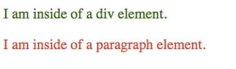

**CSS-селектор** это часть CSS-правила, которая позволяет вам указать, к какому элементу (элементам) применить стиль. Например:

```
***HTML***
<div> I am inside of a div element. </div>
<p> I am inside of a paragraph element. </p>


***CSS***
div {
 color: green;
}

p {
 color: red;
}
```

В первом CSS-правиле я выбираю элемент div и задаю его стиль (цвет текста — зелёный). Во втором CSS-правиле выбираю элемент p и задаю красный цвет текста. Вот как выглядит результат:



## Смотрите также

### Основные статьи

1. Базовые селекторы

   1. [Селекторы по типу](/ru/docs/Web/CSS/Type_selectors) `elementname`
   2. [Селекторы по классу](/ru/docs/Web/CSS/Class_selectors) `.classname`
   3. [Селекторы по ID](/ru/docs/Web/CSS/ID_selectors) `#idname`
   4. [Универсальные селекторы](/ru/docs/Web/CSS/Universal_selectors) `* ns|* *|*`
   5. [Атрибутивные селекторы](/ru/docs/Web/CSS/Attribute_selectors) `[attr=value]`
   6. [Селекторы состояния элементов](/ru/docs/Web/CSS/Pseudo-classes) `a:active, a:visited`

2. Группирующие селекторы

   1. [Список селекторов](/ru/docs/Web/CSS/Selector_list) `A, B`

3. Комбинаторы

   1. [Adjacent sibling selectors](/ru/docs/Web/CSS/Adjacent_sibling_selectors) `A + B`
   2. [General sibling selectors](/ru/docs/Web/CSS/General_sibling_selectors) `A ~ B`
   3. [Child selectors](/ru/docs/Web/CSS/Child_selectors) `A > B`
   4. [Descendant selectors](/ru/docs/Web/CSS/Descendant_selectors) `A B`

4. Псевдо

   1. [Псевдоклассы](/ru/docs/Web/CSS/Pseudo-classes) `:`
   2. [Псевдоэлементы](/ru/docs/Web/CSS/Pseudo-elements) `::`
