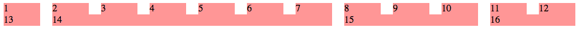
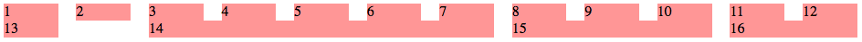
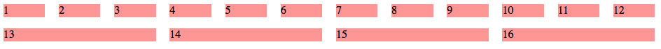
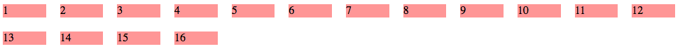
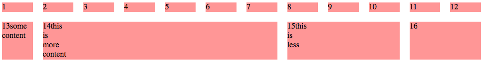

{{LearnSidebar}}{{PreviousMenuNext("Learn/CSS/CSS_layout/Flexbox", "Learn/CSS/CSS_layout/Floats", "Learn/CSS/CSS_layout")}}Сетки (grids) являются установленным инструментом проектирования и многие современные макеты веб-сайта основаны на регулярной сетке. В этой статье мы рассмотрим дизайн на основе сетки и увидим как CSS можно использовать для создания сеток — как с помощью современных инструментов, так и с помощью новых технологий, которые только начинают становиться доступными в браузерах.

| Необходимые навыки: | основы HTML(изучите [Introduction to HTML](/ru/docs/Learn/HTML/Introduction_to_HTML)), понимание как работает CSS (изучите [Introduction to CSS](/ru/docs/Learn/CSS/Introduction_to_CSS) и [Styling boxes](/ru/docs/Learn/CSS/Styling_boxes).) |
| ------------------- | ---------------------------------------------------------------------------------------------------------------------------------------------------------------------------------------------------------------------------------------------- |
| Задача:             | Понять основные концепции, лежащие в основе систем компоновки сетки и как реализовать сетку на веб-странице.                                                                                                                                   |

## Что такое макет сетки (grid layout)?

Сетка (grid) - это просто набор горизонтальных и вертикальных линий, создающих шаблон, по которому мы можем выстроить элементы дизайна. Они помогают нам создавать проекты, в которых элементы не прыгают или не меняют ширину при переходе от страницы к странице, обеспечивая большую согласованность на наших сайтах.

В сетке обычно будут **столбцы (columns)**, **строки (rows)**, а затем промежутки между каждой строкой и столбцом, обычно называемые **желобами (gutters)**.


\[Временная диаграмма; скоро будет заменена лучшей диаграммой.]

> **Примечание:** Может показаться удивительным, если кто-нибудь из фона дизайна, что CSS не имеет встроенной сетки, и вместо этого мы, похоже, используем множество субоптимальных методов для создания сетчатых конструкций. Как вы узнаете в последней части этой статьи, это изменится, однако вам, вероятно, понадобятся существующие методы создания гридов в течение некоторого времени.

## Использование "grid system" в ваших проектах

Чтобы обеспечить постоянный опыт на вашем сайте или в приложении, основываясь на системе сетки с самого начала, вам не нужно думать о том, насколько широкий элемент имеет отношение к другим элементам. Ваш выбор ограничен «количеством столбцов сетки, которые этот элемент будет охватывать».

Ваша «сеточная система» может быть просто решением, принятым в процессе проектирования, для использования регулярной сетки. Если ваши проекты начнутся в приложении для редактирования графики, например Photoshop, вы можете создать сетку для ссылки во время этого процесса, как описано в [A better Photoshop grid for responsive web design](http://www.elliotjaystocks.com/blog/a-better-photoshop-grid-for-responsive-web-design/) by Elliot Jay Stocks.

Ваша сетевая система также может быть структурой - либо третьей стороной, либо созданной вами только для вашего проекта, - которую вы используете для обеспечения сетки с помощью CSS.

## Создание простых рамок сетки

Мы начнём с рассмотрения того, как вы можете создать простую сетку для вашего проекта.

В настоящее время большинство макетов типа grid создаются с использованием поплавков (floats). Если вы прочитали [нашу предыдущую статью о поплавках,](/ru/docs/Learn/CSS/CSS_layout/Floats) вы уже видели, как мы можем использовать эту технику для создания раскладки нескольких столбцов, что является сущностью любой сетки, использующей этот метод.

Самый простой тип структуры сетки для создания фиксированной ширины — нам просто нужно выяснить, сколько общей ширины мы хотим для нашего дизайна, сколько столбцов мы хотим и насколько широки должны быть желоба и столбцы. Если бы вместо этого мы решили выложить наш проект на сетке со столбцами, которые растут и сокращаются в соответствии с шириной браузера, нам нужно будет рассчитать процентную ширину для столбцов и желобов между ними.

В следующих разделах мы рассмотрим, как создать оба. Мы создадим сетку с 12 столбцами - очень общий выбор, который, как видно, очень адаптируется к различным ситуациям, учитывая, что 12 прекрасно делится на 6, 4, 3 и 2.

### Простая сетка с фиксированной шириной

Давайте сначала создадим сетку, использующую столбцы фиксированной ширины.

Начните с создания локальной копии нашего образца [simple-grid.html](https://github.com/mdn/learning-area/blob/master/css/css-layout/grids/simple-grid.html) файла, который содержит следующую разметку в своём теле.

```html
<div class="wrapper">
  <div class="row">
    <div class="col">1</div>
    <div class="col">2</div>
    <div class="col">3</div>
    <div class="col">4</div>
    <div class="col">5</div>
    <div class="col">6</div>
    <div class="col">7</div>
    <div class="col">8</div>
    <div class="col">9</div>
    <div class="col">10</div>
    <div class="col">11</div>
    <div class="col">12</div>
  </div>
  <div class="row">
    <div class="col span1">13</div>
    <div class="col span6">14</div>
    <div class="col span3">15</div>
    <div class="col span2">16</div>
  </div>
</div>
```

Цель состоит в том, чтобы превратить это в демонстрационную сетку из двух рядов на двенадцать столбцов сетки (grid) - верхний ряд, демонстрирующий размер отдельных столбцов, второй ряд - некоторые области разного размера в сетке.



В элементе {{htmlelement ("style")}} добавьте следующий код, который даёт контейнеру ширину 980 пикселей с отступом с правой стороны 20 пикселей. Это даёт нам 960 пикселей для нашей общей ширины столбца/желоба - в этом случае отступы вычитаются из общей ширины содержимого, потому что мы установили {{cssxref ("box-sizing")}} в рамку по всем элементам на сайте (см. [Changing the box model completely](/ru/docs/Learn/CSS/Styling_boxes/Box_model_recap#Changing_the_box_model_completely) для большего объяснения).

```css
* {
  box-sizing: border-box;
}

body {
  width: 980px;
  margin: 0 auto;
}

.wrapper {
  padding-right: 20px;
}
```

Теперь используйте контейнер строк, который обёрнут вокруг каждой строки сетки, чтобы очистить одну строку от другой. Добавьте следующее правило ниже предыдущего:

```css
.row {
  clear: both;
}
```

Применение этого клиринга означает, что нам не нужно полностью заполнять каждую строку элементами, составляющими полные двенадцать столбцов. Строки будут разделены и не будут мешать друг другу.

Желоба между колоннами шириной 20 пикселей. Мы создаём эти желоба в качестве поля в левой части каждого столбца, включая первый столбец, чтобы сбалансировать 20 пикселей прокладки в правой части контейнера. Таким образом, у нас есть 12 водосточных желобов - 12 x 20 = 240.

Нам нужно вычесть это из нашей общей ширины 960 пикселей, что даёт нам 720 пикселей для наших столбцов. Если мы разделим это на 12, мы знаем, что каждый столбец должен быть 60 пикселей в ширину. Наш следующий шаг - создать правило для класса `.col`, плавающее влево, предоставив ему {{cssxref ("margin-left")}} из 20 пикселей для формирования желоба и {{cssxref ("width" )}} из 60 пикселей. Добавьте нижеследующее правило в CSS:

```css
.col {
  float: left;
  margin-left: 20px;
  width: 60px;
  background: rgb(255, 150, 150);
}
```

Верхний ряд отдельных столбцов теперь будет аккуратно размещаться в виде сетки.

> **Примечание:** Мы также дали каждому столбцу светло-красный цвет, чтобы вы могли точно видеть, сколько места занимает каждый.

В контейнерах макетов, которые мы хотим разместить более одного столбца, нужно предоставить специальные классы, чтобы скорректировать их значения {{cssxref ("width")}} до необходимого количества столбцов (плюс желоба между ними). Нам нужно создать дополнительный класс, чтобы контейнеры могли охватывать от 2 до 12 столбцов. Каждая ширина является результатом сложения ширины столбца этого количества столбцов плюс ширины желоба, который всегда будет набирать номер меньше, чем число столбцов.

Добавьте нижеследующую часть вашего CSS:

```css
/
  *
  Ширина
  двух
  колонок
  (120 пикселей)
  плюс
  одна
  ширина
  желоба
  (20 пикселей)
  */
  .col.span2 {
  width: 140px;
}
/
  *
  Три
  ширины
  столбца
  (180 пикселей)
  плюс
  две
  ширины
  желоба
  (40 пикселей)
  *
  /
  .col.span3 {
  width: 220px;
}
/* И так далее... */
.col.span4 {
  width: 300px;
}
.col.span5 {
  width: 380px;
}
.col.span6 {
  width: 460px;
}
.col.span7 {
  width: 540px;
}
.col.span8 {
  width: 620px;
}
.col.span9 {
  width: 700px;
}
.col.span10 {
  width: 780px;
}
.col.span11 {
  width: 860px;
}
.col.span12 {
  width: 940px;
}
```

С помощью этих классов мы можем теперь выкладывать разные столбцы ширины в сетке. Попробуйте сохранить и загрузить страницу в своём браузере, чтобы увидеть эффекты.

> **Примечание:** Если вам не удаётся заставить приведённый выше пример работать, попробуйте сравнить его с нашей [готовой версией](https://github.com/mdn/learning-area/blob/master/css/css-layout/grids/simple-grid-finished.html) на GitHub (см. также [запуск в режиме реального времени](https://mdn.github.io/learning-area/css/css-layout/grids/simple-grid-finished.html)).

Попробуйте изменить классы на своих элементах или даже добавить и удалить некоторые контейнеры, чтобы увидеть, как вы можете изменять макет. Например, вы можете сделать вторую строку следующим образом:

```css
<div class="row">
  <div class="col span8">13</div>
  <div class="col span4">14</div>
</div>
```

Теперь у вас работает сетка, вы можете просто определить строки и количество столбцов в каждой строке, а затем заполнить каждый контейнер своим необходимым контентом. Отлично!

### Создание fluid grid

Наша сетка работает красиво, но имеет фиксированную ширину. Нам очень нужна гибкая (жидкая) сетка, которая будет расти и сокращаться с доступным пространством в браузере {{Glossary ("viewport")}}. Для этого мы можем использовать опорные пиксельные ширины и превратить их в проценты

Уравнение, которое превращает фиксированную ширину в гибкую, основанную на процентах, выглядит следующим образом.

```
target / context = result
```

Для нашей ширины столбца наша **целевая ширина** составляет 60 пикселей, а наш **контекст** 960 пикселей. Для расчёта процента мы можем использовать следующее.

```
60 / 960 = 0.0625
```

Затем мы перемещаем десятичные точки на 2 места, давая нам процент от 6,25%. Таким образом, в нашем CSS мы можем заменить ширину столбца 60 пикселей на 6,25%.

Мы должны сделать то же самое с нашей шириной желоба:

```
20 / 960 = 0.02083333333
```

Поэтому нам нужно заменить 20 пикселей {{cssxref ("margin-left")}} на наше правило `.col` 20 пикселей {{cssxref ("padding-right")}} на `.wrapper` с 2.08333333%.

#### Обновление нашей сетки

Чтобы начать работу в этом разделе, создайте новую копию предыдущей страницы примера или создайте локальную копию нашего кода [simple-grid-finished.html](https://github.com/mdn/learning-area/blob/master/css/css-layout/grids/simple-grid-finished.html), который будет использоваться в качестве отправной точки.

Обновите второе правило CSS (с помощью селектора `.wrapper`) следующим образом:

```css
body {
  width: 90%;
  max-width: 980px;
  margin: 0 auto;
}

.wrapper {
  padding-right: 2.08333333%;
}
```

Мы не только дали нам процент {{cssxref ("width")}}, мы также добавили свойство {{cssxref ("max-width")}}, чтобы остановить распространение макета.

Затем обновите четвёртое правило CSS (с селектором `.col`) следующим образом:

```css
.col {
  float: left;
  margin-left: 2.08333333%;
  width: 6.25%;
  background: rgb(255, 150, 150);
}
```

Теперь идёт немного более трудоёмкая часть - нам нужно обновить все наши правила `.col.span`, чтобы использовать проценты, а не ширину пикселей. Это занимает немного времени с калькулятором; чтобы сэкономить вам немного усилий, мы сделали это для вас ниже.

Обновите нижний блок правил CSS следующим образом:

```css
/* Two column widths (12.5%) plus one gutter width (2.08333333%) */
.col.span2 {
  width: 14.58333333%;
}
/* Three column widths (18.75%) plus two gutter widths (4.1666666) */
.col.span3 {
  width: 22.91666666%;
}
/* And so on... */
.col.span4 {
  width: 31.24999999%;
}
.col.span5 {
  width: 39.58333332%;
}
.col.span6 {
  width: 47.91666665%;
}
.col.span7 {
  width: 56.24999998%;
}
.col.span8 {
  width: 64.58333331%;
}
.col.span9 {
  width: 72.91666664%;
}
.col.span10 {
  width: 81.24999997%;
}
.col.span11 {
  width: 89.5833333%;
}
.col.span12 {
  width: 97.91666663%;
}
```

Теперь сохраните свой код, загрузите его в браузере и попробуйте изменить ширину видового экрана - вы должны увидеть, что ширины столбцов хорошо меняются. Отлично!

> **Примечание:** Если вам не удаётся заставить приведённый выше пример работать, попробуйте сравнить его с нашей [готовой версией на GitHub](https://github.com/mdn/learning-area/blob/master/css/css-layout/grids/fluid-grid.html) (см. также [запуск в режиме реального времени](https://mdn.github.io/learning-area/css/css-layout/grids/fluid-grid.html)).

### Более простые вычисления с использованием функции calc()

Вы можете использовать функцию {{cssxref ("calc ()")}} для выполнения математики прямо внутри вашего CSS - это позволяет вставлять простые математические уравнения в ваши значения CSS, чтобы рассчитать, какое значение должно быть. Это особенно полезно, когда необходимо выполнить сложную математику и вы даже можете сделать расчёт, который использует разные единицы, например «Я хочу, чтобы высота этого элемента всегда была на 100% от высоты родителя, минус 50 пикселей». См. [этот пример из учебника API MediaRecorder](</ru/docs/Web/API/MediaStream_Recording_API/Using_the_MediaStream_Recording_API#Keeping_the_interface_constrained_to_the_viewport_regardless_of_device_height_with_calc()>).

В любом случае, вернёмся к нашим сетям! Любой столбец, который охватывает более одного столбца нашей сетки, имеет общую ширину 6,25%, умноженную на количество столбцов, спаренных плюс 2.08333333%, умноженное на количество желобов (которые всегда будут числом столбцов минус 1). Функция `calc()` позволяет нам делать это вычисление прямо внутри значения ширины, поэтому для любого элемента, охватывающего 4 столбца, мы можем это сделать, например:

```css
.col.span4 {
  width: calc((6.25% * 4) + (2.08333333% * 3));
}
```

Попробуйте заменить нижний блок правил следующим, а затем перезагрузите его в браузере, чтобы узнать, получаете ли вы тот же результат:

```css
.col.span2 {
  width: calc((6.25% * 2) + 2.08333333%);
}
.col.span3 {
  width: calc((6.25% * 3) + (2.08333333% * 2));
}
.col.span4 {
  width: calc((6.25% * 4) + (2.08333333% * 3));
}
.col.span5 {
  width: calc((6.25% * 5) + (2.08333333% * 4));
}
.col.span6 {
  width: calc((6.25% * 6) + (2.08333333% * 5));
}
.col.span7 {
  width: calc((6.25% * 7) + (2.08333333% * 6));
}
.col.span8 {
  width: calc((6.25% * 8) + (2.08333333% * 7));
}
.col.span9 {
  width: calc((6.25% * 9) + (2.08333333% * 8));
}
.col.span10 {
  width: calc((6.25% * 10) + (2.08333333% * 9));
}
.col.span11 {
  width: calc((6.25% * 11) + (2.08333333% * 10));
}
.col.span12 {
  width: calc((6.25% * 12) + (2.08333333% * 11));
}
```

> **Примечание:** вы можете увидеть нашу законченную версию в файле [liquid-grid-calc.html](https://github.com/mdn/learning-area/blob/master/css/css-layout/grids/fluid-grid-calc.html) (также см. её [в режиме реального времени](https://mdn.github.io/learning-area/css/css-layout/grids/fluid-grid-calc.html)).

> **Примечание:** Если вы не можете заставить это работать, возможно, это связано с тем, что ваш браузер не поддерживает функцию `calc ()`, хотя он довольно хорошо поддерживается в браузерах - ещё в IE9.

### Семантические и "несемантические" сетчатые системы

Добавление классов в вашу разметку для определения макета означает, что ваш контент и разметка привязаны к его визуальному представлению. Иногда вы слышите это использование классов CSS, описанных как «несемантические», - описывая, как выглядит контент, а не семантическое использование классов, описывающих контент. Это относится к классам `span2`, `span3` и т. Д.

Это не единственный подход. Вместо этого вы можете выбрать свою сетку, а затем добавить информацию о размерах в правила для существующих семантических классов. Например, если у вас есть {{htmlelement ("div")}} с классом `content` в нем, который вы хотите разбить на 8 столбцов, вы можете скопировать по ширине из класса `span8`, предоставив вам следующее правило:

```css
.content {
  width: calc((6.25% * 8) + (2.08333333% * 7));
}
```

> **Примечание:** Если вы использовали препроцессор, такой как [Sass](http://sass-lang.com/), вы могли бы создать простой mixin, чтобы вставить это значение для вас.

### Включение офсетных контейнеров в нашей сетке

Сетка, которую мы создали, работает хорошо, пока мы хотим запустить все контейнеры заподлицо с левой стороны сетки. Если бы мы хотели оставить пустое пространство столбца перед первым контейнером - или между контейнерами - нам нужно было бы создать класс смещения, чтобы добавить левое поле на наш сайт, чтобы визуально визуализировать его по сетке. Больше математики!

Давайте попробуем это.

Начните с предыдущего кода или используйте наш файл [fluid-grid.html](https://github.com/mdn/learning-area/blob/master/css/css-layout/grids/fluid-grid.html) в качестве отправной точки.

Давайте создадим класс в нашем CSS, который будет смещать элемент контейнера на одну ширину столбца. Добавьте нижеследующую часть вашего CSS:

```css
.offset-by-one {
  margin-left: calc(6.25% + (2.08333333% * 2));
}
```

Или если вы предпочитаете самостоятельно рассчитать проценты, используйте это:

```css
.offset-by-one {
  margin-left: 10.41666666%;
}
```

Теперь вы можете добавить этот класс в любой контейнер, в котором вы хотите оставить пустое пространство с одним столбцом в левой части окна. Например, если у вас есть это в вашем HTML:

```html
<div class="col span6">14</div>
```

Попробуйте заменить его на

```html
<div class="col span5 offset-by-one">14</div>
```

> **Примечание:** Обратите внимание, что вам необходимо уменьшить количество столбцов, чтобы освободить место для смещения!

Попытайтесь загрузить и обновить, чтобы увидеть разницу или посмотрите наш пример [fluid-grid-offset.html](https://github.com/mdn/learning-area/blob/master/css/css-layout/grids/fluid-grid-offset.html) (см. [также «live»](https://mdn.github.io/learning-area/css/css-layout/grids/fluid-grid-offset.html)). Готовый пример должен выглядеть так:



> **Примечание:** В качестве дополнительного упражнения вы можете реализовать класс «смещение на два»?

### Ограничения с плавающей сеткой

При использовании такой системы вам необходимо позаботиться о том, чтобы ваша общая ширина была правильно вставлена и что вы не включаете элементы в строку, которая содержит больше столбцов, чем может содержать строка. Из-за того, как работают поплавки, если количество столбцов сетки становится слишком большим для сетки, элементы на конце будут опускаться до следующей строки, разбивая сетку.

Также имейте в виду, что если содержимое элементов становится шире, чем занимаемые им строки, оно будет переполняться и выглядит как беспорядок.

Самое большое ограничение этой системы состоит в том, что она по существу одномерна. Мы имеем дело со столбцами и охватываем элементы по столбцам, но не по строкам. С помощью этих старых методов компоновки очень сложно контролировать высоту элементов без явной установки высоты, и это тоже очень негибкий подход - он работает только, если вы можете гарантировать, что ваш контент будет определённой высоты.

## Flexbox grids?

Если вы прочтёте нашу предыдущую статью о [flexbox](/ru/docs/Learn/CSS/CSS_layout/Flexbox), вы можете подумать, что flexbox - идеальное решение для создания сетчатой системы. В настоящее время доступно множество систем gridbox на основе flexbox и flexbox может решить многие из проблем, которые мы уже обнаружили при создании нашей сетки выше.

Однако flexbox никогда не разрабатывался как сетчатая система и создаёт новый набор проблем при использовании в качестве одного. В качестве простого примера мы можем использовать тот же пример разметки, который мы использовали выше, и использовать следующий CSS для стилей классов-оболочек (`wrapper`), `row` и `col` классов:

```css
body {
  width: 90%;
  max-width: 980px;
  margin: 0 auto;
}

.wrapper {
  padding-right: 2.08333333%;
}

.row {
  display: flex;
}

.col {
  margin-left: 2.08333333%;
  margin-bottom: 1em;
  width: 6.25%;
  flex: 1 1 auto;
  background: rgb(255, 150, 150);
}
```

Вы можете попробовать сделать эти замены в своём собственном примере или посмотреть на наш пример кода [flexbox-grid.html](https://github.com/mdn/learning-area/blob/master/css/css-layout/grids/flexbox-grid.html) (см. также [он работает в режиме реального времени](https://mdn.github.io/learning-area/css/css-layout/grids/flexbox-grid.html)).

Здесь мы превращаем каждую строку в гибкий контейнер. С сеткой на основе flexbox нам все ещё нужны строки, чтобы мы могли иметь элементы, которые составляют менее 100%. Мы установили этот контейнер для `display: flex`.

На `.col` мы устанавливаем первое значение свойства {{cssxref ("flex")}} ({{cssxref ("flex-grow")}}) до 1, чтобы наши объекты могли расти, второе значение ({{cssxref (" flex-shrink ")}}) до 1, поэтому элементы могут сокращаться, а третье значение ({{cssxref (" flex-basis ")}}) - `auto`. Поскольку наш элемент имеет набор {{cssxref ("width")}}, `auto` будет использовать эту ширину в качестве базового значения flex (`flex-basis`).

В верхней строке мы получаем двенадцать аккуратных коробок на сетке, и они растут и сжимаются одинаково, когда мы меняем ширину окна просмотра. Однако на следующей строке у нас есть только четыре элемента, и они также растут и сокращаются с 60px. Только с четырьмя из них они могут расти намного больше, чем элементы в строке выше, в результате они все занимают одну и ту же ширину во второй строке.



Чтобы исправить это, нам всё равно нужно включить наши классы `span`, чтобы обеспечить ширину, которая заменит значение, используемое `flex-basis` для этого элемента.

Они также не уважают сетку, используемую выше, потому что они ничего не знают об этом.

Flexbox является **одномерным** по дизайну. Он имеет дело с одним измерением - со строкой или столбцом. Мы не можем создать строгую сетку для столбцов и строк, что означает, что если мы будем использовать flexbox для нашей сетки, нам всё равно нужно рассчитать проценты, как для плавающего макета.

В вашем проекте вы всё равно можете использовать сетку flexbox из-за дополнительных возможностей выравнивания и распределения пространства. Flexbox обеспечивает надплавки. Однако вам следует помнить, что вы все ещё используете инструмент для чего-то другого, кроме того, для чего он предназначен. Таким образом, вы можете почувствовать, что он заставляет вас прыгать через дополнительные обручи, чтобы получить конечный результат, который вы хотите.

## Системы сторонних сетей

Теперь, когда мы понимаем математику за нашими расчётами в сетке, мы находимся в хорошем месте, чтобы взглянуть на некоторые из сторонних сетевых систем, которые используются совместно. Если вы ищете «CSS Grid framework» в Интернете, вы найдёте огромный список вариантов на выбор. В популярных структурах, таких как [Bootstrap](http://getbootstrap.com/) и [Foundation](https://foundation.zurb.com/), есть сетка. Существуют также автономные сетчатые системы, разработанные с использованием CSS или с использованием препроцессоров.

Давайте рассмотрим одну из этих автономных систем, поскольку она демонстрирует общие методы работы с сеткой. Сетка, которую мы будем использовать, является частью Skeleton, простой CSS-структуры.

Для начала посетите [веб-сайт Skeleton](http://getskeleton.com/) и выберите «Загрузить», чтобы загрузить ZIP-файл. Разархивируйте это и скопируйте файлы skeleton.css и normalize.css в новый каталог.

Сделайте копию нашего файла [html-skeleton.html](https://github.com/mdn/learning-area/blob/master/css/css-layout/grids/html-skeleton.html) и сохраните его в том же каталоге, что и скелет, и нормализовать CSS.

Включите скелет и нормализуйте CSS на странице HTML, добавив следующее в голову:

```html
<link href="normalize.css" rel="stylesheet" />
<link href="skeleton.css" rel="stylesheet" />
```

Скелет включает в себя больше, чем сетку - он также содержит CSS для типографики и других элементов страницы, которые вы можете использовать в качестве отправной точки. На данный момент мы оставим их по умолчанию, но именно эта сетка нас действительно интересует.

> **Примечание:** Нормализация - очень полезная небольшая библиотека CSS, написанная Николасом Галлахером, которая автоматически делает некоторые полезные основные исправления макета и делает стиль элементов по умолчанию более согласованным в разных браузерах.

Мы будем использовать аналогичный HTML для нашего предыдущего примера. Добавьте в свой HTML-код следующее:

```html
<div class="container">
  <div class="row">
    <div class="col">1</div>
    <div class="col">2</div>
    <div class="col">3</div>
    <div class="col">4</div>
    <div class="col">5</div>
    <div class="col">6</div>
    <div class="col">7</div>
    <div class="col">8</div>
    <div class="col">9</div>
    <div class="col">10</div>
    <div class="col">11</div>
    <div class="col">12</div>
  </div>
  <div class="row">
    <div class="col">13</div>
    <div class="col">14</div>
    <div class="col">15</div>
    <div class="col">16</div>
  </div>
</div>
```

Чтобы начать использовать Skeleton, нам нужно предоставить оболочку {{htmlelement ("div")}} класс `container` - это уже включено в наш HTML. Это центрирует контент с максимальной шириной 960 пикселей. Вы можете видеть, как теперь коробки не становятся шире, чем 960 пикселей.

Вы можете посмотреть в файле skeleton.css, чтобы увидеть CSS, который используется, когда мы применяем этот класс. `<div>` центрируется с использованием `auto` левого и правого полей, а отступы в 20 пикселей применяются слева и справа. Скелет также устанавливает свойство {{cssxref ("box-sizing")}} в `border-box`, как мы делали это раньше, поэтому дополнение и границы этого элемента будут включены в общую ширину.

```css
.container {
  position: relative;
  width: 100%;
  max-width: 960px;
  margin: 0 auto;
  padding: 0 20px;
  box-sizing: border-box;
}
```

Элементы могут быть только частью сетки, если они находятся внутри строки, так как в нашем предыдущем примере нам нужен дополнительный `<div>` или другой элемент с классом строки (`row`), вложенным между `content` `<div>` и нашим контейнером фактического содержимого `<div>`. Мы уже это сделали.

Теперь давайте выложим контейнеры. Скелет основан на сетке из 12 столбцов. В верхних строках нужны классы из `one column`, чтобы они охватывали один столбец.

Добавьте их сейчас, как показано в следующем фрагменте:

```html
<div class="container">
  <div class="row">
    <div class="one column">1</div>
    <div class="one column">2</div>
    <div class="one column">3</div>
    /* and so on */
  </div>
</div>
```

Затем дайте контейнеры во втором классе классов, объясняющие количество столбцов, которые они должны охватывать, например:

```html
<div class="row">
  <div class="one column">13</div>
  <div class="six columns">14</div>
  <div class="three columns">15</div>
  <div class="two columns">16</div>
</div>
```

Попробуйте сохранить свой HTML-файл и загрузить его в свой браузер, чтобы увидеть эффект.

> **Примечание:** Примечание. Если вам не удаётся заставить этот пример работать, попробуйте сравнить его с нашим [html-skeleton-finished.html](https://github.com/mdn/learning-area/blob/master/css/css-layout/grids/html-skeleton-finished.html) - файлом (см. также [в режиме реального времени](https://mdn.github.io/learning-area/css/css-layout/grids/html-skeleton-finished.html)).

Если вы посмотрите в файле skeleton.css, вы увидите, как это работает. Например, у Skeleton определены следующие элементы стиля с добавленными к ним классами «три столбца».

```css
.three.columns {
  width: 22%;
}
```

Весь Skeleton (или любая другая структура сетки) выполняет настройку предопределённых классов, которые вы можете использовать, добавив их в свою разметку. Это точно так же, как если бы вы сами делали расчёт этих процентов.

Как вы можете видеть, нам нужно написать очень мало CSS при использовании Skeleton. Он касается всех плавающих для нас, когда мы добавляем классы в нашу разметку. Именно эта способность нести ответственность за компоновку над чем-то ещё, что делает использование рамки для сетчатой системы неотразимым выбором!

Skeleton - это более простая сетка, чем некоторые из структур, с которыми вы можете столкнуться. Сетки в больших рамках, таких как Bootstrap и Foundation, предлагают больше функциональности и дополнительные точки останова для различной ширины экрана. Тем не менее, все они работают аналогичным образом - добавив определённые классы в свою разметку, вы можете контролировать, как элемент выложен с использованием предопределённой сетки.

## Родные CSS Сетки с Grid Layout

В начале этой статьи мы сказали, что CSS ранее не имел реальной системы для создания макетов сетки, но это изменится. Хотя мы ещё не можем использовать встроенную сетевую систему CSS, в следующем году мы увидим поддержку браузера для модуля компоновки сетки CSS ([CSS Grid Layout Module](/ru/docs/Web/CSS/CSS_Grid_Layout)).

В настоящее время вы можете использовать только те методы, которые мы покажем вам в браузерах, которые реализуют макет сетки CSS «за флагом» - это означает, что он в настоящее время реализован, но в экспериментальном состоянии, которое вам нужно включить.

В Firefox, например, вам нужно перейти к URL-адресу `about: config`, выполнить поиск по предпочтению `layout.css.grid.enabled` и дважды щёлкнуть его, чтобы включить CSS-сетки. Вы можете узнать, как использовать его в других браузерах, посетив [Grid by Example](http://gridbyexample.com/browsers).

Мы рассмотрели структуру Скелетной сетки выше - как и другие сторонние решётки и даже ручные сетки, для этого требуется добавить `<div>` для формирования строк, а затем указать количество столбцов, которые будут охватывать элементы в этих рядах.

С помощью CSS Grid Layout вы можете полностью указать свою сетку в CSS, не добавляя эти вспомогательные классы в разметку вообще. Давайте рассмотрим наш простой пример и посмотрим, как мы будем создавать тот же макет с помощью CSS Grid Layout.

### Создание собственной сетки

Сначала начните с создания локальной копии файла [css-grid.html](https://github.com/mdn/learning-area/blob/master/css/css-layout/grids/css-grid.html). Он содержит следующую разметку:

```html
<div class="wrapper">
  <div class="col">1</div>
  <div class="col">2</div>
  <div class="col">3</div>
  <div class="col">4</div>
  <div class="col">5</div>
  <div class="col">6</div>
  <div class="col">7</div>
  <div class="col">8</div>
  <div class="col">9</div>
  <div class="col">10</div>
  <div class="col">11</div>
  <div class="col">12</div>
  <div class="col">13</div>
  <div class="col span6">14</div>
  <div class="col span3">15</div>
  <div class="col span2">16</div>
</div>
```

На этот раз у нас есть родительский `<div>` с классом обёртки (`wrapper`), а затем все дочерние элементы просто появляются непосредственно внутри обёртки - никаких элементов строки. Мы добавили класс к элементам, которые должны охватывать более одного столбца.

Теперь добавьте следующее в элемент {{htmlelement ("style")}}:

```css
.wrapper {
  width: 90%;
  max-width: 960px;
  margin: 0 auto;
  display: grid;
  grid-template-columns: repeat(12, 1fr);
  grid-gap: 20px;
}

.col {
  background: rgb(255, 150, 150);
}
```

Здесь мы устанавливаем правило `.wrapper`, поэтому оно составляет 90% от ширины тела, с центром и имеет {{cssxref ("max-width")}} 960px.

Теперь для свойств сетки CSS. Мы можем объявить сетку, используя значение `grid` свойства {{cssxref ("display")}}, установить жёлоб с свойством {{cssxref ("grid-gap")}}, а затем создать сетку из 12 столбцов равной ширине, используя {{cssxref ("grid-template-columns")}}, новую функцию `repeat()` и новую единицу, определённую для макета сетки - блок `fr`.

Блок `fr` представляет собой блок фракции - он описывает долю доступного пространства в контейнере сетки. Если все столбцы равны `1fr`, каждый из них занимает равное количество места. Это устраняет необходимость вычислять проценты для создания гибкой сетки.

Создав сетку, правила автоматического размещения сетки немедленно выведут наши коробки в этой сетке, и мы получим гибкую сетку с двенадцатью столбцами.



Чтобы создать контейнеры, которые охватывают несколько треков столбцов в сетке, мы можем использовать свойство {{cssxref ("grid-column")}}. Чтобы охватить 6 столбцов, например:

```css
.span6 {
  grid-column: auto / span 6;
}
```

И для span 3:

```css
.span3 {
  grid-column: auto / span 3;
}
```

Значение перед косой чертой - это начальная строка - в этом случае мы явно не устанавливаем это и не позволяем браузеру размещать элемент на следующей доступной строке. Затем мы можем установить его на 6, 3 или сколько угодно строк.

Добавьте нижеследующую часть вашего CSS:

```css
.span2 {
  grid-column: auto / span 2;
}
.span3 {
  grid-column: auto / span 3;
}
.span4 {
  grid-column: auto / span 4;
}
.span5 {
  grid-column: auto / span 5;
}
.span6 {
  grid-column: auto / span 6;
}
.span7 {
  grid-column: auto / span 7;
}
.span8 {
  grid-column: auto / span 8;
}
.span9 {
  grid-column: auto / span 9;
}
.span10 {
  grid-column: auto / span 10;
}
.span11 {
  grid-column: auto / span 11;
}
.span12 {
  grid-column: auto / span 12;
}
```

Попробуйте сохранить и обновить, и вы увидите, что контейнеры охватывают несколько столбцов, если это необходимо. Круто!

Сетки CSS являются **двумерными**, так как макет растёт и сжимается, элементы остаются выровненными по горизонтали и по вертикали.

Вы можете проверить это, заменив последние 4 col `<div>` s следующим:

```css
<div class="col">13some<br>content</div>
<div class="col span6">14this<br>is<br>more<br>content</div>
<div class="col span3">15this<br>is<br>less</div>
<div class="col span2">16</div>
```

Здесь мы намеренно добавили некоторые фрагменты строки ({{htmlelement ("br")}}), чтобы заставить некоторые из столбцов стать выше других. Если вы попытаетесь сохранить и обновить, вы увидите, что столбцы регулируют их высоту, как самый высокий контейнер, поэтому все остаётся аккуратным.

Окончательный макет выглядит так:



> **Примечание:** Если вам не удаётся заставить этот пример работать, вы можете проверить свой код на нашу [законченную версию](https://github.com/mdn/learning-area/blob/master/css/css-layout/grids/css-grid-finished.html) (также смотрите, как она [работает в прямом эфире](https://mdn.github.io/learning-area/css/css-layout/grids/css-grid-finished.html)).

### Другие полезные функции сетки CSS

С сетками CSS нам не нужно толкать вещи вдоль полей, чтобы их компенсировать. Попробуйте внести эти изменения в свой CSS:

```css
.content {
  grid-column: 2 / 8;
}
```

```html
<div class="col span2 content">16</div>
```

Контейнер 16 теперь будет охватывать столбцы с 2 по 8, в следующей доступной строке, где он может поместиться.

Мы можем так же легко группировать строки так же, как и столбцы:

```css
.content {
  grid-column: 2 / 8;
  grid-row: 3 / 5;
}
```

Контейнер 16 теперь будет охватывать строки с 3 по 5, а также столбцы с 2 по 8.

Нам также не нужно использовать маржу для фальшивых желобов или явно рассчитать их ширину - сетка CSS имеет эту функциональность, встроенную прямо в свойство `grid-gap`.

Мы просто касаемся поверхности того, что возможно с помощью CSS Grid Layout, но главное, что нужно понять в контексте этой статьи, это то, что вам не нужно создавать сетку с сеткой - она одна. Вы можете написать CSS, который помещает элемент непосредственно в предопределённую сетку. Это первый раз, когда это было возможно с помощью CSS и это улучшится, когда поддержка браузера закрепится.

### Активное обучение: Напишите свою собственную простую сетку

В макете «[Введение в CSS](/ru/docs/Learn/CSS/CSS_layout/Introduction)» мы включили раздел о [CSS-таблицах](/ru/docs/Learn/CSS/CSS_layout/Introduction#CSS_tables), который включал простой пример формы (см. Пример [css-tables-example.html live](https://mdn.github.io/learning-area/css/styling-boxes/box-model-recap/css-tables-example.html) и [исходный код](https://github.com/mdn/learning-area/blob/master/css/styling-boxes/box-model-recap/css-tables-example.html)). Мы хотели бы, чтобы вы взяли копию этого примера и выполните следующие действия:

1. Удалите элементы `<div>` внутри `<form>` - вам больше не нужны эти данные, поскольку CSS-сетки могут обрабатывать размещение содержимого по строкам и столбцам для вас.
2. Используйте свойства сетки CSS, чтобы создать макет для вашей формы как можно ближе к оригиналу. Вам нужно будет установить ширину на содержащем элементе и подумать о том, как установить пробелы в столбцах, а также пробелы в строке.

> **Примечание:** Сначала выполните это и если вы действительно застряли, вы можете проверить свой код на примере [css-tables-as-grid.html](https://github.com/mdn/learning-area/blob/master/css/css-layout/grids/css-tables-as-grid.html). Не обманывайте - сначала попробуйте упражнение!

## Резюме

Прочитав эту статью, вы должны теперь понять, как grid-схемы и grid-структуры работают в CSS. Вы также заглянули в будущее сетки CSS и теперь должны понимать, что используемые нами grid-сетки - это, по сути, стоп-решение, пока у нас не будет широко распространённого способа достижения этого в CSS.

{{PreviousMenuNext("Learn/CSS/CSS_layout/Flexbox", "Learn/CSS/CSS_layout/Floats", "Learn/CSS/CSS_layout")}}

## In this module

- [Introduction to CSS layout](/ru/docs/Learn/CSS/CSS_layout/Introduction)
- [Floats](/ru/docs/Learn/CSS/CSS_layout/Floats)
- [Positioning](/ru/docs/Learn/CSS/CSS_layout/Positioning)
- [Practical positioning examples](/ru/docs/Learn/CSS/CSS_layout/Practical_positioning_examples)
- [Flexbox](/ru/docs/Learn/CSS/CSS_layout/Flexbox)
- [Grids](/ru/docs/Learn/CSS/CSS_layout/Grids)
