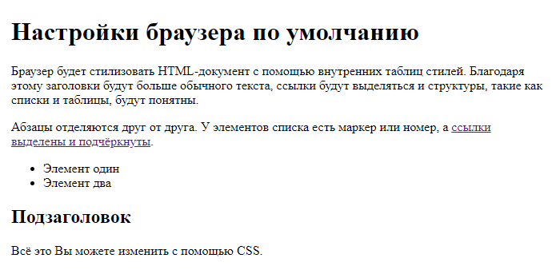

{{LearnSidebar}}{{NextMenu("Learn/CSS/First_steps/Getting_started", "Learn/CSS/First steps")}}

**{{Glossary("CSS")}}** (Каскадные таблицы стилей) позволяет создавать великолепно выглядящие веб-страницы, но как же это работает? Эта статья объясняет, что такое CSS, с помощью простого примера синтаксиса, а также охватывает некоторые ключевые термины о языке.

| Требуемые знания: | Базовые компьютерные знания, [установка базового программного обеспечения](/ru/docs/Learn/Getting_started_with_the_web/%D0%A3%D1%81%D1%82%D0%B0%D0%BD%D0%BE%D0%B2%D0%BA%D0%B0_%D0%B1%D0%B0%D0%B7%D0%BE%D0%B2%D0%BE%D0%B3%D0%BE_%D0%BF%D1%80%D0%BE%D0%B3%D1%80%D0%B0%D0%BC%D0%BC%D0%BD%D0%BE%D0%B3%D0%BE_%D0%BE%D0%B1%D0%B5%D1%81%D0%BF%D0%B5%D1%87%D0%B5%D0%BD%D0%B8%D1%8F), базовые знания [работа с файлами](/ru/docs/Learn/Getting_started_with_the_web/Dealing_with_files) и базовые знания HTML ([Введение в HTML](/ru/docs/Learn/HTML/%D0%92%D0%B2%D0%B5%D0%B4%D0%B5%D0%BD%D0%B8%D0%B5_%D0%B2_HTML)). |
| ----------------- | ----------------------------------------------------------------------------------------------------------------------------------------------------------------------------------------------------------------------------------------------------------------------------------------------------------------------------------------------------------------------------------------------------------------------------------------------------------------------------------------------------------------------------------------------------------------------------------------------------------- |
| Задача:           | Узнать, что такое CSS.                                                                                                                                                                                                                                                                                                                                                                                                                                                                                                                                                                                      |

В модуле [Основы HTML](/ru/docs/Learn/HTML/Introduction_to_HTML) мы рассмотрели, что такое HTML и как он используется для разметки документов. Эти документы будут доступны для чтения в веб-браузере. Заголовки будут выглядеть больше, чем обычный текст, абзацы разбиваются на новую строку и будут иметь пространство между друг другом. Ссылки выделены цветом и подчёркнуты, чтобы отличить их от остального текста. То, что вы видите, — это стили браузера по умолчанию — самые основные стили, которые браузер применяет к HTML, чтобы гарантировать, что он будет в основном читабельным, даже если автор страницы не указал явный стиль.



Тем не менее, интернет был бы скучным, если бы все сайты выглядели так. Используя CSS, вы можете до мелочей контролировать, как элементы HTML выглядят в браузере, представляя вашу разметку, используя любой понравившийся вам дизайн.

## Для чего нужен CSS?

Как мы уже упоминали ранее, CSS — это язык для определения того, как документы представляются пользователям — как они оформляются, размещаются и т. д.

**Документ** обычно представляет собой текстовый файл, структурированный с использованием языка разметки: {{Glossary("HTML")}} — самый распространённый язык разметки, но вы также можете встретить другие языки разметки, такие как {{Glossary("SVG")}} или {{Glossary("XML")}}.

**Представление** документа пользователю означает преобразование его в форму, используемую вашей аудиторией**.** {{Glossary("browser","Browsers")}}, такие как {{Glossary("Mozilla Firefox","Firefox")}}, {{Glossary("Google Chrome","Chrome")}} или {{Glossary("Microsoft Edge","Edge")}} , предназначены для визуального представления документов, например, на экране компьютера, проектора или принтера.

> **Примечание:** Браузер иногда называют {{Glossary("User agent","user agent")}}, что в основном означает компьютерную программу, которая представляет человека внутри компьютерной системы. Браузеры — это основной тип пользовательского агента, о котором мы думаем, когда говорим о CSS, но он не единственный. Доступны и другие пользовательские агенты, например, те, которые преобразуют документы HTML и CSS в файлы PDF для печати.

CSS может использоваться для очень простой стилизации текста документа, например, изменение [цвета](/ru/docs/Web/CSS/color_value) и [размера](/ru/docs/Web/CSS/font-size) заголовков и ссылок. Он может быть использован для создания макета, например, [превращение одного столбца текста в макет](/ru/docs/Web/CSS/Layout_cookbook/Column_layouts) с основной областью контента и боковой панелью для соответствующей информации. Это может даже использоваться для эффектов, таких как [анимация](/ru/docs/Web/CSS/CSS_Animations). Посмотрите на ссылки в этом параграфе для конкретных примеров.

## Синтаксис CSS

CSS — это язык на основе правил: вы задаёте правила, определяющие группы стилей, которые должны применяться к определённым элементам или группам элементов на вашей веб-странице. Например:

«Я хочу, чтобы основной заголовок на моей странице отображался крупным красным текстом».

В следующем коде показано очень простое правило CSS, которое будет соответствовать стилю, описанному выше:

```css
h1 {
  color: red;
  font-size: 5em;
}
```

Правило открывается с помощью {{Glossary("CSS Selector", "селектора")}} . Этот селектор выбирает HTML-элемент, который мы собираемся стилизовать. В этом случае мы используем заголовки первого уровня — ({{htmlelement("h1")}}).

Затем у нас есть набор фигурных скобок `{ }`. Внутри них будет один или несколько **объявлений**, которые принимают форму пары **свойства** и его **значения**. Каждая пара указывает свойство элемента(-ов), который(-е) мы выбираем, а затем значение, которое мы хотели бы присвоить свойству.

Перед двоеточием у нас есть свойство, а после двоеточия — значение. CSS-{{Glossary("property/CSS","свойства")}} имеют разные допустимые значения в зависимости от того, какое свойство указывается. В нашем примере мы имеем свойство `color`, которое может принимать различные [цветовые значения](/ru/docs/Learn/CSS/Building_blocks/Values_and_units#Color). У нас также есть свойство `font-size`. Это свойство может принимать различные [значения размера](/ru/docs/Learn/CSS/Building_blocks/Values_and_units#Numbers_lengths_and_percentages), как и свойства.

Таблица стилей CSS будет содержать много таких правил, написанных одно за другим.

```css
h1 {
  color: red;
  font-size: 5em;
}

p {
  color: black;
}
```

Вы обнаружите, что вы быстро изучаете некоторые значения, тогда как другие вам нужно искать. Страницы отдельных свойств в MDN дают вам быстрый способ поиска свойств и их значений, когда вы забыли или хотите узнать, что ещё вы можете использовать в качестве значения.

> **Примечание:** вы можете найти ссылки на все страницы свойств CSS (вместе с другими функциями CSS), перечисленные в MDN [Руководстве по CSS](/ru/docs/Web/CSS/Reference). Кроме того, вы должны привыкнуть к поиску "MDN _css-feature-name_" в вашем браузере, когда вам нужно узнать больше информации о функции CSS. Например, попробуйте поискать «mdn color» и «mdn font-size»!

## CSS-модули

Поскольку существует множество вещей, которые можно стилизовать с помощью CSS, язык разбит на модули. По мере изучения MDN вы увидите ссылки на эти модули, а многие страницы документации организованы вокруг определённого модуля. Например, вы можете взглянуть на ссылку MDN в модуле [Свойства фона и границ](/ru/docs/Web/CSS/CSS_Backgrounds_and_Borders), чтобы узнать, какова его цель и какие различные свойства и другие функции он содержит. Вы также найдёте ссылки на спецификацию CSS, которая определяет технологию (см. ниже).

На этом этапе вам не нужно слишком беспокоиться о том, как структурирован CSS, однако это может упростить поиск информации, если, например, вы знаете, что определённое свойство может быть найдено среди других похожих вещей, и поэтому, вероятно, в той же спецификации.

Для конкретного примера давайте вернёмся к модулю Свойства фона и границ — вы можете подумать, что это логично для свойств [`background-color`](/ru/docs/Web/CSS/background-color) и [`border-color`](/ru/docs/Web/CSS/border-color), которые будут определены в этом модуле. И Вы правы.

### Технические характеристики CSS

Все технологии веб-стандартов (HTML, CSS, JavaScript и т. д.) определены в гигантских документах, называемых спецификациями, которые публикуются организациями по стандартизации (такие как {{glossary("W3C")}}, {{glossary("WHATWG")}}, {{glossary("ECMA")}} или {{glossary("Khronos")}}) и определяют, как эти технологии должны вести себя.

CSS ничем не отличается — он разработан группой в W3C, которая называется [CSS Working Group](https://www.w3.org/Style/CSS/). Эта группа состоит из представителей производителей браузеров и других компаний, которые заинтересованы в CSS. Есть также другие люди, известные как приглашённые эксперты, которые выступают как независимые голоса; они не связаны с членами организации.

Новые функции CSS разрабатываются или определяются рабочей группой CSS. Иногда потому, что конкретный браузер заинтересован в том, чтобы иметь какие-то возможности, иногда потому, что веб-дизайнеры и разработчики запрашивают функцию, а иногда потому, что сама рабочая группа определила требование. CSS постоянно развивается, появляются новые функции. Тем не менее, ключевым моментом в CSS является то, что все работают очень усердно, чтобы никогда не менять вещи таким образом, чтобы это сломало старые сайты. Веб-сайт, созданный в 2000 году, с использованием ограниченного CSS, доступного в то время, должен всё ещё использоваться в браузере сегодня!

Как новичок в CSS, вполне вероятно, что вы найдёте CSS-спецификации ошеломляющими — они предназначены для инженеров, чтобы использовать их для реализации поддержки функций в пользовательских агентах, а не для веб-разработчиков, чтобы читать, чтобы понимать CSS. Многие опытные разработчики предпочитают обращаться к документации MDN или другим учебникам. Однако стоит знать, что они существуют, понимать взаимосвязь между используемым CSS, поддержкой браузера (см. ниже) и спецификациями.

## Поддержка браузера

После того как CSS был указан, он будет полезен для разработки веб-страниц, только если один или несколько браузеров его реализовали. Это означает, что код был написан для превращения инструкции в нашем CSS-файле во что-то, что может быть выведено на экран. Мы рассмотрим этот процесс подробнее на уроке [Как работает CSS](/ru/docs/Learn/CSS/First_steps/How_CSS_works)[.](/ru/docs/) Это необычно для всех браузеров, чтобы реализовать функцию одновременно, и поэтому обычно есть пробел, где вы можете использовать некоторую часть CSS в одних браузерах, а не в других. По этой причине полезно проверять состояние реализации. На каждой странице свойств в MDN вы можете видеть статус интересующего вас свойства, чтобы вы могли определить, сможете ли вы использовать её на веб-сайте.

Ниже приведена диаграмма данных для CSS свойства [`font-family`](/ru/docs/Web/CSS/font-family):

{{Compat("css.properties.font-family")}}

## Что дальше?

Теперь, когда у вас есть некоторое представление о том, что такое CSS, давайте перейдём к [Началу работы с CSS](/ru/docs/Learn/CSS/First_steps/Getting_started), где вы можете начать писать CSS самостоятельно.

{{NextMenu("Learn/CSS/First_steps/Getting_started", "Learn/CSS/First_steps")}}

## В этом модуле

1. [Что такое CSS?](/ru/docs/Learn/CSS/First_steps/%D0%A7%D1%82%D0%BE_%D1%82%D0%B0%D0%BA%D0%BE%D0%B5_CSS)
2. [Начало работы с CSS](/ru/docs/Learn/CSS/First_steps)
3. [Как структурирован CSS](/ru/docs/Learn/CSS/First_steps/%D0%9A%D0%B0%D0%BA_%D1%81%D1%82%D1%80%D1%83%D0%BA%D1%82%D1%83%D1%80%D0%B8%D1%80%D0%BE%D0%B2%D0%B0%D0%BD_CSS)
4. [Как работает CSS](/ru/docs/Learn/CSS/First_steps/How_CSS_works)
5. [Использование ваших новых знаний](/ru/docs/Learn/CSS/First_steps/Using_your_new_knowledge)
