{{LearnSidebar}}{{PreviousMenuNext("Learn/HTML/Forms/How_to_structure_an_HTML_form", "Learn/HTML/Forms/Sending_and_retrieving_form_data", "Learn/HTML/Forms")}}

Сейчас мы детально изучим возможности различных виджетов форм, посмотрим, какие функции доступны для получения информации в различных представлениях. Это исчерпывающая статья, описывающая все доступные стандартные виджеты форм.

| Требования: | Базовая компьютерная грамотность, базовое [понимание HTML](/ru/docs/Learn/HTML/Introduction_to_HTML).                    |
| ----------- | ------------------------------------------------------------------------------------------------------------------------ |
| Цель:       | Понять, какие типы стандартных виджетов форм доступны в браузерах для сбора информации, как внедрять их, используя HTML. |

Сейчас мы сосредоточимся на виджетах форм, встроенных в браузеры, но поскольку формы HTML остаются несколько ограниченными и особенности их реализации различаются для разных браузеров, веб-разработчики иногда создают собственные виджеты форм - прочтите статью [Как создать собственную форму](/ru/docs/Learn/Forms/How_to_build_custom_form_controls) позже в данном модуле для более подробного изучения.

> **Примечание:** Большая часть признаков обсуждаемых в этой статье имеют широкую поддержку в браузерах; мы отметим исключения из этого правила. Если вы хотите больше точных сведений, вам следует обратиться к [HTML forms element reference](/ru/docs/Web/HTML/Element#forms), и в частости к нашей обширной ссылке [\<input> types](/ru/docs/Web/HTML/Element/input).

## Стандартные атрибуты

Многие элементы, используемые для определения виджетов форм, имеют собственные атрибуты. Однако, существует набор атрибутов, общих для всех элементов формы, которые предоставляют вам контроль над их виджетами. Вот список этих общих атрибутов:

| Attribute name | Default value | Description                                                                                                                                                                                                                                                                                                                                                     |
| -------------- | ------------- | --------------------------------------------------------------------------------------------------------------------------------------------------------------------------------------------------------------------------------------------------------------------------------------------------------------------------------------------------------------- |
| `autofocus`    | (_false_)     | Этот атрибут логического типа позволяет вам определить, должен ли элемент автоматически попадать в фокус при загрузке страницы, пока пользователь не изменит это, например, печатая в другом виджете. Этот атрибут может явно определяться только для одного элемента в документе, ассоциированного с формой.                                                   |
| `disabled`     | (_false_)     | Этот атрибут логического типа определяет, может ли пользователь взаимодействовать с элементом. Если этот атрибут не определён, то элемент наследует его значение от элемента-родителя. Если атрибут не определён, то по умолчанию пользователь может взаимодействовать с элементом.                                                                             |
| `form`         |               | Элемент формы, с которым ассоциирован виджет. Значением данного атрибута должен быть атрибут `id` элемента {{HTMLElement("form")}} в том же документе. Теоретически, это позволяет вам помещать определение виджета за рамками элемента {{HTMLElement("form")}}. На практике, однако, не существует браузеров, поддерживающих данную функцию. |
| `name`         |               | Название элемента; передаётся вместе с данными формы.                                                                                                                                                                                                                                                                                                           |
| `value`        |               | Начальное значение элемента.                                                                                                                                                                                                                                                                                                                                    |

## Поля ввода текста

Текстовые поля {{htmlelement("input")}} являются самыми базовыми виджетами форм. Эти поля наиболее удобны для пользовательского ввода различной информации. Однако, некоторые текстовые поля отличаются от данного и используются для специфических нужд. Мы уже видели несколько простых примеров.

> **Примечание:** HTML form text fields are simple plain text input controls. This means that you cannot use them to perform [rich editing](/ru/docs/Web/Guide/HTML/Editable_content/Rich-Text_Editing_in_Mozilla) (bold, italic, etc.). All rich text editors you'll encounter out there are custom widgets created with HTML, CSS, and JavaScript.

Все текстовые поля имеют общие атрибуты:

- Они могут быть помечены как [`readonly`](/ru/docs/Web/HTML/Element/input#readonly) (пользователь не может изменять начальное значение) или даже [`disabled`](/ru/docs/Web/HTML/Element/input#disabled) начальное значение никогда не посылается вместе с остальными данными формами).
- Они могут иметь атрибут [`placeholder`](/ru/docs/Web/HTML/Element/input#placeholder); это текст, который появляется внутри теста поля формы и кратко описывает, для чего используется данная форма.
- Существуют общие характеристики [`size`](/ru/docs/Web/HTML/Element/input#size) (физический размер поля) и [длину](/ru/docs/Web/HTML/Element/input#attr-maxlength) (максимальное количество символов, которые может ввести пользователь).
- Они могут быть определены с помощью [spell checking](/ru/docs/Web/HTML/Element/input#attr-spellcheck), если браузер поддерживает данную функцию.

> **Примечание:** The {{htmlelement("input")}} element is special because it can be almost anything. By simply setting its `type` attribute, it can change radically, and it is used for creating most types of form widget including single line text fields, controls without text input, time and date controls, and buttons. However, there are some exceptions, like {{htmlelement("textarea")}} for multi-line inputs. Take careful note of these as you read the article.

### Однострочные текстовые поля

Однострочные текстовые поля создаются с использованием элемента {{HTMLElement("input")}} чей атрибут [`type`](/ru/docs/Web/HTML/Element/input#type) имеет значение `text` (если вы не поставите другое значение атрибута [`type`](/ru/docs/Web/HTML/Element/input#type), `text` является значением по умолчанию). Значение `text` для этого атрибута является возвратным, если значение которое вы определили для [`type`](/ru/docs/Web/HTML/Element/input#type) неизвестно браузеру (например, если вы определили `type="date"` а браузер не поддерживает выбор даты).

> **Примечание:** вы можете найти примеры всех типов однострочных текстовых полей на GitHub at [single-line-text-fields.html](https://github.com/mdn/learning-area/blob/master/html/forms/native-form-widgets/single-line-text-fields.html) ([see it live also](https://mdn.github.io/learning-area/html/forms/native-form-widgets/single-line-text-fields.html)).

Пример базового одностраничного текстового поля:

```html
<input type="text" id="comment" name="comment" value="I'm a text field">
```

Однострочное текстовое поле имеет только одно настоящее ограничение: если вы вводите текст с разрывами строки, браузер удаляет эти разрывы строк перед отправкой данных.

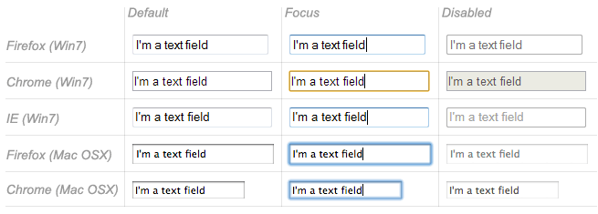

HTML5 enhances the basic single line text field by adding special values for the [`type`](/ru/docs/Web/HTML/Element/input#type) attribute. Those values still turn an {{HTMLElement("input")}} element into a single line text field but they add a few extra constraints and features to the field.

#### E-mail address field

Этот тип поля устанавливается со значением `email` для атрибута [`type`](/ru/docs/Web/HTML/Element/input#type):

```html
<input type="email" id="email" name="email" multiple>
```

Когда используется этот `type`, пользователь должен ввести в поле валидный адрес электронной почты; любое другое содержание будет отображено браузером при отправке формы как ошибка. Заметьте, что это проверка ошибок на стороне клиента, выполняемая браузером:

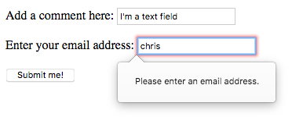

It's also possible to let the user type several e-mail addresses into the same input (separated by commas) by including the [`multiple`](/ru/docs/Web/HTML/Element/input#multiple) attribute.

On some devices (especially on mobile), a different virtual keypad might be presented that is more suitable for entering email addresses.

> **Примечание:** You can find out more about form validation in the article [Form data validation](/ru/docs/Learn/Forms/Form_validation).

#### Password field

This type of field is set using the value `password` for the [`type`](/ru/docs/Web/HTML/Element/input#type) attribute:

```html
<input type="password" id="pwd" name="pwd">
```

It doesn't add any special constraints to the entered text, but it does obscure the value entered into the field (e.g. with dots or asterisks) so it can't be read by others.

Keep in mind this is just a user interface feature; unless you submit your form securely, it will get sent in plain text, which is bad for security — a malicious party could intercept your data and steal passwords, credit card details, or whatever else you've submitted. The best way to protect users from this is to host any pages involving forms over a secure connection (i.e. at an https\:// ... address), so the data is encrypted before it is sent.

Modern browsers recognize the security implications of sending form data over an insecure connection, and have implemented warnings to deter users from using insecure forms. For more information on what Firefox implements, see [Insecure passwords](/ru/docs/Web/Security/Insecure_passwords).

#### Search field

This type of field is set by using the value `search` for the [`type`](/ru/docs/Web/HTML/Element/input#type) attribute:

```html
<input type="search" id="search" name="search">
```

The main difference between a text field and a search field is how the browser styles it — often, search fields are rendered with rounded corners, and/or given an "x" to press to clear the entered value. However, there is another added feature worth noting: their values can be automatically saved to be auto completed across multiple pages on the same site.

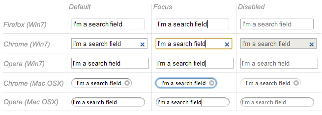

#### Phone number field

This type of field is set using `tel` as the value of the [`type`](/ru/docs/Web/HTML/Element/input#type) attribute:

```html
<input type="tel" id="tel" name="tel">
```

Due to the wide variety of phone number formats around the world, this type of field does not enforce any constraints on the value entered by a user (this can include letters, etc.). This is primarily a semantic difference, although on some devices (especially on mobile), a different virtual keypad might be presented that is more suitable for entering phone numbers.

#### URL field

This type of field is set using the value `url` for the [`type`](/ru/docs/Web/HTML/Element/input#type) attribute:

```html
<input type="url" id="url" name="url">
```

It adds special validation constraints to the field, with the browser reporting an error if invalid URLs are entered.

> **Примечание:** Just because the URL is well-formed doesn't necessarily mean that it refers to a location that actually exists.

> **Примечание:** Fields that have special constraints and are in error prevent the form from being sent; in addition, they can be styled so as to make the error clear. We will discuss this in detail in the article: [Data form validation](/ru/docs/Learn/Forms/Form_validation).

### Multi-line text fields

A multi-line text field is specified using a {{HTMLElement("textarea")}} element, rather than using the {{HTMLElement("input")}} element.

```html
<textarea cols="30" rows="10"></textarea>
```

The main difference between a textarea and a regular single line text field is that users are allowed to type text that includes hard line breaks (i.e. pressing return).

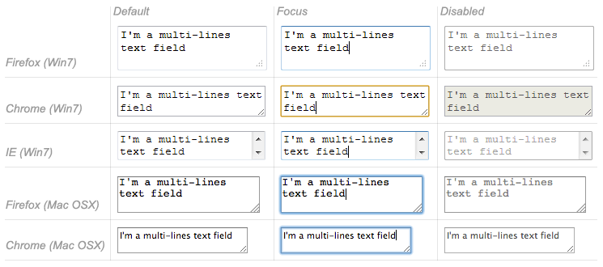

> **Примечание:** You can find an example of a multi-line text field on GitHub at [multi-line-text-field.html](https://github.com/mdn/learning-area/blob/master/html/forms/native-form-widgets/multi-line-text-field.html) ([see it live also](https://mdn.github.io/learning-area/html/forms/native-form-widgets/multi-line-text-field.html)). Have a look at it, and notice how in most browsers, the text area is given a drag handle on the bottom right to allow the user to resize it. This resizing ability can be turned off by setting the text area's {{cssxref("resize")}} property to `none` using [CSS](/ru/docs/Learn/CSS).

{{htmlelement("textarea")}} also accepts a few extra attributes to control its rendering across several lines (in addition to several others):

| Attribute name                                   | Default value | Description                                                                 |
| ------------------------------------------------ | ------------- | --------------------------------------------------------------------------- |
| [`cols`](/ru/docs/Web/HTML/Element/textarea#cols) | `20`          | The visible width of the text control, in average character widths.         |
| [`rows`](/ru/docs/Web/HTML/Element/textarea#rows) |               | The number of visible text lines for the control.                           |
| [`wrap`](/ru/docs/Web/HTML/Element/textarea#wrap) | `soft`        | Indicates how the control wraps text. Possible values are: `hard` or `soft` |

Note that the {{HTMLElement("textarea")}} element is written a bit differently from the {{HTMLElement("input")}} element. The {{HTMLElement("input")}} element is an empty element, which means that it cannot contain any child elements. On the other hand, the {{HTMLElement("textarea")}} element is a regular element that can contain text content children.

There are two key related points to note here:

- If you want to define a default value for an {{HTMLElement("input")}} element, you have to use the `value` attribute; for a {{HTMLElement("textarea")}} element on the other hand you put the default text between the starting tag and the closing tag of the {{HTMLElement("textarea")}}.
- Because of its nature, the {{HTMLElement("textarea")}} element only accepts text content; this means that any HTML content put inside a {{HTMLElement("textarea")}} is rendered as if it was plain text content.

## Drop-down content

Drop-down widgets are a simple way to let users select one of many options without taking up much space in the user interface. HTML has two forms of drop down content: the **select box**, and **autocomplete box**. In both cases the interaction is the same — once the control is activated, the browser displays a list of values the user can select between.

> **Примечание:** Note: You can find examples of all the drop-down box types on GitHub at [drop-down-content.html](https://github.com/mdn/learning-area/blob/master/html/forms/native-form-widgets/drop-down-content.html) ([see it live also](https://mdn.github.io/learning-area/html/forms/native-form-widgets/drop-down-content.html)).

### Select box

A select box is created with a {{HTMLElement("select")}} element with one or more {{HTMLElement("option")}} elements as its children, each of which specifies one of its possible values.

```html
<select id="simple" name="simple">
  <option>Banana</option>
  <option>Cherry</option>
  <option>Lemon</option>
</select>
```

If required, the default value for the select box can be set using the [`selected`](/ru/docs/Web/HTML/Element/option#selected) attribute on the desired {{HTMLElement("option")}} element — this option is then preselected when the page loads. The {{HTMLElement("option")}} elements can also be nested inside {{HTMLElement("optgroup")}} elements to create visually associated groups of values:

```html
<select id="groups" name="groups">
  <optgroup label="fruits">
    <option>Banana</option>
    <option selected>Cherry</option>
    <option>Lemon</option>
  </optgroup>
  <optgroup label="vegetables">
    <option>Carrot</option>
    <option>Eggplant</option>
    <option>Potato</option>
  </optgroup>
</select>
```

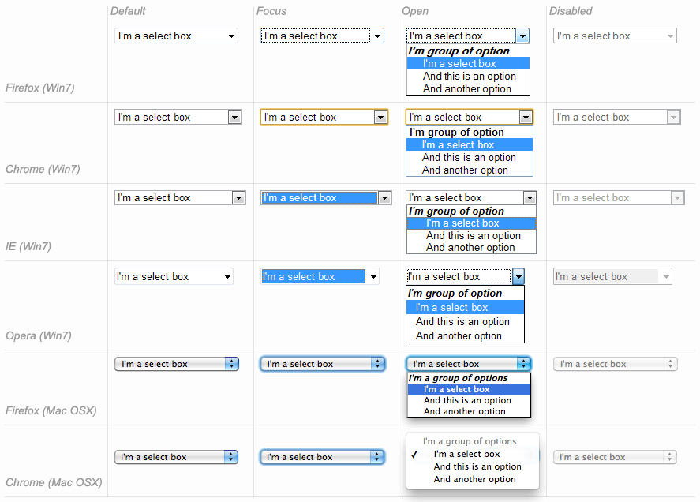

If an {{HTMLElement("option")}} element is set with a `value` attribute, that attribute's value is sent when the form is submitted. If the `value` attribute is omitted, the content of the {{HTMLElement("option")}} element is used as the select box's value.

On the {{HTMLElement("optgroup")}} element, the `label` attribute is displayed before the values, but even if it looks somewhat like an option, it is not selectable.

### Multiple choice select box

By default, a select box only lets the user select a single value. By adding the [`multiple`](/ru/docs/Web/HTML/Element/select#multiple) attribute to the {{HTMLElement("select")}} element, you can allow users to select several values, by using the default mechanism provided by the operating system (e.g. holding down <kbd>Cmd</kbd>/<kbd>Ctrl</kbd> and clicking multiple values).

Note: In the case of multiple choice select boxes, the select box no longer displays the values as drop-down content — instead, they are all displayed at once in a list.

```html
<select multiple id="multi" name="multi">
  <option>Banana</option>
  <option>Cherry</option>
  <option>Lemon</option>
</select>
```

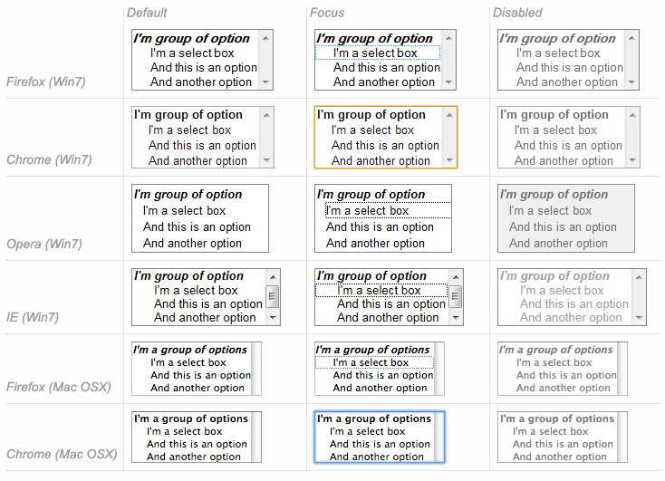

> **Примечание:** All browsers that support the {{HTMLElement("select")}} element also support the [`multiple`](/ru/docs/Web/HTML/Element/select#multiple) attribute on it.

### Autocomplete box

You can provide suggested, automatically-completed values for form widgets using the {{HTMLElement("datalist")}} element with some child {{HTMLElement("option")}} elements to specify the values to display.

The data list is then bound to a text field (usually an `<input>` element) using the [`list`](/ru/docs/Web/HTML/Element/input#list) attribute.

Once a data list is affiliated with a form widget, its options are used to auto-complete text entered by the user; typically, this is presented to the user as a drop-down box listing possible matches for what they've typed into the input.

```html
<label for="myFruit">What's your favorite fruit?</label>
<input type="text" name="myFruit" id="myFruit" list="mySuggestion">
<datalist id="mySuggestion">
  <option>Apple</option>
  <option>Banana</option>
  <option>Blackberry</option>
  <option>Blueberry</option>
  <option>Lemon</option>
  <option>Lychee</option>
  <option>Peach</option>
  <option>Pear</option>
</datalist>
```

> **Примечание:** According to [the HTML specification](https://www.w3.org/TR/html5/common-input-element-attributes.html#attr-input-list), the [`list`](/ru/docs/Web/HTML/Element/input#list) attribute and the {{HTMLElement("datalist")}} element can be used with any kind of widget requiring a user input. However, it is unclear how it should work with controls other than text (color or date for example), and different browsers behave differently from case to case. Because of that, be cautious using this feature with anything but text fields.

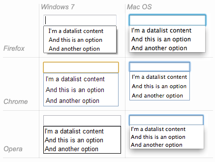

#### Datalist support and fallbacks

The {{HTMLElement("datalist")}} element is a very recent addition to HTML forms, so browser support is a bit more limited than what we saw earlier. Most notably, it isn't supported in IE versions below 10, and Safari still doesn't support it at the time of writing.

To handle this, here is a little trick to provide a nice fallback for those browsers:

```html
<label for="myFruit">What is your favorite fruit? (With fallback)</label>
<input type="text" id="myFruit" name="fruit" list="fruitList">

<datalist id="fruitList">
  <label for="suggestion">or pick a fruit</label>
  <select id="suggestion" name="altFruit">
    <option>Apple</option>
    <option>Banana</option>
    <option>Blackberry</option>
    <option>Blueberry</option>
    <option>Lemon</option>
    <option>Lychee</option>
    <option>Peach</option>
    <option>Pear</option>
  </select>
</datalist>
```

Browsers that support the {{HTMLElement("datalist")}} element will ignore all the elements that are not {{HTMLElement("option")}} elements and will work as expected. On the other hand, browsers that do not support the {{HTMLElement("datalist")}} element will display the label and the select box. Of course, there are other ways to handle the lack of support for the {{HTMLElement("datalist")}} element, but this is the simplest (others tend to require JavaScript).

| Safari 6   | 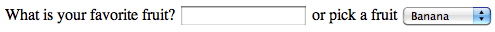 |
| ---------- | ----------------------------------------------------------------------------------------- |
| Firefox 18 | 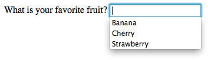  |

## Checkable items

Checkable items are widgets whose state you can change by clicking on them. There are two kinds of checkable item: the check box and the radio button. Both use the [`checked`](/ru/docs/Web/HTML/Element/input#checked) attribute to indicate whether the widget is checked by default or not.

It's worth noting that these widgets do not behave exactly like other form widgets. For most form widgets, once the form is submitted all widgets that have a [`name`](/ru/docs/Web/HTML/Element/input#name) attribute are sent, even if no value has been filled out. In the case of checkable items, their values are sent only if they are checked. If they are not checked, nothing is sent, not even their name.

> **Примечание:** You can find the examples from this section on GitHub as [checkable-items.html](https://github.com/mdn/learning-area/blob/master/html/forms/native-form-widgets/checkable-items.html) ([see it live also](https://mdn.github.io/learning-area/html/forms/native-form-widgets/checkable-items.html)).

For maximum usability/accessibility, you are advised to surround each list of related items in a {{htmlelement("fieldset")}}, with a {{htmlelement("legend")}} providing an overall description of the list. Each individual pair of {{htmlelement("label")}}/{{htmlelement("input")}} elements should be contained in its own list item (or similar). This is shown in the examples.

You also need to provide values for these kinds of inputs inside the `value` attribute if you want them to be meaningful — if no value is provided, check boxes and radio buttons are given a value of `on`.

### Check box

A check box is created using the {{HTMLElement("input")}} element with its [`type`](/ru/docs/Web/HTML/Element/input#type) attribute set to the value `checkbox`.

```html
<input type="checkbox" checked id="carrots" name="carrots" value="carrots">
```

Including the `checked` attribute makes the checkbox checked automatically when the page loads.

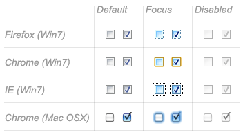

### Radio button

A radio button is created using the {{HTMLElement("input")}} element with its [`type`](/ru/docs/Web/HTML/Element/input#type) attribute set to the value `radio`.

```html
<input type="radio" checked id="soup" name="meal">
```

Several radio buttons can be tied together. If they share the same value for their [`name`](/ru/docs/Web/HTML/Element/input#name) attribute, they will be considered to be in the same group of buttons. Only one button in a given group may be checked at the same time; this means that when one of them is checked all the others automatically get unchecked. When the form is sent, only the value of the checked radio button is sent. If none of them are checked, the whole pool of radio buttons is considered to be in an unknown state and no value is sent with the form.

```html
<fieldset>
  <legend>What is your favorite meal?</legend>
  <ul>
    <li>
      <label for="soup">Soup</label>
      <input type="radio" checked id="soup" name="meal" value="soup">
    </li>
    <li>
      <label for="curry">Curry</label>
      <input type="radio" id="curry" name="meal" value="curry">
    </li>
    <li>
      <label for="pizza">Pizza</label>
      <input type="radio" id="pizza" name="meal" value="pizza">
    </li>
  </ul>
</fieldset>
```

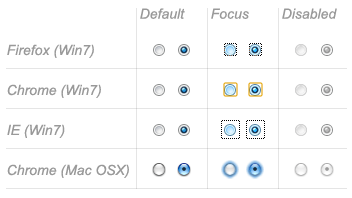

## Buttons

Within HTML forms, there are three kinds of button:

- Submit
  - : Sends the form data to the server.
- Reset
  - : Resets all form widgets to their default values.
- Anonymous
  - : Buttons that have no automatic effect but can be customized using JavaScript code. If you omit the `type` attribute, this is the default value.

> **Примечание:** You can find the examples from this section on GitHub as [button-examples.html](https://github.com/mdn/learning-area/blob/master/html/forms/native-form-widgets/button-examples.html) ([see it live also](https://mdn.github.io/learning-area/html/forms/native-form-widgets/button-examples.html)).

A button is created using a {{HTMLElement("button")}} element or an {{HTMLElement("input")}} element. It's the value of the [`type`](/ru/docs/Web/HTML/Element/input#type) attribute that specifies what kind of button is displayed:

### submit

```html
<button type="submit">
    This a <br><strong>submit button</strong>
</button>

<input type="submit" value="This is a submit button">
```

### reset

```html
<button type="reset">
    This a <br><strong>reset button</strong>
</button>

<input type="reset" value="This is a reset button">
```

### anonymous

```html
<button type="button">
    This an <br><strong>anonymous button</strong>
</button>

<input type="button" value="This is an anonymous button">
```

Buttons always behave the same whether you use a {{HTMLElement("button")}} element or an {{HTMLElement("input")}} element. There are, however, some notable differences:

- As you can see from the examples, {{HTMLElement("button")}} elements let you use HTML content in their labels, which are inserted inside the opening and closing `<button>` tags. {{HTMLElement("input")}} elements on the other hand are empty elements; their labels are inserted inside `value` attributes, and therefore only accept plain text content.
- With {{HTMLElement("button")}} elements, it's possible to have a value different than the button's label (by setting it inside a `value` attribute). This isn't reliable in versions of Internet Explorer prior to IE 8.


Technically speaking, there is almost no difference between a button defined with the {{HTMLElement("button")}} element or the {{HTMLElement("input")}} element. The only noticeable difference is the label of the button itself. Within an {{HTMLElement("input")}} element, the label can only be character data, whereas in a {{HTMLElement("button")}} element, the label can be HTML, so it can be styled accordingly.

## Advanced form widgets

In this section we cover those widgets that let users input complex or unusual data. This includes exact or approximate numbers, dates and times, or colors.

> **Примечание:** You can find the examples from this section on GitHub as [advanced-examples.html](https://github.com/mdn/learning-area/blob/master/html/forms/native-form-widgets/advanced-examples.html) ([see it live also](https://mdn.github.io/learning-area/html/forms/native-form-widgets/advanced-examples.html)).

### Numbers

Widgets for numbers are created with the {{HTMLElement("input")}} element, with its [`type`](/ru/docs/Web/HTML/Element/input#type) attribute set to the value `number`. This control looks like a text field but allows only floating-point numbers, and usually provides some buttons to increase or decrease the value of the widget.

It's also possible to:

- Constrain the value by setting the [`min`](/ru/docs/Web/HTML/Element/input#min) and [`max`](/ru/docs/Web/HTML/Element/input#max) attributes.
- Specify the amount by which the increase and decrease buttons change the widget's value by setting the [`step`](/ru/docs/Web/HTML/Element/input#step) attribute.

#### Example

```html
<input type="number" name="age" id="age" min="1" max="10" step="2">
```

This creates a number widget whose value is restricted to any value between 1 and 10, and whose increase and decrease buttons change its value by 2.

`number` inputs are not supported in versions of Internet Explorer below 10.

### Sliders

Another way to pick a number is to use a slider. Visually speaking, sliders are less accurate than text fields, therefore they are used to pick a number whose exact value is not necessarily important.

A slider is created by using the {{HTMLElement("input")}} with its [`type`](/ru/docs/Web/HTML/Element/input#type) attribute set to the value `range`. It's important to properly configure your slider; to that end, it's highly recommended that you set the [`min`](/ru/docs/Web/HTML/Element/input#min), [`max`](/ru/docs/Web/HTML/Element/input#max), and [`step`](/ru/docs/Web/HTML/Element/input#step) attributes.

#### Example

```html
<input type="range" name="beans" id="beans" min="0" max="500" step="10">
```

This example creates a slider whose value may range between 0 and 500, and whose increment/decrement buttons change the value by +10 and -10.

One problem with sliders is that they don't offer any kind of visual feedback as to what the current value is. You need to add this yourself with JavaScript, but this is relatively easy to do. In this example we add an empty {{htmlelement("span")}} element, in which we will write the current value of the slider, updating it as it is changed.

```html
<label for="beans">How many beans can you eat?</label>
<input type="range" name="beans" id="beans" min="0" max="500" step="10">
<span class="beancount"></span>
```

This can be implemented using some simple JavaScript:

```js
var beans = document.querySelector('#beans');
var count = document.querySelector('.beancount');

count.textContent = beans.value;

beans.oninput = function() {
  count.textContent = beans.value;
}
```

Here we store references to the range input and the span in two variables, then we immediately set the span's [`textContent`](/en-US/docs/Web/API/Node/textContent) to the current `value` of the input. Finally, we set up an `oninput` event handler so that every time the range slider is moved, the span `textContent` is updated to the new input value.

`range` inputs are not supported in versions of Internet Explorer below 10.

### Date and time picker

Gathering date and time values has traditionally been a nightmare for web developers. HTML5 brings some enhancements here by providing a special control to handle this specific kind of data.

A date and time control is created using the {{HTMLElement("input")}} element and an appropriate value for the [`type`](/ru/docs/Web/HTML/Element/input#type) attribute, depending on whether you wish to collect dates, times, or both.

#### `datetime-local`

This creates a widget to display and pick a date with time, but without any specific time zone information.

```html
<input type="datetime-local" name="datetime" id="datetime">
```

#### `month`

This creates a widget to display and pick a month with a year.

```html
<input type="month" name="month" id="month">
```

#### `time`

This creates a widget to display and pick a time value.

```html
<input type="time" name="time" id="time">
```

#### `week`

This creates a widget to display and pick a week number and its year.

```html
<input type="week" name="week" id="week">
```

All date and time control can be constrained using the [`min`](/ru/docs/Web/HTML/Element/input#min) and [`max`](/ru/docs/Web/HTML/Element/input#max) attributes.

```html
<label for="myDate">When are you available this summer?</label>
<input type="date" name="myDate" min="2013-06-01" max="2013-08-31" id="myDate">
```

Warning — The date and time widgets don't have the deepest support. At the moment, Chrome, Edge, Firefox, and Opera support them well, but there is no support in Internet Explorer and Safari has patchy support.

### Color picker

Colors are always a bit difficult to handle. There are many ways to express them: RGB values (decimal or hexadecimal), HSL values, keywords, etc. The color widget lets users pick a color in both textual and visual ways.

A color widget is created using the {{HTMLElement("input")}} element with its [`type`](/ru/docs/Web/HTML/Element/input#type) attribute set to the value `color`.

```html
<input type="color" name="color" id="color">
```

Warning — Color widget support it currently not very good. There is no support in Internet Explorer, and Safari currently doesn't support it either. The other major browsers do support it.

## Other widgets

There are a few other widgets that cannot be easily classified due to their very specific behaviors, but which are still very useful.

> **Примечание:** You can find the examples from this section on GitHub as [other-examples.html](https://github.com/mdn/learning-area/blob/master/html/forms/native-form-widgets/other-examples.html) ([see it live also](https://mdn.github.io/learning-area/html/forms/native-form-widgets/other-examples.html)).

### File picker

HTML forms are able to send files to a server; this specific action is detailed in the article [Sending and retrieving form data](/ru/docs/Learn/Forms/Sending_and_retrieving_form_data). The file picker widget is how the user can choose one or more files to send.

To create a file picker widget, you use the {{HTMLElement("input")}} element with its [`type`](/ru/docs/Web/HTML/Element/input#type) attribute set to `file`. The types of files that are accepted can be constrained using the [`accept`](/ru/docs/Web/HTML/Element/input#accept) attribute. In addition, if you want to let the user pick more than one file, you can do so by adding the [`multiple`](/ru/docs/Web/HTML/Element/input#multiple) attribute.

#### Example

In this example, a file picker is created that requests graphic image files. The user is allowed to select multiple files in this case.

```html
<input type="file" name="file" id="file" accept="image/*" multiple>
```

### Hidden content

It's sometimes convenient for technical reasons to have pieces of data that are sent with a form but not displayed to the user. To do this, you can add an invisible element in your form. Use an {{HTMLElement("input")}} with its [`type`](/ru/docs/Web/HTML/Element/input#type) attribute set to the value `hidden`.

If you create such an element, it's required to set its `name` and `value` attributes:

```html
<input type="hidden" id="timestamp" name="timestamp" value="1286705410">
```

### Image button

The **image button** control is one which is displayed exactly like an {{HTMLElement("img")}} element, except that when the user clicks on it, it behaves like a submit button (see above).

An image button is created using an {{HTMLElement("input")}} element with its [`type`](/ru/docs/Web/HTML/Element/input#type) attribute set to the value `image`. This element supports exactly the same set of attributes as the {{HTMLElement("img")}} element, plus all the attributes supported by other form buttons.

```html
<input type="image" alt="Click me!" src="my-img.png" width="80" height="30" />
```

If the image button is used to submit the form, this widget doesn't submit its value; instead the X and Y coordinates of the click on the image are submitted (the coordinates are relative to the image, meaning that the upper-left corner of the image represents the coordinate 0, 0). The coordinates are sent as two key/value pairs:

- The X value key is the value of the [`name`](/ru/docs/Web/HTML/Element/input#name) attribute followed by the string "_.x_".
- The Y value key is the value of the [`name`](/ru/docs/Web/HTML/Element/input#name) attribute followed by the string "_.y_".

So for example when you click on the image of this widget, you are sent to a URL like the following:

```
http://foo.com?pos.x=123&pos.y=456
```

This is a very convenient way to build a "hot map". How these values are sent and retrieved is detailed in the [Sending and retrieving form data](/ru/docs/Learn/Forms/Sending_and_retrieving_form_data) article.

### Meters and progress bars

Meters and progress bars are visual representations of numeric values.

#### Progress

A progress bar represents a value that changes over time up to a maximum value specified by the [`max`](/ru/docs/Web/HTML/Element/progress#max) attribute. Such a bar is created using a {{ HTMLElement("progress")}} element.

```html
<progress max="100" value="75">75/100</progress>
```

This is for implementing anything requiring progress reporting, such as the percentage of total files downloaded, or the number of questions filled in on a questionnaire.

The content inside the {{HTMLElement("progress")}} element is a fallback for browsers that don't support the element and for assistive technologies to vocalize it.

#### Meter

A meter bar represents a fixed value in a range delimited by a [`min`](/ru/docs/Web/HTML/Element/meter#min) and a [`max`](/ru/docs/Web/HTML/Element/meter#max) value. This value is visualy rendered as a bar, and to know how this bar looks, we compare the value to some other set values:

- The [`low`](/ru/docs/Web/HTML/Element/meter#low) and [`high`](/ru/docs/Web/HTML/Element/meter#high) values divide the range in three parts:

  - The lower part of the range is between the [`min`](/ru/docs/Web/HTML/Element/meter#min) and [`low`](/ru/docs/Web/HTML/Element/meter#low) values (including those values).
  - The medium part of the range is between the [`low`](/ru/docs/Web/HTML/Element/meter#low) and [`high`](/ru/docs/Web/HTML/Element/meter#high) values (excluding those values).
  - The higher part of the range is between the [`high`](/ru/docs/Web/HTML/Element/meter#high) and [`max`](/ru/docs/Web/HTML/Element/meter#max) values (including those values).

- The [`optimum`](/ru/docs/Web/HTML/Element/meter#optimum) value defines the optimum value for the {{HTMLElement("meter")}} element. In conjuction with the [`low`](/ru/docs/Web/HTML/Element/meter#low) and [`high`](/ru/docs/Web/HTML/Element/meter#high) value, it defines which part of the range is prefered:

  - If the [`optimum`](/ru/docs/Web/HTML/Element/meter#optimum) value is in the lower part of the range, the lower range is considered to be the prefered part, the medium range is considered to be the average part and the higher range is considered to be the worst part.
  - If the [`optimum`](/ru/docs/Web/HTML/Element/meter#optimum) value is in the medium part of the range, the lower range is considered to be an average part, the medium range is considered to be the prefered part and the higher range is considered to be average as well.
  - If the [`optimum`](/ru/docs/Web/HTML/Element/meter#optimum) value is in the higher part of the range, the lower range is considered to be the worst part, the medium range is considered to be the average part and the higher range is considered to be the prefered part.

All browsers that implement the {{HTMLElement("meter")}} element use those values to change the color of the meter bar:

- If the current value is in the prefered part of the range, the bar is green.
- If the current value is in the average part of the range, the bar is yellow.
- If the current value is in the worst part of the range, the bar is red.

Such a bar is created using a {{HTMLElement("meter")}} element. This is for implementing any kind of meter, for example a bar showing total space used on a disk, which turns red when it starts to get full.

```html
<meter min="0" max="100" value="75" low="33" high="66" optimum="50">75</meter>
```

The content inside the {{HTMLElement("meter")}} element is a fallback for browsers that don't support the element and for assistive technologies to vocalize it.

Support for progress and meter is fairly good — there is no support in Internet Explorer, but other browsers support it well.

## Conclusion

As you'll have seen above, there are a lot of different types of available form elements — you don't need to remember all of these details at once, and can return to this article as often as you like to check up on details.

## See also

To dig into the different form widgets, there are some useful external resources you should check out:

- [The Current State of HTML5 Forms](http://wufoo.com/html5/) by Wufoo
- [HTML5 Tests - inputs](https://www.quirksmode.org/html5/inputs.html) on Quirksmode (also [available for mobile](https://www.quirksmode.org/html5/inputs_mobile.html) browsers)

{{PreviousMenuNext("Learn/HTML/Forms/How_to_structure_an_HTML_form", "Learn/HTML/Forms/Sending_and_retrieving_form_data", "Learn/HTML/Forms")}}

## In this module

- [Your first HTML form](/ru/docs/Learn/Forms/Your_first_form)
- [How to structure an HTML form](/ru/docs/Learn/Forms/How_to_structure_a_web_form)
- [The native form widgets](/ru/docs/Learn/Forms/Basic_native_form_controls)
- [Sending form data](/ru/docs/Learn/Forms/Sending_and_retrieving_form_data)
- [Form data validation](/ru/docs/Learn/Forms/Form_validation)
- [How to build custom form widgets](/ru/docs/Learn/Forms/How_to_build_custom_form_controls)
- [Sending forms through JavaScript](/ru/docs/Learn/Forms/Sending_forms_through_JavaScript)
- [HTML forms in legacy browsers](/ru/docs/Learn/Forms/HTML_forms_in_legacy_browsers)
- [Styling HTML forms](/ru/docs/Learn/Forms/Styling_web_forms)
- [Advanced styling for HTML forms](/ru/docs/Learn/Forms/Advanced_form_styling)
- [Property compatibility table for form widgets](/ru/docs/Learn/Forms/Property_compatibility_table_for_form_controls)
