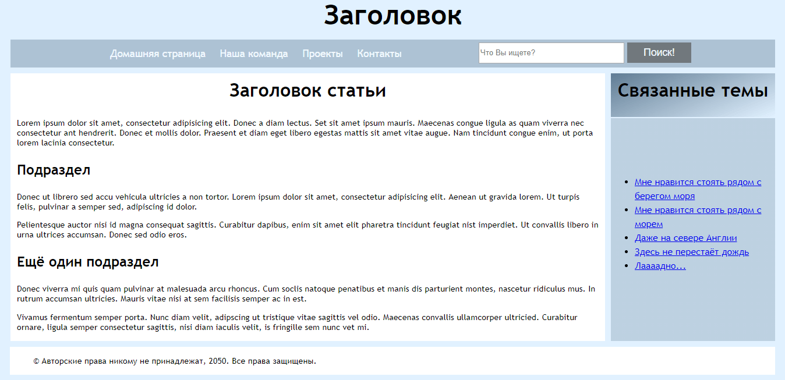

{{LearnSidebar}}{{PreviousMenuNext("Learn/HTML/Introduction_to_HTML/Advanced_text_formatting", "Learn/HTML/Introduction_to_HTML/Debugging_HTML", "Learn/HTML/Introduction_to_HTML")}}

В дополнение к определению отдельных частей вашей страницы (таких как «абзац» или «изображение»), {{glossary("HTML")}} также содержит ряд элементов блочного уровня, используемых для определения областей вашего веб-сайта (такие как «заголовок», «навигационное меню», «колонка основного содержимого»). В этой статье рассматривается, как планировать базовую структуру сайта и писать HTML для представления этой структуры.

| Необходимые знания: | Базовое знакомство с HTML, описано в разделе [Начало работы с HTML](/ru/docs/Learn/HTML/Introduction_to_HTML/Getting_started). Форматирование текста в HTML, описано в разделе [Основы текста в HTML](/ru/docs/Learn/HTML/Introduction_to_HTML/HTML_text_fundamentals). Как работают гиперссылки, описано в разделе [Создание гиперссылок](/ru/docs/Learn/HTML/Introduction_to_HTML/Creating_hyperlinks). |
| ------------------- | --------------------------------------------------------------------------------------------------------------------------------------------------------------------------------------------------------------------------------------------------------------------------------------------------------------------------------------------------------------------------------------------------------- |
| Задача:             | Изучить, как структурировать документ с помощью семантических тегов и как разработать структуру простого веб-сайта.                                                                                                                                                                                                                                                                                       |

## Основные составляющие документа

Веб-страницы могут и будут отличаться друг от друга, но все они, преимущественно, состоят из аналогичных стандартных компонентов, если только страница не отображает полноэкранное видео или игру, не является частью какого-либо художественного проекта или просто плохо структурирована:

- Заголовок (колонтитул)
  - : Обычно это большая полоса вверху страницы, с крупным заголовком и / или логотипом. Здесь указывается общая информация о веб-сайте, не меняющаяся от страницы к странице.
- Навигационное меню
  - : Ссылки на основные разделы сайта; обычно в виде кнопок, ссылок или вкладок. Также как и заголовок, навигация остаётся неизменной на всех страницах сайта — наличие непоследовательной навигации на вашем сайте запутает и разочарует пользователей. Многие веб-дизайнеры считают панель навигации частью заголовка, а не отдельным компонентом, но это не является обязательным требованием; на самом деле, некоторые также утверждают, что их разделение на отдельные компоненты улучшает [доступность](/ru/docs/Learn/Accessibility), поскольку раздельная структура будет понятнее для людей, пользующихся считывателями экрана.
- Основное содержимое
  - : Большая область в центре страницы, содержащая, в основном, уникальный контент данной веб-страницы, например видео, которое вы хотите посмотреть, или рассказ, который вы читаете, или карту, которую вы хотите просмотреть, или заголовки новостей и т. д. Это одна из частей сайта, которая определённо будет меняться от страницы к странице!
- Боковая панель
  - : Как правило, содержит некоторую второстепенную информацию, ссылки, цитаты, рекламу и т.д. Обычно она относится к содержимому в основном контенте (например, на странице со статьёй, боковая панель может содержать биографию автора или ссылки на связанные статьи), но в некоторых случаях здесь размещают и другие элементы, например, вторичную навигационную систему.
- Нижний колонтитул (футер)
  - : Полоса в нижней части страницы, которая обычно содержит уведомления об авторских правах или контактную информацию. Это место для размещения общей информации (например, заголовка), но обычно эта информация не является критичной или вторична для самого веб-сайта. Нижний колонтитул также иногда используется для {{Glossary("SEO")}} целей, предоставляя ссылки для быстрого доступа к популярному контенту.

"Типичный веб-сайт" может быть структурирован примерно так:



## HTML для структурирования содержимого

Пример, показанный сверху, не красив и примитивен, но идеально подходит для иллюстрирования типичного макета веб-сайта. У некоторых веб-сайтов больше колонок, некоторые — более сложные, но идею вы поняли. С правильным CSS вы могли бы использовать практически любые элементы для обёртывания различных разделов и стилизовать их так, как вам хочется, но, как обсуждалось ранее, нам нужно уважать семантику и **использовать правильный элемент для правильной работы**.

Это потому, что визуальные эффекты — это ещё не самое главное. Мы используем цвет и размер шрифта для привлечения внимания посетителей к наиболее полезным частям содержимого, такого как навигационное меню или связанные ссылки, но что насчёт людей со слабым зрением, к примеру, для которых концепция "розового" и "большого шрифта" не будет полезной?

> **Примечание:** Люди с дальтонизмом составляют около [8% мирового населения](http://www.color-blindness.com/2006/04/28/colorblind-population/). Слепые и слабовидящие люди составляют примерно 4-5% населения мира (в 2012 году в мире было [285 миллионов таких людей](https://en.wikipedia.org/wiki/Visual_impairment), а общая численность населения составляла [около 7 миллиардов](https://en.wikipedia.org/wiki/World_human_population#/media/File:World_population_history.svg)).

В своём HTML-коде вы можете размечать разделы содержимого сайта на основе их _функциональности_ — использовать элементы, которые представляют разделы контента, описанные выше, а вспомогательные технологии, такие как программы чтения с экрана, смогут распознавать эти элементы и помогать в таких задачах, как "найти основную навигацию" или "найти основное содержимое". Как мы упоминали ранее в ходе курса, существует ряд [последствий неиспользования правильной структуры элементов и семантики для правильной работы.](/en-US/Learn/HTML/Introduction_to_HTML/HTML_text_fundamentals#Why_do_we_need_structure)

Для реализации такой семантической разметки HTML предоставляет выделенные теги, которые можно использовать для создания таких разделов, например:

- **Заголовок:** {{htmlelement("header")}}.
- **Навигационное меню:** {{htmlelement("nav")}}.
- **Основное содержимое:** {{htmlelement("main")}}, с различными подразделами содержимого, представленными элементами {{HTMLElement("article")}}, {{htmlelement("section")}} и {{htmlelement("div")}}.
- **Боковая панель:** {{htmlelement("aside")}}, обычно располагается внутри {{htmlelement("main")}}.
- **Нижний колонтитул:** {{htmlelement("footer")}}.

### Активное обучение: исследование кода для нашего примера

Наш пример, представленный выше, содержит следующий код (Вы также можете [найти пример в нашем репозитории Github](https://github.com/mdn/learning-area/blob/master/html/introduction-to-html/document_and_website_structure/index.html)). Мы хотели бы, чтобы вы взглянули на приведённый выше пример, а затем просмотрели код ниже, чтобы узнать, из каких частей он состоит.

```html
<!doctype html>
<html>
  <head>
    <meta charset="utf-8" />

    <title>Заголовок моей страницы</title>
    <link
      href="https://fonts.googleapis.com/css?family=Open+Sans+Condensed:300|Sonsie+One"
      rel="stylesheet"
      type="text/css" />
    <link rel="stylesheet" href="style.css" />

    <!-- следующие 3 строки нужны для корректного отображения семантических элементов HTML5 в старых версиях Internet Explorer-->
    <!--[if lt IE 9]>
      <script src="https://cdnjs.cloudflare.com/ajax/libs/html5shiv/3.7.3/html5shiv.js"></script>
    <![endif]-->
  </head>

  <body>
    <!-- Вот наш главный заголовок, который используется на всех страницах нашего веб-сайта -->

    <header>
      <h1>Заголовок</h1>
    </header>

    <nav>
      <ul>
        <li><a href="#">Домашняя страница</a></li>
        <li><a href="#">Наша команда</a></li>
        <li><a href="#">Проекты</a></li>
        <li><a href="#">Контакты</a></li>
      </ul>

      <!-- Форма поиска — это ещё один распространённый нелинейный способ навигации по веб-сайту. -->

      <form>
        <input type="search" name="q" placeholder="Search query" />
        <input type="submit" value="Go!" />
      </form>
    </nav>

    <!-- Здесь основное содержимое нашей страницы -->
    <main>
      <!-- Она содержит статью -->
      <article>
        <h2>Заголовок статьи</h2>

        <p>
          Lorem ipsum dolor sit amet, consectetur adipisicing elit. Donec a diam
          lectus. Set sit amet ipsum mauris. Maecenas congue ligula as quam
          viverra nec consectetur ant hendrerit. Donec et mollis dolor. Praesent
          et diam eget libero egestas mattis sit amet vitae augue. Nam tincidunt
          congue enim, ut porta lorem lacinia consectetur.
        </p>

        <h3>Подраздел</h3>

        <p>
          Donec ut librero sed accu vehicula ultricies a non tortor. Lorem ipsum
          dolor sit amet, consectetur adipisicing elit. Aenean ut gravida lorem.
          Ut turpis felis, pulvinar a semper sed, adipiscing id dolor.
        </p>

        <p>
          Pelientesque auctor nisi id magna consequat sagittis. Curabitur
          dapibus, enim sit amet elit pharetra tincidunt feugiat nist imperdiet.
          Ut convallis libero in urna ultrices accumsan. Donec sed odio eros.
        </p>

        <h3>Ещё один подраздел</h3>

        <p>
          Donec viverra mi quis quam pulvinar at malesuada arcu rhoncus. Cum
          soclis natoque penatibus et manis dis parturient montes, nascetur
          ridiculus mus. In rutrum accumsan ultricies. Mauris vitae nisi at sem
          facilisis semper ac in est.
        </p>

        <p>
          Vivamus fermentum semper porta. Nunc diam velit, adipscing ut
          tristique vitae sagittis vel odio. Maecenas convallis ullamcorper
          ultricied. Curabitur ornare, ligula semper consectetur sagittis, nisi
          diam iaculis velit, is fringille sem nunc vet mi.
        </p>
      </article>

      <!-- Дополнительный контент также может быть вложен в основной контент -->
      <aside>
        <h2>Связанные темы</h2>

        <ul>
          <li><a href="#">Мне нравится стоять рядом с берегом моря</a></li>
          <li><a href="#">>Мне нравится стоять рядом с морем</a></li>
          <li><a href="#">Даже на севере Англии</a></li>
          <li><a href="#">Здесь не перестаёт дождь</a></li>
          <li><a href="#">Лаааадно...</a></li>
        </ul>
      </aside>
    </main>

    <!-- И вот наш главный нижний колонтитул, который используется на всех страницах нашего веб-сайта -->

    <footer>
      <p>©Авторские права никому не принадлежат, 2050. Все права защищены.</p>
    </footer>
  </body>
</html>
```

Потратьте некоторое время, чтобы просмотреть код и понять его — комментарии внутри кода также помогут вам в этом. Мы не просим вас делать ничего больше в этом уроке, потому что ключ к пониманию макета документа заключается в написании осмысленной структуры HTML, а затем её развёртывании с помощью CSS. Мы подождём, пока вы не начнёте изучать CSS-макет как часть темы CSS.

## Подробнее об элементах HTML макета

Полезно понять общий смысл всех структурных элементов HTML — это то, над чем вы будете работать постепенно, когда начнёте получать больше опыта с веб-разработкой. Вы можете ознакомиться с деталями, прочитав статью [HTML-элементы](/ru/docs/Web/HTML/Element). Пока что это основные определения, которые вы должны попытаться понять:

- {{HTMLElement('main')}} предназначен для содержимого, _уникального для этой страницы_. Используйте `<main>` только _один_ раз на странице и размещайте прямо внутри {{HTMLElement('body')}}. В идеале он не должен быть вложен в другие элементы.
- {{HTMLElement('article')}} окружает блок связанного содержимого, который имеет смысл сам по себе без остальной части страницы (например, один пост в блоге).
- {{HTMLElement('section')}} подобен `<article>`, но больше подходит для группирования одной части страницы, которая представляет собой одну часть функциональности (например, мини-карту или набор заголовков статей и сводок). Считается хорошей практикой начинать каждый раздел с [заголовка](/en-US/Learn/HTML/Howto/Set_up_a_proper_title_hierarchy). Также обратите внимание, что в зависимости от контекста вы можете разбить `<article>` на несколько `<section>` или, наоборот, `<section>` на несколько `<article>`.
- {{HTMLElement('aside')}} содержит контент, который не имеет прямого отношения к основному содержимому, но может содержать дополнительную информацию, косвенно связанную с ним (словарь, биография автора, связанные ссылки и т. д.).
- {{HTMLElement('header')}} представляет собой группу вводного содержимого. Если он дочерний элемент {{HTMLElement('body')}}, то он определяет глобальный заголовок веб-страницы, но если он дочерний элемент {{HTMLElement('article')}} или {{HTMLElement('section')}}, то определяет конкретный заголовок для этого раздела (постарайтесь не путать его с [titles и headings](/en-US/Learn/HTML/Introduction_to_HTML/The_head_metadata_in_HTML#Adding_a_title)).
- {{HTMLElement('nav')}} содержит основные функции навигации для страницы. Так же часто в нем можно увидеть логотип и / или название сайта или компании. Вторичные ссылки и т. д. не входят в навигацию.
- {{HTMLElement('footer')}} представляет собой группу конечного контента для страницы.

### Несемантические обёртки

Иногда вы будете сталкиваться с ситуацией, когда вы не можете найти идеальный семантический элемент, чтобы сгруппировать некоторые элементы вместе или обернуть некоторый контент. Иногда вам просто нужно будет сгруппировать несколько элементов вместе, чтобы применить к ним, как к единой сущности, {{glossary("CSS")}} или {{glossary("JavaScript")}}. Для таких случаев в HTML есть элементы {{HTMLElement("div")}} и {{HTMLElement("span")}}. Вам следует использовать их с подходящим значением атрибута [`class`](/ru/docs/Web/HTML/Global_attributes#class) или [`id`](/ru/docs/Web/HTML/Global_attributes#id), чтобы можно было легко получить к ним доступ.

{{HTMLElement("span")}} — это строчный несемантический элемент, который стоит использовать только если вы не можете подобрать более подходящий семантический текстовый элемент для обёртывания контента или если не хотите добавлять какие-либо конкретные значения. Например:

```html
<p>
  Пьяный Король возвратился в свою комнату в 01:00 и всё никак не мог войти в
  дверь: хмель мешал
  <span class="editor-note"
    >[Примечание редактора: В этот момент свет на сцене должен быть
    приглушён]</span
  >.
</p>
```

В этом примере примечание редактора просто сообщает дополнительные пожелания режиссёру пьесы. В нем нет особого семантического значения. Для слабовидящих пользователей, возможно, примечание будет отделено от основного содержимого с помощью CSS.

{{HTMLElement("div")}} — это блочный несемантический элемент, который следует использовать только если вы не можете подобрать более подходящий семантический блочный элемент или если не хотите добавлять какие-либо конкретные значения. Например, представьте виджет корзины в интернет-магазине, который вы можете открыть в любой момент нахождения на сайте:

```html
<div class="shopping-cart">
  <h2>Корзина</h2>
  <ul>
    <li>
      <p>
        <a href=""><strong>Silver earrings</strong></a
        >: $99.95.
      </p>
      
    </li>
    <li>...</li>
  </ul>
  <p>Итого: $237.89</p>
</div>
```

Ему не подходит `<aside>`, поскольку это не обязательно относится к основному содержимому страницы (Вы хотите, чтобы его можно было просматривать из любого места). Также не подходит и `<section>`, т. к. это не часть основного содержимого страницы. Поэтому `<div>` подходит в этом случае. Мы включили заголовок в качестве указателя, чтобы помочь пользователям программ чтения с экрана в его поиске.

> **Предупреждение:** **Внимание**: `div` настолько просто использовать, что легко переборщить. Поскольку они не несут никакого семантического значения, они просто загромождают ваш HTML-код. Старайтесь использовать их только тогда, когда нет лучшего семантического решения, и постарайтесь свести их использование к минимуму, иначе вам будет трудно обновлять и поддерживать ваши документы.

### Перенос строки и горизонтальный разделитель

Два элемента, которые вы будете периодически использовать или захотите узнать о них: {{htmlelement("br")}} и {{htmlelement("hr")}}:

`<br>` создаёт разрыв строки в абзаце, и это единственный способ изменить жёсткую структуру в ситуации, когда вам нужна серия фиксированных коротких строк, например, в почтовом адресе или стихотворении. Пример:

```html
<p>
  Жила-была девчушка Нелл,<br />
  Любившая писать HTML:<br />
  Её семантика ужасна была — <br />
  Она и сама прочитать ничего не могла.
</p>
```

Без элемента `<br>` абзац разместится в одну длинную линию (как было сказано ранее, [HTML игнорирует переносы строк](/en-US/Learn/HTML/Introduction_to_HTML/Getting_started#Whitespace_in_HTML)), а с ним в коде — разметка будет выглядеть следующим образом:

Жила-была девчушка Нелл,
Любившая писать HTML:
Её семантика ужасна была —
Она и сама прочитать ничего не могла.

`<hr>` создаёт горизонтальный разделитель в документе, это означает тематическое изменение текста (например, изменение темы или сцены). Визуально он просто похож на горизонтальную линию. В качестве примера:

```
<p>Рон был зажат в углу адскими тварями. Он боялся, но твёрдо решил защитить своих друзей, поднял свою волшебную палочку и приготовился к битве, надеясь, что справится со своим несчастьем.</p>
<hr>
<p>Тем временем Гарри сидел дома с раскрытым указом и размышлял о том, когда выйдут новые серии спин-оффов; в это время зачарованное письмо пархнуло в окно и приземлилось у него на коленях. Он прочитал его и подскочил на ноги; он подумал: "Думаю, самое время вернуться к работе".</p>
```

Будет выглядеть примерно так:

Рон был зажат в углу адскими тварями. Он боялся, но твёрдо решил защитить своих друзей, поднял свою волшебную палочку и приготовился к битве, надеясь, что справится со своим несчастьем.

---

Тем временем Гарри сидел дома с раскрытым указом и размышлял о том, когда выйдут новые серии спин-оффов; в это время зачарованное письмо пархнуло в окно и приземлилось у него на коленях. Он прочитал его и подскочил на ноги; он подумал: "Думаю, самое время вернуться к работе".

## Планирование простого веб-сайта

Когда вы уже спланировали содержание одной веб-страницы, следующий логический шаг — продумать содержание всего веб-сайта: какие страницы нужны, как они будут устроены и связаны друг с другом для лучшего восприятия пользователем. Это называется {{glossary("Information architecture")}}. В большом, сложном веб-сайте на планирование может уходить много времени, однако спроектировать простой веб-сайт из нескольких страниц может быть очень легко и весело!

1. Имейте в виду, что у вас будет несколько элементов, общих для большинства (если не всех) страниц — например, меню навигации и содержимого нижнего колонтитула. Например, для сайта компании хорошая идея разместить контактные данные в нижнем колонтитуле на каждой странице. Составьте список элементов, общих для всех страниц. 
2. Теперь набросайте структуру страниц (можно взять за образец наш простой дизайн, приведённый раннее). Что находится в этих блоках?
3. Теперь составьте список остальной (уникальной для каждой страницы) информации, которую вы разместите на сайте.
4. Сгруппируйте информацию по темам. Какие части можно разместить на одной странице? Это похоже на метод {{glossary("Card sorting")}}. 
5. Составьте карту сайта. Обведите каждую страницу рамкой, и продумайте перемещения пользователя между ними. Обычно в центре оказывается главная страница, с которой можно быстро перейти на все остальные. На небольшом сайте большинство страниц помещают в главную навигацию, но не обязательно класть туда все ссылки. Также можете пометить, как выглядят элементы страниц — ссылками, списками, карточками.


### Самостоятельная работа: создайте свою собственную карту сайта

Применить наш метод к своему сайту. О чем он будет?

> **Примечание:** Сохраните свой код, он вам ещё понадобится.

## Заключение

Вы стали лучше понимать, как структурировать веб-страницу или сайт. В последней статье этого модуля мы узнаем, как отлаживать HTML.

## Дополнительные материалы

- [Using HTML sections and outlines](/ru/docs/Web/Guide/HTML/Using_HTML_sections_and_outlines): Продвинутый справочник по семантическим элементам и алгоритму выделения разделов (outline algorithm) в HTML5.

{{PreviousMenuNext("Learn/HTML/Introduction_to_HTML/Advanced_text_formatting", "Learn/HTML/Introduction_to_HTML/Debugging_HTML", "Learn/HTML/Introduction_to_HTML")}}

## В этом модуле

- [Начало работы с HTML](/ru/docs/Learn/HTML/%D0%92%D0%B2%D0%B5%D0%B4%D0%B5%D0%BD%D0%B8%D0%B5_%D0%B2_HTML/%D0%9D%D0%B0%D1%87%D0%B0%D0%BB%D0%BE_%D1%80%D0%B0%D0%B1%D0%BE%D1%82%D1%8B)
- [Что такое заголовок? Метаданные в HTML](/ru/docs/Learn/HTML/%D0%92%D0%B2%D0%B5%D0%B4%D0%B5%D0%BD%D0%B8%D0%B5_%D0%B2_HTML/The_head_metadata_in_HTML)
- [Основы редактирования текста в HTML](/ru/docs/Learn/HTML/%D0%92%D0%B2%D0%B5%D0%B4%D0%B5%D0%BD%D0%B8%D0%B5_%D0%B2_HTML/HTML_text_fundamentals)
- [Создание гиперссылок](/ru/docs/Learn/HTML/%D0%92%D0%B2%D0%B5%D0%B4%D0%B5%D0%BD%D0%B8%D0%B5_%D0%B2_HTML/%D0%A1%D0%BE%D0%B7%D0%B4%D0%B0%D0%BD%D0%B8%D0%B5_%D0%B3%D0%B8%D0%BF%D0%B5%D1%80%D1%81%D1%81%D1%8B%D0%BB%D0%BE%D0%BA)
- [Углублённое форматирование текста](/ru/docs/Learn/HTML/%D0%92%D0%B2%D0%B5%D0%B4%D0%B5%D0%BD%D0%B8%D0%B5_%D0%B2_HTML/Advanced_text_formatting)
- [Структура документа и веб-сайта](/ru/docs/Learn/HTML/%D0%92%D0%B2%D0%B5%D0%B4%D0%B5%D0%BD%D0%B8%D0%B5_%D0%B2_HTML/%D0%A1%D1%82%D1%80%D1%83%D0%BA%D1%82%D1%83%D1%80%D0%B0_%D0%B4%D0%BE%D0%BA%D1%83%D0%BC%D0%B5%D0%BD%D1%82%D0%B0_%D0%B8_%D0%B2%D0%B5%D0%B1-%D1%81%D0%B0%D0%B9%D1%82%D0%B0)
- [Отладка HTML](/ru/docs/Learn/HTML/%D0%92%D0%B2%D0%B5%D0%B4%D0%B5%D0%BD%D0%B8%D0%B5_%D0%B2_HTML/Debugging_HTML)
- [Разметка письма](/ru/docs/Learn/HTML/%D0%92%D0%B2%D0%B5%D0%B4%D0%B5%D0%BD%D0%B8%D0%B5_%D0%B2_HTML/Marking_up_a_letter)
- [Структурируем страницу](/ru/docs/Learn/HTML/%D0%92%D0%B2%D0%B5%D0%B4%D0%B5%D0%BD%D0%B8%D0%B5_%D0%B2_HTML/Structuring_a_page_of_content)
