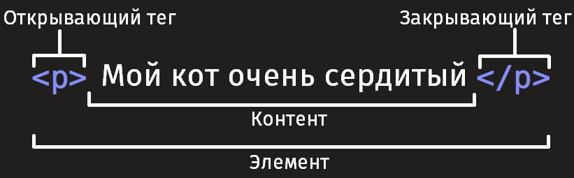
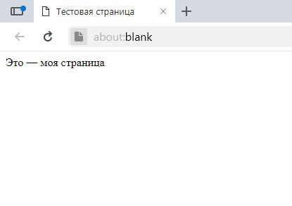

{{LearnSidebar}}{{NextMenu("Learn/HTML/Introduction_to_HTML/The_head_metadata_in_HTML", "Learn/HTML/Введение_в_HTML/Начало_работы")}}

В этой статье мы охватим азы HTML, необходимые для начала работы. Дадим определение «элементам», «атрибутам», «тегам» и прочим важным понятиям, о которых вы, возможно, слышали, а также об их роли в языке. Мы также покажем, как устроены HTML-элементы, типичная HTML-страница, и объясним другие важные аспекты языка. По ходу дела, чтобы вы не заскучали, мы поиграем с настоящей HTML-страницей!

| Необходимые знания: | Умение работать с компьютером, [наличие необходимого ПО](/ru/docs/Learn/Getting_started_with_the_web/Installing_basic_software), базовые знания о [работе с файлами](/ru/docs/Learn/Getting_started_with_the_web/Dealing_with_files). |
| ------------------- | ------------------------------------------------------------------------------------------------------------------------------------------------------------------------------------------------------------------------------------- |
| Цель:               | Познакомиться с языком HTML и научиться описывать некоторые его элементы.                                                                                                                                                             |

## Что такое HTML?

{{glossary("HTML")}} (HyperText Markup Language - язык гипертекстовой разметки) не является языком программирования; это _язык разметки_, используемый для определения структуры веб-страниц, посещаемых пользователями. Они могут иметь сложную или простую структуру, всё зависит от замысла и желания веб-разработчика. HTML состоит из ряда {{glossary("Element", "элементов")}}, которые вы используете для того, чтобы охватить, обернуть или _разметить_ различные части содержимого, чтобы оно имело определённый вид или срабатывало определённым способом. Встроенные {{glossary("Tag", "тэги")}} могут преобразовать часть содержимого в гиперссылку, по которой можно перейти на другую веб-страницу, выделить курсивом слова и так далее. Например, рассмотрим следующую строку:

```
Мой кот очень сердитый
```

Если мы хотим, чтобы строка отобразилась в таком же виде, мы можем определить её, как "параграф", заключив её в теги элемента "параграф" ({{htmlelement("p")}}), например:

```html
<p>Мой кот очень сердитый</p>
```

> **Примечание:** Метки в HTML нечувствительны к регистру, то есть они могут быть записаны в верхнем или нижнем регистре. Например, тег {{htmlelement("title")}} может быть записан как `<title>`, `<TITLE>`, `<Title>`, `<TiTlE>`, и т.д., и он будет работать нормально. Лучшей практикой, однако, является запись всех тегов в нижнем регистре для обеспечения согласованности, удобочитаемости и других причин.

## Структура HTML-элементов

Давайте рассмотрим элемент "параграф" чуть подробнее:



Основными частями элемента являются:

1. **Открывающий тег:** Он состоит из названия (обозначения) элемента (в нашем случае, p), помещённого внутри **угловых скобок**. Данный тег служит признаком начала элемента, с этого момента тег начинает влиять на следующее после него содержимое.
2. **Закрывающий тег:** выглядит как и открывающий, но содержит слеш перед названием тега. Он служит признаком конца элемента. Пропуски закрывающих тегов — типичная ошибка новичков, которая может приводить к неопределённым результатам — в лучшем случае всё сработает правильно, в других страница может вовсе не прорисоваться или прорисоваться не как ожидалось.
3. **Содержимое:** Как видно, в нашем случае содержимым является простой текст.
4. **Элемент:** открывающий тег + закрывающий тег + содержимое = элемент.

### Активное изучение: создание вашего первого HTML-элемента

Отредактируйте строку текста ниже в поле _Ввод_, обернув её тегами `<em>` и `</em>` (вставьте `<em>` перед строкой, чтобы _указать начало элемента_, и `</em>` после неё, чтобы _указать конец элемента_) — эти действия должны выделить строку текста курсивом! Вы можете видеть изменения в реальном времени в поле _Вывод_.

Если вы ошиблись, то всегда можете начать снова, воспользовавшись кнопкой _Сбросить_. Если упражнение вызывает у вас затруднения, то нажмите кнопку _Показать решение_, чтобы увидеть правильный ответ.

```html hidden
<h2>Результат</h2>
<div class="output" style="min-height: 50px;"></div>

<h2>Редактируемый код</h2>
<p class="a11y-label">
  Нажмите Esc, чтобы выйти из области кода (Tab вставляет символ табуляции).
</p>

<textarea id="code" class="playable-code" style="min-height: 100px;width: 95%">
  Это мой текст.
</textarea>

<div class="controls">
  <input id="reset" type="button" value="Сбросить" />
  <input id="solution" type="button" value="Показать решение" />
</div>
```

```css hidden
html {
  font-family: "Open Sans Light", Helvetica, Arial, sans-serif;
}

h2 {
  font-size: 16px;
}

.a11y-label {
  margin: 0;
  text-align: right;
  font-size: 0.7rem;
  width: 98%;
}

body {
  margin: 10px;
  background: #f5f9fa;
}
```

```js hidden
var textarea = document.getElementById("code");
var reset = document.getElementById("reset");
var solution = document.getElementById("solution");
var output = document.querySelector(".output");
var code = textarea.value;
var userEntry = textarea.value;

function updateCode() {
  output.innerHTML = textarea.value;
}

reset.addEventListener("click", function () {
  textarea.value = code;
  userEntry = textarea.value;
  solutionEntry = htmlSolution;
  solution.value = "Показать решение";
  updateCode();
});

solution.addEventListener("click", function () {
  if (solution.value === "Показать решение") {
    textarea.value = solutionEntry;
    solution.value = "Спрятать решение";
  } else {
    textarea.value = userEntry;
    solution.value = "Показать решение";
  }
  updateCode();
});

var htmlSolution = "<em>Это мой текст.</em>";
var solutionEntry = htmlSolution;

textarea.addEventListener("input", updateCode);
window.addEventListener("load", updateCode);

// stop tab key tabbing out of textarea and
// make it write a tab at the caret position instead

textarea.onkeydown = function (e) {
  if (e.keyCode === 9) {
    e.preventDefault();
    insertAtCaret("\t");
  }

  if (e.keyCode === 27) {
    textarea.blur();
  }
};

function insertAtCaret(text) {
  var scrollPos = textarea.scrollTop;
  var caretPos = textarea.selectionStart;

  var front = textarea.value.substring(0, caretPos);
  var back = textarea.value.substring(
    textarea.selectionEnd,
    textarea.value.length,
  );
  textarea.value = front + text + back;
  caretPos = caretPos + text.length;
  textarea.selectionStart = caretPos;
  textarea.selectionEnd = caretPos;
  textarea.focus();
  textarea.scrollTop = scrollPos;
}

// Update the saved userCode every time the user updates the text area code

textarea.onkeyup = function () {
  // We only want to save the state when the user code is being shown,
  // not the solution, so that solution is not saved over the user code
  if (solution.value === "Показать решение") {
    userEntry = textarea.value;
  } else {
    solutionEntry = textarea.value;
  }

  updateCode();
};
```

{{ EmbedLiveSample('Playable_code', 700, 400, "", "", "hide-codepen-jsfiddle") }}

### Вложенные элементы

Вы также можете вкладывать элементы внутрь других элементов — это называется **вложенностью**. Если мы хотим подчеркнуть, что наш кот **очень** сердитый, мы можем заключить слово "очень" в элемент {{htmlelement("strong")}} , который означает, что это слово крайне важно в данном контексте:

```html
<p>Мой кот <strong>очень</strong> сердитый.</p>
```

Вы должны удостовериться, что элементы вложены должным образом: в следующем примере мы открываем `p` элемент первым, затем элемент `strong`, затем мы закрываем элемент `strong` первым, затем `p`. Следующее писать неправильно:

```html example-bad
<p>Мой кот <strong>очень сердитый.</p></strong>
```

Элементы должны открываться и закрываться правильно таким образом, чтобы явно находиться внутри или снаружи друг друга. Если они перекрываются так, как в примере выше, то ваш браузер попытается «додумать» за вас, что вы имели в виду, и вы получите непредсказуемый результат. Так что не делайте так!

### Блочные и строчные элементы

Существует две важных категории элементов в HTML, которые вам стоит знать — элементы блочного уровня и строчные элементы.

- Элементы блочного уровня формируют видимый блок на странице — они окажутся на новой строке после любого контента, который шёл до них, и любой контент после них также окажется на новой строке. Чаще всего элементами блочного уровня бывают структурные элементы страницы, представляющие собой, например, параграфы (абзацы), списки, меню навигации, футеры, или подвалы, и т. п. Элементы блочного уровня не вкладываются в строчные элементы, но иногда могут вкладываться в другие элементы блочного уровня.
- Строчные элементы — это те, которые содержатся в элементах блочного уровня и окружают только малые части содержимого документа, не целые абзацы и группировки контента. Строчные элементы не приводят к появлению новой строки в документе: они обычно встречаются внутри абзаца текста, например, элемент {{htmlelement("a")}} (ссылка) или акцентирующие элементы вроде {{htmlelement("em")}} или {{htmlelement("strong")}}.

Посмотрите на следующий пример:

```html
<em>Первый</em>
<em>второй</em>
<em>третий</em>

<p>четвёртый</p>
<p>пятый</p>
<p>шестой</p>
```

{{htmlelement("em")}} — это строчный элемент, так что, как вы здесь видите, первые три элемента находятся на одной строке друг с другом без пробелов между ними. С другой стороны, {{htmlelement("p")}} — это элемент блочного уровня, так что каждый элемент находится на новой строке, с пространством выше и ниже каждого (этот интервал определяется [CSS-оформлением](/ru/docs/Learn/CSS/First_steps) по умолчанию, которое браузеры применяют к абзацам).

{{ EmbedLiveSample('Block_versus_inline_elements', 700, 200, "", "") }}

> **Примечание:** HTML5 переопределил категории элементов в HTML: смотрите [Категории типов содержимого элементов](https://www.whatwg.org/specs/web-apps/current-work/complete/section-index.html#element-content-categories). Хотя эти определения точнее и однозначнее, чем те, которые были раньше, их гораздо сложнее понять, чем «блочный» и «строчный», поэтому мы будем придерживаться их в этом разделе.

> **Примечание:** Не путайте термины «блочный» и «строчный», используемые в этом разделе, с одноимёнными [типами отображения в CSS](/ru/docs/Learn/CSS/Building_blocks/The_box_model#экскурс_внутренний_и_внешний_типы_отображения). Хотя по умолчанию они коррелируют, смена типа отображения в CSS не меняет категорию элемента и не влияет на то, во что его можно вкладывать и что можно вкладывать в него. Эта довольно частая путаница — одна из причин, почему HTML5 отказался от этих терминов.

> **Примечание:** вам могут пригодиться справочники, включающие списки блочных и строчных элементов — смотри [Элементы блочного уровня](/ru/docs/Web/HTML/Block-level_elements) и [Строчные элементы](/ru/docs/Web/HTML/Inline_elements).

### Пустые элементы

Не все элементы соответствуют вышеупомянутому шаблону: открывающий тег, контент, закрывающий тег. Некоторые элементы состоят из одного тега и обычно используются для вставки чего-либо в то место документа, где размещены. Например, элемент {{htmlelement("img")}} вставляет картинку на страницу в том самом месте, где он расположен:

```html

```

Это выведет на вашу страницу следующее:

{{ EmbedLiveSample('Empty_elements', 700, 300, "", "", "hide-codepen-jsfiddle") }}

> **Примечание:** Пустые элементы иногда называют _void-элементами_.

## Атрибуты

У элементов также могут быть атрибуты, которые выглядят так:


Атрибуты содержат дополнительную информацию об элементе, которая, по вашему мнению, не должна отображаться в содержимом элемента. В данном случае атрибут `class` позволяет вам дать элементу идентификационное имя, которое в дальнейшем может быть использовано для обращения к элементу с информацией о стиле и прочими вещами.

Атрибут должен иметь:

1. Пробел между атрибутом и именем элемента (или предыдущим атрибутом, если у элемента уже есть один или несколько атрибутов).
2. Имя атрибута и следующий за ним знак равенства.
3. Значение атрибута, заключённое в кавычки.

### Активное изучение: Добавление атрибутов в элемент

Возьмём для примера элемент {{htmlelement("a")}} — означает anchor (якорь) и делает текст внутри него гиперссылкой. Может иметь несколько атрибутов, вот несколько из них:

- `href`
  - : В значении этого атрибута прописывается веб-адрес, на который, по вашей задумке, должна указывать ссылка, куда браузер переходит, когда вы по ней кликаете. Например, `href="https://www.mozilla.org/"`.
- `title`
  - : Атрибут `title` описывает дополнительную информацию о ссылке, такую как: на какую страницу она ведёт. Например, `title="The Mozilla homepage"`. Она появится в виде всплывающей подсказки, когда вы наведёте курсор на ссылку.
- `target`
  - : Атрибут `target` определяет контекст просмотра, который будет использоваться для отображения ссылки. Например, `target="_blank"` отобразит ссылку на новой вкладке. Если вы хотите отобразить ссылку на текущей вкладке, просто опустите этот атрибут.

Измените строку текста ниже в поле _Ввод_ так, чтобы она вела на ваш любимый веб-сайт. Сначала добавьте элемент `<a>` затем атрибут `href` и атрибут `title`. Наконец, укажите атрибут `target` чтобы открыть ссылку на новой вкладке. Вы можете наблюдать сделанные изменения в реальном времени в поле _Вывод_. Вы должны увидеть гиперссылку, при наведении курсора на которую появляется содержимое атрибута `title`, а при щелчке переходит по адресу в атрибуте `href`. Помните, что между именем элемента и каждым из атрибутов должен быть пробел.

Если вы ошиблись, то всегда можете начать снова, воспользовавшись кнопкой _Сбросить_. Если упражнение вызывает у вас затруднения, то нажмите кнопку _Показать решение_, чтобы увидеть правильный ответ.

```html hidden
<h2>Результат</h2>

<div class="output" style="min-height: 50px;"></div>

<h2>Редактируемый код</h2>
<p class="a11y-label">
  Нажмите Esc, чтобы выйти из области кода (Tab вставляет символ табуляции).
</p>

<textarea id="code" class="input" style="min-height: 100px;width: 95%">
  &lt;p&gt;Ссылка на мой любимый веб-сайт.&lt;/p&gt;
</textarea>

<div class="playable-buttons">
  <input id="reset" type="button" value="Сбросить" />
  <input id="solution" type="button" value="Показать решение" />
</div>
```

```css hidden
html {
  font-family: sans-serif;
}

h2 {
  font-size: 16px;
}

.a11y-label {
  margin: 0;
  text-align: right;
  font-size: 0.7rem;
  width: 98%;
}

body {
  margin: 10px;
  background: #f5f9fa;
}
```

```js hidden
var textarea = document.getElementById("code");
var reset = document.getElementById("reset");
var solution = document.getElementById("solution");
var output = document.querySelector(".output");
var code = textarea.value;
var userEntry = textarea.value;

function updateCode() {
  output.innerHTML = textarea.value;
}

reset.addEventListener("click", function () {
  textarea.value = code;
  userEntry = textarea.value;
  solutionEntry = htmlSolution;
  solution.value = "Показать решение";
  updateCode();
});

solution.addEventListener("click", function () {
  if (solution.value === "Показать решение") {
    textarea.value = solutionEntry;
    solution.value = "Спрятать решение";
  } else {
    textarea.value = userEntry;
    solution.value = "Показать решение";
  }
  updateCode();
});

var htmlSolution =
  '<p>Ссылка на мой <a href="https://www.mozilla.org/" title="Домашняя страница Mozilla" target="_blank">любимый веб-сайт</a>.</p>';
var solutionEntry = htmlSolution;

textarea.addEventListener("input", updateCode);
window.addEventListener("load", updateCode);

// stop tab key tabbing out of textarea and
// make it write a tab at the caret position instead

textarea.onkeydown = function (e) {
  if (e.keyCode === 9) {
    e.preventDefault();
    insertAtCaret("\t");
  }

  if (e.keyCode === 27) {
    textarea.blur();
  }
};

function insertAtCaret(text) {
  var scrollPos = textarea.scrollTop;
  var caretPos = textarea.selectionStart;

  var front = textarea.value.substring(0, caretPos);
  var back = textarea.value.substring(
    textarea.selectionEnd,
    textarea.value.length,
  );
  textarea.value = front + text + back;
  caretPos = caretPos + text.length;
  textarea.selectionStart = caretPos;
  textarea.selectionEnd = caretPos;
  textarea.focus();
  textarea.scrollTop = scrollPos;
}

// Update the saved userCode every time the user updates the text area code

textarea.onkeyup = function () {
  // We only want to save the state when the user code is being shown,
  // not the solution, so that solution is not saved over the user code
  if (solution.value === "Показать решение") {
    userEntry = textarea.value;
  } else {
    solutionEntry = textarea.value;
  }

  updateCode();
};
```

{{ EmbedLiveSample('Playable_code2', 700, 400, "", "", "hide-codepen-jsfiddle") }}

### Булевые атрибуты

Иногда вы будете видеть атрибуты, написанные без значения — это совершенно допустимо. Такие атрибуты называются булевые, и они могут иметь только одно значение, которое в основном совпадает с его именем. В качестве примера возьмём атрибут [`disabled`](/ru/docs/Web/HTML/Element/input#disabled), который можно назначить для формирования элементов ввода, если вы хотите, чтобы они были отключены (неактивны), так что пользователь не может вводить какие-либо данные в них.

```
<input type="text" disabled="disabled">
```

Для краткости совершенно допустимо записывать их следующим образом (мы также для справки разместили не деактивированный элемент input, чтобы дать вам большее понимание происходящего):

```html
<input type="text" disabled />

<input type="text" />
```

На выходе оба варианта будут выглядеть следующим образом:

{{ EmbedLiveSample('Boolean_attributes', 700, 100, "", "", "hide-codepen-jsfiddle") }}

### Опускание кавычек вокруг значений атрибутов

Осматриваясь во всемирной сети, вы будете встречать различные незнакомые способы написания разметки, включая написание значений атрибутов без кавычек. Это допустимо при определённых условиях, но разрушит вашу разметку при других. Например, возвращаясь к нашему упражнению с гиперссылкой, мы можем написать основной вариант только с атрибутом `href` так:

```html
<a href=https://www.mozilla.org/>любимый веб-сайт</a>
```

Однако, как только мы добавим атрибут `title` в таком же стиле, мы поступим неверно:

```html example-bad
<a href=https://www.mozilla.org/ title=The Mozilla homepage>favorite website</a>
```

В этом месте браузер неверно истолкует вашу разметку, думая, что атрибут `title` — это на самом деле три разных атрибута — атрибут title со значением "The" и два булевых атрибута: `Mozilla` и `homepage`. Это, очевидно, не то, что имелось в виду, и приведёт к ошибке или неожиданному поведению кода, как это показано в живом примере ниже. Попробуйте навести курсор на ссылку, чтобы увидеть, на что похож текст title!

{{ EmbedLiveSample('Omitting_quotes_around_attribute_values', 700, 100, "", "", "hide-codepen-jsfiddle") }}

Наш совет: всегда используйте кавычки в атрибутах — это позволит избежать подобных проблем, и, следовательно, код будет более читабельным.

### Одинарные или двойные кавычки?

В этой статье вы заметите, что все атрибуты заключены в двойные кавычки. Однако, вы можете видеть одинарные кавычки в HTML документах других людей. Это исключительно дело вкуса, и вы можете свободно выбирать, какие из них предпочитаете. Обе следующие строки эквивалентны:

```html
<a href="http://www.example.com">Ссылка к моему примеру.</a>

<a href="http://www.example.com">Ссылка к моему примеру.</a>
```

Однако вы должны убедиться, что не смешиваете их вместе. Следующее будет неверным!

```html example-bad
<a href="http://www.example.com'>Ссылка к моему примеру.</a>
```

Если вы используете один тип кавычек в своём HTML, то вы можете поместить внутрь их кавычки другого типа, не вызывая никаких проблем:

```html
<a href="http://www.example.com" title="Isn't this fun?"
  >A link to my example.</a
>
```

Если вы хотите вставить кавычки того же типа, то вы должны использовать [объекты HTML](/ru/docs/Learn/HTML/Introduction_to_HTML/Getting_started#entity_references_including_special_characters_in_html). Например, это работать не будет:

```html example-bad
<a href='http://www.example.com' title='Isn't this fun?'>A link to my example.</a>
```

Поэтому вам нужно сделать так:

```html
<a href="http://www.example.com" title="Isn&#39;t this fun?"
  >A link to my example.</a
>
```

## Структура HTML документа

Ниже дан пример оборачивания основных, самостоятельных HTML-элементов, которые сами по себе не очень полезны. Давайте посмотрим, как самостоятельные элементы объединяются для формирования всей HTML страницы:

```html
<!doctype html>
<html>
  <head>
    <meta charset="utf-8" />
    <title>Тестовая страница</title>
  </head>
  <body>
    <p>Это — моя страница</p>
  </body>
</html>
```

Вот что мы имеем:

1. `<!DOCTYPE html>`: Объявление типа документа. Очень давно, ещё когда HTML был молод (1991/2), типы документов использовались в качестве ссылок на набор правил, которым HTML-страница должна была следовать, чтобы она считалась хорошей, что может означать автоматическую проверку ошибок и другие полезные вещи. Объявление типа документа выглядело примерно вот так:

   ```html
   <!DOCTYPE html PUBLIC "-//W3C//DTD XHTML 1.0 Transitional//EN" "http://www.w3.org/TR/xhtml1/DTD/xhtml1-transitional.dtd">
   ```

   Однако в наши дни никто особо не думает о них, и типы документа стали историческим артефактом, которые должны быть включены везде, чтобы всё работало правильно. `<!DOCTYPE html>` — это самый короткий вид типа документа, который считается действующим. На самом деле это всё, что нужно вам знать о типах документов .

2. `<html></html>`: Элемент {{htmlelement("html")}} содержит в себе всё содержимое на всей странице, и иногда его называют "корневой элемент".
3. `<head></head>`: Элемент {{htmlelement("head")}}. Данный элемент выступает в качестве контейнера для всего содержимого, которое вы хотите включить в HTML документ, но не хотите показывать посетителям вашей страницы. Он включает такие вещи, как ключевые слова и описание страницы, которые вы хотели бы показывать в поисковых запросах, CSS для стилизирования вашего контента, объявление поддерживаемого набора символов и многое другое. Вы узнаете больше об этом из следующей статьи данного руководства.
4. `<meta charset="utf-8">`: Этот элемент устанавливает в качестве символьной кодировки для вашего документа utf-8 , который включает большинство символов из всех известных человечеству языков. По существу, теперь страница сможет отобразить любой текстовый контент, который вы сможете в неё вложить. Нет причин не устанавливать эту кодировку, это также позволит избежать некоторых проблем позднее.
5. `<title></title>`: Элемент {{htmlelement("title")}}. Этот элемент устанавливает заголовок вашей страницы, который появляется во вкладке браузера, загружающей эту страницу, также это заглавие используется при описании страницы, когда вы сохраняете её в закладках или избранном.
6. `<body></body>`: Элемент {{htmlelement("body")}}. Он содержит _весь_ контент, который вы хотите показывать посетителям вашей страницы, — текст, изображения, видео, игры, проигрываемые аудио дорожки или что-то ещё.

### Активное изучение: Добавление элементов в ваш HTML-документ

Если вы хотите поэкспериментировать с написанием HTML на своём компьютере, то можете:

1. Скопировать пример HTML-страницы, расположенный выше.
2. Создать новый файл в текстовом редакторе.
3. Вставить код в ваш новый текстовый файл.
4. Сохранить файл как `index.html`.

> **Примечание:** вы также можете найти этот базовый пример HTML на [MDN Learning Area Github repo](https://github.com/mdn/learning-area/blob/master/html/introduction-to-html/getting-started/index.html).

Теперь можете открыть браузер и посмотреть, во что отрисовался код, а потом изменить его, обновить страницу и посмотреть, что получилось. Сначала страница выглядит так:


Для этого упражнения вы можете редактировать код локально на своём компьютере, как предлагается выше, а можете работать в редакторе, расположенном ниже. В редакторе показано только содержимое элемента {{htmlelement("body")}}. Попробуйте сделать следующее:

- Добавьте заголовок страницы сразу за открывающим тегом {{htmlelement("body")}}. Текст должен находиться между открывающим тегом `<h1>` и закрывающим `</h1>` .
- Напишите в параграфе о чём-нибудь, что кажется вам интересным.
- Выделите важные слова, обернув их в открывающий тег `<strong>` и закрывающий `</strong>`
- Добавьте ссылку на свой абзац так, как [объяснено ранее в статье](/ru/docs/Learn/HTML/Introduction_to_HTML/Getting_started#active_learning_adding_attributes_to_an_element).
- Добавьте изображение в свой документ под абзацем, как [объяснено ранее в статье](/ru/docs/Learn/HTML/Introduction_to_HTML/Getting_started#empty_elements). Если сможете использовать другую картинку (со своего компьютера или из интернета). Вы большой молодец!

Если вы запутались, всегда можно запустить пример сначала кнопкой _Сбросить_. Сдаётесь — посмотрите ответ, нажав на _Показать решение_.

```html hidden
<h2>Результат</h2>

<div class="output" style="min-height: 50px;"></div>

<h2>Редактируемый код</h2>
<p class="a11y-label">
  Нажмите Esc, чтобы выйти из области кода (Tab вставляет символ табуляции).
</p>

<textarea id="code" class="input" style="min-height: 100px;width: 95%">
  &lt;p&gt;Это — моя страница&lt;/p&gt;
</textarea>

<div class="playable-buttons">
  <input id="reset" type="button" value="Сбросить" />
  <input id="solution" type="button" value="Показать решение" />
</div>
```

```css hidden
html {
  font-family: sans-serif;
}

h2 {
  font-size: 16px;
}

.a11y-label {
  margin: 0;
  text-align: right;
  font-size: 0.7rem;
  width: 98%;
}

img {
  max-width: 100%;
}

body {
  margin: 10px;
  background: #f5f9fa;
}
```

```js hidden
var textarea = document.getElementById("code");
var reset = document.getElementById("reset");
var solution = document.getElementById("solution");
var output = document.querySelector(".output");
var code = textarea.value;
var userEntry = textarea.value;

function updateCode() {
  output.innerHTML = textarea.value;
}

reset.addEventListener("click", function () {
  textarea.value = code;
  userEntry = textarea.value;
  solutionEntry = htmlSolution;
  solution.value = "Показать решение";
  updateCode();
});

solution.addEventListener("click", function () {
  if (solution.value === "Показать решение") {
    textarea.value = solutionEntry;
    solution.value = "Спрятать решение";
  } else {
    textarea.value = userEntry;
    solution.value = "Показать решение";
  }
  updateCode();
});

var htmlSolution =
  '<p>Мне очень нравится <strong>играть на барабанах</strong>. Мой любимый барабанщик — Нил Пирт, который играет в группе <a href="https://en.wikipedia.org/wiki/Rush_%28band%29" title="Rush Wikipedia article">"Rush"</a>. Мой любимый альбом Rush — <a href="http://www.deezer.com/album/942295">"Moving Pictures"</a>.</p> ';
var solutionEntry = htmlSolution;

textarea.addEventListener("input", updateCode);
window.addEventListener("load", updateCode);

// stop tab key tabbing out of textarea and
// make it write a tab at the caret position instead

textarea.onkeydown = function (e) {
  if (e.keyCode === 9) {
    e.preventDefault();
    insertAtCaret("\t");
  }

  if (e.keyCode === 27) {
    textarea.blur();
  }
};

function insertAtCaret(text) {
  var scrollPos = textarea.scrollTop;
  var caretPos = textarea.selectionStart;

  var front = textarea.value.substring(0, caretPos);
  var back = textarea.value.substring(
    textarea.selectionEnd,
    textarea.value.length,
  );
  textarea.value = front + text + back;
  caretPos = caretPos + text.length;
  textarea.selectionStart = caretPos;
  textarea.selectionEnd = caretPos;
  textarea.focus();
  textarea.scrollTop = scrollPos;
}

// Update the saved userCode every time the user updates the text area code

textarea.onkeyup = function () {
  // We only want to save the state when the user code is being shown,
  // not the solution, so that solution is not saved over the user code
  if (solution.value === "Показать решение") {
    userEntry = textarea.value;
  } else {
    solutionEntry = textarea.value;
  }

  updateCode();
};
```

{{ EmbedLiveSample('Playable_code3', 700, 600, "", "", "hide-codepen-jsfiddle") }}

### Пробелы в HTML

Вы могли заметить, что в примерах кода из этой статьи много пробелов. Это вовсе не обязательно — следующие два примера эквивалентны:

```html-nolint
<p>Собаки глупы.</p>

<p>Собаки
         глупы.</p>
```

Не важно, сколько пустого места вы используете в разметке (что может включать пробелы и сдвиги строк): браузер при анализе кода сократит всё пустое место до одного пробела. Зачем использовать много пробелов? Ответ: это доступность для понимания — гораздо легче разобраться, что происходит в вашем коде, если он удобно отформатирован, а не просто собран вместе в одном большом беспорядке. В нашем коде каждый вложенный элемент сдвинут на два пробела относительно элемента, в котором он находится. Вы можете использовать любое форматирование (в частности, количество пробелов для отступа), но лучше придерживаться одного стиля.

## Ссылки на сущности: Включение специальных символов в HTML

В HTML символы `<`, `>`, `"`, `'` и `&` являются специальными. Они являются частью самого синтаксиса HTML. Так как же включить в текст один из этих специальных символов? Например, если вы хотите использовать амперсанд или знак «меньше» и не интерпретировать его как код.

Мы должны использовать ссылки-мнемоники — специальные коды, которые отображают спецсимволы, и могут быть использованы в необходимых позициях. Каждая ссылка-мнемоник начинается с амперсанда (&) и завершается точкой с запятой (;).

| Буквенный символ | Символьный эквивалент |
| ---------------- | --------------------- |
| <                | \&lt;                 |
| >                | \&gt;                 |
| "                | \&quot;               |
| '                | \&apos;               |
| &                | \&amp;                |

В следующем примере вы видите два абзаца, которые рассказывают о веб-технологиях:

```html-nolint
<p>В HTML вы определяете параграф элементом <p>.</p>

<p>В HTML вы определяете параграф элементом &lt;p&gt;.</p>
```

В живом выводе ниже вы можете заметить, что первый абзац выводится неправильно, так как браузер считает, что второй элемент `<p>` является началом нового абзаца! Второй абзац нашего кода выводится правильно, потому что мы заменили угловые скобки на ссылки-мнемоники.

{{ EmbedLiveSample('Entity_references_Including_special_characters_in_HTML', 700, 200, "", "", "hide-codepen-jsfiddle") }}

> **Примечание:** Таблица всех доступных в HTML символов-мнемоников — в Википедии: [List of XML and HTML character entity references](http://en.wikipedia.org/wiki/List_of_XML_and_HTML_character_entity_references).

## HTML комментарии

В HTML, как и в большинстве языков программирования, есть возможность писать комментарии в коде. Комментарии игнорируются обозревателем и не видны пользователю, их добавляют для того, чтобы пояснить, как работает написанный код, что делают отдельные его части и т. д. Такая практика полезна, если вы возвращаетесь к коду, который давно не видели или когда хотите передать его кому-то другому.

Чтобы превратить часть содержимого HTML-файла в комментарий, нужно поместить её в специальные маркеры `<!--` и `-->`, например:

```html
<p>Меня нет в комментариях(</p>

<!-- <p>А теперь есть!</p> -->
```

Как вы увидите ниже, первый параграф будет отображён на экране, а второй нет.

{{ EmbedLiveSample('HTML_comments', 700, 100, "", "", "hide-codepen-jsfiddle") }}

## Подведение итогов

Вы дошли до конца статьи — надеемся, вам понравилось путешествие по основам HTML. На этом этапе вы уже должны немного разобраться, как выглядит язык, как он работает на базовом уровне и уметь описать несколько элементов и атрибутов. Сейчас идеальное время и место, чтобы продолжить изучать HTML. В последующих статьях мы рассмотрим некоторые из вещей, которые вы уже рассмотрели, но намного подробнее, а также представим некоторые новые функции языка. Оставайтесь с нами!

> **Примечание:** Сейчас, когда вы начинаете больше узнавать о HTML, вы также можете начать изучать основы каскадных таблиц стилей Cascading Style Sheets, или [CSS](/ru/docs/Learn/CSS). CSS — это язык, который используется для стилизации веб-страниц (например, изменение шрифта или цветов или изменение макета страницы). Как вы скоро поймёте, HTML и CSS созданы друг для друга.

## Смотрите также

- [Применение цвета к элементам HTML с помощью CSS](/ru/docs/Web/HTML/Applying_color)

{{NextMenu("Learn/HTML/Introduction_to_HTML/The_head_metadata_in_HTML", "Learn/HTML/Введение_в_HTML/Начало_работы")}}

## В этом модуле

- [Начало работы с HTML](/ru/docs/Learn/HTML/%D0%92%D0%B2%D0%B5%D0%B4%D0%B5%D0%BD%D0%B8%D0%B5_%D0%B2_HTML/%D0%9D%D0%B0%D1%87%D0%B0%D0%BB%D0%BE_%D1%80%D0%B0%D0%B1%D0%BE%D1%82%D1%8B)
- [Что такое заголовок? Метаданные в HTML](/ru/docs/Learn/HTML/%D0%92%D0%B2%D0%B5%D0%B4%D0%B5%D0%BD%D0%B8%D0%B5_%D0%B2_HTML/The_head_metadata_in_HTML)
- [Основы редактирования текста в HTML](/ru/docs/Learn/HTML/%D0%92%D0%B2%D0%B5%D0%B4%D0%B5%D0%BD%D0%B8%D0%B5_%D0%B2_HTML/HTML_text_fundamentals)
- [Создание гиперссылок](/ru/docs/Learn/HTML/%D0%92%D0%B2%D0%B5%D0%B4%D0%B5%D0%BD%D0%B8%D0%B5_%D0%B2_HTML/%D0%A1%D0%BE%D0%B7%D0%B4%D0%B0%D0%BD%D0%B8%D0%B5_%D0%B3%D0%B8%D0%BF%D0%B5%D1%80%D1%81%D1%81%D1%8B%D0%BB%D0%BE%D0%BA)
- [Углублённое форматирование текста](/ru/docs/Learn/HTML/%D0%92%D0%B2%D0%B5%D0%B4%D0%B5%D0%BD%D0%B8%D0%B5_%D0%B2_HTML/Advanced_text_formatting)
- [Структура документа и веб-сайта](/ru/docs/Learn/HTML/%D0%92%D0%B2%D0%B5%D0%B4%D0%B5%D0%BD%D0%B8%D0%B5_%D0%B2_HTML/%D0%A1%D1%82%D1%80%D1%83%D0%BA%D1%82%D1%83%D1%80%D0%B0_%D0%B4%D0%BE%D0%BA%D1%83%D0%BC%D0%B5%D0%BD%D1%82%D0%B0_%D0%B8_%D0%B2%D0%B5%D0%B1-%D1%81%D0%B0%D0%B9%D1%82%D0%B0)
- [Отладка HTML](/ru/docs/Learn/HTML/%D0%92%D0%B2%D0%B5%D0%B4%D0%B5%D0%BD%D0%B8%D0%B5_%D0%B2_HTML/Debugging_HTML)
- [Разметка письма](/ru/docs/Learn/HTML/%D0%92%D0%B2%D0%B5%D0%B4%D0%B5%D0%BD%D0%B8%D0%B5_%D0%B2_HTML/Marking_up_a_letter)
- [Структурируем страницу](/ru/docs/Learn/HTML/%D0%92%D0%B2%D0%B5%D0%B4%D0%B5%D0%BD%D0%B8%D0%B5_%D0%B2_HTML/Structuring_a_page_of_content)
