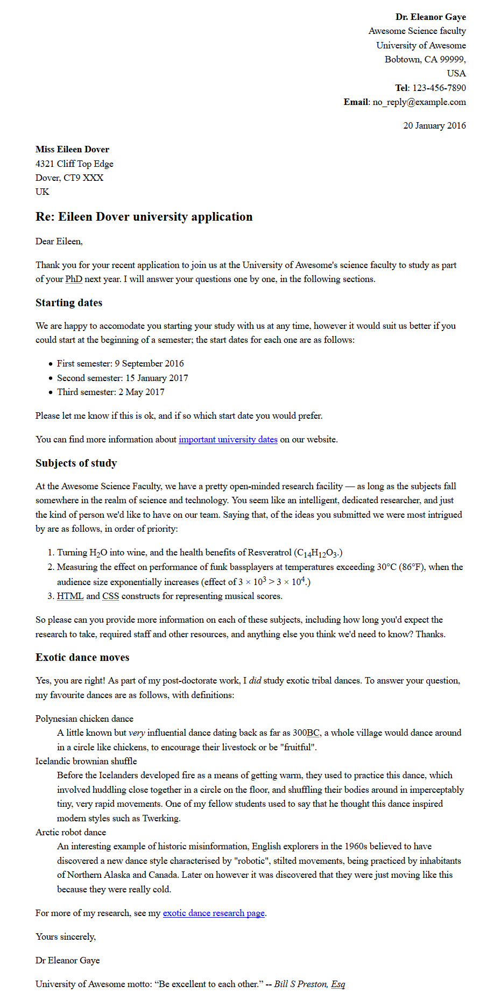

{{LearnSidebar}}{{PreviousMenuNext("Learn/HTML/Introduction_to_HTML/Debugging_HTML", "Learn/HTML/Introduction_to_HTML/Structuring_a_page_of_content", "Learn/HTML/Introduction_to_HTML")}}

Мы все учимся писать письма рано или поздно; это также хороший способ испытать наши навыки форматирования! В этом задании у вас будет письмо для проверки ваших навыков форматирования текста HTML, использования гиперссылок и элемента `<head>`.

| Знания: | Перед выполнением этого задания вы должны пройти [Начало работы с HTML](/ru/docs/Learn/HTML/%D0%92%D0%B2%D0%B5%D0%B4%D0%B5%D0%BD%D0%B8%D0%B5_%D0%B2_HTML/%D0%9D%D0%B0%D1%87%D0%B0%D0%BB%D0%BE_%D1%80%D0%B0%D0%B1%D0%BE%D1%82%D1%8B), [Что такое заголовок? Метаданные в HTML](/ru/docs/Learn/HTML/%D0%92%D0%B2%D0%B5%D0%B4%D0%B5%D0%BD%D0%B8%D0%B5_%D0%B2_HTML/The_head_metadata_in_HTML), [Основы редактирования текста в HTML](/ru/docs/Learn/HTML/%D0%92%D0%B2%D0%B5%D0%B4%D0%B5%D0%BD%D0%B8%D0%B5_%D0%B2_HTML/HTML_text_fundamentals), [Создание гиперссылок](/ru/docs/Learn/HTML/%D0%92%D0%B2%D0%B5%D0%B4%D0%B5%D0%BD%D0%B8%D0%B5_%D0%B2_HTML/%D0%A1%D0%BE%D0%B7%D0%B4%D0%B0%D0%BD%D0%B8%D0%B5_%D0%B3%D0%B8%D0%BF%D0%B5%D1%80%D1%81%D1%81%D1%8B%D0%BB%D0%BE%D0%BA), и [Углублённое форматирование текста](/ru/docs/Learn/HTML/%D0%92%D0%B2%D0%B5%D0%B4%D0%B5%D0%BD%D0%B8%D0%B5_%D0%B2_HTML/Advanced_text_formatting). |
| ------- | -------------------------------------------------------------------------------------------------------------------------------------------------------------------------------------------------------------------------------------------------------------------------------------------------------------------------------------------------------------------------------------------------------------------------------------------------------------------------------------------------------------------------------------------------------------------------------------------------------------------------------------------------------------------------------------------------------------------------------------------------------------------------------------------------------------------------------------------------------------------------------------------------------------------------- |
| Цель:   | Проверить базовые и продвинутые навыки HTML форматирования и работы с гиперссылками, и знания о содержимом HTML тега `<head>`.                                                                                                                                                                                                                                                                                                                                                                                                                                                                                                                                                                                                                                                                                                                                                                                             |

## Отправная точка

Для начала задания, вы должны [скачать текст](https://github.com/mdn/learning-area/blob/master/html/introduction-to-html/marking-up-a-letter-start/letter-text.txt), который вам надо отформатировать, и [CSS стиль](https://github.com/mdn/learning-area/blob/master/html/introduction-to-html/marking-up-a-letter-start/css.txt), который вы должны подключить к вашему HTML. Создайте .html файл используя текстовый редактор, которым вы пользуетесь (или воспользуйтесь онлайн редакторами, таким как [JSBin](http://jsbin.com/) или [Thimble](https://thimble.mozilla.org/)).

## Описание проекта

В этом проекте, ваша задача - отформатировать письмо, которое должно быть размещено во внутренней сети университета. Это письмо - ответ исследователя будущему PhD студенту о его заявлении на работу в университете.

Блочные элементы / структура:

- Вы должны корректно структурировать весь документ, включив в него элементы doctype, и {{htmlelement("html")}}, {{htmlelement("head")}} и {{htmlelement("body")}}.
- Письмо в целом должно быть размечено используя параграфы и заголовки, за исключением следующих пунктов - один заголовок верхнего уровня (начинается на "Re:") и три заголовка второго уровня.
- Даты начала семестра, изучения предметов и экзотических танцев должны быть помечены используя соответствующие типы списков.
- Два адреса должны быть помещены внутри элементов {{htmlelement("address")}}. Каждая строка адреса должна находиться на новой строке, но не быть новым параграфом.

Строчные элементы:

- Имена отправителя и получателя (как и "Tel" и "Email") должны быть выделены жирным.
- Четырём датам в документе необходимо выбрать правильные элементы содержащие машинно-читаемые даты.
- Первый адрес и первая дата в письме должны иметь атрибут `class` со значением `"sender-column"`; CSS стиль, который вы добавите позже, позволит выравнять по правому боку, как оно и должно быть в классической разметке письма.
- Пять акронимов/аббревиатур в главном тексте письма должны быть размечены, чтобы предоставить подсказки для каждого акронима/аббревиатуры.
- Шесть под/надстрочных элементов должны быть оформлены корректно в химической формуле, как и числа 103 и 104 (степень числа должна быть над числом).
- Для разметки символов градуса и умножения воспользуйтесь [справкой](https://ru.wikipedia.org/wiki/Мнемоники_в_HTML).
- Постарайтесь выделить как минимум два нужных по смыслу слова в тексте жирным.
- Есть два места, где следует разместить гиперссылки; добавьте нужные ссылки с заголовками. В качестве адреса для ссылок используйте `http://example.com`.
- Девиз университета и цитата должны быть размечены соответствующими элементами.

Заголовок документа:

- Кодировка документа должна быть указана как utf-8 с использованием соответствующего мета-тега.
- Автор письма должен быть указан в соответствующем мета-теге.
- Предоставленный CSS должен быть включён в соответствующий тег.

## Советы и подсказки

- Проверяйте свой HTML в [валидаторе W3C](https://validator.w3.org/) — писать валидный код здорово!
- Для задания не нужно знать CSS — просто укажите CSS из задания в документе.

## Пример

Это скриншот размеченного письма:

## Оценка

Если вам дали это задание на каком-то курсе, просто передайте свою страницу для проверки преподавателю. Если вы учитесь сами, обратитесь на [форум, в тему этого задания](https://discourse.mozilla.org/t/marking-up-a-letter-assignment/24676), или по тегу [#mdn](irc://irc.mozilla.org/mdn) в нашем IRC-канале ([Mozilla IRC](https://wiki.mozilla.org/IRC)). Сделайте это задание сами — вам некого обманывать, кроме себя самого.

{{PreviousMenuNext("Learn/HTML/Introduction_to_HTML/Debugging_HTML", "Learn/HTML/Introduction_to_HTML/Structuring_a_page_of_content", "Learn/HTML/Introduction_to_HTML")}}

## В этом модуле

- [Начало работы с HTML](/ru/docs/Learn/HTML/%D0%92%D0%B2%D0%B5%D0%B4%D0%B5%D0%BD%D0%B8%D0%B5_%D0%B2_HTML/%D0%9D%D0%B0%D1%87%D0%B0%D0%BB%D0%BE_%D1%80%D0%B0%D0%B1%D0%BE%D1%82%D1%8B)
- [Что такое заголовок? Метаданные в HTML](/ru/docs/Learn/HTML/%D0%92%D0%B2%D0%B5%D0%B4%D0%B5%D0%BD%D0%B8%D0%B5_%D0%B2_HTML/The_head_metadata_in_HTML)
- [Основы редактирования текста в HTML](/ru/docs/Learn/HTML/%D0%92%D0%B2%D0%B5%D0%B4%D0%B5%D0%BD%D0%B8%D0%B5_%D0%B2_HTML/HTML_text_fundamentals)
- [Создание гиперссылок](/ru/docs/Learn/HTML/%D0%92%D0%B2%D0%B5%D0%B4%D0%B5%D0%BD%D0%B8%D0%B5_%D0%B2_HTML/%D0%A1%D0%BE%D0%B7%D0%B4%D0%B0%D0%BD%D0%B8%D0%B5_%D0%B3%D0%B8%D0%BF%D0%B5%D1%80%D1%81%D1%81%D1%8B%D0%BB%D0%BE%D0%BA)
- [Углублённое форматирование текста](/ru/docs/Learn/HTML/%D0%92%D0%B2%D0%B5%D0%B4%D0%B5%D0%BD%D0%B8%D0%B5_%D0%B2_HTML/Advanced_text_formatting)
- [Структура документа и веб-сайта](/ru/docs/Learn/HTML/%D0%92%D0%B2%D0%B5%D0%B4%D0%B5%D0%BD%D0%B8%D0%B5_%D0%B2_HTML/%D0%A1%D1%82%D1%80%D1%83%D0%BA%D1%82%D1%83%D1%80%D0%B0_%D0%B4%D0%BE%D0%BA%D1%83%D0%BC%D0%B5%D0%BD%D1%82%D0%B0_%D0%B8_%D0%B2%D0%B5%D0%B1-%D1%81%D0%B0%D0%B9%D1%82%D0%B0)
- [Отладка HTML](/ru/docs/Learn/HTML/%D0%92%D0%B2%D0%B5%D0%B4%D0%B5%D0%BD%D0%B8%D0%B5_%D0%B2_HTML/Debugging_HTML)
- [Разметка письма](/ru/docs/Learn/HTML/%D0%92%D0%B2%D0%B5%D0%B4%D0%B5%D0%BD%D0%B8%D0%B5_%D0%B2_HTML/Marking_up_a_letter)
- [Структурируем страницу](/ru/docs/Learn/HTML/%D0%92%D0%B2%D0%B5%D0%B4%D0%B5%D0%BD%D0%B8%D0%B5_%D0%B2_HTML/Structuring_a_page_of_content)
