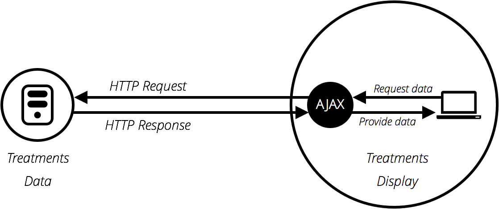
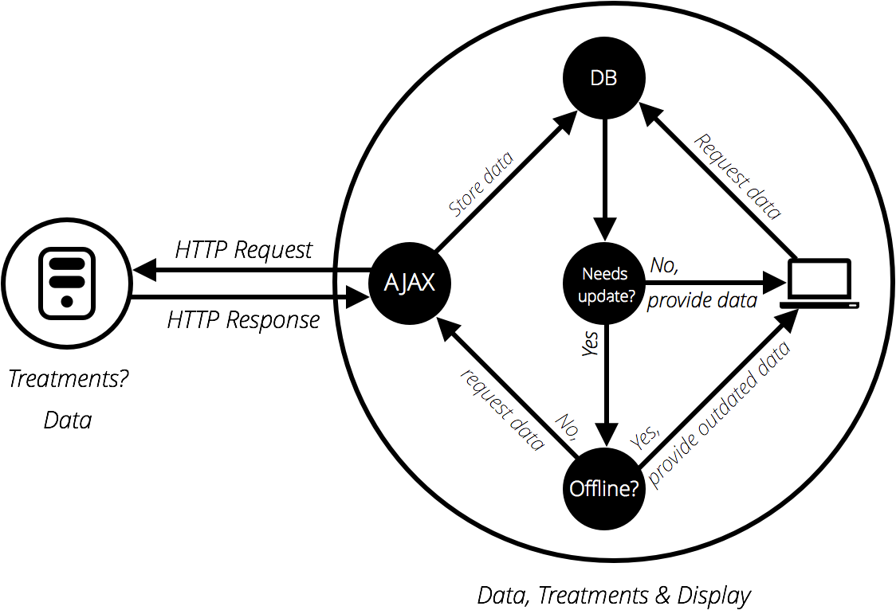

{{LearnSidebar}}{{PreviousMenuNext("Learn/JavaScript/Client-side_web_APIs/Manipulating_documents", "Learn/JavaScript/Client-side_web_APIs/Third_party_APIs", "Learn/JavaScript/Client-side_web_APIs")}}

Другой очень распространённой задачей в современных веб-сайтах и приложениях является получение отдельных элементов данных с сервера для обновления разделов веб-страницы без необходимости загрузки всей новой страницы. Эта, казалось бы, небольшая деталь оказала огромное влияние на производительность и поведение сайтов, поэтому в этой статье мы объясним концепцию и рассмотрим технологии, которые делают это возможным, например XMLHttpRequest и API Fetch.

| Необходимые условия: | Основы JavaScript (см. [первые шаги](/ru/docs/Learn/JavaScript/First_steps), [структурные элементы](/ru/docs/Learn/JavaScript/Building_blocks), [объекты JavaScript](/ru/docs/Learn/JavaScript/Objects)), [основы клиентских API](/ru/docs/Learn/JavaScript/Client-side_web_APIs/Introduction) |
| -------------------- | ---------------------------------------------------------------------------------------------------------------------------------------------------------------------------------------------------------------------------------------------------------------------------------------------- |
| Задача:              | Узнать, как извлекать данные с сервера и использовать их для обновления содержимого веб-страницы.                                                                                                                                                                                              |

## В чем проблема?

Первоначальная загрузка страницы в Интернете была простой - вы отправляли запрос на сервер web-сайта, и если всё работает, как и должно, то вся необходимая информация о странице будет загружена и отображена на вашем компьютере.


Проблема с этой моделью заключается в том, что всякий раз, когда вы хотите обновить любую часть страницы, например, чтобы отобразить новый набор продуктов или загрузить новую страницу, вам нужно снова загрузить всю страницу. Это очень расточительно и приводит к плохому пользовательскому опыту, особенно по мере того, как страницы становятся все более сложными.

### Появление Ajax

Это привело к созданию технологий, позволяющих веб-страницам запрашивать небольшие фрагменты данных (например, [HTML](/ru/docs/Web/HTML), {{glossary("XML")}}, [JSON](/ru/docs/Learn/JavaScript/Objects/JSON) или обычный текст) и отображать их только при необходимости, помогая решать проблему, описанную выше.

Это достигается с помощью таких API, как {{domxref("XMLHttpRequest")}} или - более новой - [Fetch API](/ru/docs/Web/API/Fetch_API). Эти технологии позволяют веб-страницам напрямую обрабатывать запросы [HTTP](/ru/docs/Web/HTTP) для определённых ресурсов, доступных на сервере, и форматировать результирующие данные по мере необходимости перед их отображением.

> **Примечание:** Вначале эта общая техника была известна как Асинхронный JavaScript и XML (Ajax), поскольку она, как правило, использовала {{domxref("XMLHttpRequest")}} для запроса данных XML. В наши дни это обычно не так (вы, скорее всего, будете использовать `XMLHttpRequest` или Fetch для запроса JSON), но результат все тот же, и термин «Ajax» по-прежнему часто используется для описания этой техники.



Модель Ajax предполагает использование веб-API в качестве прокси для более разумного запроса данных, а не просто для того, чтобы браузер перезагружал всю страницу. Давайте подумаем о значении этого:

1. Перейдите на один из ваших любимых сайтов, богатых информацией, таких как Amazon, YouTube, CNN и т.д., и загрузите его.
2. Теперь найдите что-нибудь, например, новый продукт. Основной контент изменится, но большая часть информации, подобной заголовку, нижнему колонтитулу, навигационному меню и т. д., останется неизменной.

Это действительно хорошо, потому что:

- Обновления страницы намного быстрее, и вам не нужно ждать перезагрузки страницы, а это означает, что сайт работает быстрее и воспринимается более отзывчивым.
- Меньше данных загружается при каждом обновлении, что означает меньшее потребление пропускной способности. Это не может быть такой большой проблемой на рабочем столе в широкополосном подключении, но это серьёзная проблема на мобильных устройствах и в развивающихся странах, которые не имеют повсеместного быстрого интернет-сервиса.

Чтобы ускорить работу, некоторые сайты также сохраняют необходимые файлы и данные на компьютере пользователя при первом обращении к сайту, а это означает, что при последующих посещениях они используют локальные версии вместо загрузки свежих копий, как при первой загрузке страницы. Содержимое загружается с сервера только при его обновлении.



## Основной запрос Ajax

Давайте посмотрим, как обрабатывается такой запрос, используя как {{domxref ("XMLHttpRequest")}}, так и [Fetch](/ru/docs/Web/API/Fetch_API). В этих примерах мы будем запрашивать данные из нескольких текстовых файлов и использовать их для заполнения области содержимого.

Этот набор файлов будет действовать как наша поддельная база данных; в реальном приложении мы с большей вероятностью будем использовать серверный язык, такой как PHP, Python или Node, чтобы запрашивать наши данные из базы данных. Здесь, однако, мы хотим сохранить его простым и сосредоточиться на стороне клиента.

### XMLHttpRequest

`XMLHttpRequest` (который часто сокращается до XHR) является довольно старой технологией сейчас - он был изобретён Microsoft в конце 1990-х годов и уже довольно долго стандартизирован в браузерах.

1. Чтобы начать этот пример, создайте локальную копию [ajax-start.html](https://github.com/mdn/learning-area/blob/master/javascript/apis/fetching-data/ajax-start.html) и четырёх текстовых файлов - [verse1.txt](https://github.com/mdn/learning-area/blob/master/javascript/apis/fetching-data/verse1.txt), [verse2.txt](https://github.com/mdn/learning-area/blob/master/javascript/apis/fetching-data/verse2.txt), [verse3.txt](https://github.com/mdn/learning-area/blob/master/javascript/apis/fetching-data/verse3.txt) и [verse4.txt](https://github.com/mdn/learning-area/blob/master/javascript/apis/fetching-data/verse4.txt) - в новом каталоге на вашем компьютере. В этом примере мы загрузим другое стихотворение (который вы вполне можете распознать) через XHR, когда он будет выбран в выпадающем меню.
2. Внутри элемента {{htmlelement("script")}} добавьте следующий код. В нем хранится ссылка на элементы {{htmlelement("select")}} и {{htmlelement("pre")}} в переменных и определяется {{domxref ("GlobalEventHandlers.onchange", "onchange")}} обработчика событий, так что, когда значение select изменяется, его значение передаётся вызываемой функции `updateDisplay()` в качестве параметра.

   ```js
   var verseChoose = document.querySelector("select");
   var poemDisplay = document.querySelector("pre");

   verseChoose.onchange = function () {
     var verse = verseChoose.value;
     updateDisplay(verse);
   };
   ```

3. Давайте определим нашу функцию `updateDisplay()`. Прежде всего, поставьте следующее ниже своего предыдущего блока кода - это пустая оболочка функции:

   ```js
   function updateDisplay(verse) {}
   ```

4. Мы начнём нашу функцию с создания относительного URL-адреса, указывающего на текстовый файл, который мы хотим загрузить и который понадобится нам позже. Значение элемента {{htmlelement("select")}} в любой момент совпадает с текстом внутри выбранного {{htmlelement("option")}} (если вы не укажете другое значение в атрибуте value) - например, «Verse 1». Соответствующий текстовый файл стиха является «verse1.txt» и находится в том же каталоге, что и файл HTML, поэтому будет использоваться только имя файла.

   Тем не менее, веб-серверы, как правило, чувствительны к регистру, и имя файла не имеет символа "пробела". Чтобы преобразовать «Verse 1» в «verse1.txt», нам нужно преобразовать V в нижний регистр, удалить пробел и добавить .txt в конец. Это можно сделать с помощью {{jsxref("String.replace", "replace ()")}}, {{jsxref("String.toLowerCase", "toLowerCase ()")}} и простой [конкатенации строк](/ru/docs/Learn/JavaScript/First_steps/Strings#Concatenating_strings). Добавьте следующие строки внутри функции `updateDisplay()`:

   ```js
   verse = verse.replace(" ", "");
   verse = verse.toLowerCase();
   var url = verse + ".txt";
   ```

5. Чтобы начать создание запроса XHR, вам нужно создать новый объект запроса, используя конструктор {{domxref("XMLHttpRequest()")}}. Вы можете назвать этот объект так, как вам нравится, но мы будем называть его `request` (запросом), чтобы все было просто. Добавьте следующие ниже строки:

   ```js
   var request = new XMLHttpRequest();
   ```

6. Затем вам нужно использовать метод {{domxref("XMLHttpRequest.open", "open()")}}, чтобы указать, какой [HTTP request method](/ru/docs/Web/HTTP/Methods) использовать для запроса ресурса из сети и какой его URL-адрес. Мы просто используем метод [`GET`](/ru/docs/Web/HTTP/Methods/GET) здесь и задаём URL как нашу переменную `url`. Добавьте это ниже вашей предыдущей строки:

   ```js
   request.open("GET", url);
   ```

7. Затем мы зададим тип ожидаемого ответа, который определяется как свойство {{domxref("XMLHttpRequest.responseType", "responseType")}} - как `text`. Здесь это не является абсолютно необходимым - XHR возвращает текст по умолчанию - но это хорошая идея, чтобы привыкнуть к настройке этого, если вы хотите получить другие типы данных в будущем. Добавьте следующее:

   ```js
   request.responseType = "text";
   ```

8. Получение ресурса из сети - это {{glossary("asynchronous")}} операция, означающая, что вам нужно дождаться завершения этой операции (например, ресурс возвращается из сети), прежде чем вы сможете сделать что-либо с этим ответом, иначе будет выброшена ошибка. XHR позволяет вам обрабатывать это, используя обработчик события {{domxref("XMLHttpRequest.onload", "onload")}} - он запускается при возникновении события {{event("load")}} (когда ответ вернулся). Когда это произойдёт, данные ответа будут доступны в свойстве `response` (ответ) объекта запроса XHR.

   Добавьте следующее ниже вашего последнего дополнения. Вы увидите, что внутри обработчика события `onload` мы устанавливаем textContent `poemDisplay` (элемент {{htmlelement("pre")}}) в значение {{domxref("XMLHttpRequest.response", "request. response ")}}.

   ```js
   request.onload = function () {
     poemDisplay.textContent = request.response;
   };
   ```

9. Вышеприведённая конфигурация запроса XHR фактически не будет выполняться до тех пор, пока мы не вызовем метод {{domxref("XMLHttpRequest.send", "send()")}}. Добавьте следующее ниже вашего предыдущего дополнения для вызова функции:

   ```js
   request.send();
   ```

10. Одна из проблем с примером заключается в том, что он не покажет ни одного стихотворения, когда он впервые загружается. Чтобы исправить это, добавьте следующие две строки внизу вашего кода (чуть выше закрывающего тега `</script>`), чтобы загрузить стих 1 по умолчанию и убедитесь, что элемент {{htmlelement("select")}} всегда показывает правильное значение:

    ```js
    updateDisplay("Verse 1");
    verseChoose.value = "Verse 1";
    ```

### Обслуживание вашего примера с сервера

Некоторые браузеры (включая Chrome) не будут запускать запросы XHR, если вы просто запускаете пример из локального файла. Это связано с ограничениями безопасности (для получения дополнительной информации о безопасности в Интернете, ознакомьтесь с [Website security](/ru/docs/Learn/Server-side/First_steps/Website_security)).

Чтобы обойти это, нам нужно протестировать пример, запустив его через локальный веб-сервер. Чтобы узнать, как это сделать, прочитайте [Как настроить локальный тестовый сервер?](/ru/docs/Learn/Common_questions/set_up_a_local_testing_server)

### Fetch

API-интерфейс Fetch - это, в основном, современная замена XHR - недавно он был представлен в браузерах для упрощения асинхронных HTTP-запросов в JavaScript, как для разработчиков, так и для других API, которые строятся поверх Fetch.

Давайте преобразуем последний пример, чтобы использовать Fetch!

1. Сделайте копию своего предыдущего готового каталога примеров. (Если вы не работали над предыдущим упражнением, создайте новый каталог и внутри него создайте копии [xhr-basic.html](https://github.com/mdn/learning-area/blob/master/javascript/apis/fetching-data/xhr-basic.html) и четырёх текстовых файлов — [verse1.txt](https://github.com/mdn/learning-area/blob/master/javascript/apis/fetching-data/verse1.txt), [verse2.txt](https://github.com/mdn/learning-area/blob/master/javascript/apis/fetching-data/verse2.txt), [verse3.txt](https://github.com/mdn/learning-area/blob/master/javascript/apis/fetching-data/verse3.txt) и [verse4.txt](https://github.com/mdn/learning-area/blob/master/javascript/apis/fetching-data/verse4.txt).)
2. Внутри функции `updateDisplay()` найдите код XHR:

   ```js
   var request = new XMLHttpRequest();
   request.open("GET", url);
   request.responseType = "text";

   request.onload = function () {
     poemDisplay.textContent = request.response;
   };

   request.send();
   ```

3. Замените весь XHR-код следующим:

   ```js
   fetch(url).then(function (response) {
     response.text().then(function (text) {
       poemDisplay.textContent = text;
     });
   });
   ```

4. Загрузите пример в свой браузер (запустите его через веб-сервер), и он должен работать так же, как и версия XHR, при условии, что вы используете современный браузер.

#### Итак, что происходит в коде Fetch?

Прежде всего, мы вызываем метод {{domxref("WorkerOrWindowGlobalScope.fetch()", "fetch()")}}, передавая ему URL-адрес ресурса, который мы хотим получить. Это современный эквивалент {{domxref("XMLHttpRequest.open", "request.open()")}} в XHR, плюс вам не нужен эквивалент `.send()`.

После этого вы можете увидеть метод {{jsxref("Promise.then", ".then()")}}, прикреплённый в конец `fetch()` - этот метод является частью {{jsxref("Promise","Promises")}} - современная функция JavaScript для выполнения асинхронных операций. `fetch()` возвращает промис, который разрешает ответ, отправленный обратно с сервера, - мы используем `.then()` для запуска некоторого последующего кода после того, как промис будет разрешено, что является функцией, которую мы определили внутри неё. Это эквивалент обработчика события `onload` в XHR-версии.

Эта функция автоматически передаёт ответ от сервера в качестве параметра, когда обещает `fetch()`. Внутри функции мы берём ответ и запускаем его метод {{domxref("Body.text", "text()")}}, который в основном возвращает ответ как необработанный текст. Это эквивалент `request.responseType = 'text'` в версии XHR.

Вы увидите, что `text()` также возвращает промис, поэтому мы привязываем к нему другой `.then()`, внутри которого мы определяем функцию для получения необработанного текста, который выполняет `text()`.

Внутри функции внутреннего промиса мы делаем то же самое, что и в версии XHR, - устанавливаем текстовое содержимое {{htmlelement("pre")}} в текстовое значение.

### Помимо промисов

Промисы немного запутывают первый раз, когда вы их встречаете, но не беспокойтесь об этом слишком долго. Через некоторое время вы привыкнете к ним, особенно, когда вы узнаете больше о современных JavaScript-API. Большинство из них в большей степени основаны на промисах.

Давайте посмотрим на структуру промисов сверху, чтобы увидеть, можем ли мы ещё немного понять это:

```js
fetch(url).then(function (response) {
  response.text().then(function (text) {
    poemDisplay.textContent = text;
  });
});
```

В первой строке говорится: «Получить ресурс, расположенный по адресу url» `(fetch(url)`) и «затем запустить указанную функцию, когда промис будет разрешено» (`.then(function() { ... })`). «Resolve» означает «завершить выполнение указанной операции в какой-то момент в будущем». Указанная операция в этом случае заключается в извлечении ресурса с указанного URL (с использованием HTTP-запроса) и возврата ответа для нас, чтобы что-то сделать.

Фактически, функция, переданная в `then()`, представляет собой кусок кода, который не запускается немедленно - вместо этого он будет работать в какой-то момент в будущем, когда ответ будет возвращён. Обратите внимание, что вы также можете сохранить своё промис в переменной и цепочку {{jsxref("Promise.then", ".then()")}} вместо этого. Ниже код будет делать то же самое:

```js
var myFetch = fetch(url);

myFetch.then(function (response) {
  response.text().then(function (text) {
    poemDisplay.textContent = text;
  });
});
```

Поскольку метод `fetch()` возвращает промис, который разрешает HTTP-ответ, любая функция, которую вы определяете внутри `.then()`, прикованная к концу, будет автоматически передаваться как параметр. Вы можете вызвать параметр, который вам нравится - приведённый ниже пример будет работать:

```js
fetch(url).then(function (dogBiscuits) {
  dogBiscuits.text().then(function (text) {
    poemDisplay.textContent = text;
  });
});
```

Но имеет смысл называть параметр тем, что описывает его содержимое!

Теперь давайте сосредоточимся только на функции:

```js
function(response) {
  response.text().then(function(text) {
    poemDisplay.textContent = text;
  });
}
```

Объект ответа имеет метод {{domxref("Body.text", "text()")}}, который берёт необработанные данные, содержащиеся в теле ответа, и превращает его в обычный текст, который является форматом, который мы хотим в нем А также возвращает промис (который разрешает полученную текстовую строку), поэтому здесь мы используем другой {{jsxref("Promise.then", ".then()")}}, внутри которого мы определяем другую функцию, которая диктует что мы хотим сделать с этой текстовой строкой. Мы просто устанавливаем свойство [`textContent`](/ru/docs/Web/API/Node/textContent) элемента {{htmlelement("pre")}} нашего стихотворения равным текстовой строке, так что это получается довольно просто.

Также стоит отметить, что вы можете напрямую связывать несколько блоков промисов (`.then()`, но есть и другие типы) на конце друг друга, передавая результат каждого блока следующему блоку по мере продвижения по цепочке , Это делает промисы очень мощными.

Следующий блок делает то же самое, что и наш оригинальный пример, но написан в другом стиле:

```js
fetch(url)
  .then(function (response) {
    return response.text();
  })
  .then(function (text) {
    poemDisplay.textContent = text;
  });
```

Многие разработчики любят этот стиль больше, поскольку он более плоский и, возможно, легче читать для более длинных цепочек промисов - каждое последующее промис приходит после предыдущего, а не внутри предыдущего (что может стать громоздким). Единственное отличие состоит в том, что мы должны были включить оператор [`return`](/ru/docs/Learn/JavaScript/Building_blocks/Return_values) перед `response.text()`, чтобы заставить его передать результат в следующую ссылку в цепочке.

### Какой механизм следует использовать?

Это действительно зависит от того, над каким проектом вы работаете. XHR существует уже давно и имеет отличную кросс-браузерную поддержку. Fetch and Promises, с другой стороны, являются более поздним дополнением к веб-платформе, хотя они хорошо поддерживаются в браузере, за исключением Internet Explorer и Safari (которые на момент написания Fetch были доступны в своём предварительный просмотр технологии).

Если вам необходимо поддерживать старые браузеры, тогда может быть предпочтительным решение XHR. Если, однако, вы работаете над более прогрессивным проектом и не так обеспокоены старыми браузерами, то Fetch может быть хорошим выбором.

Вам действительно нужно учиться - Fetch станет более популярным, так как Internet Explorer отказывается от использования (IE больше не разрабатывается, в пользу нового браузера Microsoft Edge), но вам может понадобиться XHR ещё некоторое время.

## Более сложный пример

Чтобы завершить статью, мы рассмотрим несколько более сложный пример, который показывает более интересные применения Fetch. Мы создали образец сайта под названием The Can Store - это вымышленный супермаркет, который продаёт только консервы. Вы можете найти этот пример [в прямом эфире на GitHub](https://mdn.github.io/learning-area/javascript/apis/fetching-data/can-store/) и [посмотреть исходный код](https://github.com/mdn/learning-area/tree/master/javascript/apis/fetching-data/can-store).


По умолчанию на сайте отображаются все продукты, но вы можете использовать элементы управления формы в столбце слева, чтобы отфильтровать их по категориям, поисковому запросу или и тому и другому.

Существует довольно много сложного кода, который включает фильтрацию продуктов по категориям и поисковым запросам, манипулирование строками, чтобы данные отображались правильно в пользовательском интерфейсе и т.д. Мы не будем обсуждать все это в статье, но вы можете найти обширные комментарии в коде (см. [can-script.js](https://github.com/mdn/learning-area/blob/master/javascript/apis/fetching-data/can-store/can-script.js)).

Однако мы объясним код Fetch.

Первый блок, который использует Fetch, можно найти в начале JavaScript:

```js
fetch("products.json").then(function (response) {
  if (response.ok) {
    response.json().then(function (json) {
      products = json;
      initialize();
    });
  } else {
    console.log(
      "Network request for products.json failed with response " +
        response.status +
        ": " +
        response.statusText,
    );
  }
});
```

Это похоже на то, что мы видели раньше, за исключением того, что второй промис находится в условном выражении. В этом случае мы проверяем, был ли возвращённый ответ успешным - свойство {{domxref("response.ok")}} содержит логическое значение, которое `true`, если ответ был в порядке (например, [200 meaning "OK"](/ru/docs/Web/HTTP/Status/200)) или `false`, если он не увенчался успехом.

Если ответ был успешным, мы выполняем второй промис - на этот раз мы используем {{domxref("Body.json", "json()")}}, а не {{domxref("Body.text", "text()")}}, так как мы хотим вернуть наш ответ как структурированные данные JSON, а не обычный текст.

Если ответ не увенчался успехом, мы выводим сообщение об ошибке в консоль, в котором сообщается о сбое сетевого запроса, который сообщает о статусе сети и описательном сообщении ответа (содержащемся в {{domxref("response.status")}} и {{domxref("response.statusText")}}, соответственно). Конечно, полный веб-сайт будет обрабатывать эту ошибку более грациозно, отображая сообщение на экране пользователя и, возможно, предлагая варианты для исправления ситуации.

Вы можете проверить сам случай отказа:

1. Создание локальной копии файлов примеров (загрузка и распаковка [the can-store ZIP file](https://github.com/mdn/learning-area/blob/master/javascript/apis/fetching-data/can-store/can-store.zip?raw=true))
2. Запустите код через веб-сервер (как описано выше, в [Serving your example from a server](#serving_your_example_from_a_server))
3. Измените путь к извлечённому файлу, например, «product.json» (т.е. убедитесь, что он написан неправильно)
4. Теперь загрузите индексный файл в свой браузер (например, через `localhost:8000`) и посмотрите в консоли разработчика браузера. Вы увидите сообщение в строке «Запрос сети для продуктов.json не удалось с ответом 404: Файл не найден»

Второй блок Fetch можно найти внутри функции `fetchBlob()`:

```js
fetch(url).then(function (response) {
  if (response.ok) {
    response.blob().then(function (blob) {
      objectURL = URL.createObjectURL(blob);
      showProduct(objectURL, product);
    });
  } else {
    console.log(
      'Network request for "' +
        product.name +
        '" image failed with response ' +
        response.status +
        ": " +
        response.statusText,
    );
  }
});
```

Это работает во многом так же, как и предыдущий, за исключением того, что вместо использования {{domxref("Body.json", "json()")}} мы используем {{domxref("Body.blob", "blob()")}} - в этом случае мы хотим вернуть наш ответ в виде файла изображения, а формат данных, который мы используем для этого - [Blob](/ru/docs/Web/API/Blob) - этот термин является аббревиатурой от« Binary Large Object »и может в основном использоваться для представляют собой большие файловые объекты, такие как изображения или видеофайлы.

После того как мы успешно получили наш blob, мы создаём URL-адрес объекта, используя {{domxref("URL.createObjectURL()", "createObjectURL()")}}. Это возвращает временный внутренний URL-адрес, указывающий на объект, указанный в браузере. Они не очень читаемы, но вы можете видеть, как выглядит, открывая приложение Can Store, Ctrl-/щёлкнуть правой кнопкой мыши по изображению и выбрать опцию «Просмотр изображения» (которая может немного отличаться в зависимости от того, какой браузер вы ). URL-адрес объекта будет отображаться внутри адресной строки и должен выглядеть примерно так:

```
blob:http://localhost:7800/9b75250e-5279-e249-884f-d03eb1fd84f4
```

### Вызов: XHR версия the Can Store

Мы хотели бы, чтобы вы решили преобразовать версию приложения Fetch для использования XHR в качестве полезной части практики. Возьмите [копию ZIP файла](https://github.com/mdn/learning-area/blob/master/javascript/apis/fetching-data/can-store/can-store.zip?raw=true) и попробуйте изменить JavaScript, если это необходимо.

Некоторые полезные советы:

- Вы можете найти полезный справочный материал {{domxref("XMLHttpRequest")}}.
- Вам в основном нужно использовать тот же шаблон, что и раньше, в примере [XHR-basic.html](https://github.com/mdn/learning-area/blob/master/javascript/apis/fetching-data/xhr-basic.html).
- Однако вам нужно будет добавить обработку ошибок, которые мы показали вам в версии Fetch Can Store:

  - Ответ найден в `request.response` после того, как событие `load` запущено, а не в промисе `then()`.
  - О наилучшем эквиваленте Fetch's `response.ok` в XHR следует проверить, является ли {{domxref("XMLHttpRequest.status","request.status")}} равным 200 или если {{domxref("XMLHttpRequest.readyState","request.readyState")}} равно 4.
  - Свойства для получения статуса и сообщения состояния одинаковы, но они находятся на объекте `request` (XHR), а не в объекте `response`.

> **Примечание:** Если у вас есть проблемы с этим, не стесняйтесь сравнить свой код с готовой версией на GitHub ([см. исходник здесь](https://github.com/mdn/learning-area/blob/master/javascript/apis/fetching-data/can-store-xhr/can-script.js), а также [см. это в действии](https://mdn.github.io/learning-area/javascript/apis/fetching-data/can-store-xhr/)).

## Резюме

Это завершает нашу статью по извлечению данных с сервера. К этому моменту вы должны иметь представление о том, как начать работать как с XHR, так и с Fetch.

## Смотрите также

Однако в этой статье обсуждается много разных тем, которые только поцарапали поверхность. Для получения более подробной информации по этим темам, попробуйте следующие статьи:

- [Введение в Ajax](/ru/docs/AJAX/Getting_Started)
- [Применение Fetch](/ru/docs/Web/API/Fetch_API/Using_Fetch)
- [Promises](/ru/docs/Web/JavaScript/Reference/Global_Objects/Promise)
- [Работа с JSON данными](/ru/docs/Learn/JavaScript/Objects/JSON)
- [Обзор HTTP](/ru/docs/Web/HTTP/Overview)
- [Программирование веб-сайта на стороне сервера](/ru/docs/Learn/Server-side)

{{PreviousMenuNext("Learn/JavaScript/Client-side_web_APIs/Manipulating_documents", "Learn/JavaScript/Client-side_web_APIs/Third_party_APIs", "Learn/JavaScript/Client-side_web_APIs")}}

## В этом модуле

- [Введение в web API](/ru/docs/Learn/JavaScript/Client-side_web_APIs/Introduction)
- [Манипулирование документами](/ru/docs/Learn/JavaScript/Client-side_web_APIs/Manipulating_documents)
- [Получение данных с сервера](/ru/docs/Learn/JavaScript/Client-side_web_APIs/Fetching_data)
- [Сторонние API](/ru/docs/Learn/JavaScript/Client-side_web_APIs/Third_party_APIs)
- [Рисование графики](/ru/docs/Learn/JavaScript/Client-side_web_APIs/Drawing_graphics)
- [Видео и аудио API](/ru/docs/Learn/JavaScript/Client-side_web_APIs/Video_and_audio_APIs)
- [Клиентское хранилище](/ru/docs/Learn/JavaScript/Client-side_web_APIs/Client-side_storage)
