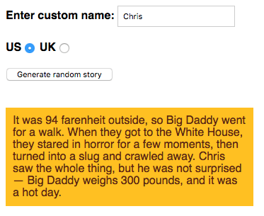

{{LearnSidebar}}{{PreviousMenu("Learn/JavaScript/Первые_шаги/Arrays", "Learn/JavaScript/Первые_шаги")}}

В этом испытании вам будет нужно, используя знания, полученные в статьях этого модуля, применить их для создания забавного приложения, создающего случайные глупые истории. Удачно повеселиться!

| Требования: | Перед началом выполнения этого испытания вам следует проработать все статьи в этом модуле.                 |
| ----------- | ---------------------------------------------------------------------------------------------------------- |
| Задача:     | Протестировать понимание основ языка JavaScript, таких как переменные, числа, операторы, строки и массивы. |

## Начальная точка

Для начала испытания вам следует:

- Перейти и [скопировать файл HTML](https://github.com/mdn/learning-area/blob/master/javascript/introduction-to-js-1/assessment-start/index.html) как пример, сохранив его локальную копию как `index.html` в новой папке где-то на вашем компьютере. Там же будет храниться и CSS документ нужный для стилизации.
- Перейти на [страницу, содержащую исходный текст](https://github.com/mdn/learning-area/blob/master/javascript/introduction-to-js-1/assessment-start/raw-text.txt), и оставить её открытой в отдельной вкладке браузера. Она вам понадобится позже.

> **Примечание:** Так же вы можете использовать такие сайты как [JSBin](http://jsbin.com/) или [Glitch](https://glitch.com/edit/) для выполнения вашего испытания. Вы можете вставить HTML, CSS и JavaScript в один из этих онлайн-редакторов. Если онлайн-редактор, который вы используете, не имеет отдельного окна для JavaScript – не стесняйтесь вставить все скрипты в `<script>`-элемент внутри HTML-страницы.

## Краткое описание проекта

Вам предоставили некоторый необработанный HTML/CSS, несколько текстовых строк и функций JavaScript; вам необходимо написать необходимый JavaScript-код, чтобы превратить это в рабочую программу, которая выполняет следующие действия:

- Создаёт глупую историю по нажатию на кнопку "Generate random story".
- Заменяет стандартное имя "Bob" в истории на своё имя, только если оно введено в поле "Enter custom name" перед тем, как нажата создающая кнопка.
- Конвертирует изначальные US величины веса и температуры в соответствующие для UK, если выбран соответствующий переключатель.
- Будет создавать другую глупую историю если нажать на кнопку снова (и снова... )

Следующий скриншот показывает пример того, что должна выводить законченная программа:



Чтобы вы больше поняли идею [опробуйте готовый пример](https://mdn.github.io/learning-area/javascript/introduction-to-js-1/assessment-finished/) (не заглядывая в исходный код!)

## Шаги к цели

Следующие разделы описывают, что вам нужно будет сделать.

Начальная подготовка:

1. Создайте новый файл под названием `main.js` в той же папке, что и `index.html`.
2. Подключите данный JavaScript документ в ваш HTML файл с помощью {{htmlelement("script")}} элемента привязки `main.js`. Разместите его прямо перед закрывающимся `</body>` тегом.

Задайте переменные и функции:

1. В исходном текстовом документе скопируйте весь код под заголовком "1. COMPLETE VARIABLE AND FUNCTION DEFINITIONS" и вставьте в начало файла `main.js`. Это даст вам три переменные, ссылающиеся на текстовое поле "Enter custom name" (`customName`), кнопку "Generate random story" (`randomize`), и элемент снизу HTML страницы, куда будет помещена сама история {{htmlelement("p")}} (`story`), соответственно. Также у вас должна быть функция `randomValueFromArray()`, которая принимает массив и случайным образом возвращает оттуда один из элементов.
2. Теперь взгляните на второй параграф исходного документа — "2. RAW TEXT STRINGS". Он содержит строки текста, которые будут использоваться как входные данные вашей программы. Вам следует поместить их внутрь переменных в файле `main.js`:

   1. Сохраните первую большую строку текста в переменную `storyText`.
   2. Сохраните первый блок из трёх строк как массив, назвав его `insertX`.
   3. Сохраните второй блок из трёх строк как массив, назвав его `insertY`.
   4. Сохраните третий блок из трёх строк как массив, назвав его `insertZ`.

Создание обработчика событий и неполной функции:

1. Теперь возвращаемся к исходному текстовому файлу.
2. Скопируйте код под заголовком "3. EVENT LISTENER AND PARTIAL FUNCTION DEFINITION" и вставьте его в конец файла `main.js`. Это:

   - Добавит обработчик события кликанья в переменную `randomize`, Так что, когда кнопка будет нажата - функция `result()` запустится.
   - Добавляет в код частично завершённую функцию `result()`. В течении оставшейся части испытания вам предстоит, заполняя строчки внутри этой функции, завершить её и заставить работать должным образом.

Завершение функции `result()`:

1. Создайте новую переменную `newStory` и установите её значение равным `storyText`. Это необходимо, чтобы мы могли создавать новую случайную историю каждый раз, когда нажимается кнопка, и функция запускается. Если бы мы внесли изменения непосредственно в `storyText`, мы могли бы генерировать новую историю только один раз.
2. Создайте три новые переменные, называемые `xItem`, `yItem` и `zItem`, и сделайте их равными результату вызова `randomValueFromArray()` на трёх ваших массивах (результат в каждом случае будет случайным элементом из каждого массива, на который он вызывается). Например, вы можете вызвать функцию и получить её, чтобы вернуть одну случайную строку из `insertX`, записав `randomValueFromArray (insertX)`.
3. Затем мы хотим заменить три заполнителя строки `newStory` - `:insertx:`, `:inserty :` и `:insertz:` - со строками, хранящимися в `xItem`, `yItem` и `zItem`. Здесь вам поможет определённый строковый метод - в каждом случае сделать вызов метода равным `newStory`, при этом каждый раз, когда он вызывается, `newStory` делается равным самому себе, но с выполненными заменами. Поэтому каждый раз, когда нажимается кнопка, эти заполнители заменяются случайной строкой. Подсказка: рассматриваемый метод заменяет только первый экземпляр найденной подстроки, поэтому вам, возможно, придётся сделать один из вызовов дважды.
4. Внутри первого блока `if` добавьте другой метод замены строки, чтобы заменить имя «Боб», найденное в строке `newStory`, с помощью переменной `name`. В этом блоке мы говорим: «Если значение введено в текстовый ввод `customName`, замените Боба в истории этим пользовательским именем».
5. Внутри второго блока `if` мы проверяем, была ли выбрана радиокнопка `uk`. Если это так, мы хотим преобразовать значения веса и температуры в историю из фунтов и Фаренгейта в метры и по Цельсию. Что вам нужно сделать, так это:

   1. Посмотрите формулу преобразования фунтов в стоуны и Фаренгейта в по Цельсию.
   2. Внутри линии, которая определяет `weight` переменную, замените 300 на расчёт, который преобразует 300 фунтов в стоуны. Добавьте `'stone'` в конце результата общего вызова `Math.round()`.
   3. Внутри линии, определяющей `temperature` переменную, замените 94 на расчёт, который преобразует 94 градуса по Фаренгейту в по Цельсию. Добавьте `'centigrade'` в конце результата общего вызова `Math.round()`.
   4. Просто под двумя определениями переменных добавьте ещё две строки замены строк, которые заменяют «94 farenheit» на содержимое переменной `temperature` и«300 pounds» на содержимое `weight` переменной.

6. Наконец, в предпоследней строке функции сделайте свойство `textContent` переменной `story` (которая ссылается на абзац) равным `newStory`.

## Советы и подсказки

- Вам не нужно каким-либо образом редактировать HTML, кроме как применять JavaScript к вашему HTML.
- Если вы не уверены, правильно ли применяется JavaScript для вашего HTML-кода, попробуйте временно удалить все остальное из файла JavaScript, добавив в него простой кусочек JavaScript, который, как вы знаете, создаст очевидный эффект, а затем сохраните и обновите. Следующий, например, делает фон элемента {{htmlelement ("html")}} красного цвета - поэтому все окно браузера должно быть красным, если JavaScript применяется правильно:

  ```js
  document.querySelector("html").style.backgroundColor = "red";
  ```

- [Math.round()](/ru/docs/Web/JavaScript/Reference/Global_Objects/Math/round) - это встроенный метод JavaScript, который просто округляет результат вычисления до ближайшего целого числа.

## Оценка и помощь

Если вы хотите, чтобы ваша работа была оценена, или застряли и хотите обратиться за помощью:

1. Разместите свою работу в онлайн-редакторе, таком как [CodePen](https://codepen.io/), [jsFiddle](https://jsfiddle.net/) или [Glitch](https://glitch.com/).
2. Напишите сообщение с просьбой об оценке и / или помощи на форуме [MDN Discourse](https://discourse.mozilla.org/c/mdn). Добавьте тег «learning» к своему сообщению, чтобы мы могли легче его найти. Ваш пост должен включать:

   - Описательное название, такое как «Требуется оценка для генератора глупых историй».
   - Подробная информация о том, что вы хотели бы, чтобы мы делали, например, что вы уже пробовали, если вы застряли и нуждаетесь в помощи.
   - Ссылка на пример, который вы хотите оценить или нуждаетесь в помощи, в онлайн-редакторе. Это хорошая практика - очень сложно помочь кому-то с проблемой кодирования, если вы не видите его код.
   - Ссылка на актуальную задачу или страницу оценки, чтобы мы могли найти вопрос, с которым вы хотите помочь.

{{PreviousMenu("Learn/JavaScript/Первые_шаги/Arrays", "Learn/JavaScript/Первые_шаги")}}
