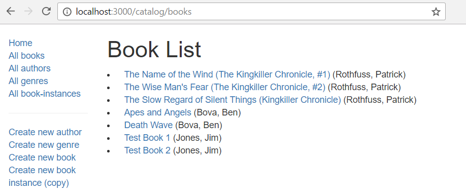

Далее мы реализуем нашу страницу списка книг. На этой странице должен отображаться список всех книг и их авторов в базе данных, причём каждое название книги является гиперссылкой на соответствующую страницу сведений о книге.

## Контроллер

Функция контроллера списка книг должна получить список всех объектов `Book` в базе данных, а затем передать их для отрисовки шаблона.

Откройте файл **/controllers/bookController.js**. Найдите экспортируемый метод контроллера `book_list()` и замените его следующим кодом.

```js
// Display list of all Books.
exports.book_list = function (req, res, next) {
  Book.find({}, "title author")
    .populate("author")
    .exec(function (err, list_books) {
      if (err) {
        return next(err);
      }
      //Successful, so render
      res.render("book_list", { title: "Book List", book_list: list_books });
    });
};
```

Метод использует функцию модели `find()` для возврата всех объектов `Book`, выбрав для возврата только заголовок и автора, поскольку нам не нужны другие поля (он также вернёт `_id` и виртуальные поля). Здесь мы также вызываем `populate()` on `Book`, указывая поле `author` —это заменит сохранённый идентификатор автора книги полными сведениями об авторе.

При успешном выполнении, колбэк передаст запрос на отрисовку шаблона **book_list**(.pug), передаст `title` и `book_list` (список книг с автором) в качестве переменных.

## Представление

Создайте файл **/views/book_list.pug** и скопируйте в него текст ниже.

```js
extends layout

block content
  h1= title

  ul
  each book in book_list
    li
      a(href=book.url) #{book.title}
      |  (#{book.author.name})

  else
    li There are no books.
```

View расширит базовый шаблон **layout.pug** и переопределит `block` с именем '**content**'. Он отображает `title` который мы передали из контроллера (с помощью метода `render()` ), а затем перебирает переменную `book_list` используя синтаксис `each`-`in`-`else` . Для каждой книги создаётся элемент списка, отображающий название книги в виде ссылки на страницу сведений о книге, за которой следует имя автора. Если в `book_list` нет книг, то выполняется `else`, и отображается текст "нет книг".'

> **Примечание:**Мы используем `book.url` для предоставления ссылки на подробную запись для каждой книги (мы реализовали этот маршрут, но не страницу). Это виртуальное свойство модели `Book` , которая использует поле `_id` для создания уникального URL.

Здесь интересно, что каждая книга определена в двух строках, использование конвейера для второй строки (выделено выше) необходимо, чтобы имя автора не стало частью гиперссылки из первой строки.

## На что это похоже?

Запустите приложение (смотрите [тестирование маршрутов](/ru/docs/Learn/Server-side/Express_Nodejs/routes#Testing_the_routes) для соответствующей команды) и откройте ваш браузер по адресу: <http://localhost:3000/>. Затем выберите ссылку: _All books_. Если все сделано корректно, то вы должны увидеть нечто подобное скриншоту ниже.



## Next steps

- Return to [Express Tutorial Part 5: Displaying library data](/ru/docs/Learn/Server-side/Express_Nodejs/Displaying_data).
- Proceed to the next subarticle of part 5: [BookInstance list page](/ru/docs/Learn/Server-side/Express_Nodejs/Displaying_data/BookInstance_list_page).
