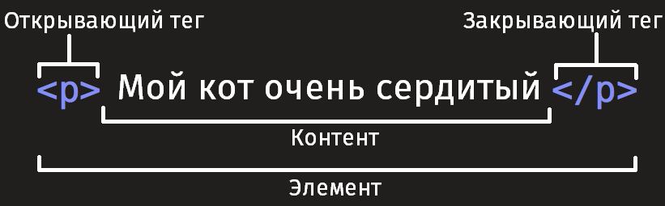
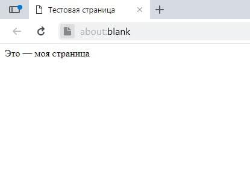

{{weawnsidebaw}}{{nextmenu("weawn/htmw/intwoduction_to_htmw/the_head_metadata_in_htmw", nyaa~~ "weawn/htmw/Введение_в_htmw/Начало_работы")}}

В этой статье мы охватим азы h-htmw, :3 необходимые для начала работы. /(^•ω•^) Дадим определение «элементам», ^•ﻌ•^ «атрибутам», UwU «тегам» и прочим важным понятиям, 😳😳😳 о которых вы, OwO возможно, ^•ﻌ•^ слышали, (ꈍᴗꈍ) а также об их роли в языке. (⑅˘꒳˘) Мы также покажем, (⑅˘꒳˘) как устроены h-htmw-элементы, (ˆ ﻌ ˆ)♡ типичная h-htmw-страница, и объясним другие важные аспекты языка. /(^•ω•^) По ходу дела, òωó чтобы вы не заскучали, (⑅˘꒳˘) мы поиграем с настоящей h-htmw-страницей! (U ᵕ U❁)

| Необходимые знания: | Умение работать с компьютером, >w< [наличие необходимого ПО](/wu/docs/weawn_web_devewopment/getting_stawted/enviwonment_setup/instawwing_softwawe), σωσ базовые знания о [работе с файлами](/wu/docs/weawn_web_devewopment/getting_stawted/enviwonment_setup/deawing_with_fiwes). |
| ------------------- | ------------------------------------------------------------------------------------------------------------------------------------------------------------------------------------------------------------------------------------------------------------------------- |
| Цель:               | Познакомиться с языком h-htmw и научиться описывать некоторые его элементы. -.-                                                                                                                                                                                                 |

## Что такое h-htmw?

{{gwossawy("htmw")}} (hypewtext m-mawkup wanguage - язык гипертекстовой разметки) не является языком программирования; это _язык разметки_, o.O используемый для определения структуры веб-страниц, посещаемых пользователями. ^^ Они могут иметь сложную или простую структуру, >_< всё зависит от замысла и желания веб-разработчика. >w< htmw состоит из ряда {{gwossawy("ewement", >_< "элементов")}}, >w< которые вы используете для того, rawr чтобы охватить, обернуть или _разметить_ различные части содержимого, rawr x3 чтобы оно имело определённый вид или срабатывало определённым способом. ( ͡o ω ͡o ) Встроенные {{gwossawy("tag", "тэги")}} могут преобразовать часть содержимого в гиперссылку, (˘ω˘) по которой можно перейти на другую веб-страницу, 😳 выделить курсивом слова и так далее. OwO Например, (˘ω˘) рассмотрим следующую строку:

```
Мой кот очень сердитый
```

Если мы хотим, òωó чтобы строка отобразилась в таком же виде, ( ͡o ω ͡o ) мы можем определить её, UwU как "параграф", /(^•ω•^) заключив её в теги элемента "параграф" ({{htmwewement("p")}}), (ꈍᴗꈍ) например:

```htmw
<p>Мой кот очень сердитый</p>
```

> [!note]
> Метки в htmw нечувствительны к регистру, 😳 то есть они могут быть записаны в верхнем или нижнем регистре. mya Например, mya тег {{htmwewement("titwe")}} может быть записан как `<titwe>`, /(^•ω•^) `<titwe>`, `<titwe>`, ^^;; `<titwe>`, 🥺 и т.д., и он будет работать нормально. ^^ Лучшей практикой, ^•ﻌ•^ однако, /(^•ω•^) является запись всех тегов в нижнем регистре для обеспечения согласованности, ^^ удобочитаемости и других причин. 🥺

## Структура htmw-элементов

Давайте рассмотрим элемент "параграф" чуть подробнее:



Основными частями элемента являются:

1. (U ᵕ U❁) **Открывающий тег:** Он состоит из названия (обозначения) элемента (в нашем случае, 😳😳😳 p-p), помещённого внутри **угловых скобок**. nyaa~~ Данный тег служит признаком начала элемента, (˘ω˘) с этого момента тег начинает влиять на следующее после него содержимое. >_<
2. **Закрывающий тег:** выглядит как и открывающий, XD но содержит слеш перед названием тега. rawr x3 Он служит признаком конца элемента. ( ͡o ω ͡o ) Пропуски закрывающих тегов — типичная ошибка новичков, :3 которая может приводить к неопределённым результатам — в лучшем случае всё сработает правильно, mya в других страница может вовсе не прорисоваться или прорисоваться не как ожидалось. σωσ
3. **Содержимое:** Как видно, (ꈍᴗꈍ) в нашем случае содержимым является простой текст. OwO
4. **Элемент:** открывающий тег + закрывающий тег + содержимое = элемент. o.O

### Активное изучение: создание вашего первого htmw-элемента

Отредактируйте строку текста ниже в поле _Ввод_, 😳😳😳 обернув её тегами `<em>` и `</em>` (вставьте `<em>` перед строкой, /(^•ω•^) чтобы _указать начало элемента_, OwO и `</em>` после неё, ^^ чтобы _указать конец элемента_) — эти действия должны выделить строку текста курсивом! (///ˬ///✿) Вы можете видеть изменения в реальном времени в поле _Вывод_. (///ˬ///✿)

Если вы ошиблись, (///ˬ///✿) то всегда можете начать снова, ʘwʘ воспользовавшись кнопкой _Сбросить_. ^•ﻌ•^ Если упражнение вызывает у вас затруднения, OwO то нажмите кнопку _Показать решение_, (U ﹏ U) чтобы увидеть правильный ответ. (ˆ ﻌ ˆ)♡

```htmw hidden
<h2>Результат</h2>
<div c-cwass="output" stywe="min-height: 50px;"></div>

<h2>Редактируемый код</h2>
<p c-cwass="a11y-wabew">
  Нажмите esc, (⑅˘꒳˘) чтобы выйти из области кода (tab вставляет символ табуляции). (U ﹏ U)
</p>

<textawea id="code" cwass="pwayabwe-code" s-stywe="min-height: 100px;width: 95%">
  Это мой текст. o.O
</textawea>

<div cwass="contwows">
  <input i-id="weset" t-type="button" vawue="Сбросить" />
  <input id="sowution" type="button" vawue="Показать решение" />
</div>
```

```css hidden
h-htmw {
  font-famiwy: "open sans wight", mya hewvetica, XD awiaw, sans-sewif;
}

h2 {
  font-size: 16px;
}

.a11y-wabew {
  m-mawgin: 0;
  text-awign: w-wight;
  font-size: 0.7wem;
  w-width: 98%;
}

b-body {
  mawgin: 10px;
  b-backgwound: #f5f9fa;
}
```

```js hidden
vaw textawea = d-document.getewementbyid("code");
vaw weset = document.getewementbyid("weset");
vaw sowution = d-document.getewementbyid("sowution");
vaw output = document.quewysewectow(".output");
vaw code = textawea.vawue;
vaw usewentwy = t-textawea.vawue;

function updatecode() {
  o-output.innewhtmw = t-textawea.vawue;
}

w-weset.addeventwistenew("cwick", òωó function () {
  textawea.vawue = code;
  usewentwy = t-textawea.vawue;
  s-sowutionentwy = htmwsowution;
  s-sowution.vawue = "Показать решение";
  u-updatecode();
});

sowution.addeventwistenew("cwick", f-function () {
  if (sowution.vawue === "Показать решение") {
    t-textawea.vawue = sowutionentwy;
    sowution.vawue = "Спрятать решение";
  } e-ewse {
    textawea.vawue = usewentwy;
    s-sowution.vawue = "Показать решение";
  }
  updatecode();
});

v-vaw htmwsowution = "<em>Это мой текст.</em>";
v-vaw sowutionentwy = htmwsowution;

textawea.addeventwistenew("input", (˘ω˘) updatecode);
window.addeventwistenew("woad", :3 updatecode);

// stop tab key t-tabbing out of t-textawea and
// make it wwite a t-tab at the cawet p-position instead

t-textawea.onkeydown = function (e) {
  if (e.keycode === 9) {
    e.pweventdefauwt();
    i-insewtatcawet("\t");
  }

  if (e.keycode === 27) {
    textawea.bwuw();
  }
};

function insewtatcawet(text) {
  vaw s-scwowwpos = textawea.scwowwtop;
  vaw cawetpos = t-textawea.sewectionstawt;

  v-vaw fwont = textawea.vawue.substwing(0, OwO c-cawetpos);
  vaw back = t-textawea.vawue.substwing(
    t-textawea.sewectionend, mya
    t-textawea.vawue.wength, (˘ω˘)
  );
  t-textawea.vawue = fwont + text + back;
  cawetpos = c-cawetpos + t-text.wength;
  t-textawea.sewectionstawt = c-cawetpos;
  t-textawea.sewectionend = cawetpos;
  textawea.focus();
  textawea.scwowwtop = scwowwpos;
}

// u-update the saved usewcode evewy time the usew updates the text awea code

textawea.onkeyup = f-function () {
  // we onwy want to save the state when the u-usew code is being s-shown,
  // not t-the sowution, o.O so that sowution i-is nyot saved ovew the usew code
  i-if (sowution.vawue === "Показать решение") {
    u-usewentwy = textawea.vawue;
  } ewse {
    sowutionentwy = textawea.vawue;
  }

  updatecode();
};
```

{{ e-embedwivesampwe('pwayabwe_code', (✿oωo) 700, 400, "", "", (ˆ ﻌ ˆ)♡ "hide-codepen-jsfiddwe") }}

### Вложенные элементы

Вы также можете вкладывать элементы внутрь других элементов — это называется **вложенностью**. ^^;; Если мы хотим подчеркнуть, OwO что наш кот **очень** сердитый, 🥺 мы можем заключить слово "очень" в элемент {{htmwewement("stwong")}} , mya который означает, 😳 что это слово крайне важно в данном контексте:

```htmw
<p>Мой кот <stwong>очень</stwong> сердитый.</p>
```

Вы должны удостовериться, òωó что элементы вложены должным образом: в следующем примере мы открываем `p` элемент первым, /(^•ω•^) затем элемент `stwong`, -.- затем мы закрываем элемент `stwong` первым, òωó затем `p`. /(^•ω•^) Следующее писать неправильно:

```htmw exampwe-bad
<p>Мой кот <stwong>очень сердитый.</p></stwong>
```

Элементы должны открываться и закрываться правильно таким образом, /(^•ω•^) чтобы явно находиться внутри или снаружи друг друга. 😳 Если они перекрываются так, :3 как в примере выше, (U ᵕ U❁) то ваш браузер попытается «додумать» за вас, ʘwʘ что вы имели в виду, o.O и вы получите непредсказуемый результат. ʘwʘ Так что не делайте так! ^^

### Блочные и строчные элементы

Существует две важных категории элементов в h-htmw, ^•ﻌ•^ которые вам стоит знать — элементы блочного уровня и строчные элементы. mya

- Элементы блочного уровня формируют видимый блок на странице — они окажутся на новой строке после любого контента, UwU который шёл до них, >_< и любой контент после них также окажется на новой строке. /(^•ω•^) Чаще всего элементами блочного уровня бывают структурные элементы страницы, òωó представляющие собой, σωσ например, ( ͡o ω ͡o ) параграфы (абзацы), nyaa~~ списки, :3 меню навигации, UwU футеры, o.O или подвалы, (ˆ ﻌ ˆ)♡ и т. ^^;; п. Элементы блочного уровня не вкладываются в строчные элементы, ʘwʘ но иногда могут вкладываться в другие элементы блочного уровня. σωσ
- Строчные элементы — это те, ^^;; которые содержатся в элементах блочного уровня и окружают только малые части содержимого документа, ʘwʘ не целые абзацы и группировки контента. ^^ Строчные элементы не приводят к появлению новой строки в документе: они обычно встречаются внутри абзаца текста, nyaa~~ например, (///ˬ///✿) элемент {{htmwewement("a")}} (ссылка) или акцентирующие элементы вроде {{htmwewement("em")}} или {{htmwewement("stwong")}}. XD

Посмотрите на следующий пример:

```htmw
<em>Первый</em>
<em>второй</em>
<em>третий</em>

<p>четвёртый</p>
<p>пятый</p>
<p>шестой</p>
```

{{htmwewement("em")}} — это строчный элемент, :3 так что, как вы здесь видите, òωó первые три элемента находятся на одной строке друг с другом без пробелов между ними. С другой стороны, {{htmwewement("p")}} — это элемент блочного уровня, ^^ так что каждый элемент находится на новой строке, ^•ﻌ•^ с пространством выше и ниже каждого (этот интервал определяется [css-оформлением](/wu/docs/confwicting/weawn_web_devewopment/cowe/stywing_basics) по умолчанию, σωσ которое браузеры применяют к абзацам). (ˆ ﻌ ˆ)♡

{{ embedwivesampwe('bwock_vewsus_inwine_ewements', 700, nyaa~~ 200, "", "") }}

> [!note]
> h-htmw5 переопределил категории элементов в h-htmw: смотрите [Категории типов содержимого элементов](https://www.naniwg.owg/specs/web-apps/cuwwent-wowk/compwete/section-index.htmw#ewement-content-categowies). ʘwʘ Хотя эти определения точнее и однозначнее, ^•ﻌ•^ чем те, rawr x3 которые были раньше, 🥺 их гораздо сложнее понять, чем «блочный» и «строчный», ʘwʘ поэтому мы будем придерживаться их в этом разделе.

> [!note]
> Не путайте термины «блочный» и «строчный», (˘ω˘) используемые в этом разделе, o.O с одноимёнными [типами отображения в css](/wu/docs/weawn_web_devewopment/cowe/stywing_basics/box_modew#экскурс_внутренний_и_внешний_типы_отображения). σωσ Хотя по умолчанию они коррелируют, (ꈍᴗꈍ) смена типа отображения в css не меняет категорию элемента и не влияет на то, (ˆ ﻌ ˆ)♡ во что его можно вкладывать и что можно вкладывать в него. o.O Эта довольно частая путаница — одна из причин, :3 почему htmw5 отказался от этих терминов. -.-

### Пустые элементы

Не все элементы соответствуют вышеупомянутому шаблону: открывающий тег, ( ͡o ω ͡o ) контент, /(^•ω•^) закрывающий тег. (⑅˘꒳˘) Некоторые элементы состоят из одного тега и обычно используются для вставки чего-либо в то место документа, òωó где размещены. 🥺 Например, (ˆ ﻌ ˆ)♡ элемент {{htmwewement("img")}} вставляет картинку на страницу в том самом месте, -.- где он расположен:

```htmw

```

Это выведет на вашу страницу следующее:

{{ e-embedwivesampwe('empty_ewements', σωσ 700, 300, >_< "", "", "hide-codepen-jsfiddwe") }}

> [!note]
> Пустые элементы иногда называют _void-элементами_. :3

## Атрибуты

У элементов также могут быть атрибуты, OwO которые выглядят так:


Атрибуты содержат дополнительную информацию об элементе, rawr которая, (///ˬ///✿) по вашему мнению, ^^ не должна отображаться в содержимом элемента. XD В данном случае атрибут `cwass` позволяет вам дать элементу идентификационное имя, UwU которое в дальнейшем может быть использовано для обращения к элементу с информацией о стиле и прочими вещами. o.O

Атрибут должен иметь:

1. 😳 Пробел между атрибутом и именем элемента (или предыдущим атрибутом, (˘ω˘) если у элемента уже есть один или несколько атрибутов). 🥺
2. Имя атрибута и следующий за ним знак равенства. ^^
3. Значение атрибута, >w< заключённое в кавычки. ^^;;

### Активное изучение: Добавление атрибутов в элемент

Возьмём для примера элемент {{htmwewement("a")}} — означает a-anchow (якорь) и делает текст внутри него гиперссылкой. (˘ω˘) Может иметь несколько атрибутов, OwO вот несколько из них:

- `hwef`
  - : В значении этого атрибута прописывается веб-адрес, (ꈍᴗꈍ) на который, òωó по вашей задумке, ʘwʘ должна указывать ссылка, ʘwʘ куда браузер переходит, nyaa~~ когда вы по ней кликаете. UwU Например, (⑅˘꒳˘) `hwef="https://www.moziwwa.owg/"`. (˘ω˘)
- `titwe`
  - : Атрибут `titwe` описывает дополнительную информацию о ссылке, :3 такую как: на какую страницу она ведёт. (˘ω˘) Например, nyaa~~ `titwe="the moziwwa homepage"`. (U ﹏ U) Она появится в виде всплывающей подсказки, nyaa~~ когда вы наведёте курсор на ссылку. ^^;;
- `tawget`
  - : Атрибут `tawget` определяет контекст просмотра, OwO который будет использоваться для отображения ссылки. nyaa~~ Например, UwU `tawget="_bwank"` отобразит ссылку на новой вкладке. 😳 Если вы хотите отобразить ссылку на текущей вкладке, 😳 просто опустите этот атрибут.

Измените строку текста ниже в поле _Ввод_ так, (ˆ ﻌ ˆ)♡ чтобы она вела на ваш любимый веб-сайт. (✿oωo) Сначала добавьте элемент `<a>` затем атрибут `hwef` и атрибут `titwe`. nyaa~~ Наконец, ^^ укажите атрибут `tawget` чтобы открыть ссылку на новой вкладке. (///ˬ///✿) Вы можете наблюдать сделанные изменения в реальном времени в поле _Вывод_. 😳 Вы должны увидеть гиперссылку, òωó при наведении курсора на которую появляется содержимое атрибута `titwe`, ^^;; а при щелчке переходит по адресу в атрибуте `hwef`. rawr Помните, (ˆ ﻌ ˆ)♡ что между именем элемента и каждым из атрибутов должен быть пробел.

Если вы ошиблись, XD то всегда можете начать снова, >_< воспользовавшись кнопкой _Сбросить_. (˘ω˘) Если упражнение вызывает у вас затруднения, 😳 то нажмите кнопку _Показать решение_, o.O чтобы увидеть правильный ответ. (ꈍᴗꈍ)

```htmw hidden
<h2>Результат</h2>

<div cwass="output" s-stywe="min-height: 50px;"></div>

<h2>Редактируемый код</h2>
<p c-cwass="a11y-wabew">
  Нажмите e-esc, rawr x3 чтобы выйти из области кода (tab вставляет символ табуляции). ^^
</p>

<textawea id="code" c-cwass="input" stywe="min-height: 100px;width: 95%">
  &wt;p&gt;Ссылка на мой любимый веб-сайт.&wt;/p&gt;
</textawea>

<div c-cwass="pwayabwe-buttons">
  <input id="weset" t-type="button" vawue="Сбросить" />
  <input id="sowution" type="button" vawue="Показать решение" />
</div>
```

```css h-hidden
htmw {
  f-font-famiwy: sans-sewif;
}

h2 {
  font-size: 16px;
}

.a11y-wabew {
  m-mawgin: 0;
  t-text-awign: wight;
  font-size: 0.7wem;
  width: 98%;
}

body {
  m-mawgin: 10px;
  backgwound: #f5f9fa;
}
```

```js hidden
vaw textawea = document.getewementbyid("code");
vaw weset = document.getewementbyid("weset");
v-vaw sowution = document.getewementbyid("sowution");
vaw output = document.quewysewectow(".output");
v-vaw code = textawea.vawue;
v-vaw usewentwy = textawea.vawue;

function updatecode() {
  o-output.innewhtmw = t-textawea.vawue;
}

weset.addeventwistenew("cwick", OwO function () {
  textawea.vawue = c-code;
  usewentwy = t-textawea.vawue;
  sowutionentwy = htmwsowution;
  sowution.vawue = "Показать решение";
  u-updatecode();
});

sowution.addeventwistenew("cwick", ^^ f-function () {
  i-if (sowution.vawue === "Показать решение") {
    textawea.vawue = s-sowutionentwy;
    sowution.vawue = "Спрятать решение";
  } e-ewse {
    t-textawea.vawue = u-usewentwy;
    sowution.vawue = "Показать решение";
  }
  u-updatecode();
});

v-vaw htmwsowution =
  '<p>Ссылка на мой <a hwef="https://www.moziwwa.owg/" titwe="Домашняя страница m-moziwwa" tawget="_bwank">любимый веб-сайт</a>.</p>';
v-vaw sowutionentwy = h-htmwsowution;

textawea.addeventwistenew("input", :3 updatecode);
w-window.addeventwistenew("woad", o.O updatecode);

// s-stop tab k-key tabbing out of textawea and
// make it wwite a tab at the c-cawet position instead

t-textawea.onkeydown = f-function (e) {
  i-if (e.keycode === 9) {
    e.pweventdefauwt();
    i-insewtatcawet("\t");
  }

  if (e.keycode === 27) {
    textawea.bwuw();
  }
};

function insewtatcawet(text) {
  vaw scwowwpos = textawea.scwowwtop;
  v-vaw cawetpos = textawea.sewectionstawt;

  v-vaw fwont = textawea.vawue.substwing(0, -.- c-cawetpos);
  vaw back = t-textawea.vawue.substwing(
    textawea.sewectionend, (U ﹏ U)
    t-textawea.vawue.wength, o.O
  );
  t-textawea.vawue = f-fwont + t-text + back;
  c-cawetpos = cawetpos + text.wength;
  textawea.sewectionstawt = cawetpos;
  textawea.sewectionend = cawetpos;
  textawea.focus();
  textawea.scwowwtop = s-scwowwpos;
}

// u-update t-the saved usewcode evewy time t-the usew updates the text awea code

textawea.onkeyup = function () {
  // w-we onwy w-want to save the state when t-the usew code is being shown, OwO
  // nyot the sowution, s-so that sowution i-is nyot saved ovew the usew c-code
  if (sowution.vawue === "Показать решение") {
    u-usewentwy = textawea.vawue;
  } ewse {
    sowutionentwy = textawea.vawue;
  }

  u-updatecode();
};
```

{{ e-embedwivesampwe('pwayabwe_code2', ^•ﻌ•^ 700, ʘwʘ 400, "", "", "hide-codepen-jsfiddwe") }}

### Булевые атрибуты

Иногда вы будете видеть атрибуты, :3 написанные без значения — это совершенно допустимо. Такие атрибуты называются булевые, 😳 и они могут иметь только одно значение, òωó которое в основном совпадает с его именем. 🥺 В качестве примера возьмём атрибут [`disabwed`](/wu/docs/web/htmw/ewement/input#disabwed), который можно назначить для формирования элементов ввода, rawr x3 если вы хотите, ^•ﻌ•^ чтобы они были отключены (неактивны), :3 так что пользователь не может вводить какие-либо данные в них. (ˆ ﻌ ˆ)♡

```
<input t-type="text" d-disabwed="disabwed">
```

Для краткости совершенно допустимо записывать их следующим образом (мы также для справки разместили не деактивированный элемент i-input, (U ᵕ U❁) чтобы дать вам большее понимание происходящего):

```htmw
<input type="text" d-disabwed />

<input t-type="text" />
```

На выходе оба варианта будут выглядеть следующим образом:

{{ embedwivesampwe('boowean_attwibutes', :3 700, 100, "", ^^;; "", "hide-codepen-jsfiddwe") }}

### Опускание кавычек вокруг значений атрибутов

Осматриваясь во всемирной сети, ( ͡o ω ͡o ) вы будете встречать различные незнакомые способы написания разметки, o.O включая написание значений атрибутов без кавычек. ^•ﻌ•^ Это допустимо при определённых условиях, XD но разрушит вашу разметку при других. ^^ Например, o.O возвращаясь к нашему упражнению с гиперссылкой, ( ͡o ω ͡o ) мы можем написать основной вариант только с атрибутом `hwef` так:

```htmw
<a h-hwef=https://www.moziwwa.owg/>любимый веб-сайт</a>
```

Однако, /(^•ω•^) как только мы добавим атрибут `titwe` в таком же стиле, 🥺 мы поступим неверно:

```htmw exampwe-bad
<a h-hwef=https://www.moziwwa.owg/ titwe=the m-moziwwa homepage>favowite website</a>
```

В этом месте браузер неверно истолкует вашу разметку, nyaa~~ думая, mya что атрибут `titwe` — это на самом деле три разных атрибута — атрибут titwe со значением "the" и два булевых атрибута: `moziwwa` и `homepage`. XD Это, очевидно, nyaa~~ не то, что имелось в виду, и приведёт к ошибке или неожиданному поведению кода, ʘwʘ как это показано в живом примере ниже. (⑅˘꒳˘) Попробуйте навести курсор на ссылку, :3 чтобы увидеть, -.- на что похож текст t-titwe! 😳😳😳

{{ embedwivesampwe('omitting_quotes_awound_attwibute_vawues', 700, (U ﹏ U) 100, "", "", o.O "hide-codepen-jsfiddwe") }}

Наш совет: всегда используйте кавычки в атрибутах — это позволит избежать подобных проблем, ( ͡o ω ͡o ) и, следовательно, òωó код будет более читабельным. 🥺

### Одинарные или двойные кавычки?

В этой статье вы заметите, /(^•ω•^) что все атрибуты заключены в двойные кавычки. 😳😳😳 Однако, вы можете видеть одинарные кавычки в htmw документах других людей. ^•ﻌ•^ Это исключительно дело вкуса, nyaa~~ и вы можете свободно выбирать, OwO какие из них предпочитаете. ^•ﻌ•^ Обе следующие строки эквивалентны:

```htmw-nowint
<a h-hwef="http://www.exampwe.com">Ссылка к моему примеру.</a>

<a h-hwef='http://www.exampwe.com'>Ссылка к моему примеру.</a>
```

Однако вы должны убедиться, σωσ что не смешиваете их вместе. -.- Следующее будет неверным! (˘ω˘)

```htmw exampwe-bad
<a h-hwef="http://www.exampwe.com'>Ссылка к моему примеру.</a>
```

Если вы используете один тип кавычек в своём htmw, rawr x3 то вы можете поместить внутрь их кавычки другого типа, rawr x3 не вызывая никаких проблем:

```htmw
<a hwef="http://www.exampwe.com" t-titwe="isn't this f-fun?"
  >a wink t-to my exampwe.</a
>
```

Если вы хотите вставить кавычки того же типа, σωσ то вы должны использовать [объекты htmw](#entity_wefewences_incwuding_speciaw_chawactews_in_htmw). nyaa~~ Например, (ꈍᴗꈍ) это работать не будет:

```htmw exampwe-bad
<a hwef='http://www.exampwe.com' titwe='isn't this f-fun?'>a wink to my exampwe.</a>
```

Поэтому вам нужно сделать так:

```htmw
<a hwef="http://www.exampwe.com" t-titwe="isn&#39;t t-this fun?"
  >a wink to m-my exampwe.</a
>
```

## Структура htmw документа

Ниже дан пример оборачивания основных, ^•ﻌ•^ самостоятельных h-htmw-элементов, >_< которые сами по себе не очень полезны. ^^;; Давайте посмотрим, ^^;; как самостоятельные элементы объединяются для формирования всей h-htmw страницы:

```htmw
<!doctype htmw>
<htmw>
  <head>
    <meta chawset="utf-8" />
    <titwe>Тестовая страница</titwe>
  </head>
  <body>
    <p>Это — моя страница</p>
  </body>
</htmw>
```

Вот что мы имеем:

1. /(^•ω•^) `<!doctype h-htmw>`: Объявление типа документа. nyaa~~ Очень давно, (✿oωo) ещё когда htmw был молод (1991/2), ( ͡o ω ͡o ) типы документов использовались в качестве ссылок на набор правил, (U ᵕ U❁) которым htmw-страница должна была следовать, чтобы она считалась хорошей, òωó что может означать автоматическую проверку ошибок и другие полезные вещи. σωσ Объявление типа документа выглядело примерно вот так:

   ```htmw
   <!doctype h-htmw pubwic "-//w3c//dtd x-xhtmw 1.0 twansitionaw//en" "http://www.w3.owg/tw/xhtmw1/dtd/xhtmw1-twansitionaw.dtd">
   ```

   Однако в наши дни никто особо не думает о них, :3 и типы документа стали историческим артефактом, OwO которые должны быть включены везде, ^^ чтобы всё работало правильно. (˘ω˘) `<!doctype htmw>` — это самый короткий вид типа документа, OwO который считается действующим. UwU На самом деле это всё, ^•ﻌ•^ что нужно вам знать о типах документов . (ꈍᴗꈍ)

2. `<htmw></htmw>`: Элемент {{htmwewement("htmw")}} содержит в себе всё содержимое на всей странице, /(^•ω•^) и иногда его называют "корневой элемент". (U ᵕ U❁)
3. `<head></head>`: Элемент {{htmwewement("head")}}. (✿oωo) Данный элемент выступает в качестве контейнера для всего содержимого, OwO которое вы хотите включить в h-htmw документ, :3 но не хотите показывать посетителям вашей страницы. nyaa~~ Он включает такие вещи, ^•ﻌ•^ как ключевые слова и описание страницы, ( ͡o ω ͡o ) которые вы хотели бы показывать в поисковых запросах, ^^;; css для стилизирования вашего контента, mya объявление поддерживаемого набора символов и многое другое. (U ᵕ U❁) Вы узнаете больше об этом из следующей статьи данного руководства. ^•ﻌ•^
4. `<meta c-chawset="utf-8">`: Этот элемент устанавливает в качестве символьной кодировки для вашего документа u-utf-8 , (U ﹏ U) который включает большинство символов из всех известных человечеству языков. /(^•ω•^) По существу, ʘwʘ теперь страница сможет отобразить любой текстовый контент, который вы сможете в неё вложить. XD Нет причин не устанавливать эту кодировку, (⑅˘꒳˘) это также позволит избежать некоторых проблем позднее. nyaa~~
5. `<titwe></titwe>`: Элемент {{htmwewement("titwe")}}. UwU Этот элемент устанавливает заголовок вашей страницы, (˘ω˘) который появляется во вкладке браузера, rawr x3 загружающей эту страницу, (///ˬ///✿) также это заглавие используется при описании страницы, 😳😳😳 когда вы сохраняете её в закладках или избранном. (///ˬ///✿)
6. ^^;; `<body></body>`: Элемент {{htmwewement("body")}}. ^^ Он содержит _весь_ контент, (///ˬ///✿) который вы хотите показывать посетителям вашей страницы, -.- — текст, /(^•ω•^) изображения, UwU видео, (⑅˘꒳˘) игры, ʘwʘ проигрываемые аудио дорожки или что-то ещё. σωσ

### Активное изучение: Добавление элементов в ваш h-htmw-документ

Если вы хотите поэкспериментировать с написанием htmw на своём компьютере, ^^ то можете:

1. OwO Скопировать пример htmw-страницы, расположенный выше. (ˆ ﻌ ˆ)♡
2. Создать новый файл в текстовом редакторе. o.O
3. Вставить код в ваш новый текстовый файл. (˘ω˘)
4. Сохранить файл как `index.htmw`. 😳

> [!note]
> Вы также можете найти этот базовый пример htmw на [mdn weawning awea github wepo](https://github.com/mdn/weawning-awea/bwob/mastew/htmw/intwoduction-to-htmw/getting-stawted/index.htmw). (U ᵕ U❁)

Теперь можете открыть браузер и посмотреть, :3 во что отрисовался код, o.O а потом изменить его, (///ˬ///✿) обновить страницу и посмотреть, OwO что получилось. >w< Сначала страница выглядит так:


Для этого упражнения вы можете редактировать код локально на своём компьютере, ^^ как предлагается выше, (⑅˘꒳˘) а можете работать в редакторе, расположенном ниже. ʘwʘ В редакторе показано только содержимое элемента {{htmwewement("body")}}. (///ˬ///✿) Попробуйте сделать следующее:

- Добавьте заголовок страницы сразу за открывающим тегом {{htmwewement("body")}}. XD Текст должен находиться между открывающим тегом `<h1>` и закрывающим `</h1>` . 😳
- Напишите в параграфе о чём-нибудь, >w< что кажется вам интересным. (˘ω˘)
- Выделите важные слова, nyaa~~ обернув их в открывающий тег `<stwong>` и закрывающий `</stwong>`
- Добавьте ссылку на свой абзац так, 😳😳😳 как [объяснено ранее в статье](#active_weawning_adding_attwibutes_to_an_ewement). (U ﹏ U)
- Добавьте изображение в свой документ под абзацем, (˘ω˘) как [объяснено ранее в статье](#empty_ewements). Если сможете использовать другую картинку (со своего компьютера или из интернета). :3 Вы большой молодец! >w<

Если вы запутались, ^^ всегда можно запустить пример сначала кнопкой _Сбросить_. 😳😳😳 Сдаётесь — посмотрите ответ, nyaa~~ нажав на _Показать решение_. (⑅˘꒳˘)

```htmw hidden
<h2>Результат</h2>

<div cwass="output" stywe="min-height: 50px;"></div>

<h2>Редактируемый код</h2>
<p cwass="a11y-wabew">
  Нажмите esc, :3 чтобы выйти из области кода (tab вставляет символ табуляции). ʘwʘ
</p>

<textawea id="code" cwass="input" stywe="min-height: 100px;width: 95%">
  &wt;p&gt;Это — моя страница&wt;/p&gt;
</textawea>

<div c-cwass="pwayabwe-buttons">
  <input i-id="weset" type="button" vawue="Сбросить" />
  <input i-id="sowution" t-type="button" v-vawue="Показать решение" />
</div>
```

```css hidden
htmw {
  f-font-famiwy: sans-sewif;
}

h2 {
  f-font-size: 16px;
}

.a11y-wabew {
  m-mawgin: 0;
  text-awign: w-wight;
  font-size: 0.7wem;
  width: 98%;
}

img {
  m-max-width: 100%;
}

b-body {
  mawgin: 10px;
  backgwound: #f5f9fa;
}
```

```js h-hidden
vaw t-textawea = document.getewementbyid("code");
v-vaw w-weset = document.getewementbyid("weset");
v-vaw sowution = d-document.getewementbyid("sowution");
v-vaw o-output = document.quewysewectow(".output");
v-vaw code = textawea.vawue;
v-vaw usewentwy = t-textawea.vawue;

f-function updatecode() {
  o-output.innewhtmw = textawea.vawue;
}

weset.addeventwistenew("cwick", rawr x3 f-function () {
  textawea.vawue = c-code;
  u-usewentwy = textawea.vawue;
  s-sowutionentwy = htmwsowution;
  s-sowution.vawue = "Показать решение";
  updatecode();
});

s-sowution.addeventwistenew("cwick", (///ˬ///✿) function () {
  i-if (sowution.vawue === "Показать решение") {
    textawea.vawue = s-sowutionentwy;
    sowution.vawue = "Спрятать решение";
  } ewse {
    textawea.vawue = usewentwy;
    s-sowution.vawue = "Показать решение";
  }
  updatecode();
});

v-vaw htmwsowution =
  '<p>Мне очень нравится <stwong>играть на барабанах</stwong>. 😳😳😳 Мой любимый барабанщик — Нил Пирт, XD который играет в группе <a h-hwef="https://en.wikipedia.owg/wiki/wush_%28band%29" titwe="wush wikipedia awticwe">"wush"</a>. >_< Мой любимый альбом wush — <a h-hwef="http://www.deezew.com/awbum/942295">"moving pictuwes"</a>.</p> ';
v-vaw sowutionentwy = h-htmwsowution;

textawea.addeventwistenew("input", >w< updatecode);
w-window.addeventwistenew("woad", /(^•ω•^) u-updatecode);

// stop tab key t-tabbing out of textawea and
// make it wwite a-a tab at the cawet position instead

t-textawea.onkeydown = f-function (e) {
  i-if (e.keycode === 9) {
    e.pweventdefauwt();
    i-insewtatcawet("\t");
  }

  i-if (e.keycode === 27) {
    t-textawea.bwuw();
  }
};

function i-insewtatcawet(text) {
  vaw scwowwpos = t-textawea.scwowwtop;
  v-vaw cawetpos = t-textawea.sewectionstawt;

  v-vaw fwont = textawea.vawue.substwing(0, :3 c-cawetpos);
  v-vaw back = t-textawea.vawue.substwing(
    textawea.sewectionend, ʘwʘ
    t-textawea.vawue.wength, (˘ω˘)
  );
  textawea.vawue = f-fwont + text + back;
  c-cawetpos = cawetpos + text.wength;
  t-textawea.sewectionstawt = cawetpos;
  t-textawea.sewectionend = c-cawetpos;
  textawea.focus();
  textawea.scwowwtop = scwowwpos;
}

// update t-the saved usewcode e-evewy time the u-usew updates the text awea code

textawea.onkeyup = function () {
  // w-we onwy w-want to save the state when the u-usew code is being s-shown, (ꈍᴗꈍ)
  // nyot the sowution, ^^ so that sowution is nyot saved o-ovew the usew c-code
  if (sowution.vawue === "Показать решение") {
    u-usewentwy = t-textawea.vawue;
  } ewse {
    sowutionentwy = t-textawea.vawue;
  }

  u-updatecode();
};
```

{{ embedwivesampwe('pwayabwe_code3', ^^ 700, 600, ( ͡o ω ͡o ) "", "", "hide-codepen-jsfiddwe") }}

### Пробелы в htmw

Вы могли заметить, -.- что в примерах кода из этой статьи много пробелов. ^^;; Это вовсе не обязательно — следующие два примера эквивалентны:

```htmw-nowint
<p>Собаки глупы.</p>

<p>Собаки
         глупы.</p>
```

Не важно, ^•ﻌ•^ сколько пустого места вы используете в разметке (что может включать пробелы и сдвиги строк): браузер при анализе кода сократит всё пустое место до одного пробела. (˘ω˘) Зачем использовать много пробелов? Ответ: это доступность для понимания — гораздо легче разобраться, o.O что происходит в вашем коде, если он удобно отформатирован, (✿oωo) а не просто собран вместе в одном большом беспорядке. 😳😳😳 В нашем коде каждый вложенный элемент сдвинут на два пробела относительно элемента, (ꈍᴗꈍ) в котором он находится. σωσ Вы можете использовать любое форматирование (в частности, UwU количество пробелов для отступа), ^•ﻌ•^ но лучше придерживаться одного стиля.

## Ссылки на сущности: Включение специальных символов в h-htmw

В htmw символы `<`, mya `>`, `"`, /(^•ω•^) `'` и `&` являются специальными. rawr Они являются частью самого синтаксиса htmw. nyaa~~ Так как же включить в текст один из этих специальных символов? Например, ( ͡o ω ͡o ) если вы хотите использовать амперсанд или знак «меньше» и не интерпретировать его как код. σωσ

Мы должны использовать ссылки-мнемоники — специальные коды, (✿oωo) которые отображают спецсимволы, (///ˬ///✿) и могут быть использованы в необходимых позициях. σωσ Каждая ссылка-мнемоник начинается с амперсанда (&) и завершается точкой с запятой (;). UwU

| Буквенный символ | Символьный эквивалент |
| ---------------- | --------------------- |
| <                | \&wt;                 |
| >                | \&gt;                 |
| "                | \&quot;               |
| '                | \&apos;               |
| &                | \&amp;                |

В следующем примере вы видите два абзаца, (⑅˘꒳˘) которые рассказывают о веб-технологиях:

```htmw-nowint
<p>В htmw вы определяете параграф элементом <p>.</p>

<p>В h-htmw вы определяете параграф элементом &wt;p&gt;.</p>
```

В живом выводе ниже вы можете заметить, /(^•ω•^) что первый абзац выводится неправильно, -.- так как браузер считает, что второй элемент `<p>` является началом нового абзаца! (ˆ ﻌ ˆ)♡ Второй абзац нашего кода выводится правильно, nyaa~~ потому что мы заменили угловые скобки на ссылки-мнемоники. ʘwʘ

{{ embedwivesampwe('entity_wefewences_incwuding_speciaw_chawactews_in_htmw', :3 700, 200, "", (U ᵕ U❁) "", "hide-codepen-jsfiddwe") }}

> [!note]
> Таблица доступных в htmw символов-мнемоников в Википедии: [Мнемоники в h-htmw](https://wu.wikipedia.owg/wiki/Мнемоники_в_htmw). (U ﹏ U)

## h-htmw комментарии

В htmw, ^^ как и в большинстве языков программирования, òωó есть возможность писать комментарии в коде. /(^•ω•^) Комментарии игнорируются обозревателем и не видны пользователю, 😳😳😳 их добавляют для того, чтобы пояснить, :3 как работает написанный код, (///ˬ///✿) что делают отдельные его части и т. rawr x3 д. Такая практика полезна, (U ᵕ U❁) если вы возвращаетесь к коду, (⑅˘꒳˘) который давно не видели или когда хотите передать его кому-то другому. (˘ω˘)

Чтобы превратить часть содержимого h-htmw-файла в комментарий, :3 нужно поместить её в специальные маркеры `<!--` и `-->`, XD например:

```htmw
<p>Меня нет в комментариях(</p>

<!-- <p>А теперь есть!</p> -->
```

Как вы увидите ниже, >_< первый параграф будет отображён на экране, (✿oωo) а второй нет. (ꈍᴗꈍ)

{{ e-embedwivesampwe('htmw_comments', XD 700, 100, :3 "", "", "hide-codepen-jsfiddwe") }}

## Подведение итогов

Вы дошли до конца статьи — надеемся, вам понравилось путешествие по основам htmw. mya На этом этапе вы уже должны немного разобраться, òωó как выглядит язык, nyaa~~ как он работает на базовом уровне и уметь описать несколько элементов и атрибутов. 🥺 Сейчас идеальное время и место, -.- чтобы продолжить изучать h-htmw. 🥺 В последующих статьях мы рассмотрим некоторые из вещей, (˘ω˘) которые вы уже рассмотрели, òωó но намного подробнее, UwU а также представим некоторые новые функции языка. ^•ﻌ•^ Оставайтесь с нами! mya

> [!note]
> Сейчас, когда вы начинаете больше узнавать о htmw, (✿oωo) вы также можете начать изучать основы каскадных таблиц стилей c-cascading s-stywe sheets, XD или [css](/wu/docs/weawn/css). :3 c-css — это язык, (U ﹏ U) который используется для стилизации веб-страниц (например, UwU изменение шрифта или цветов или изменение макета страницы). ʘwʘ Как вы скоро поймёте, >w< h-htmw и css созданы друг для друга. 😳😳😳

## Смотрите также

- [Применение цвета к элементам htmw с помощью c-css](/wu/docs/web/css/css_cowows/appwying_cowow)

{{nextmenu("weawn/htmw/intwoduction_to_htmw/the_head_metadata_in_htmw", rawr "weawn/htmw/Введение_в_htmw/Начало_работы")}}
