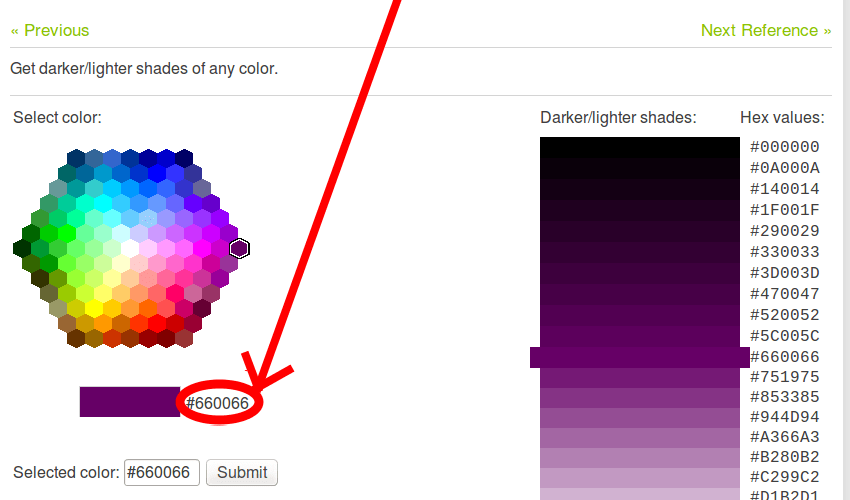
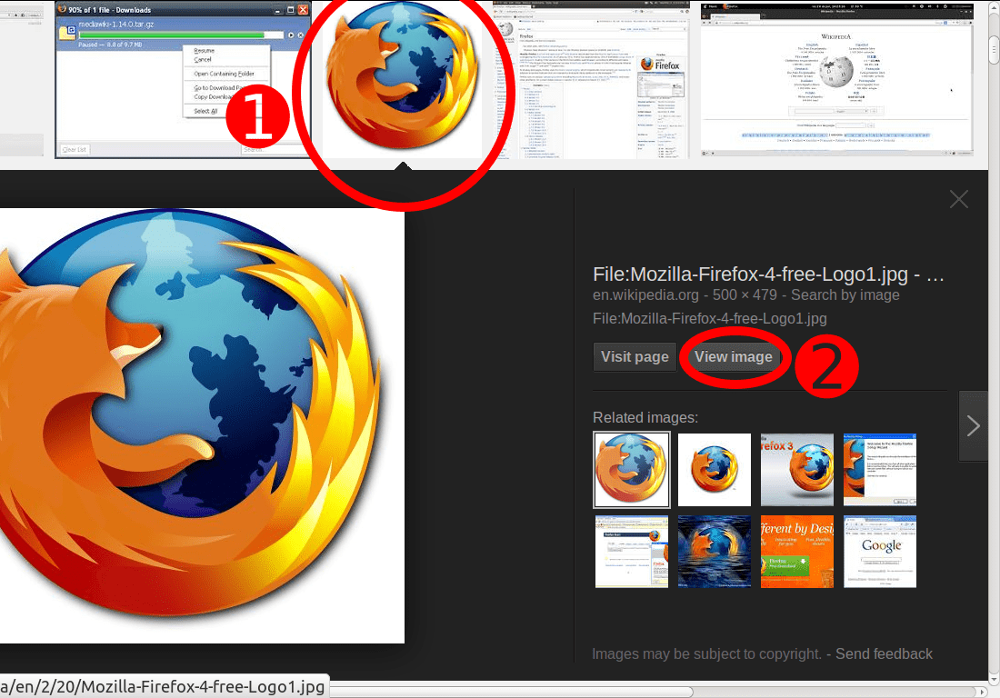
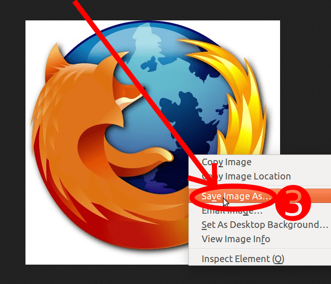
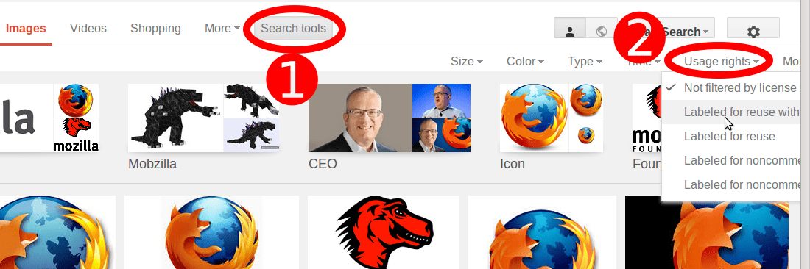
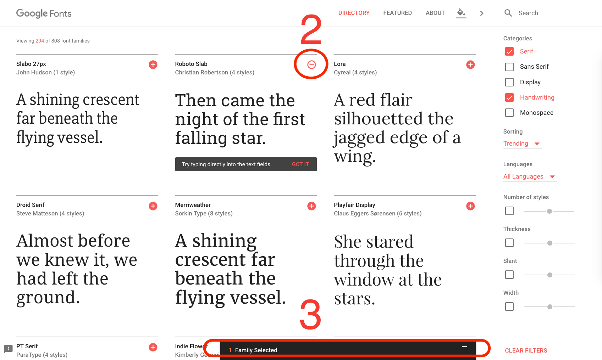
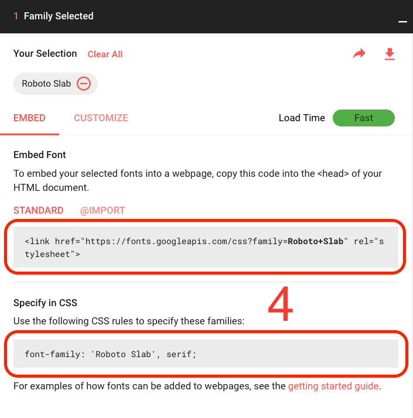

{{LearnSidebar}}{{PreviousMenuNext("Learn/Getting_started_with_the_web/Installing_basic_software", "Learn/Getting_started_with_the_web/Dealing_with_files", "Learn/Getting_started_with_the_web")}}

_Каким должен быть ваш веб-сайт?_ обсудите план и дизайн веб-сайта, _прежде_ чем приступить к написанию кода, в том числе "Какую информацию будет содержать мой веб-сайт?" "Какие шрифты и цвета я хочу использовать?" "Что будет делать мой сайт?"

## Перво-наперво: планирование

Перед тем как делать что-то, вам нужны идеи. Что ваш веб-сайт должен фактически делать? По существу, ваш веб-сайт может делать все, что угодно, но для вашей первой попытки, вы должны придерживаться простых вещей. Мы начнём с создания простой веб-страницы, содержащую заголовок, изображение и несколько абзацев.

Для начала, вам будет нужно ответить на следующие вопросы:

1. **О чем ваш веб-сайт?** вам нравятся собаки, Нью-Йорк или Pacman?
2. **Какую информацию вы предоставляете о предмете?** Напишите заголовок и несколько абзацев, и подумайте над изображениями, которые вы хотите показать на своей странице.
3. **Как будет выглядеть ваш веб-сайт**, в простых терминах высокого уровня. Какой цвет фона? Какой вид шрифта будет уместен: деловой, мультяшный, жирный и кричащий или тонкий?

> [!NOTE]
> Комплексные проекты нуждаются в детализированных руководствах, которые включают все детали цветов, шрифтов, расстояния между элементами на странице, соответствующий стиль письма и так далее. Их иногда называют руководствами по проектированию или бренд-бук, вы можете увидеть пример в [Руководство Firefox OS](https://www.mozilla.org/en-US/styleguide/products/firefox-os/).

## Сделайте набросок вашего дизайна

Теперь возьмите ручку и бумагу и сделайте примерный набросок того, как вы хотите, чтобы выглядел ваш сайт. Для вашей первой веб-страницы должен получиться небольшой набросок, и вы должны взять это в привычку. Это действительно помогает, и вам не нужно быть Ван Гогом!

> [!NOTE]
> Даже в реальных, сложных веб-сайтах, команда разработчиков обычно начинает с наброска на бумаге и потом строит цифровые макеты используя графические редакторы или веб-технологии.
>
> Веб-команда часто включает в себя пару графических дизайнеров и дизайнера с опытом взаимодействия (user-experience (UX) designer). Графические дизайнеры, очевидно, работают вместе над визуализацией веб-сайта. UX дизайнеры играют более абстрактную роль, обращаясь к тому как пользователи будут пользоваться и взаимодействовать с веб-сайтом.

## Выберите свои активы

На данном этапе хорошо бы начать собирать контент, который в конечном итоге появится на вашей веб-странице.

### Текст

У вас должен быть текст, разбитый на заголовки и параграфы. Придерживайтесь этого правила.

### Цветовая схема

Чтобы выбрать цвет, перейдите в [инструмент выбора цвета](/ru/docs/Web/CSS/CSS_colors/Color_picker_tool) и выберите цвет, который вам нравится. Когда вы щёлкните по цвету, вы увидите странный код из шести цифр, например, `#660066`. Это называется _шестнадцатеричный код (hex(adecimal) code)_ и он представляет ваш цвет. Скопируйте это код куда-нибудь прямо сейчас.

### Изображения

Чтобы выбрать изображение, перейдите в [Google Картинки](https://www.google.com/imghp?gws_rd=ssl) и найдите что-нибудь подходящее.

1. Когда вы найдёте изображение, которое хотели, щёлкните по нему.
2. Нажмите кнопку _В полном размере (View image)_.
3. На следующей странице, правым щелчком мыши на изображении (Ctrl + клик на Mac), выберите Сохранить изображение как... (_Save Image As...)_, и выберите место для сохранения вашего изображения. В качестве альтернативы, скопируйте адрес изображения из адресной строки браузера для последующего использования.

> [!NOTE]
> Большинство изображений в Интернете, использованных в Google Картинках имеют авторские права. Для снижения вероятности нарушения авторских прав, используйте фильтр лицензии Google. Для этого: 1) кликните на **Инструменты поиска (Search tools)**, затем на 2) **Права на использование (Usage rights)**:
>
> 

### Шрифт

Чтобы выбрать шрифт:

1. Перейдите на [Google Fonts](https://www.google.com/fonts) и прокрутите список вниз, пока не найдёте шрифт, который вам понравится. Вы также можете использовать элементы управления справа для дальнейшей фильтрации результатов.
2. Щёлкните по кнопке "плюс" рядом со шрифтом, который вы хотите выбрать.
3. Щёлкните по кнопке "\* Family Selected" на панели в нижней части страницы. ("\*" зависит от того, сколько шрифтов вы выбрали)
4. В всплывающем окне вы можете увидеть и скопировать строки кода, которые предоставляет Google, чтобы сохранить их позже в вашем текстовом редакторе.

{{PreviousMenuNext("Learn/Getting_started_with_the_web/Installing_basic_software", "Learn/Getting_started_with_the_web/Dealing_with_files", "Learn/Getting_started_with_the_web")}}
