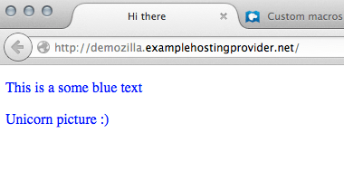
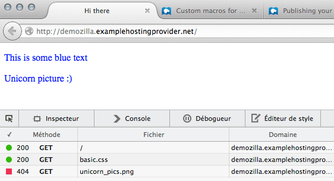
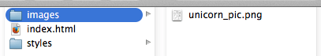
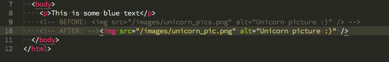
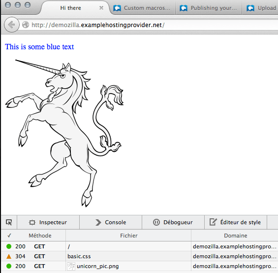
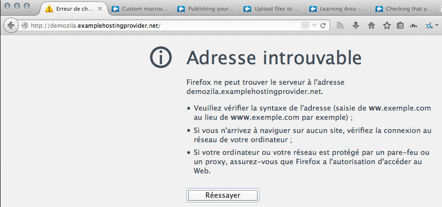
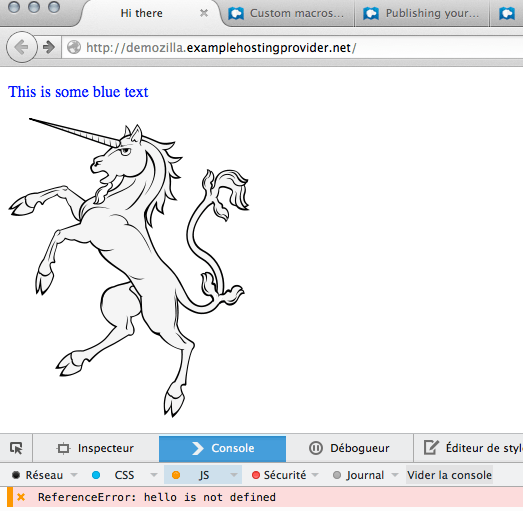
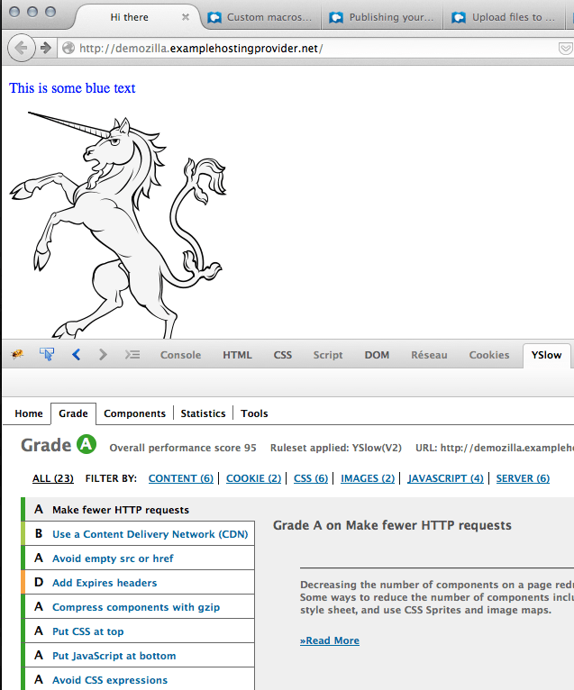

В этой статье мы рассмотрим различные шаги по устранению неполадок на веб-сайте, а также некоторые базовые действия для решения этих проблем.

<table>
  <tbody>
    <tr>
      <th scope="row">Предварительные требования:</th>
      <td>
        Необходимо знать, как
        <a
          href="/ru/docs/Learn_web_development/Howto/Tools_and_setup/Upload_files_to_a_web_server"
          >загружать файлы на веб-сервер</a
        >.
      </td>
    </tr>
    <tr>
      <th scope="row">Цель:</th>
      <td>
        Вы научитесь диагностировать и решать некоторые базовые проблемы, с которыми можете столкнуться на своём сайте.
      </td>
    </tr>
  </tbody>
</table>

Итак, вы опубликовали свой сайт в интернете? Очень хорошо! Но уверены ли вы, что он работает правильно?

Удалённый веб-сервер часто ведёт себя совсем не так, как локальный, поэтому хорошей идеей будет протестировать ваш сайт после его публикации. Вы можете удивиться, сколько проблем всплывёт: изображения не отображаются, страницы не загружаются или загружаются медленно и так далее. В большинстве случаев это не страшно, просто небольшая ошибка или проблема с конфигурацией хостинга.

Давайте посмотрим, как диагностировать и решать эти проблемы.

## Углубляемся

### Тестирование в браузере

Если вы хотите узнать, работает ли ваш сайт правильно, первым делом откройте браузер и перейдите на страницу, которую хотите проверить.

#### Ой-ой, а где изображение?

Давайте посмотрим на наш персональный сайт: `http://demozilla.examplehostingprovider.net/`. Он не показывает ожидаемое изображение!



Откройте инструмент Network в Firefox (**Инструменты ➤ Веб-разработчик ➤ Network**) и перезагрузите страницу:



Вот в чём проблема: этот "404" внизу. "404" означает "ресурс не найден", и поэтому мы не видим изображение.

#### HTTP-статусы

Сервер отвечает статусным сообщением каждый раз, когда получает запрос. Вот наиболее распространённые статусы:

- **200: OK**
  - : Запрошенный ресурс был доставлен.
- **301: Перемещён навсегда**
  - : Ресурс перемещён на новое место. Вы не часто увидите это в браузере, но полезно знать о "301", поскольку поисковые системы активно используют эту информацию для обновления своих индексов.
- **304: Не изменён**
  - : Файл не изменился с момента вашего последнего запроса, поэтому браузер может показать версию из своего кэша, что даёт более быстрое время ответа и эффективное использование пропускной способности.
- **403: Запрещено**
  - : Вам не разрешено отображать ресурс. Обычно это связано с ошибкой конфигурации (например, ваш хостинг-провайдер забыл дать вам права доступа к каталогу).
- **404: Не найдено**
  - : Говорит само за себя. Ниже мы обсудим, как это исправить.
- **500: Внутренняя ошибка сервера**
  - : Что-то пошло не так на сервере. Например, возможно, перестал работать язык серверной стороны ({{Glossary("PHP")}}, .Net и т.д.) или сам веб-сервер имеет проблему с конфигурацией. Обычно лучше обратиться в службу поддержки вашего хостинг-провайдера.
- **503: Сервис недоступен**
  - : Обычно возникает из-за кратковременной перегрузки системы. На сервере есть какая-то проблема. Попробуйте ещё раз через некоторое время.

Как начинающие, проверяющие наш (простой) сайт, мы чаще всего будем сталкиваться с 200, 304, 403 и 404.

#### Исправление ошибки 404

Так что же пошло не так?



На первый взгляд, запрошенное нами изображение, кажется, находится в нужном месте, но инструмент Network сообщил об ошибке "404". Оказывается, мы допустили опечатку в HTML-коде: `unicorn_pics.png` вместо `unicorn_pic.png`. Поэтому исправьте опечатку в вашем редакторе кода, изменив атрибут `src` изображения:



Сохраните, [отправьте на сервер](/ru/docs/Learn_web_development/Howto/Tools_and_setup/Upload_files_to_a_web_server) и перезагрузите страницу в браузере:



Вуаля! Давайте снова посмотрим на {{Glossary("HTTP")}}-статусы:

- **200** для `/` и для `unicorn_pic.png` означает, что нам удалось успешно перезагрузить страницу и изображение.
- **304** для `basic.css` означает, что этот файл не изменился с момента последнего запроса, поэтому браузер может использовать файл из своего кэша, а не получать свежую копию.

Итак, мы исправили ошибку и попутно узнали несколько HTTP-статусов!

### Частые ошибки

Наиболее частые ошибки, которые мы находим, это:

#### Опечатки в адресе

Мы хотели набрать `http://demozilla.examplehostingprovider.net/`, но поторопились и пропустили букву "l":



Адрес не найден. Действительно.

#### Ошибки 404

Часто ошибка возникает просто из-за опечатки, но иногда вы либо забыли загрузить ресурс, либо потеряли сетевое соединение во время загрузки ресурсов. Сначала проверьте правильность написания и точность пути к файлу, а если проблема осталась — загрузите файлы снова. Это, скорее всего, исправит ситуацию.

#### Ошибки JavaScript

Кто-то (возможно, вы) добавил на страницу скрипт и допустил ошибку. Это не помешает загрузке страницы, но вы почувствуете, что что-то не так.

Откройте консоль (**Инструменты ➤ Веб-разработчик ➤ Веб-консоль**) и перезагрузите страницу:



В этом примере мы (довольно ясно) видим, в чём ошибка, и можем пойти и исправить её (мы рассмотрим JavaScript в [другой серии](/ru/docs/Learn_web_development/Core/Scripting) статей).

### Что ещё стоит проверить

Мы перечислили несколько простых способов проверить, что ваш сайт работает правильно, а также наиболее распространённые ошибки, с которыми вы можете столкнуться, и способы их исправления. Вы также можете проверить, соответствует ли ваша страница следующим критериям:

#### Как насчёт производительности?

Загружается ли страница достаточно быстро? Такие ресурсы, как [WebPageTest.org](https://www.webpagetest.org/) или дополнения для браузера, например [YSlow](https://github.com/marcelduran/yslow), могут рассказать вам несколько интересных вещей:



Оценки варьируются от A до F. Наша страница маленькая и соответствует большинству критериев. Но мы уже можем заметить, что лучше было бы использовать {{Glossary("CDN")}}. Это не очень важно, когда мы отдаём всего одно изображение, но будет критично для высоконагруженного сайта, раздающего тысячи изображений.

#### Достаточно ли отзывчив сервер?

`ping` — это полезный инструмент командной строки, который проверяет указанное доменное имя и сообщает, отвечает ли сервер:

```plain
$ ping mozilla.org
PING mozilla.org (63.245.215.20): 56 data bytes
64 bytes from 63.245.215.20: icmp_seq=0 ttl=44 time=148.741 ms
64 bytes from 63.245.215.20: icmp_seq=1 ttl=44 time=148.541 ms
64 bytes from 63.245.215.20: icmp_seq=2 ttl=44 time=148.734 ms
64 bytes from 63.245.215.20: icmp_seq=3 ttl=44 time=147.857 ms
^C
--- mozilla.org ping statistics ---
4 packets transmitted, 4 packets received, 0.0% packet loss
round-trip min/avg/max/stddev = 147.857/148.468/148.741/0.362 ms
```

Просто помните об удобном сочетании клавиш: **Ctrl+C**. Ctrl+C посылает сигнал "прерывания" среде выполнения и говорит ей остановиться. Если вы не остановите выполнение, `ping` будет пинговать сервер бесконечно.

### Простой контрольный список

- Проверьте наличие ошибок 404
- Убедитесь, что все веб-страницы ведут себя так, как вы ожидаете
- Проверьте ваш сайт в нескольких браузерах, чтобы убедиться в единообразии отображения

## Что дальше

Поздравляем, ваш сайт работает и доступен для всех желающих. Это огромное достижение. Теперь вы можете начать глубже изучать различные темы.

- Поскольку на ваш сайт могут заходить люди со всего мира, вам стоит подумать о том, чтобы сделать его [доступным для всех](/ru/docs/Learn_web_development/Howto/Design_and_accessibility/What_is_accessibility).
- Дизайн вашего сайта кажется слишком простым? Пришло время [узнать больше о CSS](/ru/docs/Learn_web_development/Core/Styling_basics).
