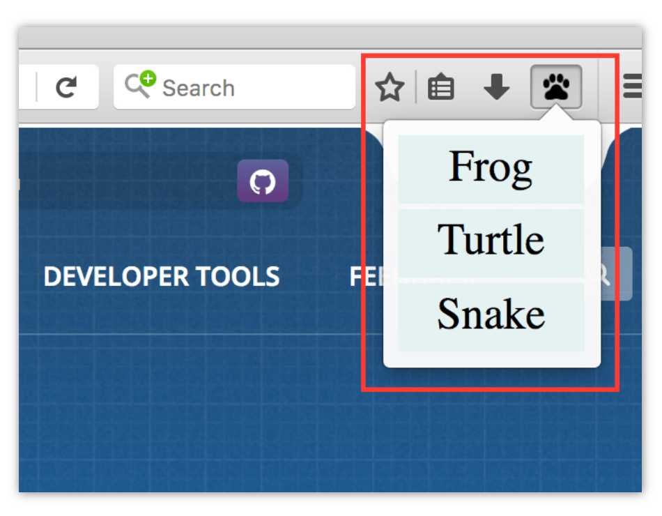

{{AddonSidebar}}

A popup is a dialog that's associated with a [toolbar button](/en-US/Add-ons/WebExtensions/Browser_action) or [address bar button](/en-US/Add-ons/WebExtensions/Page_actions).



When the user clicks the button, the popup is shown. When the user clicks anywhere outside the popup, the popup is closed. The popup can be closed programmatically by calling [`window.close()`](/ru/docs/Web/API/Window/close) from a script running in the popup. However, you can't open the popup programmatically from an extension's JavaScript: it can only be opened in response to a user action.

You can define a keyboard shortcut that opens the popup using the `"_execute_browser_action"` and `"_execute_page_action"` shortcuts. See the documentation for the manifest.json key [`commands`](/ru/docs/Mozilla/Add-ons/WebExtensions/manifest.json/commands) .

## Specifying a popup

The popup is specified as an HTML file, which can include CSS and JavaScript files, as a normal web page does. Unlike a normal page, though, the JavaScript can use all the [WebExtension APIs](/en-US/Add-ons/WebExtensions/API) that the extension has [permissions](/ru/docs/Mozilla/Add-ons/WebExtensions/manifest.json/permissions) for.

The HTML file is included in the extension and specified as part of the [`browser_action`](/ru/docs/Mozilla/Add-ons/WebExtensions/manifest.json/browser_action) or [page_action](/ru/docs/Mozilla/Add-ons/WebExtensions/manifest.json/page_action) key by `"default_popup"` in the manifest.json:

```json
  "browser_action": {
    "default_icon": "icons/beasts-32.png",
    "default_title": "Beastify",
    "default_popup": "popup/choose_beast.html"
  }
```

You can ask the browser to include a stylesheet in your popup that will make it look consistent with the browser's UI. To do this, include `"browser_style": true` in the [`browser_action`](/ru/docs/Mozilla/Add-ons/WebExtensions/manifest.json/browser_action) or [page_action](/ru/docs/Mozilla/Add-ons/WebExtensions/manifest.json/page_action) key.

Popups have a Content Security Policy that restricts the sources from which they can load resources, and disallows some unsafe practices such as the use of [`eval()`](/ru/docs/Web/JavaScript/Reference/Global_Objects/eval). See [Content Security Policy](/ru/docs/Mozilla/Add-ons/WebExtensions/Content_Security_Policy) for more details on this.

## Debugging popups

You can debug a popup's markup and JavaScript using the Add-on Debugger, but you'll need to turn on the Disable popup auto hide feature to prevent popups from hiding when you click outside them. [Read about debugging popups](/en-US/Add-ons/WebExtensions/Debugging#Debugging_popups).

## Popup resizing

Popups resize automatically to fit their content. The algorithm for this may differ from one browser to another.

In Firefox, the size is calculated just before the popup is shown, and at most 10 times per second after DOM mutations. For strict mode documents, the size is calculated based on the layout size of the [`<body>`](/ru/docs/Web/HTML/Element/body) element. For quirks mode, it's the [`<html>`](/ru/docs/Web/HTML/Element/html) element. Firefox calculates the preferred width of the contents of that element, reflows it to that width, and then resizes so there's no vertical scrolling. It will grow to a size of **800x600 pixels** at most if that fits on the user's screen. If the user [moves the extension's button to the menu](https://support.mozilla.org/en-US/kb/customize-firefox-controls-buttons-and-toolbars#w_customize-the-menu-or-the-toolbar) or it appears in the toolbar overflow, then the popup appears inside the menu's panel and is given a fixed width.

## Examples

The [webextensions-examples](https://github.com/mdn/webextensions-examples) repo on GitHub, contains several examples of extensions that use a browser action:

- [beastify](https://github.com/mdn/webextensions-examples/tree/master/beastify) uses a browser action.
