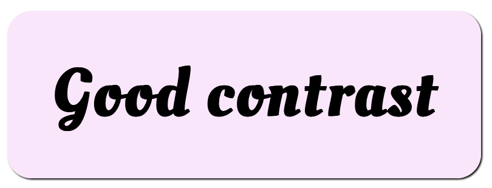
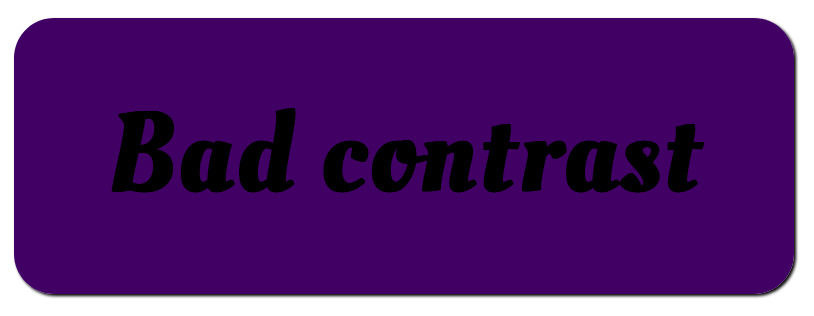

## Описание проблемы

Цветовой контраст между фоном и содержимым переднего плана (обычно текстом) должен быть минимальным, чтобы обеспечить удобство чтения. Хорошо иметь крутой дизайн на своём сайте, но он бесполезен, если ваши пользователи не могут прочитать контент.

Пример хорошего контраста:

Пример плохого контраста:

Наличие хорошего цветового контраста на вашем сайте принесёт пользу всем вашим пользователям, но в особенности будет полезно пользователям с определёнными типами дальтонизма и другими подобными условиями, которые испытывают затруднения при распознавании похожих цветов.

## Связанные с WCAG критерии успеха

- [1.4.3 Минимальный контраст (AA)](https://www.w3.org/TR/WCAG21/#contrast-minimum)

  - : Цветовой контраст между фоном и содержимым переднего плана должен быть минимальным, чтобы обеспечить удобочитаемость:

    - Текст и его фон должны иметь контрастность не менее 4.5.1.
    - Текст заголовка (или просто крупный текст) должен иметь соотношение не менее 3.1. Крупный текст определяется как минимум 18pt или 14pt полужирный.

- [1.4.6 Улучшенный контраст (AAA)](https://www.w3.org/TR/WCAG21/#contrast-enhanced)

  - : Это следует и основывается на критерии 1.4.3.

    - Текст и его фон должны иметь контрастность не менее 7.1.
    - Текст заголовка (или просто крупный текст) должен иметь соотношение не менее 4.5.1.

- [1.4.11 Нетекстовый контраст (AA)](https://www.w3.org/TR/WCAG21/#non-text-contrast) (добавлен в 2.1)
  - : Минимальное соотношение цветовой контрастности для компонентов пользовательского интерфейса и графических объектов должно составлять 3 к 1.

## Решение

При выборе цветовой схемы для вашего сайта, выберите цвета переднего плана и фона, которые имеют хороший контраст. Сделайте цветовой контраст настолько хорошим, насколько это возможно в рамках ваших проектных ограничений — в идеале используйте рейтинг AAA (см. 1.4.6 выше), или в крайнем случае, соответствуйте рейтингу AA (см. 1.4.3 выше).

Если вы используете нетекстовый контент, такой как видео или анимация, вы должны следовать 1.4.11.

Чтобы проверить свой контраст при выборе цвета, используйте такой инструмент, как [Color Contrast Checker](http://webaim.org/resources/contrastchecker/) от WebAIM.

Вы также можете проверить цветовой контраст на лету с помощью инструментов разработчика Firefox — см. наше руководство [Инспектор доступности](/ru/docs/Tools/Инспектор_доступности), и в частности раздел [Цветовой контраст](/ru/docs/Tools/Инспектор_доступности#Цветовой_контраст).

## Смотрите также

- [Цвет и цветовой контраст](/ru/docs/Learn/Accessibility/CSS_and_JavaScript#Color_and_color_contrast)
- [Понимание нетекстового контраста](https://www.w3.org/WAI/WCAG21/Understanding/non-text-contrast.html)
