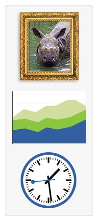

{{DefaultAPISidebar("Canvas API")}}

[**`<canvas>`**](/ru/docs/Web/HTML/Reference/Elements/canvas) — это [HTML](/ru/docs/Web/HTML) элемент, использующийся для рисования графики средствами языков программирования (обычно это [JavaScript](/ru/docs/Glossary/JavaScript)). Он может, к примеру, использоваться для рисования графов, создания коллажей или простой анимации.
Изображения в правой части статьи являются примерами использования `<canvas>.`
Примеры их создания приводятся в этой статье.

В этом руководстве описываются основы использования элемента `<canvas>` для рисования 2D-графики. Приведённые примеры дадут вам понимание того, что вы можете сделать с помощью \<canvas>, а использованные в статье фрагменты кода помогут в создании собственных проектов.

`Впервые <canvas>` использовался компанией Apple для создания [Mac OS X Dashboard](https://ru.wikipedia.org/wiki/Dashboard), а затем был реализован в Web-браузерах. На сегодняшний день все основные браузеры поддерживают работу с \<canvas>. Тег `<canvas>` часть спецификации [WhatWG Web applications 1.0](https://www.whatwg.org/specs/web-apps/current-work/) также известной как HTML5.

## Прежде чем начать

Работа с элементом **`<canvas>`** довольно проста, но потребует от вас базовых знаний [HTML](/ru/docs/Web/HTML) и [JavaScript](JavaScript). Следует предупредить о том, что элемент `<canvas>` не работает в некоторых старых браузерах, но поддерживается большинством современных браузеров. Стандартный размер **`<canvas>`** 300px × 150px (ширина × высота), однако эти размеры могут быть изменены при помощи HTML-атрибутов `height` и `width`. Для рисования графики **`<canvas>`** мы будем использовать `javascript context object`, который создаёт графику динамически.

## В этом руководстве

- [Базовое использование](/ru/docs/Web/API/Canvas_API/Tutorial/Basic_usage)
- [Рисование форм](/ru/docs/Web/API/Canvas_API/Tutorial/Drawing_shapes)
- [Использование изображений](/ru/docs/Web/API/Canvas_API/Tutorial/Using_images)
- [Применение стилей и цветов](/ru/docs/Web/API/Canvas_API/Tutorial/Applying_styles_and_colors)
- [Трансформации](/ru/docs/Web/API/Canvas_API/Tutorial/Transformations)
- [Композирование и обрезка](/ru/docs/Web/API/Canvas_API/Tutorial/Compositing)
- [Базовое анимирование](/ru/docs/Web/API/Canvas_API/Tutorial/Basic_animations)
- [Оптимизация canvas](/ru/docs/Web/API/Canvas_API/Tutorial/Optimizing_canvas)

## Смотрите Также

- [Canvas topic page](/ru/docs/Web/API/Canvas_API)
- [Drawing Graphics with Canvas](/ru/docs/Web/API/Canvas_API/Tutorial)
- [Canvas examples](/ru/docs/tag/Canvas_examples)
- [HTML5 Tutorial](http://html5tutorial.com)
- [Drawing Text Using a Canvas](/ru/docs/Web/API/Canvas_API/Tutorial/Drawing_text)
- [Adding Text to Canvas](https://developer.apple.com/library/safari/#documentation/AudioVideo/Conceptual/HTML-canvas-guide/AddingText/AddingText.html#//apple_ref/doc/uid/TP40010542-CH6-SW4)
- [Canvas Drawing and Animation Application](http://canvimation.github.com/)
- [Interactive canvas tutorial](http://billmill.org/static/canvastutorial/)
- [HTML5CanvasTutorials](https://www.html5canvastutorials.com/)
- [How to draw N grade Bézier curves with the Canvas API](http://html5tutorial.com/how-to-draw-n-grade-bezier-curve-with-canvas-api)
- [W3C Standard](https://www.w3.org/TR/2dcontext/)

## Примечание для помощников

Из-за досадной технической ошибки, которая произошла 17 июня 2013 года, мы утеряли историю по этому руководству, в том числе атрибуции ко всем прошлым, участвовавшие в его создании. Мы приносим извинения за это, и надеемся, что вы простите нас за этот несчастный случай.

{{ Next("Web/API/Canvas_API/Tutorial/Basic_usage") }}
