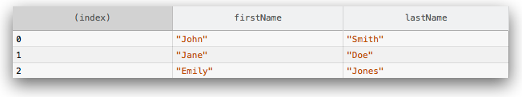

{{APIRef("Console API")}}{{Non-standard_header}}

Отображает наборы данных в виде таблицы.

Данная функция принимает один обязательный аргумент `data`, который должен быть представлен в виде массива или объекта, и один дополнительный параметр `columns`.

функция логирует аргумент `data` в виде таблицы. Каждый элемент массива (или каждое свойство, если `data -` это объект) будет представлять строку таблицы.

Первая колонка таблицы будет озаглавлена как `(index)`. Если `data` представлена массивом, тогда значения первой колонки будут представлять индексы массива. Если `data-` объект, тогда значения первой колонки будут представлять свойства объекта.

{{AvailableInWorkers}}

### Простые наборы

Аргумент `data` может быть массивом или объектом.

```js
// массив строк

console.table(["apples", "oranges", "bananas"]);
```


```js
// объект, чьи свойства содержат строки

function Person(firstName, lastName) {
  this.firstName = firstName;
  this.lastName = lastName;
}

var me = new Person("John", "Smith");

console.table(me);
```


### Наборы смешанных типов

Если элементы массива, либо свойства объекта, в свою очередь сами являются массивами или объектами, тогда эти элементы или свойства перечисляются построчно, перечисляя вложенные элементы/свойства в колонках:

```js
// массив массивов

var people = [
  ["John", "Smith"],
  ["Jane", "Doe"],
  ["Emily", "Jones"],
];
console.table(people);
```


```js
// массив объектов

function Person(firstName, lastName) {
  this.firstName = firstName;
  this.lastName = lastName;
}

var john = new Person("John", "Smith");
var jane = new Person("Jane", "Doe");
var emily = new Person("Emily", "Jones");

console.table([john, jane, emily]);
```

Обратите внимание, что если массив состоит из объектов, колонки таблицы будут озаглавлены названиями свойств объекта.



```js
// объект, свойства которого являются объектами

var family = {};

family.mother = new Person("Jane", "Smith");
family.father = new Person("John", "Smith");
family.daughter = new Person("Emily", "Smith");

console.table(family);
```


### Ограничение видимости колонок

По умолчанию, `console.table()` отображает все элементы в каждой строке. Вы можете использовать опциональный параметр `columns` чтобы указать набор отображаемых колонок:

```js
// массив объектов, логируется только свойство firstName

function Person(firstName, lastName) {
  this.firstName = firstName;
  this.lastName = lastName;
}

var john = new Person("John", "Smith");
var jane = new Person("Jane", "Doe");
var emily = new Person("Emily", "Jones");

console.table([john, jane, emily], ["firstName"]);
```


### Сортировка колонок

Вы можете отсортировать необходимую колонку, кликнув по её заголовку.

## Синтаксис

```
console.table(data [, columns]);
```

### Параметры

- `data`
  - : Данные для отображения. Могут быть представлены массивом или объектом.
- `columns`
  - : Массив названий колонок, которые следует отобразить.

## Спецификации

{{Specifications}}

## Совместимость с браузерами

{{Compat}}
