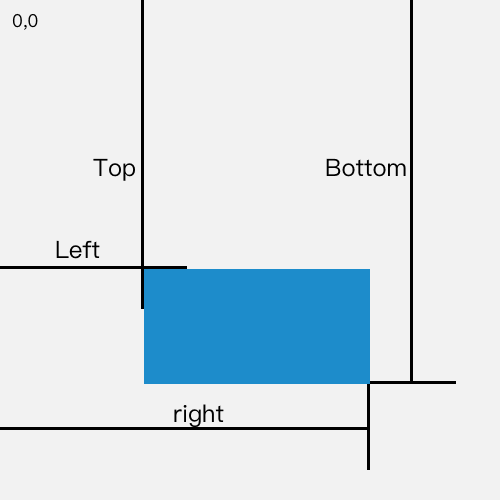

{{APIRef("DOM")}}

Метод **`Element.getBoundingClientRect()`** возвращает размер элемента и его позицию относительно viewport (часть страницы, показанная на экране, и которую мы видим).

## Синтаксис

```
domRect = element.getBoundingClientRect();
```

### Возвращаемое значение

Данный метод возвращает объект {{domxref("DOMRect")}}, который является объединением прямоугольников, возвращаемых методом {{domxref("Element.getClientRects", "getClientRects()")}} для данного элемента, т. е. CSS border-boxes (css-коробок в рамках), связанных с этим элементом. Результатом является самый маленький прямоугольник, в котором содержится весь элемент с read-only `left`, `top`, `right`, `bottom`, `x`, `y`, `width` и `height` свойствами, описывающие это в пикселях. Все свойства, кроме `width` и `height`, являются относительными к верхнему левому углу viewport-а.



Пустые border-box полностью игнорируются. Если border-box элемента пуст, прямоугольник возвращается с нулевыми `width` и `height`, а `top` и `left` берутся у следующего CSS элемента (в порядке контента).

После каждого скролла значения `left`, `top`, `right` и `bottom` изменяются, так как эти значения относительны к viewport и не абсолютные.

Если вам нужны значения, описывающие прямоугольник относительно к верхнему левому углу документа, просто добавьте к свойствам `top` и `left` текущую позицию прокрутки, используя {{domxref("window.scrollX")}} и {{domxref("window.scrollY")}}), чтобы получить прямоугольник, положение которого не зависит от текущей позиции прокрутки.

### Про кроссбраузерность

Скрипты, требующих высокую кроссбраузерность, могут использовать {{domxref("window.pageXOffset")}} и {{domxref("window.pageYOffset")}} вместо `window.scrollX` and `window.scrollY`. Скрипты без доступа к этим свойствам могут использовать код, наподобие этого:

```js
// Для scrollX
(((t = document.documentElement) || (t = document.body.parentNode)) &&
typeof t.scrollLeft == "number"
  ? t
  : document.body
).scrollLeft(
  // Для scrollY
  ((t = document.documentElement) || (t = document.body.parentNode)) &&
    typeof t.scrollTop == "number"
    ? t
    : document.body,
).scrollTop;
```

## Пример

```js
// rect - DOMRect объект с 8-ми свойствами: left, top, right, bottom, x, y, width, height
var rect = obj.getBoundingClientRect();
```

## Спецификации

{{Specifications}}

## Совместимость с браузерами

{{Compat}}

## Смотрите также

- {{domxref("Element.getClientRects", "getClientRects()")}}
- [MSDN: `getBoundingClientRect`](<https://msdn.microsoft.com/en-us/library/ms536433(VS.85).aspx>)
- [MSDN: `ClientRect`](<https://msdn.microsoft.com/en-us/library/hh826029(VS.85).aspx>), более ранняя версия `DOMRect`
-
- {{DOMxRef("Element.getClientRects()")}}
