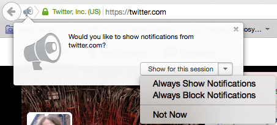

{{DefaultAPISidebar("Web Notifications")}}

Notifications API позволяют web-страницам контролировать отображение системных уведомлений для конечного пользователя — они находятся вне контекста окна браузера верхнего уровня, поэтому могут отображаться даже если пользователь сменил вкладку или перешёл к другому приложению. API были разработаны таким образом, чтобы поддерживать совместимость с существующими системами уведомлений на различных платформах.

## Концепция и использование

На поддерживаемых платформах, отображение системных уведомлений обычно включает две вещи. Во-первых, пользователь должен разрешить текущему источнику отображать уведомления, что, как правило, происходит, при первичной загрузке приложения или сайта, используя метод {{domxref("Notification.requestPermission()")}}. Далее будет вызван диалог со следующим текстом:



Здесь пользователь может выбрать разрешить уведомления от источника, заблокировать их или решить позже. Как только выбор будет сделан, для текущей сессии будут установлены настройки.

> **Примечание:** Для Firefox 44, разрешения для Notifications и [Push](/ru/docs/Web/API/Push_API) объединяются. Если было установлено разрешение для уведомлений, push так же будут разрешены .

Затем создаётся новое уведомление с помощью конструктора {{domxref("Notification.Notification","Notification()")}}. В функцию должен быть передан аргумент заголовка и, по желанию, объект настроек, чтобы определить опции, такие как направление и тело текста, иконка, звук уведомления и т.д.

{{AvailableInWorkers}}

В дополнение, спецификация Notifications API определить несколько дополнений для [ServiceWorker API](/ru/docs/Web/API/ServiceWorker_API), чтобы позволить им отправлять уведомления.

> **Примечание:** Чтобы найти больше об использовании уведомлений в вашем приложении, читайте [Использование Notifications API](/ru/docs/Web/API/Notifications_API/Using_the_Notifications_API).

## Интерфейс уведомлений

- {{domxref("Notification")}}
  - : Определяет объект уведомления.

### Дополнение для Service worker

- {{domxref("ServiceWorkerRegistration")}}
  - : Включает {{domxref("ServiceWorkerRegistration.showNotification()")}} и {{domxref("ServiceWorkerRegistration.getNotifications()")}} методы для контролирования отображения уведомлений.
- {{domxref("ServiceWorkerGlobalScope")}}
  - : Включает обработчик {{domxref("ServiceWorkerGlobalScope.onnotificationclick")}} для вызова встроенных функций, когда был выполнен клик на уведомлении.
- {{domxref("NotificationEvent")}}
  - : Особый тип объекта событий, основанный на {{domxref("ExtendableEvent")}}, который представляет уведомление, которое было вызвано.

## Спецификации

| Specification                                                               |
| --------------------------------------------------------------------------- |
| [Notifications API Living Standard](https://notifications.spec.whatwg.org/) |

## Поддержка браузерами

{{Compat("api.Notification")}}

## Firefox OS разрешения

Когда используете уведомления в приложении на Firefox OS, убедитесь, что `desktop-notification` установленно в вашем фаине манифеста. Уведомления могут быть использованы для любомого уровня разрешения, равного или выше:

```json
"permissions": {
  "desktop-notification": {}
}
```

## See also

- [Использование Notifications API](/ru/docs/Web/API/Notifications_API/Using_the_Notifications_API)
