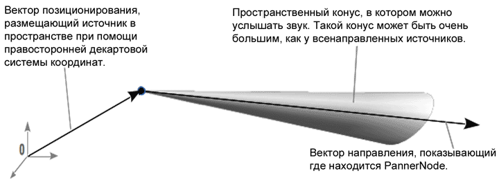

{{ APIRef("Web Audio API") }}

Интерфейс `PannerNode` представляет положение источника звука и поведение его сигнала в пространстве. Это модуль {{domxref("AudioNode")}} для обработки звука, описывающий его положение (в правосторонней системе координат Декарта), его перемещение (с помощью вектора скорости распространения) и его направленности (при помощи конуса направления).

`PannerNode` всегда имеет только один вход и один выход: вход может быть _моно_ или _стерео_, но выход всегда _стерео_ (2 канала); нельзя получить эффекты панорамирования при отсутствии, как минимум двух аудиоканалов!

<table class="properties">
  <tbody>
    <tr>
      <th scope="row">Число входов</th>
      <td><code>1</code></td>
    </tr>
    <tr>
      <th scope="row">Число выходов</th>
      <td><code>1</code></td>
    </tr>
    <tr>
      <th scope="row">Режим подсчёта каналов</th>
      <td><code>"clamped-max"</code></td>
    </tr>
    <tr>
      <th scope="row">Количество каналов</th>
      <td><code>2</code></td>
    </tr>
    <tr>
      <th scope="row">Представление канала</th>
      <td><code>"speakers"</code></td>
    </tr>
  </tbody>
</table>

## Конструктор

- {{domxref("PannerNode.PannerNode")}}
  - : Создаёт новый экземпляр `PannerNode.`

## Свойства

Наследует свойства от своего родителя*, {{domxref("AudioNode")}}*.

Значения направления и положения устанавливаются и получаются различными вариантами синтаксиса, поскольку они хранятся в виде значений {{domxref("AudioParam")}}. Получение значения осуществляется через обращение, например так, `PannerNode.positionX`. Установка того же свойства делается так, `PannerNode.positionX.value`. This is why these values are not marked read only, which is how they appear in the WebIDL.

- {{domxref("PannerNode.coneInnerAngle")}}
  - : Это значение типа `double`, представляющее угол конуса (в градусах), внутри которого не будет уменьшения громкости.
- {{domxref("PannerNode.coneOuterAngle")}}
  - : Это значение типа `double`, представляющее угол конуса (в градусах), вне которого громкость звука будет уменьшена на постоянное значение, определяемое атрибутом `coneOuterGain.`
- {{domxref("PannerNode.coneOuterGain")}}
  - : Это значение типа `double`, представляющее величину снижения уровня громкости вне конуса, определённого атрибутом `coneOuterAngle`. Значение по умолчанию равно `0`, то есть, вне конуса звук не будет слышен.
- {{domxref("PannerNode.distanceModel")}}
  - : Перечислимое значение, определяющее, какой алгоритм будет использован для уменьшения громкости источника звука при удалении его от слушателя.
- {{domxref("PannerNode.maxDistance")}}
  - : Значение типа `double`, представляющее максимальное расстояние между источником звука и слушателем, после которого громкость звука далее не уменьшается.
- {{domxref("PannerNode.orientationX")}}
  - : Представляет горизонтальное положение вектора источника звука в правосторонней системе координат Декарта. В то время как данный {{domxref("AudioParam")}} непосредственно изменить нельзя, его значение может быть изменено через его свойство {{domxref("AudioParam.value", "value")}} . Значение по умолчанию равно 1.
- {{domxref("PannerNode.orientationY")}}
  - : Представляет вертикальное положение вектора источника звука в правосторонней системе координат Декарта. Значение по умолчанию равно 0. В то время как данный {{domxref("AudioParam")}} непосредственно изменить нельзя, его значение может быть изменено через его свойство {{domxref("AudioParam.value", "value")}}. Значение по умолчанию равно 0.
- {{domxref("PannerNode.orientationZ")}}
  - : Представляет продольную (вперёд - назад) позицию вектора распространения звука от источника в правосторонней системе координат Декарта. Значение по умолчанию равно 0. В то время как данный {{domxref("AudioParam")}} непосредственно изменить нельзя, его значение может быть изменено через его свойство {{domxref("AudioParam.value", "value")}}. Значение по умолчанию равно 0.
- {{domxref("PannerNode.panningModel")}}
  - : Перечислимое значение, определяющее какой алгоритм пространственной обработки используется для размещения источника звука в трёхмерном пространстве.
- {{domxref("PannerNode.positionX")}}
  - : Представляет горизонтальное положение источника звука в правосторонней системе координат Декарта. Значение по умолчанию равно 0. В то время как данный {{domxref("AudioParam")}} непосредственно изменить нельзя, его значение может быть изменено через его свойство {{domxref("AudioParam.value", "value")}}. Значение по умолчанию равно 0.
- {{domxref("PannerNode.positionY")}}
  - : Представляет вертикальное положение источника звука в правосторонней системе координат Декарта. Значение по умолчанию равно 0. В то время как данный {{domxref("AudioParam")}} непосредственно изменить нельзя, его значение может быть изменено через его свойство {{domxref("AudioParam.value", "value")}}. Значение по умолчанию равно 0.
- {{domxref("PannerNode.positionZ")}}
  - : Представляет позицию источника звука вдоль оси Z (вперёд и назад) в правосторонней системе координат Декарта. Значение по умолчанию равно 0. В то время как данный {{domxref("AudioParam")}} непосредственно изменить нельзя, его значение может быть изменено через его свойство {{domxref("AudioParam.value", "value")}}. Значение по умолчанию равно 0.
- {{domxref("PannerNode.refDistance")}}
  - : Значение типа `double`, представляющее справочное (опорное) расстояние для уменьшения громкости при удалении источника звука от слушателя.
- {{domxref("PannerNode.rolloffFactor")}}
  - : Значение типа `double`, представляющее как быстро уменьшается громкость при удалении источника звука от слушателя. Данное значение используется во всех моделях изменения громкости от расстояния.

## Методы

Наследует методы от своего родителя*, {{domxref("AudioNode")}}*.

- {{domxref("PannerNode.setPosition()")}}
  - : Определяет положение источника звука относительно слушателя (представлен объектом {{domxref("AudioListener")}}, хранящимся в атрибуте {{domxref("AudioContext.listener")}} ).

<!---->

- {{domxref("PannerNode.setOrientation()")}}
  - : Определяет направление воспроизведения источника звука.

<!---->

- {{domxref("PannerNode.setVelocity()")}}
  - : Это устаревший элемент API и его работа в дальнейшем не гарантируется.
    Определяет вектор распространения звука от источника - как быстро он движется и в каком направлении. В предыдущей версии спецификации, {{domxref("PannerNode")}} имел скорость распространения, которую можно было выдать выше или ниже подключённого потока {{domxref("AudioBufferSourceNode")}}. Эта функция не была чётко оговорена и имела ряд проблем, поэтому была удалена из спецификации.

## Примеры

{{page("/ru/docs/Web/API/AudioContext.createPanner","Example")}}

## Specifications

{{Specifications}}

## Browser compatibility

{{Compat}}

## Смотрите также

- [Using the Web Audio API](/ru/docs/Web_Audio_API/Using_Web_Audio_API)
- [Основы панорамирования. Расположение звуков в виртуальном пространстве.](http://musiconnect.ru/publ/mixmaster/osnovy-panoramirovaniya-raspolozhenie-zvukov-v-virtualnom-prostranstve-ch-1/)
