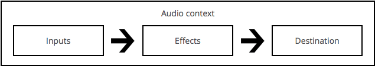

Web audio API - мощный и многогранный инструмент для манипуляции звуковой составляющей на веб-странице, что даёт возможность разработчикам выбрать источники, добавить к ним специальные звуковые эффекты (такие как panning), визуализировать их и многое другое.

## Общие концепции и использование Web Audio

Web audio API позволяет обрабатывать операции над аудио с помощью специального аудио контекста (audio context), и был спроектирован на использование модульной маршрутизации (modular routing). Базовые операции выполняются с помощью аудио узлов (audio nodes), которые объединяются вместе, формируя аудио-маршрутизатору \*таблицу (audio routing graph). Несколько источников - с разными видами поточных схем - поддерживаются даже изнутри простого контекста. Эта модульная концепция обеспечивает гибкость в создании сложных функций для динамических эффектов.

Аудио узлы объединяются в цепи и простые сети их вводами и выводами. Они, как правило, запускаются с одним или более источниками. Источники представляют собой массивы сэмплов на единицу времени. Например, при частоте дискретизации 44100 Гц, в каждой секунде каждого канала расположено 22050 сэмплов. Они могут быть либо обработаны математически (смотрите : OscillatorNode), либо считаны с звуко/видео файлов (смотрите : AudioBufferSourceNode и MediaElementAudioSourceNode) или с аудио потоков (смотрите : MediaStreamAudioSourceNode). По факту, звуковые файлы - просто запись звуковых колебаний, которые поступают от микрофона и музыкальных инструментов, смешиваясь в одну сложную волну. Выводные данные этих узлов могут быть связаны с вводными других, что смешивают или модифицируют потоки звуковых образцов в иные потоки. Популярная модификация - умножение образца на значение, чтобы сделать выходной звук менее или более громким (смотрите : GainMode). Когда звук был успешно обработан предназначенным ему эффектом, он может быть привязан к выходному потоку (смотрите : AudioContext.destination), что направляет звук в динамики или микрофон. Данный шаг нужен лишь если вы предпочтёте дать возможность пользователю услышать ваши шедевры.

Простой, типичный порядок действий выполнения манипуляций над аудио выглядит так :

1. Создадим аудио контекст
2. Внутри нашего контекста определим источники - такие как \<audio>, генератор (oscillator), поток
3. Определим узлы эффектов, такие как реверберация (reverb), биквадратный фильтр (biquad filter), панорамирование (panner), сжатие (compressor)
4. Выберем конечную точку аудио сигнала, например ваши системные звуковые устройства
5. Привяжем наши источники к эффектам, и эффекты к конечному сигналу.



Распределение времени контролируется с высокой точностью и низкими задержками, позволяя разработчикам писать код, что точно реагирует на события и в состоянии обработать образец даже на высокой оценке образцов (sample rate). Так что такие приложения как ритм-компьютер и программный автомат всегда под рукой.

Web audio API также даёт нам возможность контролировать то, каким аудио является в пространстве. Используя особую систему, что базируется
на модели source-listener, он позволяет контролировать модель панорамирования и обходиться без дистанционно-вызванного ослабления (distance-induced attenuation) или duppler shift, вызванного сдвигом источника (или сдвигом слушателя).

> **Примечание:** Помните: вы можете прочитать более детальный теоретический материал о Web audio API в нашей статье [Basic concepts behind Web Audio API](/ru/docs/Web/API/Web_Audio_API/Basic_concepts_behind_Web_Audio_API).

## Web Audio API интерфейсы

В Web audio API есть всего 28 интерфейсов и соответствующих событий, которые мы сгруппировали в 9 категорий по функциональности.

### Главные объекты определения аудио

Главные контейнеры и определения, что формируют аудио объект в Web Audio API.

- {{domxref("AudioContext")}}
  - : AudioContext представляет собой некий аудио обрабатывающий объект, сооружённый из аудио модулей связанных вместе, где каждый является экземпляром класса {{domxref("AudioNode")}}. AudioContext управляет созданием узлов, содержащихся в нём и выполняет обработку или декодирование аудио данных.
- {{domxref("AudioNode")}}
  - : Интерфейс AudioNode представляет собой некий обрабатывающий модуль такой как источник аудио (то есть HTML \<audio> или \<video> элемент), конечный аудио объект, модуль непосредственной обработки (например фильтр BiquadFilterNode или звуковой контроллер такой как GainNode).
- {{domxref("AudioParam")}}
  - : Интерфейс **`AudioParam`** представляет аудио-параметры связанные с {{domxref("AudioNode")}}. Он может содержать как точное значение параметра, так и параметры изменяющиеся во времени.
- {{event("ended_(Web_Audio)", "ended")}} (event)
  - : Событие **ended** генерируется тогда, когда воспроизведение остановлено по причине окончания носителя.

### Источники звука

Интерфейсы, которые определяют источники звука для использования в Web Audio API.

- {{domxref("OscillatorNode")}}
  - : **`OscillatorNode`** представляет собой источник синусоидальной волны. Это модуль {{domxref("AudioNode")}} который принимает на вход _частоту_ и генерирует синусоидальную волну с этой частотой.
- {{domxref("AudioBuffer")}}
  - : Интерфейс **`AudioBuffer`** представляет собой короткий аудио сэмпл находящийся в памяти, созданный из аудио файла с использованием метода {{ domxref("AudioContext.decodeAudioData()") }}, или созданный из необработанных(сырых) данных с использованием метода {{ domxref("AudioContext.createBuffer()") }}. После декодирования аудио данные могут быть помещены в {{ domxref("AudioBufferSourceNode") }}.
- {{domxref("AudioBufferSourceNode")}}
  - : Интерфейс **`AudioBufferSourceNode`** представляет собой источник звука, состоящий из аудио данных, хранящихся в {{domxref("AudioBuffer")}}. Это {{domxref("AudioNode")}}, который действует в качестве источника звука.
- {{domxref("MediaElementAudioSourceNode")}}
  - : Интерфейс **`MediaElementAudioSourceNode`** представляет источник звука, содержащегося в элементе HTML5 {{ htmlelement("audio") }} или {{ htmlelement("video") }} . Это {{domxref("AudioNode")}}, который действует в качестве источника звука.
- {{domxref("MediaStreamAudioSourceNode")}}
  - : Интерфейс **`MediaStreamAudioSourceNode`** представляет источник звука, содержащегося в потоке [WebRTC](/ru/docs/WebRTC) {{domxref("MediaStream")}} (например веб-камеры или микрофона). Это {{domxref("AudioNode")}}, который действует в качестве источника звука.

### Аудио фильтры

Интерфейсы для определения эффектов которые можно применить к источникам звука.

- {{domxref("BiquadFilterNode")}}
  - : **`BiquadFilterNode`** представляет простой фильтр низкого порядка. Это {{domxref("AudioNode")}} представляющий различные виды фильтров такие как эквалайзер или управление тональностью. **`BiquadFilterNode`** имеет ровно один вход и один выход.
- {{domxref("ConvolverNode")}}
  - : **`ConvolverNode`** это {{domxref("AudioNode")}} выполняющий линейную свёртку AudioBuffer, часто применяется для достижения эффекта реверберации по заданной импульсной характеристике.
- {{domxref("DelayNode")}}
  - : **`DelayNode`** представляет собой линию задержки ([delay-line](http://en.wikipedia.org/wiki/Digital_delay_line)); содержит {{domxref("AudioNode")}} вызывающий задержку между выходным и входным сигналом.
- {{domxref("DynamicsCompressorNode")}}
  - : The **`DynamicsCompressorNode`** interface provides a compression effect, which lowers the volume of the loudest parts of the signal in order to help prevent clipping and distortion that can occur when multiple sounds are played and multiplexed together at once.
- {{domxref("GainNode")}}
  - : The **`GainNode`** interface represents a change in volume. It is an {{domxref("AudioNode")}} audio-processing module that causes a given _gain_ to be applied to the input data before its propagation to the output.
- {{domxref("StereoPannerNode")}}
  - : The **`StereoPannerNode`** interface represents a simple stereo panner node that can be used to pan an audio stream left or right.
- {{domxref("WaveShaperNode")}}
  - : The **`WaveShaperNode`** interface represents a non-linear distorter. It is an {{domxref("AudioNode")}} that use a curve to apply a waveshaping distortion to the signal. Beside obvious distortion effects, it is often used to add a warm feeling to the signal.
- {{domxref("PeriodicWave")}}
  - : Used to define a periodic waveform that can be used to shape the output of an {{ domxref("OscillatorNode") }}.

### Defining audio destinations

Once you are done processing your audio, these interfaces define where to output it.

- {{domxref("AudioDestinationNode")}}
  - : The **`AudioDestinationNode`** interface represents the end destination of an audio source in a given context — usually the speakers of your device.
- {{domxref("MediaStreamAudioDestinationNode")}}
  - : The **`MediaStreamAudioDestinationNode`** interface represents an audio destination consisting of a [WebRTC](/ru/docs/WebRTC) {{domxref("MediaStream")}} with a single `AudioMediaStreamTrack`, which can be used in a similar way to a MediaStream obtained from {{ domxref("Navigator.getUserMedia") }}. It is an {{domxref("AudioNode")}} that acts as an audio destination.

### Анализ и визуализация данных

If you want to extract time, frequency and other data from your audio, the `AnalyserNode` is what you need.

- {{domxref("AnalyserNode")}}
  - : The **`AnalyserNode`** interface represents a node able to provide real-time frequency and time-domain analysis information, for the purposes of data analysis and visualization.

### Splitting and merging audio channels

To split and merge audio channels, you'll use these interfaces.

- {{domxref("ChannelSplitterNode")}}
  - : The **`ChannelSplitterNode`** interface separates the different channels of an audio source out into a set of _mono_ outputs.
- {{domxref("ChannelMergerNode")}}
  - : The **`ChannelMergerNode`** interface reunites different mono inputs into a single output. Each input will be used to fill a channel of the output.

### Audio spatialization

These interfaces allow you to add audio spatialization panning effects to your audio sources.

- {{domxref("AudioListener")}}
  - : The **`AudioListener`** interface represents the position and orientation of the unique person listening to the audio scene used in audio spatialization.
- {{domxref("PannerNode")}}
  - : The **`PannerNode`** interface represents the behavior of a signal in space. It is an {{domxref("AudioNode")}} audio-processing module describing its position with right-hand Cartesian coordinates, its movement using a velocity vector and its directionality using a directionality cone.

### Audio processing via JavaScript

If you want to use an external script to process your audio source, the below Node and events make it possible.

> **Примечание:** As of the August 29 2014 Web Audio API spec publication, these features have been marked as deprecated, and are soon to be replaced by [Audio_Workers](#audio_workers).

- {{domxref("ScriptProcessorNode")}}
  - : The **`ScriptProcessorNode`** interface allows the generation, processing, or analyzing of audio using JavaScript. It is an {{domxref("AudioNode")}} audio-processing module that is linked to two buffers, one containing the current input, one containing the output. An event, implementing the {{domxref("AudioProcessingEvent")}} interface, is sent to the object each time the input buffer contains new data, and the event handler terminates when it has filled the output buffer with data.
- {{event("audioprocess")}} (event)
  - : The `audioprocess` event is fired when an input buffer of a Web Audio API {{domxref("ScriptProcessorNode")}} is ready to be processed.
- {{domxref("AudioProcessingEvent")}}
  - : The [Web Audio API](/ru/docs/Web_Audio_API) `AudioProcessingEvent` represents events that occur when a {{domxref("ScriptProcessorNode")}} input buffer is ready to be processed.

### Offline/background audio processing

It is possible to process/render an audio graph very quickly in the background — rendering it to an {{domxref("AudioBuffer")}} rather than to the device's speakers — with the following.

- {{domxref("OfflineAudioContext")}}
  - : The **`OfflineAudioContext`** interface is an {{domxref("AudioContext")}} interface representing an audio-processing graph built from linked together {{domxref("AudioNode")}}s. In contrast with a standard `AudioContext`, an `OfflineAudioContext` doesn't really render the audio but rather generates it, _as fast as it can_, in a buffer.
- {{event("complete")}} (event)
  - : The `complete` event is fired when the rendering of an {{domxref("OfflineAudioContext")}} is terminated.
- {{domxref("OfflineAudioCompletionEvent")}}
  - : The `OfflineAudioCompletionEvent` represents events that occur when the processing of an {{domxref("OfflineAudioContext")}} is terminated. The {{event("complete")}} event implements this interface.

### Audio Workers

Audio workers provide the ability for direct scripted audio processing to be done inside a [web worker](/ru/docs/Web/Guide/Performance/Using_web_workers) context, and are defined by a couple of interfaces (new as of 29th August 2014.) These are not implemented in any browsers yet. When implemented, they will replace {{domxref("ScriptProcessorNode")}}, and the other features discussed in the [Audio processing via JavaScript](#Audio_processing_via_JavaScript) section above.

- {{domxref("AudioWorkerNode")}}
  - : The AudioWorkerNode interface represents an {{domxref("AudioNode")}} that interacts with a worker thread to generate, process, or analyse audio directly.
- {{domxref("AudioWorkerGlobalScope")}}
  - : The `AudioWorkerGlobalScope` interface is a `DedicatedWorkerGlobalScope`-derived object representing a worker context in which an audio processing script is run; it is designed to enable the generation, processing, and analysis of audio data directly using JavaScript in a worker thread.
- {{domxref("AudioProcessEvent")}}
  - : This is an `Event` object that is dispatched to {{domxref("AudioWorkerGlobalScope")}} objects to perform processing.

## Obsolete interfaces

The following interfaces were defined in old versions of the Web Audio API spec, but are now obsolete and have been replaced by other interfaces.

- {{domxref("JavaScriptNode")}}
  - : Used for direct audio processing via JavaScript. This interface is obsolete, and has been replaced by {{domxref("ScriptProcessorNode")}}.
- {{domxref("WaveTableNode")}}
  - : Used to define a periodic waveform. This interface is obsolete, and has been replaced by {{domxref("PeriodicWave")}}.

## Пример

This example shows a wide variety of Web Audio API functions being used. You can see this code in action on the [Voice-change-o-matic](http://mdn.github.io/voice-change-o-matic/) demo (also check out the [full source code at Github](https://github.com/mdn/voice-change-o-matic)) — this is an experimental voice changer toy demo; keep your speakers turned down low when you use it, at least to start!

The Web Audio API lines are highlighted; if you want to find more out about what the different methods, etc. do, have a search around the reference pages.

```js
var audioCtx = new (window.AudioContext || window.webkitAudioContext)(); // define audio context
// Webkit/blink browsers need prefix, Safari won't work without window.

var voiceSelect = document.getElementById("voice"); // select box for selecting voice effect options
var visualSelect = document.getElementById("visual"); // select box for selecting audio visualization options
var mute = document.querySelector(".mute"); // mute button
var drawVisual; // requestAnimationFrame

var analyser = audioCtx.createAnalyser();
var distortion = audioCtx.createWaveShaper();
var gainNode = audioCtx.createGain();
var biquadFilter = audioCtx.createBiquadFilter();

function makeDistortionCurve(amount) {
  // function to make curve shape for distortion/wave shaper node to use
  var k = typeof amount === "number" ? amount : 50,
    n_samples = 44100,
    curve = new Float32Array(n_samples),
    deg = Math.PI / 180,
    i = 0,
    x;
  for (; i < n_samples; ++i) {
    x = (i * 2) / n_samples - 1;
    curve[i] = ((3 + k) * x * 20 * deg) / (Math.PI + k * Math.abs(x));
  }
  return curve;
}

navigator.getUserMedia(
  // constraints - only audio needed for this app
  {
    audio: true,
  },

  // Success callback
  function (stream) {
    source = audioCtx.createMediaStreamSource(stream);
    source.connect(analyser);
    analyser.connect(distortion);
    distortion.connect(biquadFilter);
    biquadFilter.connect(gainNode);
    gainNode.connect(audioCtx.destination); // connecting the different audio graph nodes together

    visualize(stream);
    voiceChange();
  },

  // Error callback
  function (err) {
    console.log("The following gUM error occured: " + err);
  },
);

function visualize(stream) {
  WIDTH = canvas.width;
  HEIGHT = canvas.height;

  var visualSetting = visualSelect.value;
  console.log(visualSetting);

  if (visualSetting == "sinewave") {
    analyser.fftSize = 2048;
    var bufferLength = analyser.frequencyBinCount; // half the FFT value
    var dataArray = new Uint8Array(bufferLength); // create an array to store the data

    canvasCtx.clearRect(0, 0, WIDTH, HEIGHT);

    function draw() {
      drawVisual = requestAnimationFrame(draw);

      analyser.getByteTimeDomainData(dataArray); // get waveform data and put it into the array created above

      canvasCtx.fillStyle = "rgb(200, 200, 200)"; // draw wave with canvas
      canvasCtx.fillRect(0, 0, WIDTH, HEIGHT);

      canvasCtx.lineWidth = 2;
      canvasCtx.strokeStyle = "rgb(0, 0, 0)";

      canvasCtx.beginPath();

      var sliceWidth = (WIDTH * 1.0) / bufferLength;
      var x = 0;

      for (var i = 0; i < bufferLength; i++) {
        var v = dataArray[i] / 128.0;
        var y = (v * HEIGHT) / 2;

        if (i === 0) {
          canvasCtx.moveTo(x, y);
        } else {
          canvasCtx.lineTo(x, y);
        }

        x += sliceWidth;
      }

      canvasCtx.lineTo(canvas.width, canvas.height / 2);
      canvasCtx.stroke();
    }

    draw();
  } else if (visualSetting == "off") {
    canvasCtx.clearRect(0, 0, WIDTH, HEIGHT);
    canvasCtx.fillStyle = "red";
    canvasCtx.fillRect(0, 0, WIDTH, HEIGHT);
  }
}

function voiceChange() {
  distortion.curve = new Float32Array();
  biquadFilter.gain.value = 0; // reset the effects each time the voiceChange function is run

  var voiceSetting = voiceSelect.value;
  console.log(voiceSetting);

  if (voiceSetting == "distortion") {
    distortion.curve = makeDistortionCurve(400); // apply distortion to sound using waveshaper node
  } else if (voiceSetting == "biquad") {
    biquadFilter.type = "lowshelf";
    biquadFilter.frequency.value = 1000;
    biquadFilter.gain.value = 25; // apply lowshelf filter to sounds using biquad
  } else if (voiceSetting == "off") {
    console.log("Voice settings turned off"); // do nothing, as off option was chosen
  }
}

// event listeners to change visualize and voice settings

visualSelect.onchange = function () {
  window.cancelAnimationFrame(drawVisual);
  visualize(stream);
};

voiceSelect.onchange = function () {
  voiceChange();
};

mute.onclick = voiceMute;

function voiceMute() {
  // toggle to mute and unmute sound
  if (mute.id == "") {
    gainNode.gain.value = 0; // gain set to 0 to mute sound
    mute.id = "activated";
    mute.innerHTML = "Unmute";
  } else {
    gainNode.gain.value = 1; // gain set to 1 to unmute sound
    mute.id = "";
    mute.innerHTML = "Mute";
  }
}
```

## Спецификации

{{Specifications}}

## Совместимость с браузерами

{{Compat}}

## Смотрите также

- [Using the Web Audio API](/ru/docs/Web/API/Web_Audio_API/Using_Web_Audio_API)
- [Visualizations with Web Audio API](/ru/docs/Web/API/Web_Audio_API/Visualizations_with_Web_Audio_API)
- [Voice-change-O-matic example](http://mdn.github.io/voice-change-o-matic/)
- [Violent Theremin example](http://mdn.github.io/violent-theremin/)
- [Web audio spatialisation basics](/ru/docs/Web/API/Web_Audio_API/Web_audio_spatialisation_basics)
- [Mixing Positional Audio and WebGL](http://www.html5rocks.com/tutorials/webaudio/positional_audio/)
- [Developing Game Audio with the Web Audio API](http://www.html5rocks.com/tutorials/webaudio/games/)
- [Porting webkitAudioContext code to standards based AudioContext](/ru/docs/Web/API/Web_Audio_API/Porting_webkitAudioContext_code_to_standards_based_AudioContext)
- [Tones](https://github.com/bit101/tones): a simple library for playing specific tones/notes using the Web Audio API.
- [howler.js](https://github.com/goldfire/howler.js/): a JS audio library that defaults to [Web Audio API](https://dvcs.w3.org/hg/audio/raw-file/tip/webaudio/specification.html) and falls back to [HTML5 Audio](http://www.whatwg.org/specs/web-apps/current-work/#the-audio-element), as well as providing other useful features.
- [Mooog](https://github.com/mattlima/mooog): jQuery-style chaining of AudioNodes, mixer-style sends/returns, and more.

### Quicklinks

1. **Guides**

   1. [Basic concepts behind Web Audio API](/ru/docs/Web/API/Web_Audio_API/Basic_concepts_behind_Web_Audio_API)
   2. [Using the Web Audio API](/ru/docs/Web/API/Web_Audio_API/Using_Web_Audio_API)
   3. [Visualizations with Web Audio API](/ru/docs/Web/API/Web_Audio_API/Visualizations_with_Web_Audio_API)
   4. [Web audio spatialisation basics](/ru/docs/Web/API/Web_Audio_API/Web_audio_spatialisation_basics)
   5. [Porting webkitAudioContext code to standards based AudioContext](/ru/docs/Web/API/Web_Audio_API/Porting_webkitAudioContext_code_to_standards_based_AudioContext)

2. **Examples**

   1. [Voice-change-O-matic](http://mdn.github.io/voice-change-o-matic/)
   2. [Violent Theremin](http://mdn.github.io/violent-theremin/)

3. **Interfaces**

   1. {{domxref("AnalyserNode")}}
   2. {{domxref("AudioBuffer")}}
   3. {{domxref("AudioBufferSourceNode")}}
   4. {{domxref("AudioContext")}}
   5. {{domxref("AudioDestinationNode")}}
   6. {{domxref("AudioListener")}}
   7. {{domxref("AudioNode")}}
   8. {{domxref("AudioParam")}}
   9. {{event("audioprocess")}} (event)
   10. {{domxref("AudioProcessingEvent")}}
   11. {{domxref("BiquadFilterNode")}}
   12. {{domxref("ChannelMergerNode")}}
   13. {{domxref("ChannelSplitterNode")}}
   14. {{event("complete")}} (event)
   15. {{domxref("ConvolverNode")}}
   16. {{domxref("DelayNode")}}
   17. {{domxref("DynamicsCompressorNode")}}
   18. {{event("ended_(Web_Audio)", "ended")}} (event)
   19. {{domxref("GainNode")}}
   20. {{domxref("MediaElementAudioSourceNode")}}
   21. {{domxref("MediaStreamAudioDestinationNode")}}
   22. {{domxref("MediaStreamAudioSourceNode")}}
   23. {{domxref("OfflineAudioCompletionEvent")}}
   24. {{domxref("OfflineAudioContext")}}
   25. {{domxref("OscillatorNode")}}
   26. {{domxref("PannerNode")}}
   27. {{domxref("PeriodicWaveNode")}}
   28. {{domxref("ScriptProcessorNode")}}
   29. {{domxref("WaveShaperNode")}}
