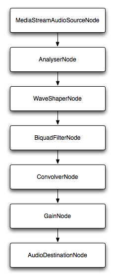

[Web Audio API](/ru/docs/Web_Audio_API) обеспечивает простой, но мощный механизм реализации и управления аудио-контентом внутри web приложения. Это позволяет разрабатывать сложные аудио миксины, эффекты и т.д. В этой статье мы постараемся объяснить основы использования Web Audio API, посредством пары простых примеров.

The Web Audio API does not replace the [\<audio>](/ru/docs/Web/HTML/Element/audio) media element, but rather complements it, just like [\<canvas>](/ru/docs/Web/HTML/Element/canvas) co-exists well alongside the [\](/ru/docs/Web/HTML/Element/Img) element. What you use to implement audio depends on your use case. If you just want to control playback of a simple audio track, \<audio> is probably a better, quicker solution. If you want to carry out more complex audio processing, as well as playback, Web Audio API provides much more power and control.

One very powerful thing about the Web Audio API is that it does not have any strict "sound call limitations". There is no ceiling of 32 or 64 sound calls at one time, for example. Depending on the power of your processor, you might be able to get a thousand or more sounds playing simultaneously without stuttering. This shows real progress, given that a few years ago mid to high range sound cards were able to handle only a fraction of this load.

## Examples

To demonstrate usage of the Web Audio API, we created a number of examples which will be added to as time goes on. Please feel free to add to them and suggest improvements!

First off, we created the [Voice-change-O-matic](https://github.com/mdn/voice-change-o-matic), a fun voice changer and sound visualisation web app, which allows you to choose different effects and visualisations. This could definitely be improved on with better quality effects, but it demonstrates the usage of multiple Web Audio API features together ([run the Voice-change-O-matic live](http://mdn.github.io/voice-change-o-matic/)).


Another example we've created on our quest to understand the Web Audio is the [Violent Theremin](http://mdn.github.io/violent-theremin/), a simple app allowing you to change the pitch and volume by moving your mouse pointer. It also provides a psychedelic lightshow ([see Violent Theremin source code](https://github.com/mdn/violent-theremin)).


## Basic concepts

> **Примечание:** most of the code snippets in this example are taken from the [Violent Theremin example](https://github.com/mdn/violent-theremin).

The Web Audio API involves handling audio operations inside an **audio context**, and has been designed to allow **modular routing**. Basic audio operations are performed with **audio nodes**, which are linked together to form an **audio routing graph**. Several sources — with different types of channel layouts — are supported even within a single context. This modular design provides the flexibility to create complex audio functions with dynamic effects.

Audio nodes are linked via their inputs and outputs, forming a chain that starts with one or more sources, goes through one or more nodes, then ends up at a destination (although you don't have to provide a destination if you, say, just want to visualise some audio data). A simple, typical workflow for web audio would look something like this:

1. Create audio context
2. Inside the context, create sources — such as `<audio>`, oscillator, stream
3. Create effects nodes, such as reverb, biquad filter, panner, compressor
4. Choose final destination of audio, for example your system speakers
5. Connect the sources up to the effects, and the effects to the destination

### Creating an audio context

First, you will need to create an instance of [`AudioContext`](/ru/docs/Web/API/AudioContext) to build an audio graph upon. The simplest example of this would look like so:

```js
var audioCtx = new AudioContext();
```

> **Примечание:** Multiple audio context instances are allowed on the same document, but are likely wasteful.

However, it is important to provide a prefixed version for Webkit/Blink browsers, and a non-prefixed version for Firefox (desktop/mobile/OS). Something like this would work:

```js
var audioCtx = new (window.AudioContext || window.webkitAudioContext)();
```

> **Примечание:** Safari can break if you don't explcitly mention the `window` object when creating a new context!

### Creating an audio source

Now we have an audio context, and we can use the methods of this context to do most everything else. The first thing we need is an audio source to play around with. Audio sources can come from a variety of places:

- Generated directly by JavaScript by an audio node such as an oscillator. An {{ domxref("OscillatorNode") }} is created using the {{ domxref("AudioContext.createOscillator") }} method.
- Created from raw PCM data: the audio context has methods to decode supported audio formats; see {{ domxref("AudioContext.createBuffer()") }}, {{ domxref("AudioContext.createBufferSource()") }}, and {{ domxref("AudioContext.decodeAudioData()") }}.
- Taken from HTML media elements such as {{HTMLElement("video")}} or {{HTMLElement("audio")}}: see {{ domxref("AudioContext.createMediaElementSource()") }}.
- Taken directly from a [WebRTC](/ru/docs/WebRTC) {{domxref("MediaStream")}} such as from a webcam or microphone. See {{ domxref("AudioContext.createMediaStreamSource()") }}.

For this particular example we'll just create an oscillator to provide a simple tone for our source, and a gain node to control sound volume:

```js
oscillator = audioCtx.createOscillator();
var gainNode = audioCtx.createGain();
```

> **Примечание:** To play a music file directly, you generally have to load the file using XHR, decode the file into a buffer, and then feed that buffer into a buffer source. See this [example from Voice-change-O-matic](https://github.com/mdn/voice-change-o-matic/blob/gh-pages/scripts/app.js#L48-L68).

> **Примечание:** Scott Michaud has written a useful helper library for loading and decoding one or more audio samples, called [AudioSampleLoader](https://github.com/ScottMichaud/AudioSampleLoader). This can help simplify the XHR/buffering process described in the above note.

### Linking source and destination together

To actually output the tone through your speakers, you need to link them together. This is done by calling the `connect` method on the node you want to connect from, which is available on most node types. The node that you want to connect to is given as the argument of the `connect` method.

The default output mechanism of your device (usually your device speakers) is accessed using {{ domxref("AudioContext.destination") }}. To connect the oscillator, gain node and destination together, we would use the following:

```js
oscillator.connect(gainNode);
gainNode.connect(audioCtx.destination);
```

In a more complex example (such as the [Voice-change-O-matic](http://mdn.github.io/voice-change-o-matic/)), you can chain together as many nodes as you want. For example:

```js
source = audioCtx.createMediaStreamSource(stream);
source.connect(analyser);
analyser.connect(distortion);
distortion.connect(biquadFilter);
biquadFilter.connect(convolver);
convolver.connect(gainNode);
gainNode.connect(audioCtx.destination);
```

This would create an audio graph like this:

You can also link multiple nodes to one node, for example if you wanted to mix multiple audio sources together, passing them all through a single effect node, like a gain node.

> **Примечание:** From Firefox 32 onwards, the integrated Firefox Developer Tools include a [Web Audio Editor](/ru/docs/Tools/Web_Audio_Editor), which is very useful for debugging web audio graphs.

### Playing our sound and setting a pitch

Now that the audio graph is set up, we can set property values and invoke methods on our audio nodes to adjust the effect they have on the sound. In this simple example we can set a specific pitch in hertz for our oscillator, set it to a specific type, and tell our sound to play like so:

```js
oscillator.type = 'sine'; // sine wave — other values are 'square', 'sawtooth', 'triangle' and 'custom'
oscillator.frequency.value = 2500; // value in hertz
oscillator.start();
```

In our Violent Theremin example we actually specify a max gain and frequency value:

```js
var WIDTH = window.innerWidth;
var HEIGHT = window.innerHeight;

var maxFreq = 6000;
var maxVol = 1;

var initialFreq = 3000;
var initialVol = 0.5;

// set options for the oscillator

oscillator.type = 'sine'; // sine wave — other values are 'square', 'sawtooth', 'triangle' and 'custom'
oscillator.frequency.value = initialFreq; // value in hertz
oscillator.start();

gainNode.gain.value = initialVol;
```

Then we set a new value of frequency and pitch every time the mouse cursor is moved, based on the current mouse X and Y value as a percetage of the maximum frequency and gain:

```js
// Mouse pointer coordinates

var CurX;
var CurY;

// Get new mouse pointer coordinates when mouse is moved
// then set new gain and putch values

document.onmousemove = updatePage;

function updatePage(e) {
    CurX = (window.Event) ? e.pageX : event.clientX + (document.documentElement.scrollLeft ? document.documentElement.scrollLeft : document.body.scrollLeft);
    CurY = (window.Event) ? e.pageY : event.clientY + (document.documentElement.scrollTop ? document.documentElement.scrollTop : document.body.scrollTop);

    oscillator.frequency.value = (CurX/WIDTH) * maxFreq;
    gainNode.gain.value = (CurY/HEIGHT) * maxVol;

    canvasDraw();
}
```

### A simple canvas visualization

A `canvasDraw()` function is also invoked after each mouse movement, this draws a little cluster of circles where the mouse pointer currently is, the size and colour of which are based on the frequency/gain values.

```js
function random(number1,number2) {
  var randomNo = number1 + (Math.floor(Math.random() * (number2 - number1)) + 1);
  return randomNo;
}

var canvas = document.querySelector('.canvas');
canvas.width = WIDTH;
canvas.height = HEIGHT;

var canvasCtx = canvas.getContext('2d');

function canvasDraw() {
  rX = CurX;
  rY = CurY;
  rC = Math.floor((gainNode.gain.value/maxVol)*30);

  canvasCtx.globalAlpha = 0.2;

  for(i=1;i<=15;i=i+2) {
    canvasCtx.beginPath();
    canvasCtx.fillStyle = 'rgb(' + 100+(i*10) + ',' + Math.floor((gainNode.gain.value/maxVol)*255) + ',' + Math.floor((oscillator.frequency.value/maxFreq)*255) + ')';
    canvasCtx.arc(rX+random(0,50),rY+random(0,50),rC/2+i,(Math.PI/180)*0,(Math.PI/180)*360,false);
    canvasCtx.fill();
    canvasCtx.closePath();
  }
}
```

### Muting the theremin

When the Mute button is pressed, the function seen below is invoked, which disconnects the gain node from the destination node, effectively breaking the graph up so no sound can be produced. Pressing it again reverses the effect.

```js
var mute = document.querySelector('.mute');

mute.onclick = function() {
  if(mute.id == "") {
    gainNode.disconnect(audioCtx.destination);
    mute.id = "activated";
    mute.innerHTML = "Unmute";
  } else {
    gainNode.connect(audioCtx.destination);
    mute.id = "";
    mute.innerHTML = "Mute";
  }
}
```

## Other node options

There are many other nodes you can create using the Web Audio API, and the good news is that, in general, they work in the same way as what we have already seen: you create a node, connect it to the other nodes in the graph, and then manipulate that node's properties and methods to affect the sound source in the way you want.

We won't go through all of the available effects and so on; you can find details of how to use each one in the different interface reference pages of the {{ domxref("Web_Audio_API") }} reference. For now we'll just go through a couple of options.

### Wave shaper nodes

You can create a wave shaper node using the {{ domxref("AudioContext.createWaveShaper") }} method:

```js
var distortion = audioCtx.createWaveShaper();
```

This object must then be fed a mathmatically defined wave shape, which is applied to the base sound wave to create a distortion effect. These waves are not that easy to figure out, and the best way to start is to just search the Web for algorithms. For example, we found this on [Stack Overflow](http://stackoverflow.com/questions/22312841/waveshaper-node-in-webaudio-how-to-emulate-distortion):

```js
function makeDistortionCurve(amount) {
  var k = typeof amount === 'number' ? amount : 50,
    n_samples = 44100,
    curve = new Float32Array(n_samples),
    deg = Math.PI / 180,
    i = 0,
    x;
  for ( ; i < n_samples; ++i ) {
    x = i * 2 / n_samples - 1;
    curve[i] = ( 3 + k ) * x * 20 * deg / ( Math.PI + k * Math.abs(x) );
  }
  return curve;
};
```

In the Voice-change-O-matic demo, we connect the `distortion` node up to the audio graph, then apply this to the distortion node when needed:

```js
source.connect(analyser);
analyser.connect(distortion);
distortion.connect(biquadFilter);

...

distortion.curve = makeDistortionCurve(400);
```

### Biquad filter

The biquad filter has a number of options available inside it, and is created using the {{ domxref("AudioContext.createBiquadFilter") }} method:

```js
var biquadFilter = audioCtx.createBiquadFilter();
```

The particular option used in the Voice-change-o-matic demo is a lowshelf filter, which basically provides a bass boost to the sound:

```js
biquadFilter.type = "lowshelf";
biquadFilter.frequency.value = 1000;
biquadFilter.gain.value = 25;
```

Here we specify the type of filter, a frequency value, and a gain value. In the case of a lowshelf filter, all frequencies below the specified frequency have their gain increased by 25 decibels.

## Other things inside Web Audio API

The Web Audio API can do many other things other than audio visualization and spatializations (e.g. panning sound). We will cover other options in further articles, as this one has become long enough already!
