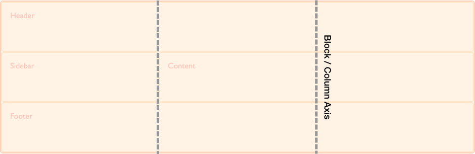

Если вы знакомы с [flexbox](/ru/docs/Web/CSS/CSS_Flexible_Box_Layout), вы уже столкнулись с тем, как гибкие элементы могут быть правильно выровнены внутри контейнера flex. Эти свойства выравнивания, которые мы впервые встретили в спецификации flexbox, были перенесены в новую спецификацию под названием [Box Alignment Level 3](https://drafts.csswg.org/css-align/). Эта спецификация содержит подробную информацию о том, как выравнивание должно работать во всех различных методах компоновки.

Каждый метод макета, который реализует выравнивание ящиков, будет иметь некоторые отличия из-за того, что каждый метод имеет разные функции и ограничения (и унаследованное поведение), что делает невозможным выравнивание точно таким же образом по всем направлениям. Спецификация Box Alignment содержит подробную информацию для каждого метода, однако вы были бы разочарованы, если бы попытались выполнить выравнивание по многим методам прямо сейчас, поскольку поддержка браузера ещё не существует. Там, где у нас есть поддержка браузера для свойств выравнивания и распределения пространства из спецификации Box Alignment, в grid макета.

В этом руководстве представлены демонстрации того, как работает выравнивание ячеек в макете. Вы увидите много общего в том, как эти свойства и ценности работают в flexbox. Из-за того, что сетка двумерна и однобочечна, существует несколько небольших различий, за которыми вы должны следить. Поэтому мы начнём с рассмотрения двух осей, с которыми мы сталкиваемся при выравнивании объектов в сетке.

## Две оси grid layout

При работе с раскладкой сетки у вас есть две оси для выравнивания объектов - _оси_ _блока или столбца_, _оси inline или строки_. Ось блока - это ось, на которой блоки выложены в макете блока. Если у вас есть два абзаца на вашей странице, они отображаются один под другим, поэтому в этом направлении мы описываем ось блока. В спецификации CSS Grid Layout она называется осью столбца, так как это ось, по которой выполняются наши дорожки столбцов.



_Внутренняя ось (inline axis)_ проходит по оси блока, это направление, в котором выполняется регулярный поток строк. В спецификации CSS Grid Layout его иногда называют осью строки, являющейся осью, по которой идут наши дорожки.


Мы можем выровнять содержимое внутри областей сетки и сетка отслеживает себя на этих двух осях.

## Выравнивание элементов на блоке или столбце по оси

Элементы управления {{cssxref ("align-self")}} и {{cssxref ("align-items")}} на оси блока. Когда мы используем эти свойства, мы меняем выравнивание элемента в области сетки, которую вы поместили.

В следующем примере у меня есть четыре области сетки внутри моей сетки. Я могу использовать свойство {{cssxref ("align-items")}} в контейнере сетки, чтобы выровнять элементы, используя одно из следующих значений:

- `auto`
- `normal`
- `start`
- `end`
- `center`
- `stretch`
- `baseline`
- `first baseline`
- `last baseline`

```css hidden
* {
  box-sizing: border-box;
}

.wrapper {
  border: 2px solid #f76707;
  border-radius: 5px;
  background-color: #fff4e6;
}

.wrapper > div {
  border: 2px solid #ffa94d;
  border-radius: 5px;
  background-color: #ffd8a8;
  padding: 1em;
  color: #d9480f;
}
```

```css
.wrapper {
  display: grid;
  grid-template-columns: repeat(8, 1fr);
  grid-gap: 10px;
  grid-auto-rows: 100px;
  grid-template-areas:
    "a a a a b b b b"
    "a a a a b b b b"
    "c c c c d d d d"
    "c c c c d d d d";
  align-items: start;
}
.item1 {
  grid-area: a;
}
.item2 {
  grid-area: b;
}
.item3 {
  grid-area: c;
}
.item4 {
  grid-area: d;
}
```

```html
<div class="wrapper">
  <div class="item1">Item 1</div>
  <div class="item2">Item 2</div>
  <div class="item3">Item 3</div>
  <div class="item4">Item 4</div>
</div>
```

{{ EmbedLiveSample('alignment_1', '500', '450') }}

Имейте в виду, что после установки `align-self: start` высота каждого дочернего `<div>` будет определяться содержимым `<div>`. Это противоречит полностью отсутствию выравнивания и в этом случае высота каждого `<div>` растягивается, чтобы заполнить его область сетки.

Свойство {{cssxref ("align-items")}} устанавливает свойство {{cssxref ("align-self")}} для всех дочерних элементов сетки. Это означает, что вы можете установить свойство индивидуально, используя `align-self` по элементу сетки.

В следующем примере я использую свойство `align-self`, чтобы продемонстрировать различные значения выравнивания. В первой области отображается поведение по умолчанию для выравнивания, которое должно растягиваться. Второй элемент имеет значение самоограничения `start`, третий `end` и четвёртый `center`.

```css hidden
* {
  box-sizing: border-box;
}

.wrapper {
  border: 2px solid #f76707;
  border-radius: 5px;
  background-color: #fff4e6;
}

.wrapper > div {
  border: 2px solid #ffa94d;
  border-radius: 5px;
  background-color: #ffd8a8;
  padding: 1em;
  color: #d9480f;
}
```

```css
.wrapper {
  display: grid;
  grid-template-columns: repeat(8, 1fr);
  grid-gap: 10px;
  grid-auto-rows: 100px;
  grid-template-areas:
    "a a a a b b b b"
    "a a a a b b b b"
    "c c c c d d d d"
    "c c c c d d d d";
}
.item1 {
  grid-area: a;
}
.item2 {
  grid-area: b;
  align-self: start;
}
.item3 {
  grid-area: c;
  align-self: end;
}
.item4 {
  grid-area: d;
  align-self: center;
}
```

```html
<div class="wrapper">
  <div class="item1">Item 1</div>
  <div class="item2">Item 2</div>
  <div class="item3">Item 3</div>
  <div class="item4">Item 4</div>
</div>
```

{{ EmbedLiveSample('alignment_2', '500', '450') }}

### Элементы с внутренним соотношением сторон

Спецификация указывает, что поведение по умолчанию в {{cssxref ("align-self")}} должно растягиваться, за исключением элементов, которые имеют внутреннее соотношение сторон, в этом случае они ведут себя как `start`. Причиной этого является то, что если элементы с соотношением сторон настроены на растяжение, это значение по умолчанию будет искажать их.

Это поведение было уточнено в спецификации, при этом браузеры ещё не реализовали правильное поведение. Пока это не произойдёт, вы можете убедиться, что элементы не растягиваются, например изображения, которые являются прямыми дочерними элементами сетки, путём установки {{cssxref ("align-self")}} и {{cssxref ("justify-self") }} `start`. Это будет имитировать правильное поведение после его реализации.

## Justifying Items on the Inline or Row Axis

Поскольку {{cssxref ("align-items")}} и {{cssxref ("align-self")}} обрабатывают выравнивание элементов на оси блока, {{cssxref ("justify-items")}} и {{cssxref ("justify-self")}} выполнить ту же работу на оси inline или row. Значения, которые вы можете выбрать, такие же, как для `align-self`.

- `auto`
- `normal`
- `start`
- `end`
- `center`
- `stretch`
- `baseline`
- `first baseline`
- `last baseline`

Вы можете увидеть тот же пример, что и для {{cssxref ("align-items")}} ниже. На этот раз мы применяем свойство {{cssxref ("justify-self")}}.

Опять же, значение по умолчанию `stretch`, за исключением элементов с внутренним соотношением сторон. Это означает, что по умолчанию элементы сетки будут покрывать их площадь сетки, если вы не измените её, установив выравнивание. Первый элемент в примере демонстрирует это выравнивание по умолчанию:

```css hidden
* {
  box-sizing: border-box;
}

.wrapper {
  border: 2px solid #f76707;
  border-radius: 5px;
  background-color: #fff4e6;
}

.wrapper > div {
  border: 2px solid #ffa94d;
  border-radius: 5px;
  background-color: #ffd8a8;
  padding: 1em;
  color: #d9480f;
}
```

```css
.wrapper {
  display: grid;
  grid-template-columns: repeat(8, 1fr);
  grid-gap: 10px;
  grid-auto-rows: 100px;
  grid-template-areas:
    "a a a a b b b b"
    "a a a a b b b b"
    "c c c c d d d d"
    "c c c c d d d d";
}
.item1 {
  grid-area: a;
}
.item2 {
  grid-area: b;
  justify-self: start;
}
.item3 {
  grid-area: c;
  justify-self: end;
}
.item4 {
  grid-area: d;
  justify-self: center;
}
```

```html
<div class="wrapper">
  <div class="item1">Item 1</div>
  <div class="item2">Item 2</div>
  <div class="item3">Item 3</div>
  <div class="item4">Item 4</div>
</div>
```

{{ EmbedLiveSample('alignment_3', '500', '450') }}

Как и {{cssxref ("align-self")}} и {{cssxref ("align-items")}}, вы можете применить {{cssxref ("justify-items")}} к контейнеру сетки, чтобы установить значение {{cssxref ("justify-self")}} для всех элементов.

Свойства {{cssxref ("justify-self")}} и {{cssxref ("justify-items")}} не реализованы в flexbox. Это связано с одномерным характером [flexbox](/ru/docs/Web/CSS/CSS_Flexible_Box_Layout) и может быть несколько элементов вдоль оси, что делает невозможным оправдание одного элемента. Чтобы выровнять элементы вдоль основной, встроенной оси в flexbox, вы используете свойство {{cssxref ("justify-content")}}.

## Center an item in the area

Объединив свойства align и justify, мы можем легко центрировать элемент внутри области сетки.

```css hidden
* {
  box-sizing: border-box;
}

.wrapper {
  border: 2px solid #f76707;
  border-radius: 5px;
  background-color: #fff4e6;
}

.wrapper > div {
  border: 2px solid #ffa94d;
  border-radius: 5px;
  background-color: #ffd8a8;
  padding: 1em;
  color: #d9480f;
}
```

```css
.wrapper {
  display: grid;
  grid-template-columns: repeat(4, 1fr);
  grid-gap: 10px;
  grid-auto-rows: 200px;
  grid-template-areas:
    ". a a ."
    ". a a .";
}
.item1 {
  grid-area: a;
  align-self: center;
  justify-self: center;
}
```

```html
<div class="wrapper">
  <div class="item1">Item 1</div>
</div>
```

{{ EmbedLiveSample('alignment_4', '500', '480') }}

## Aligning the grid tracks on the block, or column, axis

Если у вас есть ситуация, когда ваши дорожки сетки используют область, которая меньше, чем контейнер сетки, вы можете выровнять трассы сетки самостоятельно внутри контейнера. И снова это работает на блочной и встроенной осях с {{cssxref ("align-content")}} выравниванием дорожек на оси блока и {{cssxref ("justify-content")}}, выполняющим выравнивание по встроенной оси. Значения для {{cssxref ("align-content")}} и {{cssxref ("justify-content")}}:

- `normal`
- `start`
- `end`
- `center`
- `stretch`
- `space-around`
- `space-between`
- `space-evenly`
- `baseline`
- `first baseline`
- `last baseline`

В приведённом ниже примере у меня есть контейнер сетки размером 500 пикселей на 500 пикселей. Я определил 3 строки и столбцы, каждый из 100 пикселей с 10-пиксельным жёлобом. Это означает, что внутри контейнера сетки есть пространство как в блочном, так и в линейном направлениях.

Свойство `align-content` применяется к контейнеру сетки, поскольку оно работает на всей сетке. Поведение по умолчанию в макете сетки `start`, поэтому наши дорожки сетки находятся в верхнем левом углу сетки, выровнены по отношению к стартовым линиям сетки:

```css hidden
* {
  box-sizing: border-box;
}

.wrapper {
  border: 2px solid #f76707;
  border-radius: 5px;
  background-color: #fff4e6;
}

.wrapper > div {
  border: 2px solid #ffa94d;
  border-radius: 5px;
  background-color: #ffd8a8;
  padding: 1em;
  color: #d9480f;
}
```

```css
.wrapper {
  display: grid;
  grid-template-columns: repeat(3, 100px);
  grid-template-rows: repeat(3, 100px);
  height: 500px;
  width: 500px;
  grid-gap: 10px;
  grid-template-areas:
    "a a b"
    "a a b"
    "c d d";
}
.item1 {
  grid-area: a;
}
.item2 {
  grid-area: b;
}
.item3 {
  grid-area: c;
}
.item4 {
  grid-area: d;
}
```

```html
<div class="wrapper">
  <div class="item1">Item 1</div>
  <div class="item2">Item 2</div>
  <div class="item3">Item 3</div>
  <div class="item4">Item 4</div>
</div>
```

{{ EmbedLiveSample('alignment_5', '500', '520') }}

Если я добавлю `align-conten` в мой контейнер со значением `end`, все треки перейдут в конечную строку контейнера сетки в размерности блока:

```css hidden
* {
  box-sizing: border-box;
}

.wrapper {
  border: 2px solid #f76707;
  border-radius: 5px;
  background-color: #fff4e6;
}

.wrapper > div {
  border: 2px solid #ffa94d;
  border-radius: 5px;
  background-color: #ffd8a8;
  padding: 1em;
  color: #d9480f;
}
```

```css
.wrapper {
  display: grid;
  grid-template-columns: repeat(3, 100px);
  grid-template-rows: repeat(3, 100px);
  height: 500px;
  width: 500px;
  grid-gap: 10px;
  grid-template-areas:
    "a a b"
    "a a b"
    "c d d";
  align-content: end;
}
.item1 {
  grid-area: a;
}
.item2 {
  grid-area: b;
}
.item3 {
  grid-area: c;
}
.item4 {
  grid-area: d;
}
```

```html
<div class="wrapper">
  <div class="item1">Item 1</div>
  <div class="item2">Item 2</div>
  <div class="item3">Item 3</div>
  <div class="item4">Item 4</div>
</div>
```

{{ EmbedLiveSample('alignment_6', '500', '520') }}

Мы также можем использовать значения для этого свойства, которые могут быть знакомы с flexbox; значения пространственного распределения `space-between`, `space-around` и `space-evenly`. Если мы обновим {{cssxref ("align-content")}} до `space-between`, вы увидите как выглядят элементы на нашем пространстве grid:

```css hidden
* {
  box-sizing: border-box;
}

.wrapper {
  border: 2px solid #f76707;
  border-radius: 5px;
  background-color: #fff4e6;
}

.wrapper > div {
  border: 2px solid #ffa94d;
  border-radius: 5px;
  background-color: #ffd8a8;
  padding: 1em;
  color: #d9480f;
}
```

```css
.wrapper {
  display: grid;
  grid-template-columns: repeat(3, 100px);
  grid-template-rows: repeat(3, 100px);
  height: 500px;
  width: 500px;
  grid-gap: 10px;
  grid-template-areas:
    "a a b"
    "a a b"
    "c d d";
  align-content: space-between;
}
.item1 {
  grid-area: a;
}
.item2 {
  grid-area: b;
}
.item3 {
  grid-area: c;
}
.item4 {
  grid-area: d;
}
```

```html
<div class="wrapper">
  <div class="item1">Item 1</div>
  <div class="item2">Item 2</div>
  <div class="item3">Item 3</div>
  <div class="item4">Item 4</div>
</div>
```

{{ EmbedLiveSample('alignment_7', '500', '520') }}

Стоит отметить, что использование этих значений пространственного распределения может привести к увеличению элементов в вашей сетке. Если элемент охватывает более одной дорожки сетки, так как дополнительное пространство добавляется между дорожками, этот предмет должен стать большим, чтобы поглотить пространство. Мы всегда работаем в строгой сетке. Поэтому, если вы решите использовать эти значения, убедитесь, что содержимое ваших треков может справиться с дополнительным пространством или что вы использовали свойства выравнивания для элементов, чтобы заставить их перемещаться в начало, а не растягиваться.

В приведённом ниже изображении я поместил сетку с `align-content`, со значением `start` рядом с сеткой, когда значение `align-content` имеет значение `space-between`. Вы можете видеть, как элементы 1 и 2, которые охватывают два ряда дорожек, взяты на дополнительной высоте, поскольку они получают дополнительное пространство, добавленное к промежутку между этими двумя дорожками:


## Justifying the grid tracks on the row axis

На оси inline мы можем использовать {{cssxref ("justify-content")}} для выполнения того же типа выравнивания, что мы использовали {{cssxref ("align-content")}} для оси блока.

Используя тот же пример, я устанавливаю {{cssxref ("justify-content")}} `space-around`. Это снова вызывает дорожки, которые охватывают более одного столбца, чтобы получить дополнительное пространство:

```css hidden
* {
  box-sizing: border-box;
}

.wrapper {
  border: 2px solid #f76707;
  border-radius: 5px;
  background-color: #fff4e6;
}

.wrapper > div {
  border: 2px solid #ffa94d;
  border-radius: 5px;
  background-color: #ffd8a8;
  padding: 1em;
  color: #d9480f;
}
```

```css
.wrapper {
  display: grid;
  grid-template-columns: repeat(3, 100px);
  grid-template-rows: repeat(3, 100px);
  height: 500px;
  width: 500px;
  grid-gap: 10px;
  grid-template-areas:
    "a a b"
    "a a b"
    "c d d";
  align-content: space-between;
  justify-content: space-around;
}
.item1 {
  grid-area: a;
}
.item2 {
  grid-area: b;
}
.item3 {
  grid-area: c;
}
.item4 {
  grid-area: d;
}
```

```html
<div class="wrapper">
  <div class="item1">Item 1</div>
  <div class="item2">Item 2</div>
  <div class="item3">Item 3</div>
  <div class="item4">Item 4</div>
</div>
```

{{ EmbedLiveSample('alignment_8', '500', '500') }}

## Alignment and auto margins

Другой способ выравнивания элементов внутри их области - использовать автоматические поля. Если вы когда-либо центрировали ваш макет в окне просмотра, установив правое и левое поле блока контейнера в `auto`, вы знаете, что автоматическая маржа поглощает все доступное пространство. Установив маржу в `auto` с обеих сторон, она выдвигает блок в середину, так как оба поля пытаются взять все пространство.

В следующем примере я дал элементу 1 левое поле `auto`. Вы можете увидеть, как содержимое теперь переместится в правую часть области, поскольку автоматическая маржа занимает оставшееся пространство после того, как было назначено место для содержимого этого элемента:

```css hidden
* {
  box-sizing: border-box;
}

.wrapper {
  border: 2px solid #f76707;
  border-radius: 5px;
  background-color: #fff4e6;
}

.wrapper > div {
  border: 2px solid #ffa94d;
  border-radius: 5px;
  background-color: #ffd8a8;
  padding: 1em;
  color: #d9480f;
}
```

```css
.wrapper {
  display: grid;
  grid-template-columns: repeat(3, 100px);
  grid-template-rows: repeat(3, 100px);
  height: 500px;
  width: 500px;
  grid-gap: 10px;
  grid-template-areas:
    "a a b"
    "a a b"
    "c d d";
}
.item1 {
  grid-area: a;
  margin-left: auto;
}
.item2 {
  grid-area: b;
}
.item3 {
  grid-area: c;
}
.item4 {
  grid-area: d;
}
```

```html
<div class="wrapper">
  <div class="item1">Item 1</div>
  <div class="item2">Item 2</div>
  <div class="item3">Item 3</div>
  <div class="item4">Item 4</div>
</div>
```

{{ EmbedLiveSample('alignment_9', '500', '500') }}

Вы можете видеть, как элемент выравнивается с помощью [Firefox Grid Highlighter](/ru/docs/Tools/Page_Inspector/How_to/Examine_grid_layouts):


## Alignment and Writing Modes

Во всех этих примерах я работал на английском языке, который является языком слева направо. Это означает, что наши стартовые линии находятся сверху и слева от нашей сетки, когда мы думаем в физических направлениях.

CSS Grid Layout и спецификация Box Alignment предназначены для работы с режимами записи в CSS. Это означает, что если вы работаете с языком справа налево, например на арабском языке, начало сетки будет верхним и правым, поэтому значение по умолчанию для `justify-content: start` будет состоять в том, что треки сетки начинаются с правой стороны сетки.

Однако, если вы устанавливаете автоматические поля, используя `margin-right` или `margin-left`, или абсолютно позиционирующий элемент, используя `top`, `right`, `bottom` and `left` смещения, вы не будете соблюдать режимы записи. В следующем руководстве мы рассмотрим это взаимодействие между компоновкой сетки CSS, выравниванием ящиков и режимами записи. Это будет важно понимать, если вы разрабатываете сайты, которые затем отображаются на нескольких языках, или если вы хотите смешивать языки или режимы записи в дизайне.
