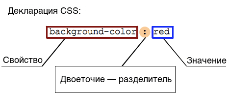

{{cssref}}Основная задача Каскадных Стилей — это рассказать движку браузера, как отрисовать элементы страницы — каким цветом, как позиционировать их на странице, как украшать, и так далее. Синтаксис CSS построен следуя этой идее, и состоит из следующих основных блоков:

- **Свойство** (_property_) — идентификатор действия, которое будет применено к элементу (например, цвет, или размер границы, и т.д.).
- **Значение** (_value_) — описывает, как именно _свойство_ будет обработано браузером. Каждое свойство имеет набор допустимых значений, определённых формальными правилами, а также семантический смысл, реализованный движком браузера.

## Объявления CSS

Задание CSS-свойствам определённых значений — это основная функция CSS. Пара свойство-значение называется _объявлением_. Работа CSS движка заключается в поиске соответствий между объявлениями стилей и элементом на странице, чтобы правильно отобразить и форматировать этот элемент.

И свойство, и значения регистрозависимы. Пара свойство-значение разделяется двоеточием, '`:`' (`U+003A COLON`), а пробелы до, между и после свойства или значения игнорируются.

В CSS существует более [ста различных свойств](/ru/docs/CSS/Reference), и бесконечное число допустимых значений. Не все пары свойств и значений допускаются, и каждое свойство определяет, каковы допустимые значения. Когда значение не подходит для данного свойства, объявление считается недействительной и целиком игнорируются CSS-движком.

## Блоки объявлений CSS

Объявления группируются в **блоки**, структура которых состоит из открывающейся , '`{`' (`U+007B LEFT CURLY BRACKET`), и закрывающейся, '`}`' (`U+007D RIGHT CURLY BRACKET`) фигурных скобок.

Такие блоки называются **блоками объявлений**, и объявления в них разделяются точкой с запятой, '`;`' (`U+003B SEMICOLON`). Блок объявлений может быть пустым, т.е. не содержать объявлений. Пробелы между объявлениями игнорируются. Последнее объявление блока не нуждается в точке с запятой, хотя считается хорошим тоном добавить её для того, чтобы не допустить упущение этого знака при добавлении другого объявления в будущем.

> **Примечание:** Содержимое блока объявлений CSS, т. е. объявления, разделённые точкой с запятой. Блок объявлений может быть помещён внутри атрибута style HTML-документа без фигурных скобок.

## CSS rulesets

If style sheets could only apply a declaration to each element of a Web page, they would be pretty useless. The real goal is to apply different declarations to different parts of the document.

CSS allows this by associating conditions with declarations blocks. Each (valid) declaration block is preceded by a _selector_ which is a condition selecting some elements of the page. The pair selector-declarations block is called a **ruleset**, or often simply a **rule**.

As an element of the page may be matched by several selectors, and therefore by several rules eventually containing a given property several times, with different values, the CSS standard defines which one has precedence over the other and must be applied: this is called the [cascade](/en/CSS/Getting_Started/Cascading_and_inheritance) algorithm.

> **Примечание:** It is important to note that even if a ruleset characterized by a group of selectors is a kind of shorthand replacing rulesets with a single selector each, this doesn't apply to the validity of the ruleset itself.
>
> This leads to an important consequence: if one single basic selector is invalid, like when using an unknown pseudo-element or pseudo-class, the whole _selector_ is invalid and therefor the entire rule is ignored (as invalid too).

## CSS statements

Rulesets are the main building blocks of a style sheet, which often consists of only a big list of them. But there is other information that a Web author wants to convey in the style sheet, like the character set, other external style sheets to import, font face or list counter descriptions and many more. It will use other and specific kinds of statements to do that.

A **statement** is a building block that begins with any non-space characters and ends at the first closing brace or semi-colon (outside a string, non-escaped and not included into another {}, () or \[] pair).

There are different kinds of statements:

- **Rulesets** (or _rules_) that, as seen, associate a collection of CSS declarations to a condition described by a selector.
- **At-rules** that start with an at sign, '`@`' (`U+0040 COMMERCIAL AT`), followed by an identifier and then continuing up the end of the statement, that is up to the next semi-colon (;) outside of a block, or the end of the next block. Each type of [at-rules](/en/CSS/At-rule), defined by the identifier, may have its own internal syntax, and semantics of course. They are used to convey meta-data information (like {{ cssxref("@charset") }} or {{ cssxref("@import") }}), conditional information (like {{ cssxref("@media") }} or {{ cssxref("@document") }}), or descriptive information (like {{ cssxref("@font-face") }}).

Any statement which isn't a rule or an at-rule is invalid and ignored.

There is another group of statements, the **nested statements**, these are statements that can be used in a specific subset of at-rules, the _conditional group rules_. These statements only apply if a specific condition is matched: the `@media` at-rule content is applied only if the device on which runs the browser matches the expressed condition; the `@document` at-rule content is applied only if the current page matches some conditions, and so on. In CSS1 and CSS2.1, only _rulesets_ could be used inside a conditional group rules. That was very restrictive and this restriction was lifted in [_CSS Conditionals Level 3_](/en/CSS/CSS3#Conditionals). Now, though it still is experimental and not supported by every browser, a conditional group rules can contain a wider range of content, rulesets but also some, but not all, at-rules.

## See also

- Ключевые концепции CSS
  - [Синтаксис CSS](/ru/docs/Web/CSS/Syntax)
  - [@-правила](/ru/docs/Web/CSS/At-rule)
  - [комментарии](/ru/docs/Web/CSS/Comments)
  - [специфичность](/ru/docs/Web/CSS/Specificity)
  - [наследование](/ru/docs/Web/CSS/inheritance)
  - [блочная модель](/ru/docs/Web/CSS/CSS_Box_Model/Introduction_to_the_CSS_box_model)
  - [режимы компоновки](/ru/docs/Web/CSS/Layout_mode)
  - [модели визуального форматирования](/ru/docs/Web/CSS/Visual_formatting_model)
  - [Схлопывание отступов](/ru/docs/Web/CSS/CSS_Box_Model/Mastering_margin_collapsing)
  - Значения
    - [начальные](/ru/docs/Web/CSS/initial_value)
    - [вычисленные](/ru/docs/Web/CSS/computed_value)
    - [используемые](/ru/docs/Web/CSS/used_value)
    - [действительные](/ru/docs/Web/CSS/actual_value)
  - [Синтаксис определения значений](/ru/docs/Web/CSS/Value_definition_syntax)
  - [Сокращённые свойства](/ru/docs/Web/CSS/Shorthand_properties)
  - [Замещаемые элементы](/ru/docs/Web/CSS/Replaced_element)
