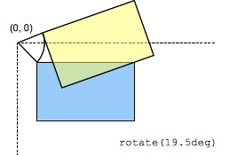

{{CSSRef}}

Функция CSS rotate () определяет преобразование, которое перемещает элемент вокруг неподвижной точки (как определено свойством {{Cssxref ("transform-origin")}}, не деформируя его. Количество движения определяется заданным углом; если положительно, движение будет по часовой стрелке, если оно отрицательное, оно будет против часовой стрелки. Вращение на 180 ° называется _точечным отражением_.



## Синтаксис

```
rotate(a)
```

## Значения

- _a_
  - : Является {{ cssxref("&lt;angle&gt;") }}, представляющим угол поворота. Положительный угол обозначает вращение по часовой стрелке, а отрицательный - против часовой стрелки.

<table class="standard-table">
  <thead>
    <tr>
      <th scope="col">Декартовы координаты на ℝ<sup>2</sup></th>
      <th scope="col">Однородные координаты на ℝℙ<sup>2</sup></th>
      <th scope="col">Декартовы координаты на ℝ<sup>3</sup></th>
      <th scope="col">Однородные координаты на ℝℙ<sup>3</sup></th>
    </tr>
  </thead>
  <tbody>
    <tr>
      <td colspan="1" rowspan="2">
        <math
          ><mfenced
            ><mtable
              ><mtr><mtd>cos(a)</mtd><mtd>-sin(a)</mtd></mtr>
              <mtr><mtd>sin(a)</mtd><mtd>cos(a)</mtd></mtr></mtable
            ></mfenced
          ></math
        >
      </td>
      <td>
        <math
          ><mfenced
            ><mtable
              ><mtr><mtd>cos(a)</mtd><mtd>-sin(a)</mtd><mtd>0</mtd></mtr
              ><mtr><mtd>sin(a)</mtd><mtd>cos(a)</mtd><mtd>0</mtd></mtr
              ><mtr><mtd>0</mtd><mtd>0</mtd><mtd>1</mtd></mtr></mtable
            ></mfenced
          ></math
        >
      </td>
      <td colspan="1" rowspan="2">
        <math
          ><mfenced
            ><mtable
              ><mtr><mtd>cos(a)</mtd><mtd>-sin(a)</mtd><mtd>0</mtd></mtr
              ><mtr><mtd>sin(a)</mtd><mtd>cos(a)</mtd><mtd>0</mtd></mtr
              ><mtr><mtd>0</mtd><mtd>0</mtd><mtd>1</mtd></mtr></mtable
            ></mfenced
          ></math
        >
      </td>
      <td colspan="1" rowspan="2">
        <math
          ><mfenced
            ><mtable
              ><mtr
                ><mtd>cos(a)</mtd><mtd>-sin(a)</mtd><mtd>0</mtd
                ><mtd>0</mtd></mtr
              ><mtr
                ><mtd>sin(a)</mtd><mtd>cos(a)</mtd><mtd>0</mtd><mtd>0</mtd></mtr
              ><mtr><mtd>0</mtd><mtd>0</mtd><mtd>1</mtd><mtd>0</mtd></mtr
              ><mtr
                ><mtd>0</mtd><mtd>0</mtd><mtd>0</mtd><mtd>1</mtd></mtr
              ></mtable
            ></mfenced
          ></math
        >
      </td>
    </tr>
    <tr>
      <td><code>[cos(a) sin(a) -sin(a) cos(a) 0 0]</code></td>
    </tr>
  </tbody>
</table>

## Примеры

### Базовый пример

#### HTML

```html
<div>Normal</div>
<div class="rotated">Rotated</div>
```

#### CSS

```css
div {
  width: 80px;
  height: 80px;
  background-color: skyblue;
}

.rotated {
  transform: rotate(45deg); /* Equal to rotateZ(45deg) */
  background-color: pink;
}
```

#### Result

{{EmbedLiveSample("Базовый_пример", "auto", 180)}}

### Объединение вращения с другим преобразованием

Если вы хотите применить к элементу несколько преобразований, будьте осторожны с порядком, в котором вы указываете свои преобразования. Например, если вы вращаете перед сдвигом, сдвиг произойдёт относительно новой оси вращения!

#### HTML

```html
<div>Normal</div>
<div class="rotate">Rotated</div>
<div class="rotate-translate">Rotated + Translated</div>
<div class="translate-rotate">Translated + Rotated</div>
```

#### CSS

```css
div {
  position: absolute;
  left: 40px;
  top: 40px;
  width: 100px;
  height: 100px;
  background-color: lightgray;
}

.rotate {
  background-color: transparent;
  outline: 2px dashed;
  transform: rotate(45deg);
}

.rotate-translate {
  background-color: pink;
  transform: rotate(45deg) translateX(180px);
}

.translate-rotate {
  background-color: gold;
  transform: translateX(180px) rotate(45deg);
}
```

#### Result

{{EmbedLiveSample("Объединение_вращения_с_другим_преобразованием", "auto", 320)}}

## Спецификации

{{Specifications}}

## Поддержка браузерами

{{Compat}}

## Смотрите также

- {{cssxref("transform")}}
- {{cssxref("transform-function")}}
- {{cssxref("transform-function/rotate3d", "rotate3d()")}}
