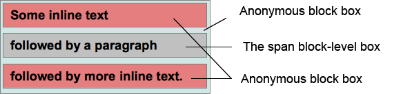

{{CSSRef}}

_Модель визуального форматирования_ CSS - это алгоритм, используемый для обработки документа и его визуального отображения. Это базовая концепция CSS. Модель визуального форматирования задаёт трансформацию каждого элемента в документе и создаёт ноль, одну или несколько боксов, согласно [боксовой модели CSS](/ru/docs/Web/CSS/box_model). Расположение (layout) каждого бокса определяется:

- размерами бокса: точно заданными или заданными ограничениями. Если размеры не заданы, это правило игнорируется;
- типом бокса: inline, inline-level, atomic inline-level, block box;
- [схемой позиционирования](/ru/docs/CSS/Box_positioning_scheme): normal flow, float или absolute;
- другими элементами дерева: дочерними и соседними;
- размерами и расположением окна просмотра ({{glossary("viewport")}});
- внутренними размерами содержащихся изображений;
- другой внешней информацией.

Бокс отображается относительно краёв _содержащего его блока._ Как правило, бокс определяет родительский блок для своих потомков. Однако, стоит заметить, что бокс не ограничен содержащим его блоком. Такое поведение слоёв, выходящих за пределы своих содержащих блоков, называется _переполнением_ (_overflow)._

## Генерация бокса

Генерация бокса - часть алгоритма модели визуального форматирования, процедура, генерирующая блоки из элементов. Различные типы боксов определяют различное поведение в контексте форматирования. Тип бокса зависит от свойства CSS {{ cssxref("display") }}.

### Блочные элементы и блок-боксы

Говорят, что элемент является блочным, когда вычисленное значение его CSS-свойства {{ cssxref("display") }} равно: `block`, `list-item`, или `table`. Блочный элемент визуально форматируется как блок (например, параграф), предназначенный для вертикальной компоновки (в столбик).

Каждый элемент блочного уровня участвует в [контексте блочного форматирования](/ru/docs/CSS/block_formatting_context). Каждый элемент блочного уровня генерирует как минимум один блок-бокс, названный _главным блок-боксом_. Некоторые элементы, например, такие как list-item, создают дополнительные боксы для хранения маркеров и других типографических элементов, содержащихся в list item. Большинство блочных элементов генерирует только один, главный блок-бокс.

Главный блок-бокс содержит сгенерированные боксы-потомки и сгенерированный контекст. Он так же будет боксом, участвующем в [схеме позиционирования](/ru/docs/CSS/Positioning_scheme).

Элемент блочного уровня так же может быть блоком-контейнером. Блок-контейнер - это блок, который содержит либо только другие элементы блочного уровня, либо создаёт [контекст инлайнового форматирования](/ru/docs/CSS/Inline_formatting_context) и, таким образом, содержит только инлайновые элементы.

Важно понимать, что понятие блочного элемента и понятие блочного контейнера - это разные вещи. Первое описывает, как блок будет себя вести по отношению к своему родителю и своим соседям/братьям. А второе - описывает, как блок будет взаимодействовать со своими потомками. Некоторые элементы блочного уровня, например, таблицы, не являются содержащими блоками. И наоборот, некоторые блоки-контейнеры, например, ячейки таблицы, не являются элементами блочного уровня.

Элементы блочного уровня, которые так же являются контейнерами, называются _блок-боксами_.

#### Анонимные блок-боксы

В некоторых случаях алгоритм визуального форматирования вынужден добавлять дополнительные боксы. Так как эти боксы невозможно как-то переименовать и к ним невозможно применить css-селекторы, поэтому эти боксы называют _анонимными_.

Из-за того, что к анонимным боксам невозможно применить селекторы, их невозможно изменить с помощью таблицы стилей. Это значит, что все наследуемые CSS-свойства для них будут иметь значение `inherit`, а все ненаследуемые свойства будут иметь значение `initial`.

Блоки-контейнеры содержат либо только инлайн-боксы, либо только элементы блочного уровня. Но, как правило, документ содержит и те и другие. В этом случае анонимные блок-боксы создаются вокруг примыкающих к ним инлайн-боксов.

### Пример

Возьмём следующий HTML код (со стилями по умолчанию, то есть элементы {{ HTMLElement("div") }} и {{ HTMLElement("p") }} имеют значение `display:block` :

```html
<div>
  Some inline text
  <p>followed by a paragraph</p>
  followed by more inline text.
</div>
```

Здесь создались два анонимных блока: один для текста перед параграфом (`Some inline text`), и второй для текста после параграфа (`followed by more inline text.`). И у нас получилась вот такая структура:


Выглядеть это будет так:

```html-nolint
Some inline text
followed by a paragraph
followed by more inline text.
```

В отличие от параграфа {{ HTMLElement("p") }}, Web разработчик не может напрямую контролировать стили этих двух анонимных боксов. Те свойства, которые наследуются, берут своё значение от элемента {{ HTMLElement("div") }}, например {{ cssxref("color") }}, определяющий цвет текста. А другие значения, ненаследуемые, устанавливаются в значение `initial`. Например, у них не будет своего свойства {{ cssxref("background-color") }}, он всегда будет в состоянии "прозрачный" (transparent), значении по умолчанию для этого свойства, и поэтому будет видно тот background, который установлен у элемента `<div>`. А вот для параграфа `<p>` можно установить своё свойство цвета фона. Таким образом, эти два анонимных бокса будут иметь один и тот же цвет текста.

Ещё один случай, который приводит к созданию анонимных блок-боксов, это случай, когда инлайн-бокс содержит один или несколько блок-боксов. В этом случае элемент, содержащий блок-боксы, делится на два инлайн-бокса - один перед, а второй после блок-бокса. И потом инлайн-элементы перед и после блок-бокса дополнительно заключаются в _анонимные блок-боксы_. Таким образом блок-бокс становится соседом для анонимных блок-боксов, содержащих инлайн-элементы.

Если есть несколько блок-боксов, идущих подряд, без инлайн-элементов между ними, то анонимные блок-боксы создаются только перед и после такого набора блок-боксов.

### Пример

Возьмём следующий HTML код, где установим для элемента {{ HTMLElement("p") }} значение `display:inline` и для элемента {{ HTMLElement("span") }} значение `display:block` :

```html
<p>
  Some <em>inline</em> text <span>followed by a paragraph</span> followed by
  more inline text.
</p>
```

Создадутся два анонимных блок-бокса, один для текста перед элементом span (`Some inline text`) и один для текста после него (`followed by more inline text`), и у нас получится вот такая структура:



Выглядеть она будет так:

```html
Some inline text followed by a paragraph followed by more inline text.
```

### Элементы инлайн-уровня и инлайн-боксы

Элементы, которые называются _элементами инлайн-уровня_ - это элементы, у которых вычисленное значение CSS-свойства {{ cssxref("display") }} установлено в : `inline`, `inline-block` или `inline-table`. Визуально они не представляют собой какие-то отдельные блоки, но они они располагаются в одну линию с другим контентом инлайн-уровня. Например, содержание параграфа, с различным форматированием, таким как подчёркивание или картинка, состоит из элементов инлайн-уровня.


> **Предупреждение:** Эта диаграмма использует устаревшую терминологию; см. примечания ниже. К тому же она некорректна, потому что жёлтый эллипс справа по определению должен быть изображён одинаковым по размеру с эллипсом слева или больше него (it could be a mathematical superset), потому что в спецификации сказано: "Элемент инлайн-уровня генерируют боксы инлайн-уровня, участвующие в форматировании инлайн-уровня", см. CSS 2.2, глава 9.2.2

Элементы инлайн-уровня создают _боксы инлайн-уровня_, которые определены как боксы, участвующие в [контексте форматирования инлайн-уровня](/ru/docs/CSS/Inline_formatting_context). _Inline boxes_ are both inline-level boxes and boxes, whose contents participate in their container's inline formatting context. This is the case, for example, for all non-replaced boxes with `display:inline`. Inline-level boxes, whose contents do not participate in an inline formatting context, are called _atomic inline-level boxes_. These boxes, generated by replaced inline-level elements or by elements with a calculated {{ cssxref("display") }} value of `inline-block` or `inline-table`, are never split into several boxes, as is possible with inline boxes.

> **Примечание:** Initially, atomic inline-level boxes were called atomic inline boxes. This was unfortunate, as they are **not** inline boxes. This was corrected in an erratum to the spec. Nevertheless, you can harmlessly read atomic inline-level box each time you meet atomic inline box in the literature, as this is only a name change.

> **Примечание:** Atomic inline boxes cannot be split into several lines in an inline formatting context.
>
> ```html
> <style>
>   span {
>     display: inline; /* default value*/
>   }
> </style>
> <div style="width:20em;">
>   The text in the span <span>can be split in several lines as it</span> is an
>   inline box.
> </div>
> ```

which leads to:

The text in the span can be split into several lines as it is an inline box.

```html
<style>
  span {
    display: inline-block;
  }
</style>
<div style="width:20em;">
  The text in the span <span>cannot be split in several lines as it</span> is an
  inline-block box.
</div>
```

> **Примечание:** which leads to:The text in the span cannot be split into several lines as it is an inline-block box.

#### Anonymous inline boxes

As for block boxes, there are a few cases where inline boxes are created automatically by the CSS engine. These inline boxes are also anonymous as they cannot be named by selectors; they inherit the value of all inheritable properties, setting it to `initial` for all others.

The most common case where an anonymous inline box is created, is when some text is found as a direct child of a block box creating an inline formatting context. In that case, this text is included in the largest possible anonymous inline box. Also, space content, which would be removed by the behavior set in the {{ cssxref("white-space") }} CSS property, does not generate anonymous inline boxes because they would end empty.

> **Примечание:** Example TBD

### Other types of boxes

#### Line boxes

_Line boxes_ are generated by the [inline formatting context](/ru/docs/CSS/Inline_formatting_context) to represent a line of text. Inside a block box, a line box extends from one border of the box to the other. When there are [floats](/ru/docs/CSS/float), the line box starts at the rightmost border of the left floats and ends at the leftmost border of the right floats.

These boxes are technical, and Web authors do not usually have to bother with them.

#### Run-in boxes

_Run-in boxes_, defined using `display:run-in`, are boxes that are either block boxes or inline boxes, depending on the type of the following box. They can be used to create a title that runs inside its first paragraph when possible.

> **Примечание:** Run-in boxes were removed from the CSS 2.1 standard, as they were insufficiently specified to allow for interoperable implementation. They may reappear in CSS3, but meanwhile, are considered _experimental_. They should not be used in production.

#### Model-induced boxes

Besides the inline and block formatting contexts, CSS specifies several additional _content models_ that may be applied to elements. These additional models, used to describe specific layouts, may define additional box types:

- The [table content model](/ru/docs/CSS/table-layout) may create a _table wrapper box_ and a _table box_, but also specific boxes like _caption boxes_.
- The [multi-column content model](/ru/docs/CSS/Using_CSS_multi-column_layouts) may create _column boxes_ between the container box and the content*.*
- The experimental grid, or flex-box content models, also create additional types of boxes.

#### Positioning schemes

Once boxes are generated, the CSS engine needs to position them on the layout. To do that, it uses one of the following algorithms:

- The _normal flow_ - positions each box one after the other.
- The _floats_ algorithm - extracts the box from the normal flow and put it to the side of the containing box.
- The _absolute positioning_ scheme - positions a box within an absolute coordinate system that is established by its containing element. An absolutely positioned element can cover other elements.

### Normal flow

In the _normal flow_, boxes are laid out one after the other. In a block formatting context, they are laid out vertically; in an inline formatting context, they are laid out horizontally. The normal flow is triggered when the CSS {{ cssxref("position") }} is set to the value `static` or `relative`, and if the CSS {{ cssxref("float") }} is set to the value `none`.

### Example

> **Примечание:** When in the normal flow, in a block formatting context, boxes are laid vertically one after the other out.
>
> When in the normal flow, in an inline formatting context, boxes are laid horizontally one after the other out.

> **Примечание:** There are two sub-cases of the normal flow: static positioning and relative positioning:
>
> - In _static positioning_, triggered by the value `static` of the {{ cssxref("position") }} property, the boxes are drawn at the exact position defined by the normal flow layout.
> - In _relative_ _positioning_, triggered by the value `relative` of the {{ cssxref("position") }} property, the boxes are drawn with an offset defined by the {{ cssxref("top") }}, {{ cssxref("bottom") }}, {{ cssxref("left") }} and {{ cssxref("right") }} CSS properties.

### Floats

In the _float positioning scheme_, specific boxes (called _floating boxes_ or simply _floats)_ are positioned at the beginning, or end of the current line. This leads to the property that text (and more generally anything within the normal flow) flows along the edge of the floating boxes, except if told differently by the {{ cssxref("clear") }} CSS property.

The float positioning scheme for a box is selected, by setting the {{ cssxref("float") }} CSS property on that box to a value different than `none` and {{ cssxref("position") }} to `static` or `relative`. If {{ cssxref("float") }} is set to `left`, the float is positioned at the beginning of the line box. If set to `right`, the float is positioned at the end of the line box. In either case, the line box is shrunk to fit alongside the float.

### Absolute positioning

In the _absolute positioning scheme_, boxes are entirely removed from the flow and don't interact with it at all. They are positioned relative to their [containing block](/ru/docs/Web/CSS/All_About_The_Containing_Block) using the {{ cssxref("top") }}, {{ cssxref("bottom") }}, {{ cssxref("left") }} and {{ cssxref("right") }} CSS properties.

An element is absolutely positioned if the {{ cssxref("position") }} is set to `absolute` or `fixed`.

With a _fixed positioned element_, the containing block is the viewport. The position of the element is absolute within the viewport. Scrolling does not change the position of the element.
