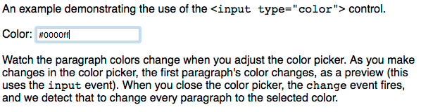
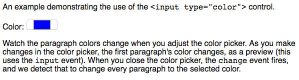

{{HTMLSidebar}}

{{HTMLElement("input")}} элементы типа **`color`** предоставляют элемент пользовательского интерфейса, который позволяет пользователю указать цвет либо с помощью визуального интерфейса выбора цвета, либо путём ввода цвета в текстовое поле в шестнадцатеричном формате #rrggbb. Разрешены только простые цвета (без альфа-канала), хотя CSS colors имеет больше форматов, например названия цветов, функциональные обозначения и шестнадцатеричный формат с альфа-каналом.

Представление элемента может существенно отличаться от одного браузера и/или платформы к другой — это может быть простой текстовый ввод, который автоматически проверяет правильность ввода информации о цвете в соответствующем формате, или стандартный для платформы выбор цвета, или какое-то пользовательское окно выбора цвета.

{{EmbedInteractiveExample("pages/tabbed/input-color.html", "tabbed-standard")}}

| **[Value](#value)**               | 7-значная {{domxref("DOMString")}} , указывающая {{cssxref("&lt;color&gt;")}} в строчной шестнадцатеричной системе счисления |
| --------------------------------- | ---------------------------------------------------------------------------------------------------------------------------- |
| **События**                       | {{domxref("HTMLElement/change_event", "change")}} и {{domxref("HTMLElement/input_event", "input")}}                          |
| **Поддерживаемые общие атрибуты** | [`autocomplete`](/ru/docs/Web/HTML/Element/input#autocomplete) и [`list`](/ru/docs/Web/HTML/Element/input#list)              |
| **IDL атрибуты**                  | `list` и `value`                                                                                                             |
| **Методы**                        | {{domxref("HTMLInputElement.select", "select()")}}                                                                           |

## Value

[`value`](/ru/docs/Web/HTML/Element/input#value) элемента {{HTMLElement ("input")}} типа `color` всегда является {{domxref ("DOMString")}}, который содержит 7-символьную строку, задающую цвет RGB в шестнадцатеричном формате. Хотя вы можете ввести цвет в верхнем или нижнем регистре, он будет сохранён в виде нижнего регистра. Value никогда не бывает в какой-либо другой форме и никогда не бывает пустым.

> **Примечание:** установка значения на всё, что не является допустимым, полностью непрозрачным цветом RGB в шестнадцатеричной системе счисления, приведёт к тому, что значение будет установлено на #000000. В частности, вы не можете использовать стандартные имена цветов CSS или любой синтаксис функций CSS для установки значения. Это имеет смысл, если иметь в виду, что HTML и CSS-это отдельные языки и спецификации. Кроме того, цвета с альфа-каналом не поддерживаются; указание цвета в 9-символьной шестнадцатеричной системе счисления (например, #009900aa) также приведёт к тому, что цвет будет установлен на #000000.

## Использование настроек цвета

Входные данные типа `color` просты из-за ограниченного числа атрибутов, которые они поддерживают.

### Предоставление цвета по умолчанию

Вы можете обновить простой пример выше, чтобы установить значение по умолчанию, так что цветовая заливка будет предварительно заполнена цветом по умолчанию, и палитра цветов (если таковая имеется) также будет по умолчанию использовать этот цвет:

```html
<input type="color" value="#ff0000" />
```

{{EmbedLiveSample("Предоставление_цвета_по_умолчанию", 700, 30)}}

Если вы не зададите значение, то по умолчанию будет `#000000`, то есть чёрный цвет. Значение должно быть в семизначной шестнадцатеричной системе счисления, то есть символ"#", за которым следуют две цифры, каждая из которых представляет красный, зелёный и синий цвета, например: #rrggbb. Если у вас есть цвета в любом другом формате (например, имена цветов CSS или цветовые функции CSS, такие как rgb () или rgba ()), вам придётся преобразовать их в шестнадцатеричные перед установкой значения.

### Отслеживание изменений цвета

Как и в случае с другими типами {{HTMLElement("input")}}, есть два события, которые могут быть использованы для обнаружения изменения цвета значения: {{domxref("HTMLElement/input_event", "input")}} и {{domxref("HTMLElement/change_event", "change")}}. `input` запускается на элементе `<input>` каждый раз, когда меняется цвет. `change` событие запускается, когда пользователь отклоняет средство выбора цвета. В обоих случаях вы можете определить новое значение элемента, посмотрев на его {{domxref("HTMLInputElement.value", "value")}}.

Вот пример, который наблюдает за изменениями со временем значения цвета:

```js
colorPicker.addEventListener("input", updateFirst, false);
colorPicker.addEventListener("change", watchColorPicker, false);

function watchColorPicker(event) {
  document.querySelectorAll("p").forEach(function (p) {
    p.style.color = event.target.value;
  });
}
```

### Выбор значения

Если реализация элемента {{HTMLElement("input")}} типа `color` в браузере пользователя не поддерживается правильно, а вместо этого является текстовым полем для непосредственного ввода строки цвета, вы можете использовать {{domxref("HTMLInputElement.select", " select ()")}} метод выбора текста, находящегося в данный момент в поле редактирования. Если браузер вместо этого верно использует `color`, select () ничего не делает. Вы должны знать об этом, чтобы ваш код мог адекватно реагировать в любом случае.

```js
colorWell.select();
```

### Вариации внешнего вида

Как уже упоминалось ранее, когда браузер не поддерживает интерфейс выбора цвета, его реализация цветовых входов будет представлять собой текстовое поле, которое автоматически проверяет содержимое, чтобы убедиться, что значение находится в правильном формате. Например, в Safari 10.1 вы увидите что-то похожее на это:

То же самое можно увидеть и в Firefox 55:

В этом случае при нажатии на цветовой колодец отображается палитра цветов платформы, из которой вы можете выбрать нужный цвет (в данном случае это палитра macOS):


## Validation

Значение цветового ввода считается недопустимым, если {{Glossary("user agent")}} не может преобразовать пользовательский ввод в семизначную строчную шестнадцатеричную нотацию. В этом случае к элементу применяется псевдокласс {{cssxref(":invalid")}}.

## Пример

Давайте создадим пример, который делает немного больше с цветом входного сигнала путём отслеживания {{domxref("HTMLElement/change_event", "change")}} и {{domxref("HTMLElement/input_event", "input")}} событий, чтобы взять новый цвет и применить его к каждому {{HTMLElement("Р")}} элемента в документе.

### HTML

HTML довольно прост — пара абзацев описательного материала с {{HTMLElement ("input")}} типа `color` с идентификатором `colorWell`, который мы будем использовать для изменения цвета текста абзацев.

```html
<p>
  An example demonstrating the use of the
  <code>&lt;input type="color"&gt;</code> control.
</p>

<label for="colorWell">Color:</label>
<input type="color" value="#ff0000" id="colorWell" />

<p>
  Watch the paragraph colors change when you adjust the color picker. As you
  make changes in the color picker, the first paragraph's color changes, as a
  preview (this uses the <code>input</code> event). When you close the color
  picker, the <code>change</code> event fires, and we detect that to change
  every paragraph to the selected color.
</p>
```

### JavaScript

Во-первых, есть некоторые настройки. Здесь мы объявляем некоторые переменные. Объявляя переменную, содержащую цвет, который мы установим, когда загрузим страницу, а затем устанавливаем обработчик {{domxref("Window/load_event", "load")}} для выполнения основной работы запуска, как только страница будет полностью загружена.

```js
var colorWell;
var defaultColor = "#0000ff";

window.addEventListener("load", startup, false);
```

#### Инициализация

Как только страница загружена, вызывается наш обработчик событий загрузки `startup()`:

```js
function startup() {
  colorWell = document.querySelector("#colorWell");
  colorWell.value = defaultColor;
  colorWell.addEventListener("input", updateFirst, false);
  colorWell.addEventListener("change", updateAll, false);
  colorWell.select();
}
```

Это возвращает ссылку на элемент color **`<input>`** в переменной `colorWell`, а затем устанавливает значение входного цвета в значение `defaultColor`. То цвет входное {{domxref("HTMLElement/input_event", "input")}} событие настроено, чтобы вызвать `updateFirst()` функцию и {{domxref("HTMLElement/change_event", "change")}} событие, вызывается `updateAll()`. Они оба видны ниже.

Наконец, мы вызываем {{domxref ("HTMLInputElement.select", " select ()")}} для выбора текстового содержимого цветового ввода, если элемент управления реализован в виде текстового поля (это не имеет никакого эффекта, если вместо него предусмотрен интерфейс выбора цвета).

#### Реакция на изменение цвета

Мы предоставляем две функции, которые имеют дело с изменением цвета. Функция `updateFirst()` вызывается в ответ на `input` событие. Он изменяет цвет первого элемента абзаца в документе, чтобы соответствовать новому значению входного цвета. Поскольку `input` события запускаются каждый раз, когда производится корректировка значения (например, если яркость цвета увеличивается), они будут происходить повторно при использовании средства выбора цвета.

```js
function updateFirst(event) {
  var p = document.querySelector("p");

  if (p) {
    p.style.color = event.target.value;
  }
}
```

Когда средство выбора цвета закрывается, указывая, что значение больше не будет меняться (если пользователь повторно не откроет средство выбора цвета), в элемент отправляется событие `change`. Мы обрабатываем это событие с помощью функции `updateAll()`, используя {{domxref("HTMLInputElement.value", "Event.target.value")}} для получения окончательного выбранного цвета:

```js
function updateAll(event) {
  document.querySelectorAll("p").forEach(function (p) {
    p.style.color = event.target.value;
  });
}
```

Это устанавливает цвет каждого элемента {{HTMLElement("p")}} таким образом, чтобы его атрибут {{cssxref("color")}} соответствовал текущему значению входного цвета, на которое ссылаются с помощью {{domxref("Event.target", "event.target")}}.

### Результат

Финальный результат выглядит так:

{{EmbedLiveSample("Пример", 700, 200)}}

## Спецификации

{{Specifications}}

## Браузерная совместимость

{{Compat}}

## Изучите также

- [Compatibility of CSS properties](/ru/docs/Learn/HTML/Forms/Property_compatibility_table_for_form_widgets)
