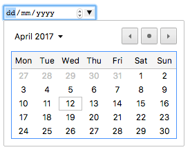
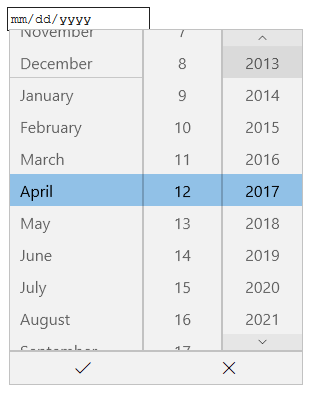
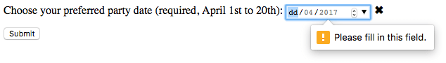

{{HTMLSidebar}}

Элементы {{htmlelement("input")}} типа **`date`** создают поля ввода и позволяют пользователю ввести дату, либо использовать _text box_ для автоматической проверки контента или использовать специальный интерфейс _date picker_. Возвращаемое значение включает год, месяц, день, но _не_ время. Используйте поля ввода {{HTMLElement("input/time", "time")}} или {{HTMLElement("input/datetime-local", "datetime-local")}}, чтобы вводить время или дату+время соответственно.

Отображение **`date`** различается в зависимости от браузера, кроме того не все браузеры поддерживают **`date`**. Подробнее см. [Browser compatibility](#browser_compatibility). В неподдерживаемых браузерах элемент будет отображаться как обычный [`<input type="text">`](/ru/docs/Web/HTML/Element/input/text).

{{EmbedInteractiveExample("pages/tabbed/input-date.html", "tabbed-standard")}}

Среди браузеров со своим интерфейсом для выбора даты, есть интерфейс браузеров Chrome и Opera, который выглядит так:



В Edge он выглядит так:



А в Firefox выглядит так:


| [Value](#value)             | Возвращает {{domxref("DOMString")}}, с датой в формате **гггг-мм-дд**, **или **пустую строку\*\*                                                                                                                           |
| --------------------------- | -------------------------------------------------------------------------------------------------------------------------------------------------------------------------------------------------------------------------- |
| **События**                 | {{event("change")}} и {{event("input")}}                                                                                                                                                                                   |
| **Поддерживаемые атрибуты** | [`autocomplete`](/ru/docs/Web/HTML/Element/input#autocomplete), [`list`](/ru/docs/Web/HTML/Element/input#list), [`readonly`](/ru/docs/Web/HTML/Element/input#readonly), and [`step`](/ru/docs/Web/HTML/Element/input#step) |
| **IDL attributes**          | `list`, `value`, `valueAsDate`, `valueAsNumber`.                                                                                                                                                                           |
| **Методы**                  | {{domxref("HTMLInputElement.select", "select()")}}, {{domxref("HTMLInputElement.stepDown", "stepDown()")}}, {{domxref("HTMLInputElement.stepUp", "stepUp()")}}                                                             |

## Значение

Возвращает {{domxref("DOMString")}}, представляющий значение даты введённой в input. Вы можете установить значение по умолчанию для элемента с помощью добавления атрибута в [`value`](/ru/docs/Web/HTML/Element/input#value), например:

```html
<input id="date" type="date" value="2017-06-01" />
```

{{EmbedLiveSample('Значение', 600, 40)}}

> **Примечание:** Помните, что отображаемый формат даты отличается от настоящего значения `value` – отображаемый формат даты будет выбран, _базируясь на региональных параметрах браузера пользователя_, тогда как значение `value` всегда имеет формат `гггг-мм-дд`.

Вы также можете получить или установить значение даты в JavaScript с помощью свойств {{domxref("HTMLInputElement.value", "value")}} и {{domxref("HTMLInputElement.valueAsNumber", "valueAsNumber")}} элемента input. Например:

```js
var dateControl = document.querySelector('input[type="date"]');
dateControl.value = "2017-06-01";
console.log(dateControl.value); // prints "2017-06-01"
console.log(dateControl.valueAsNumber); // prints 1496275200000, a JavaScript timestamp (ms)
```

Этот код выбирает первый элемент {{HTMLElement("input")}}, `type` которого `date` и устанавливает значение даты в `2017-06-01` (1 Июня 2017). Затем он считывает это значение обратно в строковом и числовом форматах.

## Дополнительные атрибуты

В дополнение к общим атрибутам для всех элементов {{HTMLElement("input")}}, у `"date"` есть следующие дополнительные атрибуты:

| Атрибут         | Описание                                                                                         |
| --------------- | ------------------------------------------------------------------------------------------------ |
| [`max`](#max)   | Максимально возможная дата для установки                                                         |
| [`min`](#min)   | Минимально возможная дата для установки                                                          |
| [`step`](#step) | Шаг (в днях), с которым будет изменяться дата при нажатии кнопок вниз или вверх данного элемента |

### {{htmlattrdef("max")}}

Максимально возможная дата для установки. Если [`value`](/ru/docs/Web/HTML/Element/input#value) является более поздней датой, чем дата, указанная в атрибуте [`max`](#max), элемент отобразит ошибку при помощи [constraint validation](/ru/docs/Web/Guide/HTML/HTML5/Constraint_validation). Если в атрибуте `max` указано значение, не удовлетворяющее формату `yyyy-MM-dd`, значит элемент не будет иметь максимальной даты.

В атрибуте `max` должна быть указана строка с датой, которая больше или равна дате, указанной в атрибуте `min`.

### {{htmlattrdef("min")}}

Минимально возможная дата для установки. Если [`value`](/ru/docs/Web/HTML/Element/input#value) является более ранней датой, чем дата, указанная в атрибуте [`min`](#min), элемент отобразит ошибку при помощи [constraint validation](/ru/docs/Web/Guide/HTML/HTML5/Constraint_validation). Если в атрибуте `min` указано значение, не удовлетворяющее формату `yyyy-MM-dd`, значит элемент не будет иметь минимальной даты.

В атрибуте `min` должна быть указана строка с датой, которая меньше или равна дате, указанной в атрибуте `max`.

### {{htmlattrdef("step")}}

{{page("/ru/docs/Web/HTML/Element/input/number", "step-include")}}

Для полей ввода `date` значение `step` задаётся в днях; и является количеством миллисекунд, равное 86 400 000 умножить на значение `step` (получаемое числовое значение хранится в миллисекундах). Стандартное значение `step` равно 1, что означает 1 день.

> **Примечание:** Для полей ввода `date` указание для `step` значения `any` даёт такой же эффект, что и значение `1`.

## Использование полей ввода c типом date

На первый взгляд, элемент `<input type="date">` выглядит заманчиво — он предоставляет лёгкий графический интерфейс для выбора даты, нормализует формат даты, отправляемой на сервер независимо от локальных настроек пользователя. Тем не менее, есть проблемы с `<input type="date">` в связи с ограниченной поддержкой браузеров.

В этом разделе мы посмотрим на простые, а затем и более сложные способы использования `<input type="date">`, и позже дадим советы по уменьшению влияния поддержки браузерами (смотрите [Handling browser support](#handling_browser_support)).

> **Примечание:** Надеемся, со временем поддержка браузерами станет повсеместной, и эта проблема исчезнет.

### Как использовать date?

Самый простой способ использовать `<input type="date">` - это использовать его с элементами `<input>` и label, как показано ниже:

```html
<form>
  <div>
    <label for="bday">Введите дату вашего рождения:</label>
    <input type="date" id="bday" name="bday" />
  </div>
</form>
```

{{EmbedLiveSample('Как_использовать_date', 600, 40)}}

### Установка максимальной и минимальной даты

Вы можете использовать атрибуты [`min`](/ru/docs/Web/HTML/Element/input#min) и [`max`](/ru/docs/Web/HTML/Element/input#max), чтобы ограничить дату, которую может выбрать пользователь. В следующем примере мы устанавливаем минимальную дату `2017-04-01` и максимальную дату `2017-04-30`. Пользователь сможет выбрать дату только из этого диапазона:

```html
<form>
  <div>
    <label for="party">Укажите предпочтительную дату события:</label>
    <input
      type="date"
      id="party"
      name="party"
      min="2017-04-01"
      max="2017-04-30" />
  </div>
</form>
```

{{EmbedLiveSample('Установка_максимальной_и_минимальной_даты', 600, 40)}}

В результате выполнения кода, пользователь сможет выбрать любой день апреля 2017 года, но не сможет выбрать и даже просмотреть дни других месяцев и годов, в том числе через виджет _date picker_.

> **Примечание:** вы _должны_ уметь использовать атрибут [`step`](/ru/docs/Web/HTML/Element/input#step), чтобы менять количество дней, на которое будет происходить шаг при изменении даты (например, чтобы сделать выбираемыми только субботы). Однако, не похоже, что это где-то применялось на данный момент.

### Controlling input size

`<input type="date">` doesn't support form sizing attributes such as [`size`](/ru/docs/Web/HTML/Element/input#size). You'll have to resort to [CSS](/ru/docs/Web/CSS) for sizing needs.

## Validation

By default, `<input type="date">` does not apply any validation to entered values. The UI implementations generally don't let you enter anything that isn't a date — which is helpful — but you can still leave the field empty or (in browsers where the input falls back to type `text`) enter an invalid date (e.g. the 32nd of April).

If you use [`min`](/ru/docs/Web/HTML/Element/input#min) and [`max`](/ru/docs/Web/HTML/Element/input#max) to restrict the available dates (see [Setting maximum and minimum dates](#setting_maximum_and_minimum_dates)), supporting browsers will display an error if you try to submit a date that is outside the set bounds. However, you'll have to check the results to be sure the value is within these dates, since they're only enforced if the date picker is fully supported on the user's device.

In addition, you can use the [`required`](/ru/docs/Web/HTML/Element/input#required) attribute to make filling in the date mandatory — again, an error will be displayed if you try to submit an empty date field. This, at least, should work in most browsers.

Let's look at an example — here we've set minimum and maximum dates, and also made the field required:

```html
<form>
  <div>
    <label for="party"
      >Choose your preferred party date (required, April 1st to 20th):</label
    >
    <input
      type="date"
      id="party"
      name="party"
      min="2017-04-01"
      max="2017-04-20"
      required />
    <span class="validity"></span>
  </div>
  <div>
    <input type="submit" />
  </div>
</form>
```

If you try to submit the form with an incomplete date (or with a date outside the set bounds), the browser displays an error. Try playing with the example now:

{{ EmbedLiveSample('Validation', 600, 100) }}

Here's a screenshot for those of you who aren't using a supporting browser:



Here's the CSS used in the above example. Here we make use of the {{cssxref(":valid")}} and {{cssxref(":invalid")}} CSS properties to style the input based on whether or not the current value is valid. We had to put the icons on a {{htmlelement("span")}} next to the input, not on the input itself, because in Chrome the generated content is placed inside the form control, and can't be styled or shown effectively.

```css
div {
  margin-bottom: 10px;
  display: flex;
  align-items: center;
}

label {
  display: inline-block;
  width: 300px;
}

input:invalid + span:after {
  content: "✖";
  padding-left: 5px;
}

input:valid + span:after {
  content: "✓";
  padding-left: 5px;
}
```

> **Предупреждение:** **Important**: HTML form validation is _not_ a substitute for scripts that ensure that the entered data is in the proper format. It's far too easy for someone to make adjustments to the HTML that allow them to bypass the validation, or to remove it entirely. It's also possible for someone to simply bypass your HTML entirely and submit the data directly to your server. If your server-side code fails to validate the data it receives, disaster could strike when improperly-formatted data is submitted (or data which is too large, is of the wrong type, and so forth).

## Handling browser support

As mentioned above, the major problem with using date inputs at the time of writing is [browser support](#browser_compatibility). As an example, the date picker on Firefox for Android looks like this:


Non-supporting browsers gracefully degrade to a text input, but this creates problems both in terms of consistency of user interface (the presented control will be different), and data handling.

The second problem is the more serious of the two; as we mentioned earlier, with a date input, the actual value is always normalized to the format `yyyy-mm-dd`. With a text input on the other hand, by default the browser has no recognition of what format the date should be in, and there are lots of different ways in which people write dates, for example:

- `ddmmyyyy`
- `dd/mm/yyyy`
- `mm/dd/yyyy`
- `dd-mm-yyyy`
- `mm-dd-yyyy`
- `Month dd yyyy`

One way around this is to put a [`pattern`](/ru/docs/Web/HTML/Element/input#pattern) attribute on your date input. Even though the date input doesn't use it, the text input fallback will. For example, try viewing the following example in a non-supporting browser:

```html
<form>
  <div>
    <label for="bday">Enter your birthday:</label>
    <input
      type="date"
      id="bday"
      name="bday"
      required
      pattern="[0-9]{4}-[0-9]{2}-[0-9]{2}" />
    <span class="validity"></span>
  </div>
  <div>
    <input type="submit" />
  </div>
</form>
```

{{ EmbedLiveSample('Handling_browser_support', 600, 100) }}

If you try submitting it, you'll see that the browser now displays an error message (and highlights the input as invalid) if your entry doesn't match the pattern `nnnn-nn-nn`, where `n` is a number from 0 to 9. Of course, this doesn't stop people from entering invalid dates, or incorrectly formatted dates, such as `yyyy-dd-mm` (whereas we want `yyyy-mm-dd`). So we still have a problem.

```css hidden
div {
  margin-bottom: 10px;
}

input:invalid + span {
  position: relative;
}

input:invalid + span:after {
  content: "✖";
  position: absolute;
  right: -18px;
}

input:valid + span {
  position: relative;
}

input:valid + span:after {
  content: "✓";
  position: absolute;
  right: -18px;
}
```

The best way to deal with dates in forms in a cross-browser way at the moment is to get the user to enter the day, month, and year in separate controls ({{htmlelement("select")}} elements being popular; see below for an implementation), or to use a JavaScript library such as [jQuery date picker](https://jqueryui.com/datepicker/).

## Examples

In this example we create two sets of UI elements for choosing dates: a native `<input type="date">` picker and a set of three {{htmlelement("select")}} elements for choosing dates in older browsers that don't support the native input.

{{ EmbedLiveSample('Examples', 600, 100) }}

### HTML

The HTML looks like so:

```html
<form>
  <div class="nativeDatePicker">
    <label for="bday">Enter your birthday:</label>
    <input type="date" id="bday" name="bday" />
    <span class="validity"></span>
  </div>
  <p class="fallbackLabel">Enter your birthday:</p>
  <div class="fallbackDatePicker">
    <span>
      <label for="day">Day:</label>
      <select id="day" name="day"></select>
    </span>
    <span>
      <label for="month">Month:</label>
      <select id="month" name="month">
        <option selected>January</option>
        <option>February</option>
        <option>March</option>
        <option>April</option>
        <option>May</option>
        <option>June</option>
        <option>July</option>
        <option>August</option>
        <option>September</option>
        <option>October</option>
        <option>November</option>
        <option>December</option>
      </select>
    </span>
    <span>
      <label for="year">Year:</label>
      <select id="year" name="year"></select>
    </span>
  </div>
</form>
```

The months are hardcoded (as they are always the same), while the day and year values are dynamically generated depending on the currently selected month and year, and the current year (see the code comments below for detailed explanations of how these functions work.)

```css hidden
input:invalid + span:after {
  content: "✖";
  padding-left: 5px;
}

input:valid + span:after {
  content: "✓";
  padding-left: 5px;
}
```

### JavaScript

The other part of the code that may be of interest is the feature detection code — to detect whether the browser supports `<input type="date">`, we create a new {{htmlelement("input")}} element, set its `type` to `date`, then immediately check what its type is set to — non-supporting browsers will return `text`, because the `date` type falls back to type `text`. If `<input type="date">` is not supported, we hide the native picker and show the fallback picker UI ({{htmlelement("select")}}) instead.

```js
// define variables
var nativePicker = document.querySelector(".nativeDatePicker");
var fallbackPicker = document.querySelector(".fallbackDatePicker");
var fallbackLabel = document.querySelector(".fallbackLabel");

var yearSelect = document.querySelector("#year");
var monthSelect = document.querySelector("#month");
var daySelect = document.querySelector("#day");

// hide fallback initially
fallbackPicker.style.display = "none";
fallbackLabel.style.display = "none";

// test whether a new date input falls back to a text input or not
var test = document.createElement("input");
test.type = "date";

// if it does, run the code inside the if() {} block
if (test.type === "text") {
  // hide the native picker and show the fallback
  nativePicker.style.display = "none";
  fallbackPicker.style.display = "block";
  fallbackLabel.style.display = "block";

  // populate the days and years dynamically
  // (the months are always the same, therefore hardcoded)
  populateDays(monthSelect.value);
  populateYears();
}

function populateDays(month) {
  // delete the current set of <option> elements out of the
  // day <select>, ready for the next set to be injected
  while (daySelect.firstChild) {
    daySelect.removeChild(daySelect.firstChild);
  }

  // Create variable to hold new number of days to inject
  var dayNum;

  // 31 or 30 days?
  if (
    month === "January" ||
    month === "March" ||
    month === "May" ||
    month === "July" ||
    month === "August" ||
    month === "October" ||
    month === "December"
  ) {
    dayNum = 31;
  } else if (
    month === "April" ||
    month === "June" ||
    month === "September" ||
    month === "November"
  ) {
    dayNum = 30;
  } else {
    // If month is February, calculate whether it is a leap year or not
    var year = yearSelect.value;
    var leap = (year % 4 === 0 && year % 100 !== 0) || year % 400 === 0;
    dayNum = leap ? 29 : 28;
  }

  // inject the right number of new <option> elements into the day <select>
  for (i = 1; i <= dayNum; i++) {
    var option = document.createElement("option");
    option.textContent = i;
    daySelect.appendChild(option);
  }

  // if previous day has already been set, set daySelect's value
  // to that day, to avoid the day jumping back to 1 when you
  // change the year
  if (previousDay) {
    daySelect.value = previousDay;

    // If the previous day was set to a high number, say 31, and then
    // you chose a month with less total days in it (e.g. February),
    // this part of the code ensures that the highest day available
    // is selected, rather than showing a blank daySelect
    if (daySelect.value === "") {
      daySelect.value = previousDay - 1;
    }

    if (daySelect.value === "") {
      daySelect.value = previousDay - 2;
    }

    if (daySelect.value === "") {
      daySelect.value = previousDay - 3;
    }
  }
}

function populateYears() {
  // get this year as a number
  var date = new Date();
  var year = date.getFullYear();

  // Make this year, and the 100 years before it available in the year <select>
  for (var i = 0; i <= 100; i++) {
    var option = document.createElement("option");
    option.textContent = year - i;
    yearSelect.appendChild(option);
  }
}

// when the month or year <select> values are changed, rerun populateDays()
// in case the change affected the number of available days
yearSelect.onchange = function () {
  populateDays(monthSelect.value);
};

monthSelect.onchange = function () {
  populateDays(monthSelect.value);
};

//preserve day selection
var previousDay;

// update what day has been set to previously
// see end of populateDays() for usage
daySelect.onchange = function () {
  previousDay = daySelect.value;
};
```

> **Примечание:** Remember that some years have 53 weeks in them (see [Weeks per year](https://en.wikipedia.org/wiki/ISO_week_date#Weeks_per_year))! You'll need to take this into consideration when developing production apps.

## Specifications

| Specification                                                                                 | Status                   | Comments |
| --------------------------------------------------------------------------------------------- | ------------------------ | -------- |
| {{SpecName('HTML WHATWG', 'forms.html#date-state-(type=date)', '&lt;input type="date"&gt;')}} | {{Spec2('HTML WHATWG')}} |          |
| {{SpecName('HTML5 W3C', 'forms.html#date-state-(type=date)', '&lt;input type="date"&gt;')}}   | {{Spec2('HTML5 W3C')}}   |          |

## Browser compatibility

{{Compat}}

## See also

- The generic {{HTMLElement("input")}} element and the interface used to manipulate it, {{domxref("HTMLInputElement")}}
- [Date and Time picker tutorial](/ru/docs/Web/Guide/HTML/Forms/The_native_form_widgets#Date_and_time_picker)
