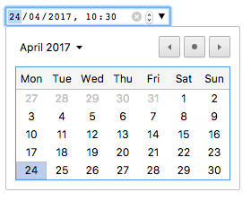
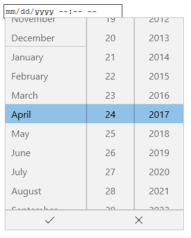
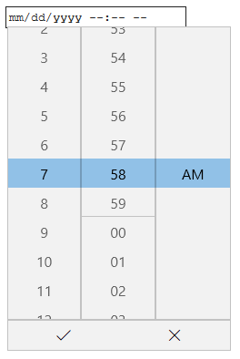
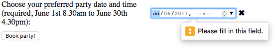
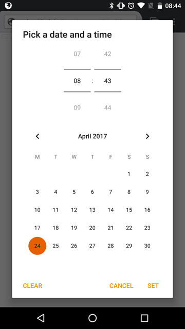

{{HTMLSidebar}}

{{htmlelement("input")}} элемент типа **`datetime-local`** создаёт поля ввода, позволяющие легко ввести дату и время — год, месяц, день, часы и минуты.

Интерфейс управления варьируется от браузера к браузеру, на данный момент поддержка носит фрагментарный характер, только с Chrome/Opera и EDGE на рабочем столе — и большинство современных мобильных версиях браузера — наличие полезной реализации. В других браузерах элемент управления сводиться до простого [`<input type="text">`](/ru/docs/Web/HTML/Element/input/text).

```html
<input id="datetime" type="datetime-local" />
```

{{EmbedInteractiveExample("pages/tabbed/input-datetime-local.html", "tabbed-shorter")}}

Для тех из вас, кто не использует поддерживающий браузер, Chrome/Opera datetime-local control выглядит как скриншот ниже. Нажатие на стрелку вниз с правой стороны приводит к выбору даты, чтобы вы могли выбрать дату; вы должны ввести время вручную.



В Edge `datetime-local` элемент управления выглядит как на скриншоте ниже. Клик на дате и времени отобразит два отдельных поля выбора, чтобы вы могли легко установить дату и время. То есть, по сути, получаем два элемента `date` и `time`, объединённых в один:





| **[Value](#value)**             | A {{domxref("DOMString")}} representing a date and time, or empty.                                                                                                                                                          |
| ------------------------------- | --------------------------------------------------------------------------------------------------------------------------------------------------------------------------------------------------------------------------- |
| **события**                     | {{event("change")}} и {{event("input")}}.                                                                                                                                                                                   |
| **Supported Common Attributes** | [`autocomplete`](/ru/docs/Web/HTML/Element/input#autocomplete), [`list`](/ru/docs/Web/HTML/Element/input#list), [`readonly`](/ru/docs/Web/HTML/Element/input#readonly), and [`step`](/ru/docs/Web/HTML/Element/input#step). |
| **IDL attributes**              | `list`, `value`, `valueAsNumber`.                                                                                                                                                                                           |
| **методы**                      | {{domxref("HTMLInputElement.select", "select()")}}, {{domxref("HTMLInputElement.stepDown", "stepDown()")}}, {{domxref("HTMLInputElement.stepUp", "stepUp()")}}.                                                             |

## Значение

{{domxref("DOMString")}} представление значения даты, введённой во входные данные. Вы можете установить значение по умолчанию для ввода, включая дату внутри [`value`](/ru/docs/Web/HTML/Element/input#value) атрибута, как:

```html
<label for="party">Enter a date and time for your party booking:</label>
<input
  id="party"
  type="datetime-local"
  name="partydate"
  value="2017-06-01T08:30" />
```

{{ EmbedLiveSample('Значение', 600, 60) }}

Одна вещь, чтобы отметить, что отображаемый формат даты отличается от фактического `значения` — отображаемый формат даты будет выбран на основе установленного языкового стандарта операционной системы пользователя, в то время как дата `значение` всегда форматируется `yyyy-MM-ddThh:mm`. Когда значение передаётся на сервер, например, это будет выглядеть `partydate=2017-06-01T08:30`.

> **Примечание:** также имейте в виду, что если такие данные поступают через http-запрос Get, двоеточие нужно экранировать для включения в параметры URL, например `partydate=2017-06-01T08%3A30`.

Вы также можете получить и установить значение даты в JavaScript, используя {{domxref("HTMLInputElement.value")}} свойство, например:

```js
var dateControl = document.querySelector('input[type="datetime-local"]');
dateControl.value = "2017-06-01T08:30";
```

## Использование локальных входных данных datetime

Ввод даты и времени выглядит удобно на первый взгляд — он обеспечивает простой пользовательский интерфейс для выбора даты и времени, и они нормализуют формат данных, отправляемых на сервер, независимо от локали пользователя. Тем не менее, есть проблемы с `<input type="datetime-local">` из-за ограниченной поддержки браузера.

Мы рассмотрим основные и более сложные способы использования `<input type="datetime-local">`, затем предложим советы по устранению проблемы поддержки браузера позже (see [Handling browser support](#handling_browser_support)).

### Базовое использование локальных полей ввода datetime

Самое простои использование `<input type="datetime-local">` включает комбинацию базового `<input>` и {{htmlelement("label")}} элемента, как в примере ниже:

```html
<form>
  <label for="party">Enter a date and time for your party booking:</label>
  <input id="party" type="datetime-local" name="partydate" />
</form>
```

{{ EmbedLiveSample('Базовое_использование_локальных_полей_ввода_datetime', 600, 40) }}

### Установка максимума и минимума даты и времени

Вы можете использовать [`min`](/ru/docs/Web/HTML/Element/input#min) и [`max`](/ru/docs/Web/HTML/Element/input#max) атрибуты чтобы ограничить дату/время, которое может выбрать пользователь. В примере ниже мы устанавливает минимальные дату и время в `2017-06-01T08:30` и максимальные в `2017-06-30T16:30`:

```html
<form>
  <label for="party">Enter a date and time for your party booking:</label>
  <input
    id="party"
    type="datetime-local"
    name="partydate"
    min="2017-06-01T08:30"
    max="2017-06-30T16:30" />
</form>
```

{{ EmbedLiveSample('Установка_максимума_и_минимума_даты_и_времени', 600, 40) }}

Как результат:

- Могут быть выбраны только дни из Июня 2017 — только дни, которые входят в заданный диапазон дат доступны для выбора, и в виджете нельзя увидеть даты, не принадлежащие Июню.
- В зависимости от того, какой браузер вы используете, вы можете заметить, что время вне заданного диапазона не доступно к выбору (e.g. Edge), или доступно к выбору(e.g. Chrome) но невалидно (see [Validation](#validation)).

> **Примечание:** Существует возможность использовать [`step`](/ru/docs/Web/HTML/Element/input#step) атрибут для того, чтобы установить количество дней, которые будут пропущены каждый раз, когда дата увеличивается (например, если вы хотите сделать доступными для выбора только Субботы). Однако, на момент написание этой статьи это нет эффективной реализации этой функции.

### Controlling input size

`<input type="datetime-local">` doesn't support form sizing attributes such as [`size`](/ru/docs/Web/HTML/Element/input#size). You'll have to resort to [CSS](/ru/docs/Web/CSS) for sizing needs.

### Setting timezones

One thing the `datetime-local` input type doesn't provide is a way to set the timezone/locale of the datetime. This was available in the [`datetime`](/ru/docs/Web/HTML/Element/input/datetime) input type, but this type is now obsolete, having been removed from the spec. The main reasons why this was removed are a lack of implementation in browsers, and concerns over the user interface/experience. It is easier to just have a control (or controls) for setting the date/time and then deal with the locale in a separate control.

For example, if you are creating a system where the user is likely to already be logged in, with their locale already set, you could provide the timezone in a [`hidden`](/ru/docs/Web/HTML/Element/input/hidden) input type. For example:

```html
<input type="hidden" id="timezone" name="timezone" value="-08:00" />
```

On the other hand, if you were required to allow the user to enter a timezone along with a datetime entry, you could provide a means of inputting a timezone, such as a {{htmlelement("select")}} element:

```html
<select name="timezone_offset" id="timezone-offset" class="span5">
  <option value="-12:00">(GMT -12:00) Eniwetok, Kwajalein</option>
  <option value="-11:00">(GMT -11:00) Midway Island, Samoa</option>
  <option value="-10:00">(GMT -10:00) Hawaii</option>
  <option value="-09:50">(GMT -9:30) Taiohae</option>
  <option value="-09:00">(GMT -9:00) Alaska</option>
  <option value="-08:00">(GMT -8:00) Pacific Time (US &amp; Canada)</option>

  ...
</select>
```

In either case, the timedate and timezone values would be submitted to the server as separate data points, and then you'd need to store them appropriately in the database on the server-side.

> **Примечание:** The above code snippet is taken from [All world timezones in an HTML select element](https://gist.github.com/nodesocket/3919205).

## Validation

By default, `<input type="datetime-local">` does not apply any validation to entered values. The UI implementations generally don't let you enter anything that isn't a datetime — which is helpful — but you can still fill in no value and submit, or enter an invalid datetime (e.g. the 32th of April).

You can use [`min`](/ru/docs/Web/HTML/Element/input#min) and [`max`](/ru/docs/Web/HTML/Element/input#max) to restrict the available dates (see anch("Setting maximum and minimum dates")), and in addition use the [`required`](/ru/docs/Web/HTML/Element/input#required) attribute to make filling in the date mandatory. As a result, supporting browsers will display an error if you try to submit a date that is outside the set bounds, or an empty date field.

Let's look at an example — here we've set minimum and maximum datetimes, and also made the field required:

```html
<form>
  <div>
    <label for="party"
      >Choose your preferred party date and time (required, June 1st 8.30am to
      June 30th 4.30pm):</label
    >
    <input
      id="party"
      type="datetime-local"
      name="partydate"
      min="2017-06-01T08:30"
      max="2017-06-30T16:30"
      required />
    <span class="validity"></span>
  </div>
  <div>
    <input type="submit" value="Book party!" />
  </div>
</form>
```

If you try to submit the form with an incomplete date (or with a date outside the set bounds), the browser displays an error. Try playing with the example now:

{{ EmbedLiveSample('Validation', 600, 120) }}

Here's'a screenshot for those of you who aren't using a supporting browser:



Here's the CSS used in the above example. Here we make use of the {{cssxref(":valid")}} and {{cssxref(":invalid")}} CSS properties to style the input based on whether or not the current value is valid. We had to put the icons on a {{htmlelement("span")}} next to the input, not on the input itself, because in Chrome the generated content is placed inside the form control, and can't be styled or shown effectively.

```css
div {
  margin-bottom: 10px;
  display: flex;
  align-items: center;
}

label {
  display: inline-block;
  width: 300px;
}

input:invalid + span:after {
  content: "✖";
  padding-left: 5px;
}

input:valid + span:after {
  content: "✓";
  padding-left: 5px;
}
```

> **Предупреждение:** **Important**: HTML form validation is _not_ a substitute for scripts that ensure that the entered data is in the proper format. It's far too easy for someone to make adjustments to the HTML that allow them to bypass the validation, or to remove it entirely. It's also possible for someone to simply bypass your HTML entirely and submit the data directly to your server. If your server-side code fails to validate the data it receives, disaster could strike when improperly-formatted data is submitted (or data which is too large, is of the wrong type, and so forth).

## Handling browser support

As mentioned above, the major problem with using date inputs at the time of writing is browser support — only Chrome/Opera and Edge support it on desktop, and most modern browsers on mobile. As an example, the `datetime-local` picker on Firefox for Android looks like this:



Non-supporting browsers gracefully degrade to a text input, but this creates problems both in terms of consistency of user interface (the presented control will be different), and data handling.

The second problem is the most serious — as we mentioned earlier, with a `datetime-local` input the actual value is always normalized to the format `yyyy-mm-ddThh:mm`. With a text input on the other hand, by default the browser has no recognition of what format the date should be in, and there are lots of different ways in which people write dates and times, for example:

- `ddmmyyyy`
- `dd/mm/yyyy`
- `mm/dd/yyyy`
- `dd-mm-yyyy`
- `mm-dd-yyyy`
- `mm-dd-yyyy hh:mm` (12 hour clock)
- `mm-dd-yyyy hh:mm` (24 hour clock)
- etc.

One way around this is to put a [`pattern`](/ru/docs/Web/HTML/Element/input#pattern) attribute on your `datetime-local` input. Even though the `datetime-local` input doesn't use it, the text input fallback will. For example, try viewing the following demo in a non-supporting browser:

```html
<form>
  <div>
    <label for="party"
      >Choose your preferred party date and time (required, June 1st 8.30am to
      June 30th 4.30pm):</label
    >
    <input
      id="party"
      type="datetime-local"
      name="partydate"
      min="2017-06-01T08:30"
      max="2017-06-30T16:30"
      pattern="[0-9]{4}-[0-9]{2}-[0-9]{2}T[0-9]{2}:[0-9]{2}"
      required />
    <span class="validity"></span>
  </div>
  <div>
    <input type="submit" value="Book party!" />
  </div>
  <input type="hidden" id="timezone" name="timezone" value="-08:00" />
</form>
```

{{ EmbedLiveSample('Handling_browser_support', 600, 100) }}

If you try submitting it, you'll see that the browser now displays an error message (and highlights the input as invalid) if your entry doesn't match the pattern `nnnn-nn-nnTnn:nn`, where `n` is a number from 0 to 9. Of course, this doesn't stop people from entering invalid dates, or incorrectly formatted dates and times.

And what user is going to understand the pattern they need to enter the time and date in?

We still have a problem.

```css hidden
div {
  margin-bottom: 10px;
}

input:invalid + span {
  position: relative;
}

input:invalid + span:after {
  content: "✖";
  position: absolute;
  right: -18px;
}

input:valid + span {
  position: relative;
}

input:valid + span:after {
  content: "✓";
  position: absolute;
  right: -18px;
}
```

The best way to deal with dates in forms in a cross-browser way at the moment is to get the user to enter the day, month, year, and time in separate controls ({{htmlelement("select")}} elements being popular — see below for an implementation), or use JavaScript libraries such as [jQuery date picker](https://jqueryui.com/datepicker/), and the [jQuery timepicker plugin](http://timepicker.co/).

## Examples

In this example we create two sets of UI elements for choosing datetimes — a native `<input type="datetime-local">` picker, and a set of five {{htmlelement("select")}} elements for choosing dates and times in older browsers that don't support the native input.

{{ EmbedLiveSample('Examples', 600, 140) }}

The HTML looks like so:

```html
<form>
  <div class="nativeDateTimePicker">
    <label for="party">Choose a date and time for your party:</label>
    <input type="datetime-local" id="party" name="bday" />
    <span class="validity"></span>
  </div>
  <p class="fallbackLabel">Choose a date and time for your party:</p>
  <div class="fallbackDateTimePicker">
    <div>
      <span>
        <label for="day">Day:</label>
        <select id="day" name="day"></select>
      </span>
      <span>
        <label for="month">Month:</label>
        <select id="month" name="month">
          <option selected>January</option>
          <option>February</option>
          <option>March</option>
          <option>April</option>
          <option>May</option>
          <option>June</option>
          <option>July</option>
          <option>August</option>
          <option>September</option>
          <option>October</option>
          <option>November</option>
          <option>December</option>
        </select>
      </span>
      <span>
        <label for="year">Year:</label>
        <select id="year" name="year"></select>
      </span>
    </div>
    <div>
      <span>
        <label for="hour">Hour:</label>
        <select id="hour" name="hour"></select>
      </span>
      <span>
        <label for="minute">Minute:</label>
        <select id="minute" name="minute"></select>
      </span>
    </div>
  </div>
</form>
```

The months are hardcoded (as they are always the same), while the day and year values are dynamically generated depending on the currently selected month and year, and the current year respectively (see the code comments below for detailed explanations of how these functions work.) We also decided to dynamically generate the hours and months, as there are so many of them!

```css hidden
div {
  margin-bottom: 10px;
  position: relative;
}

input[type="number"] {
  width: 100px;
}

input + span {
  padding-right: 30px;
}

input:invalid + span:after {
  position: absolute;
  content: "✖";
  padding-left: 5px;
}

input:valid + span:after {
  position: absolute;
  content: "✓";
  padding-left: 5px;
}
```

The other part of the code that may be of interest is the feature detection code — to detect whether the browser supports `<input type="date">`, we create a new {{htmlelement("input")}} element, set its `type` to `date`, then immediately check what its type is set to — non-supporting browsers will return `text`, because the `date` type falls back to type `text`. If `<input type="date">` is not supported, we hide the native picker and show the fallback picker UI ({{htmlelement("select")}}) instead.

```js
// define variables
var nativePicker = document.querySelector(".nativeDateTimePicker");
var fallbackPicker = document.querySelector(".fallbackDateTimePicker");
var fallbackLabel = document.querySelector(".fallbackLabel");

var yearSelect = document.querySelector("#year");
var monthSelect = document.querySelector("#month");
var daySelect = document.querySelector("#day");
var hourSelect = document.querySelector("#hour");
var minuteSelect = document.querySelector("#minute");

// hide fallback initially
fallbackPicker.style.display = "none";
fallbackLabel.style.display = "none";

// test whether a new date input falls back to a text input or not
var test = document.createElement("input");
test.type = "date";
// if it does, run the code inside the if() {} block
if (test.type === "text") {
  // hide the native picker and show the fallback
  nativePicker.style.display = "none";
  fallbackPicker.style.display = "block";
  fallbackLabel.style.display = "block";

  // populate the days and years dynamically
  // (the months are always the same, therefore hardcoded)
  populateDays(monthSelect.value);
  populateYears();
  populateHours();
  populateMinutes();
}

function populateDays(month) {
  // delete the current set of <option> elements out of the
  // day <select>, ready for the next set to be injected
  while (daySelect.firstChild) {
    daySelect.removeChild(daySelect.firstChild);
  }

  // Create variable to hold new number of days to inject
  var dayNum;

  // 31 or 30 days?
  if (
    (month === "January") |
    (month === "March") |
    (month === "May") |
    (month === "July") |
    (month === "August") |
    (month === "October") |
    (month === "December")
  ) {
    dayNum = 31;
  } else if (
    (month === "April") |
    (month === "June") |
    (month === "September") |
    (month === "November")
  ) {
    dayNum = 30;
  } else {
    // If month is February, calculate whether it is a leap year or not
    var year = yearSelect.value;
    (year - 2016) % 4 === 0 ? (dayNum = 29) : (dayNum = 28);
  }

  // inject the right number of new <option> elements into the day <select>
  for (i = 1; i <= dayNum; i++) {
    var option = document.createElement("option");
    option.textContent = i;
    daySelect.appendChild(option);
  }

  // if previous day has already been set, set daySelect's value
  // to that day, to avoid the day jumping back to 1 when you
  // change the year
  if (previousDay) {
    daySelect.value = previousDay;

    // If the previous day was set to a high number, say 31, and then
    // you chose a month with less total days in it (e.g. February),
    // this part of the code ensures that the highest day available
    // is selected, rather than showing a blank daySelect
    if (daySelect.value === "") {
      daySelect.value = previousDay - 1;
    }

    if (daySelect.value === "") {
      daySelect.value = previousDay - 2;
    }

    if (daySelect.value === "") {
      daySelect.value = previousDay - 3;
    }
  }
}

function populateYears() {
  // get this year as a number
  var date = new Date();
  var year = date.getFullYear();

  // Make this year, and the 100 years before it available in the year <select>
  for (var i = 0; i <= 100; i++) {
    var option = document.createElement("option");
    option.textContent = year - i;
    yearSelect.appendChild(option);
  }
}

function populateHours() {
  // populate the hours <select> with the 24 hours of the day
  for (var i = 0; i <= 23; i++) {
    var option = document.createElement("option");
    option.textContent = i < 10 ? "0" + i : i;
    hourSelect.appendChild(option);
  }
}

function populateMinutes() {
  // populate the minutes <select> with the 60 hours of each minute
  for (var i = 0; i <= 59; i++) {
    var option = document.createElement("option");
    option.textContent = i < 10 ? "0" + i : i;
    minuteSelect.appendChild(option);
  }
}

// when the month or year <select> values are changed, rerun populateDays()
// in case the change affected the number of available days
yearSelect.onchange = function () {
  populateDays(monthSelect.value);
};

monthSelect.onchange = function () {
  populateDays(monthSelect.value);
};

//preserve day selection
var previousDay;

// update what day has been set to previously
// see end of populateDays() for usage
daySelect.onchange = function () {
  previousDay = daySelect.value;
};
```

## Specifications

| Specification                                                                                                                    | Status                   | Comments |
| -------------------------------------------------------------------------------------------------------------------------------- | ------------------------ | -------- |
| {{SpecName('HTML WHATWG', 'forms.html#local-date-and-time-state-(type=datetime-local)', '&lt;input type="datetime-local"&gt;')}} | {{Spec2('HTML WHATWG')}} |          |
| {{SpecName('HTML5 W3C', 'forms.html##local-date-and-time-state-(type=datetime-local)', '&lt;input type="datetime-local"&gt;')}}  | {{Spec2('HTML5 W3C')}}   |          |

## Browser compatibility

{{Compat}}

## See also

- The generic {{HTMLElement("input")}} element and the interface used to manipulate it, {{domxref("HTMLInputElement")}}
- [Date and Time picker tutorial](/ru/docs/Web/Guide/HTML/Forms/The_native_form_widgets#Date_and_time_picker)
