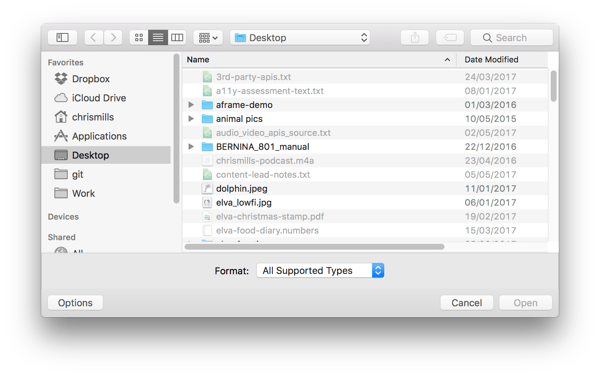

{{HTMLSidebar}}

{{HTMLElement("input")}} элемент с атрибутом **`type="file"`** позволяет пользователю выбрать один файл или более из файлового хранилища своего устройства. После выбора эти файлы могут быть загружены на сервер при помощи [формы](/ru/docs/Learn/HTML/Forms), или обработаны JavaScript и [File API](/ru/docs/Using_files_from_web_applications).

```html
<input name="myFile" type="file" />
```

{{EmbedLiveSample('file-example', 650, 40)}}

| **[Value](#value)**         | {{domxref("DOMString")}} представляет собой путь до выбранного файла.                                                                                              |
| --------------------------- | ------------------------------------------------------------------------------------------------------------------------------------------------------------------ |
| **Действия**                | {{event("change")}} и{{event("input")}}                                                                                                                            |
| **Поддерживаемые атрибуты** | [`accept`](/ru/docs/Web/HTML/Element/input#accept), [`multiple`](/ru/docs/Web/HTML/Element/input#multiple), [`required`](/ru/docs/Web/HTML/Element/input#required) |
| **IDL атрибуты**            | `files` and `value`                                                                                                                                                |
| **Методы**                  | {{domxref("HTMLInputElement.select", "select()")}}                                                                                                                 |

## Value

Атрибут [`value`](/ru/docs/Web/HTML/Element/input#value) элемента input содержит {{domxref("DOMString")}}, который представляет путь к выбранным файлам. Если пользователь выбрал несколько файлов, `value` представляет первый файл из списка. Остальные файлы можно определить используя {{domxref("HTMLInputElement.files")}} свойство элемента input.

> **Примечание:**1. Если выбрано несколько файлов, строка представляет собой первый выбранный файл. JavaScript предоставляет доступ к остальным файлам через свойство [`FileList`](</ru/docs/Using_files_from_web_applications#Getting_information_about_selected_file(s)>). 2. Если не выбрано ни одного файла, .строка равна `""` (пустая). 3. Строка [начинается с `C:\fakepath\`](https://html.spec.whatwg.org/multipage/input.html#fakepath-srsly), для предотвращения определения файловой структуры пользователя вредоносным ПО.

## Additional attributes

In addition to the common attributes shared by all {{HTMLElement("input")}} elements, inputs of type `file` also support:

- `files`
  - : A {{domxref("FileList")}} object that lists every selected file. This list has no more than one member unless the [`multiple`](/ru/docs/Web/HTML/Element/input#multiple) attribute is specified.

## Using file inputs

### A basic example

```html
<form method="post" enctype="multipart/form-data">
  <div>
    <label for="file">Choose file to upload</label>
    <input type="file" id="file" name="file" multiple />
  </div>
  <div>
    <button>Submit</button>
  </div>
</form>
```

```css hidden
div {
  margin-bottom: 10px;
}
```

This produces the following output:

{{EmbedLiveSample('A_basic_example', 650, 60)}}

> **Примечание:** You can find this example on GitHub too — see the [source code](https://github.com/mdn/learning-area/blob/master/html/forms/file-examples/simple-file.html), and also [see it running live](https://mdn.github.io/learning-area/html/forms/file-examples/simple-file.html).

Regardless of the user's device or operating system, the file input provides a button that opens up a file picker dialog that allows the user to choose a file.

Including the [`multiple`](/ru/docs/Web/HTML/Element/input#multiple) attribute, as shown above, specifies that multiple files can be chosen at once. The user can choose multiple files from the file picker in any way that their chosen platform allows (e.g. by holding down <kbd>Shift</kbd> or <kbd>Control</kbd>, and then clicking). If you only want the user to choose a single file per `<input>`, omit the `multiple` attribute.

When the form is submitted, each selected file's name will be added to URL parameters in the following fashion: `?file=file1.txt&file=file2.txt`

### Getting information on selected files

The selected files' are returned by the element's {{domxref("HTMLElement.files", "files")}} property, which is a {{domxref("FileList")}} object containing a list of {{domxref("File")}} objects. The `FileList` behaves like an array, so you can check its `length` property to get the number of selected files.

Each `File` object contains the following information:

- `name`
  - : The file's name.
- `lastModified`
  - : A number specifying the date and time at which the file was last modified, in milliseconds since the UNIX epoch (January 1, 1970 at midnight).
- `lastModifiedDate` {{deprecated_inline}}
  - : A {{jsxref("Date")}} object representing the date and time at which the file was last modified. _This is deprecated and should not be used. Use `lastModified` instead._
- `size`
  - : The size of the file in bytes.
- `type`
  - : The file's [MIME type](/ru/docs/Web/HTTP/Basics_of_HTTP/MIME_types).
- webkitRelativePath {{non-standard_inline}}
  - : A string specifying the file's path relative to the base directory selected in a directory picker (that is, a `file` picker in which the [`webkitdirectory`](/ru/docs/Web/HTML/Element/input#webkitdirectory) attribute is set). _This is non-standard and should be used with caution._

> **Примечание:** You can set as well as get the value of `HTMLInputElement.files` in all modern browsers; this was most recently added to Firefox, in version 57 (see {{bug(1384030)}}).

### Limiting accepted file types

Often you won't want the user to be able to pick any arbitrary type of file; instead, you often want them to select files of a specific type or types. For example, if your file input lets users upload a profile picture, you probably want them to select web-compatible image formats, such as [JPEG](/ru/docs/Glossary/jpeg) or [PNG](/ru/docs/Glossary/PNG).

Acceptable file types can be specified with the [`accept`](/ru/docs/Web/HTML/Element/input#accept) attribute, which takes a comma-separated list of allowed file extensions or MIME types. Some examples:

- `accept="image/png"` or `accept=".png"` — Accepts PNG files.
- `accept="image/png, image/jpeg"` or `accept=".png, .jpg, .jpeg"` — Accept PNG or JPEG files.
- `accept="image/*"` — Accept any file with an `image/*` MIME type. (Many mobile devices also let the user take a picture with the camera when this is used.)
- `accept=".doc,.docx,.xml,application/msword,application/vnd.openxmlformats-officedocument.wordprocessingml.document"` — accept anything that smells like an MS Word document.

Let's look like a more complete example:

```html
<form method="post" enctype="multipart/form-data">
  <div>
    <label for="profile_pic">Choose file to upload</label>
    <input
      type="file"
      id="profile_pic"
      name="profile_pic"
      accept=".jpg, .jpeg, .png" />
  </div>
  <div>
    <button>Submit</button>
  </div>
</form>
```

```css hidden
div {
  margin-bottom: 10px;
}
```

This produces a similar-looking output to the previous example:

{{EmbedLiveSample('Limiting_accepted_file_types', 650, 60)}}

> **Примечание:** You can find this example on GitHub too — see the [source code](https://github.com/mdn/learning-area/blob/master/html/forms/file-examples/file-with-accept.html), and also [see it running live](https://mdn.github.io/learning-area/html/forms/file-examples/file-with-accept.html).

It may look similar, but if you try selecting a file with this input, you'll see that the file picker only lets you select the file types specified in the `accept` value (the exact nature differs across browsers and operating systems).



The `accept` attribute doesn't validate the types of the selected files; it simply provides hints for browsers to guide users towards selecting the correct file types. It is still possible (in most cases) for users to toggle an option in the file chooser that makes it possible to override this and select any file they wish, and then choose incorrect file types.

Because of this, you should make sure that the `accept` attribute is backed up by appropriate server-side validation.

## Examples

In this example, we'll present a slightly more advanced file chooser that takes advantage of the file information available in the {{domxref("HTMLInputElement.files")}} property, as well as showing off a few clever tricks.

> **Примечание:** You can see the complete source code for this example on GitHub — [file-example.html](https://github.com/mdn/learning-area/blob/master/html/forms/file-examples/file-example.html) ([see it live also](https://mdn.github.io/learning-area/html/forms/file-examples/file-example.html)). We won't explain the CSS; the JavaScript is the main focus.

First of all, let's look at the HTML:

```html
<form method="post" enctype="multipart/form-data">
  <div>
    <label for="image_uploads">Choose images to upload (PNG, JPG)</label>
    <input
      type="file"
      id="image_uploads"
      name="image_uploads"
      accept=".jpg, .jpeg, .png"
      multiple />
  </div>
  <div class="preview">
    <p>No files currently selected for upload</p>
  </div>
  <div>
    <button>Submit</button>
  </div>
</form>
```

```css hidden
html {
  font-family: sans-serif;
}

form {
  width: 600px;
  background: #ccc;
  margin: 0 auto;
  padding: 20px;
  border: 1px solid black;
}

form ol {
  padding-left: 0;
}

form li,
div > p {
  background: #eee;
  display: flex;
  justify-content: space-between;
  margin-bottom: 10px;
  list-style-type: none;
  border: 1px solid black;
}

form img {
  height: 64px;
  order: 1;
}

form p {
  line-height: 32px;
  padding-left: 10px;
}

form label,
form button {
  background-color: #7f9ccb;
  padding: 5px 10px;
  border-radius: 5px;
  border: 1px ridge black;
  font-size: 0.8rem;
  height: auto;
}

form label:hover,
form button:hover {
  background-color: #2d5ba3;
  color: white;
}

form label:active,
form button:active {
  background-color: #0d3f8f;
  color: white;
}
```

This is similar to what we've seen before — nothing special to comment on.

Next, let's walk through the JavaScript.

In the first lines of script, we get references to the form input itself, and the {{htmlelement("div")}} element with the class of `.preview`. Next, we hide the {{htmlelement("input")}} element — we do this because file inputs tend to be ugly, difficult to style, and inconsistent in their design across browsers. You can activate the input element by clicking its {{htmlelement("label")}}, so it is better to visually hide the input and style the label like a button, so the user will know to interact with it if they want to upload files.

```js
var input = document.querySelector("input");
var preview = document.querySelector(".preview");

input.style.opacity = 0;
```

> **Примечание:** [`opacity`](/ru/docs/Web/CSS/opacity) is used to hide the file input instead of [`visibility: hidden`](/ru/docs/Web/CSS/visibility) or [`display: none`](/ru/docs/Web/CSS/display), because assistive technology interprets the latter two styles to mean the file input isn't interactive.

Next, we add an [event listener](/ru/docs/Web/API/EventTarget/addEventListener) to the input to listen for changes to its selected value changes (in this case, when files are selected). The event listener invokes our custom `updateImageDisplay()` function.

```js
input.addEventListener("change", updateImageDisplay);
```

Whenever the `updateImageDisplay()` function is invoked, we:

- Use a [`while`](/ru/docs/Web/JavaScript/Reference/Statements/while) loop to empty the previous contents of the preview `<div>`.
- Grab the {{domxref("FileList")}} object that contains the information on all the selected files, and store it in a variable called `curFiles`.
- Check to see if no files were selected, by checking if `curFiles.length` is equal to 0. If so, print a message into the preview `<div>` stating that no files have been selected.
- If files _have_ been selected, we loop through each one, printing information about it into the preview `<div>`. Things to note here:
- We use the custom `validFileType()` function to check whether the file is of the correct type (e.g. the image types specified in the `accept` attribute).
- If it is, we:

  - Print out its name and file size into a list item inside the previous `<div>` (obtained from `curFiles[i].name` and `curFiles[i].size`). The custom `returnFileSize()` function returns a nicely-formatted version of the size in bytes/KB/MB (by default the browser reports the size in absolute bytes).
  - Generate a thumbnail preview of the image by calling `window.URL.createObjectURL(curFiles[i])` and reducing the image size in the CSS, then insert that image into the list item too.

- If the file type is invalid, we display a message inside a list item telling the user that they need to select a different file type.

```js
function updateImageDisplay() {
  while (preview.firstChild) {
    preview.removeChild(preview.firstChild);
  }

  var curFiles = input.files;
  if (curFiles.length === 0) {
    var para = document.createElement("p");
    para.textContent = "No files currently selected for upload";
    preview.appendChild(para);
  } else {
    var list = document.createElement("ol");
    preview.appendChild(list);
    for (var i = 0; i < curFiles.length; i++) {
      var listItem = document.createElement("li");
      var para = document.createElement("p");
      if (validFileType(curFiles[i])) {
        para.textContent =
          "File name " +
          curFiles[i].name +
          ", file size " +
          returnFileSize(curFiles[i].size) +
          ".";
        var image = document.createElement("img");
        image.src = window.URL.createObjectURL(curFiles[i]);

        listItem.appendChild(image);
        listItem.appendChild(para);
      } else {
        para.textContent =
          "File name " +
          curFiles[i].name +
          ": Not a valid file type. Update your selection.";
        listItem.appendChild(para);
      }

      list.appendChild(listItem);
    }
  }
}
```

The custom `validFileType()` function takes a {{domxref("File")}} object as a parameter, then loops through the list of allowed file types, checking if any matches the file's `type` property. If a match is found, the function returns `true`. If no match is found, it returns `false`.

```js
var fileTypes = ["image/jpeg", "image/pjpeg", "image/png"];

function validFileType(file) {
  for (var i = 0; i < fileTypes.length; i++) {
    if (file.type === fileTypes[i]) {
      return true;
    }
  }

  return false;
}
```

The `returnFileSize()` function takes a number (of bytes, taken from the current file's `size` property), and turns it into a nicely formatted size in bytes/KB/MB.

```js
function returnFileSize(number) {
  if (number < 1024) {
    return number + "bytes";
  } else if (number > 1024 && number < 1048576) {
    return (number / 1024).toFixed(1) + "KB";
  } else if (number > 1048576) {
    return (number / 1048576).toFixed(1) + "MB";
  }
}
```

The example looks like this; have a play:

{{EmbedLiveSample('Examples', '100%', 200)}}

## Specifications

| Specification                                                                                        | Status                   | Comment            |
| ---------------------------------------------------------------------------------------------------- | ------------------------ | ------------------ |
| {{SpecName('HTML WHATWG', 'input.html#file-upload-state-(type=file)', '&lt;input type="file"&gt;')}} | {{Spec2('HTML WHATWG')}} | Initial definition |
| {{SpecName('HTML5.1', 'sec-forms.html#file-upload-state-typefile', '&lt;input type="file"&gt;')}}    | {{Spec2('HTML5.1')}}     | Initial definition |

## Browser compatibility

{{Compat}}

## See also

- [Using files from web applications](/ru/docs/Using_files_from_web_applications) — contains a number of other useful examples related to `<input type="file">` and the [File API](/ru/docs/Web/API/File).
