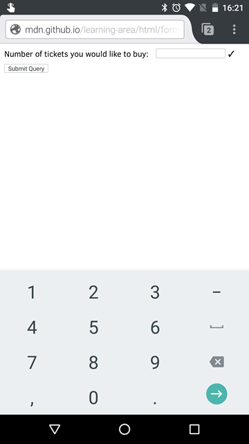

{{HTMLSidebar}}

{{HTMLElement("input")}} элементы типа **`number`** используются для того, чтобы дать возможность пользователю ввести число. У них есть встроенная валидация, запрещающая вводить нечисловые значения. Браузер может предоставить возможность увеличить или уменьшить значение специальными стрелками, используя мышь или просто двигая пальцем по экрану.

{{EmbedInteractiveExample("pages/tabbed/input-number.html", "tabbed-shorter")}}

В браузерах, которые не поддерживают тип `number`, тип `number` приводится к `text`.

| **[Value](#value)**             | A {{jsxref("Number")}} representing a number, or empty                                                                                                                                                                               |
| ------------------------------- | ------------------------------------------------------------------------------------------------------------------------------------------------------------------------------------------------------------------------------------ |
| **Events**                      | {{event("change")}} and {{event("input")}}                                                                                                                                                                                           |
| **Supported Common Attributes** | [`autocomplete`](/ru/docs/Web/HTML/Element/input#autocomplete), [`list`](/ru/docs/Web/HTML/Element/input#list), [`placeholder`](/ru/docs/Web/HTML/Element/input#placeholder), [`readonly`](/ru/docs/Web/HTML/Element/input#readonly) |
| **IDL attributes**              | `list`, `value`, `valueAsNumber`                                                                                                                                                                                                     |
| **Methods**                     | {{domxref("HTMLInputElement.select", "select()")}}, {{domxref("HTMLInputElement.stepUp", "stepUp()")}}, {{domxref("HTMLInputElement.stepDown", "stepDown()")}}                                                                       |

## Value

{{jsxref("Number")}}, представляющий значение введённого числа. Вы можете установить значение по умолчанию, вставив значение в атрибут [`value`](/ru/docs/Web/HTML/Element/input#value), например:

```html
<input id="number" type="number" value="42" />
```

{{EmbedLiveSample('Value', 600, 40)}}

## Additional attributes

In addition to the attributes commonly supported by all {{HTMLElement("input")}} types, inputs of type `number` support these attributes:

| Attribute                     | Description                                                                                             |
| ----------------------------- | ------------------------------------------------------------------------------------------------------- |
| [`max`](#max)                 | The maximum value to accept for this input                                                              |
| [`min`](#min)                 | The minimum value to accept for this input                                                              |
| [`placeholder`](#placeholder) | An example value to display inside the field when it's empty                                            |
| [`readonly`](#readonly)       | A Boolean attribute controlling whether or not the value is read-only                                   |
| [`step`](#step)               | A stepping interval to use when using up and down arrows to adjust the value, as well as for validation |

### {{htmlattrdef("max")}}

The maximum value to accept for this input. If the [`value`](/ru/docs/Web/HTML/Element/input#value) entered into the element exceeds this, the element fails [constraint validation](/ru/docs/Web/Guide/HTML/HTML5/Constraint_validation). If the value of the `max` attribute isn't a number, then the element has no maximum value.

This value must be greater than or equal to the value of the `min` attribute.

### {{htmlattrdef("min")}}

The minimum value to accept for this input. If the [`value`](/ru/docs/Web/HTML/Element/input#value) of the element is less than this, the element fails [constraint validation](/ru/docs/Web/Guide/HTML/HTML5/Constraint_validation). If a value is specified for `min` that isn't a valid number, the input has no minimum value.

This value must be less than or equal to the value of the `max` attribute.

{{page("/ru/docs/Web/HTML/Element/input/text", "placeholder", 0, 1, 2)}}

{{page("/ru/docs/Web/HTML/Element/input/text", "readonly", 0, 1, 2)}}

### {{htmlattrdef("step")}}

Атрибут `step` – это число, которое определяет точность, с которой задаётся значение, или специальное значение `any`, описанное ниже. Только значения, кратные шагу ([`min`](#min), если задано, иначе [`value`](/ru/docs/Web/HTML/Element/input#value), или подходящее стандартное значение, если ни одно из двух не задано) будут корректными.

Строковое значение `any` означает, что никакое значение шага не задано и допустимо любое значение (в пределах других ограничений, таких как [`min`](#min) и [`max`](#max)).

> **Примечание:** Когда значение, введённое пользователем, не подходит под заданное значение шага, {{Glossary("user agent")}} может округлить его до ближайшего допустимого значения с приоритетом в большую сторону в том случае, если значение находится ровно посередине шага.

Стандартное значение шага для поля ввода `number` – это `1`, что позволяет вводить только целые числа, _если_ только не задать значение шага нецелым числом.

## Using number inputs

`<input type="number">` elements can help simplify your work when building the user interface and logic for entering numbers into a form. When you create a number input with the proper `type` value, `number`, you get automatic validation that the entered text is a number, and usually a set of up and down buttons to step the value up and down.

> **Предупреждение:** **Important**: Bear in mind that logically you should not be able to enter characters inside a number of input other than numbers. There seems to be some disagreement about this among browsers; see {{bug(1398528)}}.

> **Примечание:** It's crucial to remember that a user can tinker with your HTML behind the scenes, so your site _must not_ use simple client-side validation for any security purposes. You _must_ verify on the server side any transaction in which the provided value may have any security implications of any kind.

Mobile browsers further help with the user experience by showing a special keyboard more suited for entering numbers when the user tries to enter a value. The following screenshot is taken from Firefox for Android:



### A simple number input

In its most basic form, a number input can be implemented like this:

```html
<label for="ticketNum">Number of tickets you would like to buy:</label>
<input id="ticketNum" type="number" name="ticketNum" value="0" />
```

{{EmbedLiveSample('A_simple_number_input', 600, 40)}}

A number input is considered valid when empty and when a single number is entered, but is otherwise invalid. If the [`required`](/ru/docs/Web/HTML/Element/input#required) attribute is used, the input is no longer considered valid when empty.

> **Примечание:** Any number is an acceptable value, as long as it is a [valid floating point number](https://html.spec.whatwg.org/multipage/infrastructure.html#valid-floating-point-number) (i.e. not [NaN](/ru/docs/Web/JavaScript/Reference/Global_Objects/NaN) or [Infinity](/ru/docs/Web/JavaScript/Reference/Global_Objects/Infinity)).

### Placeholders

Sometimes it's helpful to offer an in-context hint as to what form the input data should take. This can be especially important if the page design doesn't offer descriptive labels for each {{HTMLElement("input")}}. This is where **placeholders** come in. A placeholder is a value most commonly used to provide a hint as to the format the input should take `value`. It is displayed inside the edit box when the element's `value` is `""`. Once data is entered into the box, the placeholder disappears; if the box is emptied, the placeholder reappears.

Here, we have an `number` input with the placeholder `"Multiple of 10"`. Note how the placeholder disappears and reappears as you manipulate the contents of the edit field.

```html
<input type="number" placeholder="Multiple of 10" />
```

{{EmbedLiveSample('Placeholders', 600, 40)}}

### Controlling step size

By default, the up and down buttons provided for you to step the number up and down will step the value up and down by 1. You can change this by providing a [`step`](/ru/docs/Web/HTML/Element/input#step) attribute, which takes as its value a number specifying the step amount. Our above example contains a placeholder saying that the value should be a multiple of 10, so it makes sense to add a `step` value of 10:

```html
<input type="number" placeholder="multiple of 10" step="10" />
```

{{EmbedLiveSample('Controlling_step_size', 600, 40)}}

In this example you should find that the up and down step arrows will increase and decrease the value by 10 each time, not 1. You can still manually enter a number that's not a multiple of 10, but it will be considered invalid.

### Specifying minimum and maximum values

You can use the [`min`](/ru/docs/Web/HTML/Element/input#min) and [`max`](/ru/docs/Web/HTML/Element/input#max) attributes to specify a minimum and maximum value that the field can have. For example, let's give our example a minimum of 0, and a maximum of 100:

```html
<input type="number" placeholder="multiple of 10" step="10" min="0" max="100" />
```

{{EmbedLiveSample('Specifying_minimum_and_maximum_values', 600, 40)}}

In this updated version, you should find that the up and down step buttons will not allow you to go below 0 or above 100. You can still manually enter a number outside these bounds, but it will be considered invalid.

### Allowing decimal values

One issue with number inputs is that their step size is 1 by default — if you try to enter a number with a decimal, such as "1.0", it will be considered invalid. If you want to enter a value that requires decimals, you'll need to reflect this in the `step` value (e.g. `step="0.01"` to allow decimals to two decimal places). Here's a simple example:

```html
<input type="number" placeholder="1.0" step="0.01" min="0" max="10" />
```

{{EmbedLiveSample("Allowing_decimal_values", 600, 40)}}

See that this example allows any value between 0.0 and 10.0, with decimals to two places. "9.52" is valid, but "9.521" is not, for example.

### Controlling input size

{{HTMLElement("input")}} elements of type `number` don't support form sizing attributes such as [`size`](/ru/docs/Web/HTML/Element/input#size). You'll have to resort to [CSS](/ru/docs/Web/CSS) to change the size of these controls.

For example, to adjust the width of the input to be only as wide as is needed to enter a three-digit number, we can change our HTML to include an ID and to shorten our placeholder since the field will be too narrow for the text we have been using so far:

```html
<input
  type="number"
  placeholder="x10"
  step="10"
  min="0"
  max="100"
  id="number" />
```

Then we add some CSS to narrow the width of the element with the ID `number`:

```css
#number {
  width: 3em;
}
```

The result looks like this:

{{EmbedLiveSample('Controlling_input_size', 600, 40)}}

### Offering suggested values

You can provide a list of default options from which the user can select by specifying the [`list`](/ru/docs/Web/HTML/Element/input#list) attribute, which contains as its value the ID of a {{HTMLElement("datalist")}}, which in turn contains one {{HTMLElement("option")}} element per suggested value; each `option`'s `value` is the corresponding suggested value for the number entry box.

```html
<input id="ticketNum" type="number" name="ticketNum" list="defaultNumbers" />
<span class="validity"></span>

<datalist id="defaultNumbers">
  <option value="10045678"></option>
  <option value="103421"></option>
  <option value="11111111"></option>
  <option value="12345678"></option>
  <option value="12999922"></option>
</datalist>
```

{{EmbedLiveSample("Offering_suggested_values", 600, 40)}}

> **Примечание:** Use of the [`list`](/ru/docs/Web/HTML/Element/input#list) attribute with `number` inputs is not supported in all browsers. It works in Chrome and Opera, for example, but not in Firefox.

## Validation

We have already mentioned a number of validation features of `number` inputs, but let's review them now:

- `<input type="number">` elements automatically invalidate any entry that isn't a number (or empty, unless `required` is specified).
- You can use the [`required`](/ru/docs/Web/HTML/Element/input#required) attribute to make an empty entry invalid, i.e. the input has to be filled in.
- You can use the [`step`](/ru/docs/Web/HTML/Element/input#step) attribute to constrain valid values to a certain set of steps (e.g. multiples of 10).
- You can use the [`min`](/ru/docs/Web/HTML/Element/input#min) and [`max`](/ru/docs/Web/HTML/Element/input#max) attributes to constrain valid values to lower and upper bounds.

The following example exhibits all of the above features, as well as using some CSS to display valid and invalid icons when the input value is valid/invalid:

```html
<form>
  <div>
    <label for="balloons">Number of balloons to order (multiples of 10):</label>
    <input
      id="balloons"
      type="number"
      name="balloons"
      step="10"
      min="0"
      max="100"
      required />
    <span class="validity"></span>
  </div>
  <div>
    <input type="submit" />
  </div>
</form>
```

{{EmbedLiveSample("Validation", 600, 80)}}

Try submitting the form with different invalid values entered — e.g. no value, a value below 0 or above 100, a value that is not a multiple of 10, or a non-numerical value — and see how the error messages the browser gives you differ with different ones.

The CSS applied to this example is as follows:

```css
div {
  margin-bottom: 10px;
}

input:invalid + span:after {
  content: "✖";
  padding-left: 5px;
}

input:valid + span:after {
  content: "✓";
  padding-left: 5px;
}
```

Here we use the {{cssxref(":invalid")}} and {{cssxref(":valid")}} pseudo classes to display an appropriate invalid or valid icon as generated content on the adjacent {{htmlelement("span")}} element, indicating if the current value is valid. We put it on a separate `<span>` element for added flexibility; some browsers don't display generated content very effectively on some types of form inputs (read for example the section on [`<input type="date">` validation](/ru/docs/Web/HTML/Element/input/date#Validation)).

> **Предупреждение:** **Important**: HTML form validation is _not_ a substitute for server-side scripts that ensure that the entered data is in the proper format. It's far too easy for someone to make adjustments to the HTML that allow them to bypass the validation, or to remove it entirely. It's also possible for someone to bypass your HTML and submit the data directly to your server. If your server-side code fails to validate the data it receives, disaster could strike when improperly-formatted data is submitted (or data which is too large, is of the wrong type, and so forth).

### Pattern validation

`<input type="number">` elements do not support use of the [`pattern`](/ru/docs/Web/HTML/Element/input#pattern) attribute for making entered values conform to a specific regex pattern. The rationale for this is that number inputs won't be valid if they contain anything except numbers, and you can constrain the minimum and maximum number of valid digits using the [`min`](/ru/docs/Web/HTML/Element/input#min) and [`max`](/ru/docs/Web/HTML/Element/input#max) attributes, as explained above.

## Examples

We've already covered the fact that by default, the increment is 1, and you can use the [`step`](/ru/docs/Web/HTML/Element/input#step) attribute to allow decimal inputs. Let's take a closer look. In the following example we've set up a form for entering the user's height; it defaults to accepting a height in meters, but you can click the relevant button to change the form to accept feet and inches instead. The input for the height in meters accepts decimals to two places.

{{EmbedLiveSample("Examples", 600, 100)}}

The HTML looks like this:

```html
<form>
    <div class="metersInputGroup">
        <label for="meters">Enter your height — meters:</label>
        <input id="meters" type="number" name="meters" step="0.01" min="0" placeholder="e.g. 1.78" required>
        <span class="validity"></span>
    </div>
        <span>Enter your height — </span>
        <label for="feet">feet:</label>
        <input id="feet" type="number" name="feet" min="0" step="1">
        <span class="validity"></span>
        <label for="inches">inches:</label>
        <input id="inches" type="number" name="inches" min="0" max="11" step="1">
        <span class="validity"></span>
    </div>
    <div>
      <input type="button" class="meters" value="Enter height in feet and inches">
    </div>
    <div>
        <input type="submit" value="Submit form">
    </div>
</form>
```

You'll see that we are using many of the attributes we've already looked at in the article earlier on. Since we want to accept a meter value in centimeters, we've set the `step` value to `0.01`, so that values like 1.78 are not seen as invalid. We've also provided a placeholder for that input.

We've hidden the feet and inches inputs initially using `class="hidden"` so that meters is the default entry type.

Now on to the CSS — this looks very similar to the validation styling we saw before; nothing remarkable here:

```css
div {
  margin-bottom: 10px;
  position: relative;
}

input[type="number"] {
  width: 100px;
}

input + span {
  padding-right: 30px;
}

input:invalid + span:after {
  position: absolute;
  content: "✖";
  padding-left: 5px;
}

input:valid + span:after {
  position: absolute;
  content: "✓";
  padding-left: 5px;
}
```

And finally, the JavaScript:

```js
var metersInputGroup = document.querySelector(".metersInputGroup");
var feetInputGroup = document.querySelector(".feetInputGroup");
var metersInput = document.querySelector("#meters");
var feetInput = document.querySelector("#feet");
var inchesInput = document.querySelector("#inches");
var switchBtn = document.querySelector('input[type="button"]');

switchBtn.addEventListener("click", function () {
  if (switchBtn.getAttribute("class") === "meters") {
    switchBtn.setAttribute("class", "feet");
    switchBtn.value = "Enter height in meters";

    metersInputGroup.style.display = "none";
    feetInputGroup.style.display = "block";

    feetInput.setAttribute("required", "");
    inchesInput.setAttribute("required", "");
    metersInput.removeAttribute("required");

    metersInput.value = "";
  } else {
    switchBtn.setAttribute("class", "meters");
    switchBtn.value = "Enter height in feet and inches";

    metersInputGroup.style.display = "block";
    feetInputGroup.style.display = "none";

    feetInput.removeAttribute("required");
    inchesInput.removeAttribute("required");
    metersInput.setAttribute("required", "");

    feetInput.value = "";
    inchesInput.value = "";
  }
});
```

After declaring a few variables, we add an event listener to the button to control the switching mechanism. This is pretty simple, mostly involving changing over the button class and label, and updating the display values of the two sets of inputs when the button is pressed. Note that we're not converting back and forth between meters and feet/inches here, which a real-life web application would probably do.

> **Примечание:** Note that when the user clicks the button, we remove the `required` attribute(s) from the input(s) we are hiding, and empty the `value` attribute(s). This is so that we can submit the form if both input sets aren't filled in, and won't submit data that we didn't mean to submit. If we didn't do this, you'd have to fill in both feet/inches **and** meters to submit the form!

## Specifications

| Specification                                                                                       | Status                   | Comment            |
| --------------------------------------------------------------------------------------------------- | ------------------------ | ------------------ |
| {{SpecName('HTML WHATWG', 'forms.html#number-state-(type=number)', '&lt;input type="number"&gt;')}} | {{Spec2('HTML WHATWG')}} | Initial definition |
| {{SpecName('HTML5.1', 'sec-forms.html#number-state-typenumber', '&lt;input type="number"&gt;')}}    | {{Spec2('HTML5.1')}}     | Initial definition |

## Browser compatibility

{{Compat}}

## See also

- [HTML forms guide](/ru/docs/Learn/HTML/Forms)
- {{HTMLElement("input")}}
- [`<input type="tel">`](/ru/docs/Web/HTML/Element/input/tel)
