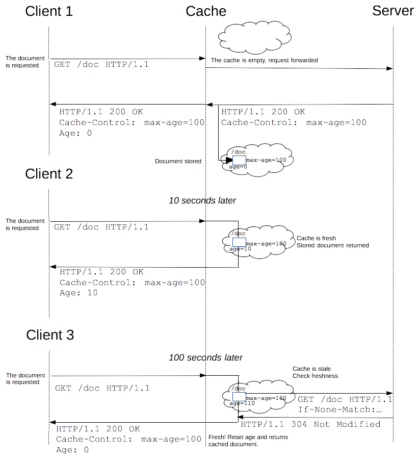
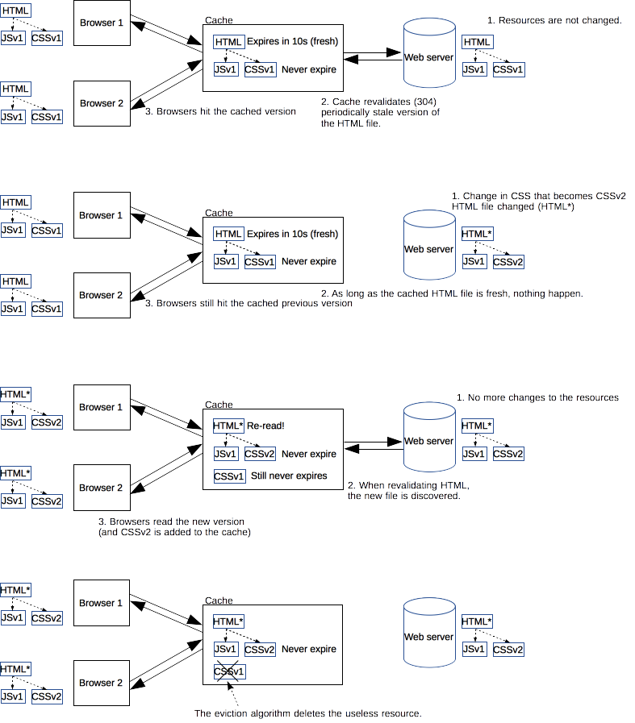
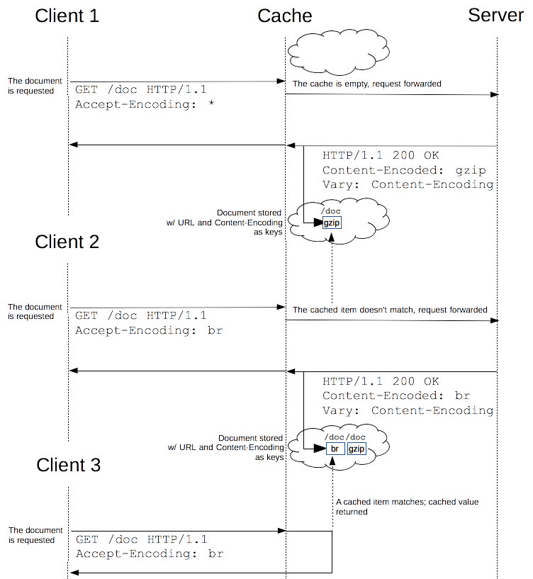

{{HTTPSidebar}}

**Производительность веб-сайтов и приложений можно значительно повысить за счёт повторного использования ранее полученных ресурсов. Веб-кеши сокращают задержку и снижают сетевой трафик, уменьшая тем самым время, необходимое для отображения ресурсов. Используя HTTP-кеширование, сайты становятся более отзывчивыми.**

## Различные виды кеширования

Техника кеширования заключается в сохранении копии полученного ресурса для возврата этой копии в ответ на дальнейшие запросы. Запрос на ресурс, уже имеющийся в веб-кеше, перехватывается, и вместо обращения к исходному серверу выполняется загрузка копии из кеша. Таким образом снижается нагрузка на сервер, которому не приходится самому обслуживать всех клиентов, и повышается производительность — кеш ближе к клиенту и ресурс передаётся быстрее. Кеширование является основным источником повышения производительности веб-сайтов. Однако, кеш надо правильно сконфигурировать: ресурсы редко остаются неизменными, так что копию требуется хранить только до того момента, как ресурс изменился, но не дольше.

Существует несколько видов кешей, которые можно разделить на две основные категории: приватные кеши и кеши совместного использования. В кешах совместного использования (shared cache) хранятся копии, которые могут направляться разным пользователям. Приватный кеш (private cache) предназначен для отдельного пользователя. Здесь будет говориться в основном о кешах браузеров и прокси, но существуют также кеши шлюзов, CDN, реверсные прокси кеши и балансировщики нагрузки, разворачиваемые на серверах для повышения надёжности, производительности и масштабируемости веб-сайтов и веб-приложений.


### Приватный (private) кеш браузера

Приватный кеш предназначен для отдельного пользователя. Вы, возможно, уже видели параметры кеширования в настройках своего браузера. Кеш браузера содержит все документы, загруженные пользователем по HTTP. Он используется для доступа к ранее загруженным страницам при навигации назад/вперёд, позволяет сохранять страницы, или просматривать их код, не обращаясь лишний раз к серверу. Кроме того, кеш полезен при отключении от сети.

### Общий (shared) прокси-кеш

Кеш совместного использования — это кеш, который сохраняет ответы, чтобы их потом могли использовать разные пользователи. Например, в локальной сети вашего провайдера или компании, может быть установлен прокси, обслуживающий множество пользователей, чтобы можно было повторно использовать популярные ресурсы, сокращая тем самым сетевой трафик и время ожидания.

## Цели кеширования

Кеширование в HTTP не является обязательным, однако в большинстве случаев бывает полезно повторно использовать ранее сохранённые ресурсы. Тем не менее, стандартные кеши HTTP обычно способны кешировать только ответы на запросы методом {{HTTPMethod("GET")}}, а другие отклоняют.

Первичный ключ состоит из метода запроса и запрашиваемого URI (зачастую используется только URI, поскольку целью кеширования являются только GET-запросы). Вот примеры того, что обычно записывается в кеш:

- Успешно загруженные ресурсы: ответ {{HTTPStatus(200)}} `OK` на запрос методом {{HTTPMethod("GET")}} HTML-документов, изображений или файлов.
- Постоянные перенаправления: ответ {{HTTPStatus (301)}} `Moved Permanently` («перемещено навсегда»).
- Сообщения об ошибках: ответ {{HTTPStatus(404)}} `Not Found` («не найдено»).
- Неполные результаты: ответ {{HTTPStatus(206)}} `Partial Content` («частичное содержимое»).
- Ответы на запросы отличные от {{HTTPMethod("GET")}}, если есть что-либо, подходящее для использования в качестве ключа кеша.

Запись в кеше может также состоять из множества ответов, различаемых по вторичному ключу, если при формировании ответа производится согласование данных. Подробнее об этом рассказано [ниже](#Varying_responses), в разделе, посвящённом заголовку {{HTTPHeader("Vary")}}.

## Управление кешированием

### Заголовок `Cache-control`

Поле {{HTTPHeader("Cache-Control")}} общего заголовка HTTP/1.1 используется для задания инструкций по механизму кеширования как в запросах, так и в ответах. Применяется для задания политик кеширования.

#### Полное отсутствие кеширования

В кеше не должно сохраняться ничего — ни по запросам клиента, ни по ответам сервера. Запрос всегда отправляется на сервер, ответ всегда загружается полностью.

```
Cache-Control: no-store
Cache-Control: no-cache, no-store, must-revalidate
```

#### Кешировать, но проверять актуальность

Перед тем, как выдать копию, кеш запрашивает исходный сервер на предмет актуальности ресурса.

```
Cache-Control: no-cache
```

#### Приватные (private) и общие (public) кеши

Директива "public" указывает, что ответ можно сохранять в любом кеше. Это бывает полезно, если возникает потребность сохранить страницы с HTTP-аутентификацией, или такими кодами ответа, которые обычно не кешируются. Директива же "private" указывает, что ответ предназначен отдельному пользователю и не должен храниться в кеше совместного использования. В этом случае ответ может сохраняться приватным кешем браузера.

```
Cache-Control: private
Cache-Control: public
```

#### Срок действия (Expiration)

Самой важной здесь является директива "max-age=\<seconds>" — максимальное время, в течение которого ресурс считается "свежим". В отличие от директивы {{HTTPHeader("Expires")}}, она привязана к моменту запроса. К неизменяющимся файлам приложения обычно можно применять "агрессивное" кеширование. Примером таких статических файлов могут быть изображения, файлы стилей (CSS) или скриптов (JavaScript).

Подробнее об этом рассказывается в разделе [Свежесть ресурса](#Freshness).

```
Cache-Control: max-age=31536000
```

#### Проверка актуальности

При использовании директивы "must-revalidate" кеш обязан проверять статус ресурсов с истёкшим сроком действия. Те копии, что утратили актуальность, использоваться не должны. Подробнее об этом рассказано ниже, в разделе [Валидация кеша](#Cache_validation).

```
Cache-Control: must-revalidate
```

### Заголовок `Pragma`

{{HTTPHeader("Pragma")}} является заголовком HTTP/1.0. Он не описан для HTTP-ответов и, таким образом, не может служить надёжной заменой общему заголовку Cache-Control протокола HTTP/1.1, хотя его поведение аналогично "Cache-Control: no-cache" когда поле заголовка Cache-Control опущено в запросе. Использовать его следует только для совместимости с клиентами HTTP/1.0.

## Свежесть сохранённой копии

Однажды попав в кеш, ресурс, теоретически, может храниться там вечно. Однако, поскольку объем хранилища конечен, записи периодически приходится оттуда удалять. Этот процесс называют _вытеснением данных из кеша_ (cache eviction). Кроме того, ресурсы могут изменяться на сервере, поэтому кеш требуется обновлять. Поскольку HTTP является клиент-серверным протоколом, сервера не могут сами обращаться к кешам и клиентам при изменении ресурса; им необходимо договориться о сроке действия сохранённой копии. До его истечения ресурс считается _свежим_ (fresh), после — _устаревшим_ (stale). Алгоритмы вытеснения отдают предпочтение "свежим" ресурсам. Тем не менее, копия ресурса не удаляется из кеша сразу же по истечении её срока действия; при получении запроса на устаревший ресурс кеш передаёт его дальше с заголовком {{HTTPHeader("If-None-Match")}} на случай, если копия все ещё актуальна. Если это так, сервер возвращает заголовок {{HTTPStatus("304")}} `Not Modified` («не изменялось»), а тело ресурса не посылает, экономя тем самым трафик.

Вот пример того, как протекает этот процесс при использовании совместного кеша прокси:



Срок действия (freshnessLifetime) вычисляется на основании нескольких заголовков. Если задан заголовок "Cache-control: max-age=N", то срок действия равен N. Если его нет, а это бывает очень часто, проверяется заголовок {{HTTPHeader("Expires")}}, и, если он есть, то срок действия берётся равным значению заголовка Expires минус значение заголовка Date. Наконец, если нет ни того ни другого, смотрят заголовок Last-Modified. Если он есть, то срок действия равен значению заголовка Date минус значение заголовка Last-modified разделить на 10.
Время устаревания (expirationTime) вычисляется следующим образом:

```
expirationTime = responseTime + freshnessLifetime - currentAge
```

где responseTime — это время получения ответа по часам браузера, а currentAge — текущий возраст кеша.

### Обновление статических ресурсов (Revved resources)

Чем больше ресурсов может быть взято из кеша, тем быстрее сайт реагирует на запросы и тем выше его производительность. Из этих соображений их "срок годности" имеет смысл делать как можно большим. Однако, возникает проблема с ресурсами, которые обновляются редко и нерегулярно. Как раз их кеширование даёт больше всего выгоды, но сильно затрудняет обновление. Такие ресурсы можно найти на любой веб-странице: файлы скриптов (JavaScript) и стилей (CSS) изменяются редко, но уж если это произошло, обновление надо произвести как можно быстрее.

Веб-разработчики разработали метод, который Стив Сандерс (Steve Sounders) назвал _revving_[\[1\]](https://www.stevesouders.com/blog/2008/08/23/revving-filenames-dont-use-querystring/), что можно перевести как "оборачиваемость". Для редко обновляемых файлов используют особый способ именования: в их URL, обычно в имя файла, добавляют номер релиза или версии. Таким образом, каждая новая версия считается отдельным ресурсом, срок устаревания которого отодвинут далеко в будущее, как правило, на год, или больше. Недостатком этого метода является то, что для получения новых версий ресурса приходится обновлять все ссылки на него — это некоторое усложнение, справиться с которым разработчику помогает цепочка инструментов. Обновление статических ресурсов влечёт за собой обновление и часто изменяемых ресурсов. Когда считываются первые, считываются и новые версии вторых.

Этот метод имеет дополнительное достоинство: одновременное обновление двух кешированных ресурсов не приводит к ситуации, при которой устаревшая версия одного ресурса используется вместе с новой версией другого. Это очень важно для сайтов с взаимосвязанными файлами стилей CSS или JS-скриптов — связь может возникнуть, например, из-за ссылок на одни и те же элементы HTML-страницы.



Номер версии, добавляемый к статическому ресурсу, не обязательно записывать в виде стандартного номера версии наподобие 1.1.3, или другого возрастающего числового значения. Это может быть что угодно, позволяющее избежать совпадений — например, дата.

## Валидация кеша

Валидация кеша запускается при нажатии пользователем кнопки перезагрузки. Кроме того, она может выполняться в ходе обычного просмотра страниц, если кешированный ответ включает заголовок "Cache-control: must-revalidate". Другим фактором являются настройки кеширования браузера — можно потребовать принудительной валидации при каждой загрузке документа.

При истечении срока годности документа он либо проходит валидацию, либо повторно доставляется с сервера. Валидация может выполняться только если на сервере реализован _сильный валидатор_ или _слабый валидатор_.

### Заголовки ETag

Заголовок ответа {{HTTPHeader("ETag")}} является непрозрачным для клиентского приложения (агента) значением, которое можно использовать в качестве сильного валидатора. Суть в том, что клиент, например, браузер, не знает, что представляет эта строка и не может предсказать, каким будет её значение. Если в ответе присутствует заголовок `ETag`, клиент может транслировать его значение через заголовок {{HTTPHeader("If-None-Match")}} будущих запросов для валидации кешированного ресурса.

Заголовок ответа {{HTTPHeader("Last-Modified")}} можно использовать в качестве слабого валидатора. Слабым он считается из-за того, что имеет 1-секундное разрешение. Если в ответе присутствует заголовок `Last-Modified`, то для валидации кешированного документа клиент может выводить в запросах заголовок {{HTTPHeader("If-Modified-Since")}}.

При запросе на валидацию сервер может либо проигнорировать валидацию и послать стандартный ответ {{HTTPStatus(200)}} `OK`, либо вернуть ответ {{HTTPStatus(304)}} `Not Modified` (с пустым телом), тем самым указывая браузеру взять копию из кеша. В последнем случае в ответ могут входить также заголовки для обновления срока действия кешированного ресурса.

## Изменяющиеся ответы

Заголовок HTTP-ответа {{HTTPHeader("Vary")}} определяет, как по заголовкам будущих запросов понять, может ли быть использована копия из кеша, или нужно запросить новые данные у сервера.

Если кеш получает запрос, который можно удовлетворить сохранённым в кеше ответом с заголовком `Vary`, то использовать этот ответ можно только при совпадении всех указанных в `Vary` полей заголовка исходного (сохранённого в кеше) запроса и нового запроса.



Это может быть полезно, например, при динамическом предоставлении контента. При использовании заголовка `Vary: User-Agent` кеширующие сервера, принимая решение об использовании страницы из кеша, должны учитывать агент пользователя. Так можно избежать ситуации, когда пользователи мобильных устройств по ошибке получат десктопную версию вашего сайта. Вдобавок, это может помочь Google и другим поисковым системам обнаружить мобильную версию страницы, и может также указать им на то, что здесь нет никакой подмены контента с целью поисковой оптимизации ([Cloaking](https://en.wikipedia.org/wiki/Cloaking)).

```
Vary: User-Agent
```

Поскольку значение заголовка {{HTTPHeader("User-Agent")}} различается ("varies") у мобильных и десктопных клиентов, закешированный мобильный контент не будет по ошибке отсылаться пользователям десктопов и наоборот.

## Смотрите также

- [RFC 7234: Hypertext Transfer Protocol (HTTP/1.1): Caching](https://tools.ietf.org/html/rfc7234)
- [Caching Tutorial – Mark Nottingham](https://www.mnot.net/cache_docs)
- [HTTP caching – Ilya Grigorik](https://developers.google.com/web/fundamentals/performance/optimizing-content-efficiency/http-caching)
- [RedBot](https://redbot.org/), инструмент для проверки относящихся к кешу заголовков HTTP .
