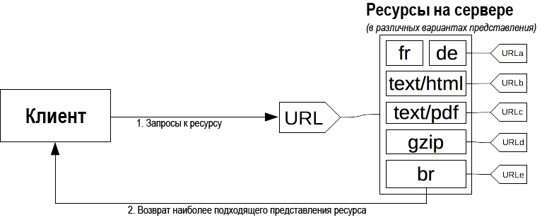

{{HTTPSidebar}}

В [HTTP](/ru/docs/Glossary/HTTP), _**согласование контента**_ - это механизм используемый для отображения различных представлений ресурса по тому же URI, так чтобы клиент мог указать, что лучше подходит для пользователя (например, желаемый язык документа, формат изображения, или кодировку текста).

## Принципы согласования контента

Конкретный документ называется _ресурсом_. Когда клиент хочет его получить, он запрашивает его используя его URL. Сервер использует этот URL, чтобы выбрать один из возможных вариантов - каждый вариант, называется _представлением_, – и возвращает этот вариант клиенту. Ресурс в общем, а также каждое из представлений, имеют определённый URL. Выбор конкретного представления при вызове ресурса определяется механизмом _согласования контента_ и существует несколько способов согласования между клиентом и сервером.

Определение наиболее подходящего представления производится с помощью одного из двух механизмов:

- Конкретные [HTTP-заголовки](/ru/docs/Web/HTTP/Headers) клиента (_согласование на основе сервера_ или _упреждающее согласование_), что является стандартным способом согласования определённого вида ресурса.
- [HTTP коды ответа](/ru/docs/Web/HTTP/Status) {{HTTPStatus("300")}} (Multiple Choices) или {{HTTPStatus("406")}} (Not Acceptable) (_согласование на основе агента_ или _реактивное согласование_), используемые в качестве резервных механизмов.

На протяжении многих лет предлагались и другие предложения по согласованию содержания, такие как _прозрачное согласование контента_ и `Alternates` заголовок. Они не смогли получить достаточной поддержки и были заброшены.

## Согласование на основе сервера

В _согласовании на стороне сервера_ или _упреждающем согласовании_, браузер (или любое другое клиентское приложение) посылает несколько заголовков HTTP наряду с URL. Эти заголовки описывают предпочтения пользователя. Сервер использует их в качестве подсказок для внутреннего алгоритма, который выбирает наиболее подходящее представление ресурса, чтобы предоставить его клиенту. Реализация алгоритма в стандарт не входит и полностью зависит от сервера. Для примера, смотрите [алгоритм согласования Apache 2.2](http://httpd.apache.org/docs/2.2/en/content-negotiation.html#algorithm).

Стандарт HTTP/1.1 определяет список стандартных заголовков которые используются в этом механизме согласования – ({{HTTPHeader("Accept")}}, {{HTTPHeader("Accept-Charset")}}, {{HTTPHeader("Accept-Encoding")}}, {{HTTPHeader("Accept-Language")}}). Хотя, строго говоря, {{HTTPHeader("User-Agent")}} не находится в этом списке, в некоторых случаях он используется, чтобы послать определённое представление запрошенного ресурса, несмотря на то, что это и не является хорошей практикой. Сервер использует заголовок {{HTTPHeader("Vary")}} чтобы обозначить, какие заголовки он использовал для согласования (точнее, ассоциированные с ними заголовки ответа), чтобы [кеширование](/ru/docs/Web/HTTP/Caching) работало оптимально.

В дополнение к этим, есть предложение добавить больше заголовков в список доступным, так называемые Подсказки Клиента (Client Hints). Они будут предоставлять информацию о типе устройства на котором они используются (например, будет это настольный компьютер или мобильное устройство).

Согласование на стороне сервера является самым популярным способом согласования контента, но у него есть несколько недостатков:

- У сервера нет всей информации о клиентском приложении. Даже с расширением Client Hints сервер не может знать всех возможностей браузера. В отличие от реактивного согласования, где клиент совершает выбор, выбор сервера всегда остаётся в каком-то смысле произвольным.
- Информация, полученная от клиента, довольно подробная (сжатие заголовков протокола HTTP/2 отчасти решает эту проблему) и является источником утечки конфиденциальности (идентификация по HTTP).
- С увеличением количества представлений падает эффективность общих кешей и усложняется реализация сервера.

### Заголовок `Accept`

Заголовок {{HTTPHeader("Accept")}} перечисляет MIME типы содержимого ресурса, которые клиент желает получить. Он представляет список MIME типов, разделённый запятыми, каждый из которых, опционально, снабжён коэффициентом желательности – параметром, определяющим относительный уровень желательности среди разных MIME типов.

{{HTTPHeader("Accept")}} определяется браузером, или любым другим клиентом, и может изменяться в зависимости от контекста, например, при получении страницы HTML, изображения, видео или скрипта – его содержимое будет различаться при запросе документа из строки адреса, через тег {{ HTMLElement("img") }}, {{ HTMLElement("video") }} или {{ HTMLElement("audio") }}. Браузеры могут использовать любое значение, которые они считают наиболее подходящим; можете ознакомиться со списком [значений по умолчанию, используемых распространёнными браузерами](/ru/docs/Web/HTTP/Content_negotiation/List_of_default_Accept_values).

### Заголовок `Accept-CH` {{experimental_inline}}

> **Примечание:** Перед вами **экспериментальная** технология под названием _Client Hints (Подсказки Клиента)_, реализуемая на данный момент только в Chrome 46 и более поздних версиях

Экспериментальный заголовок {{HTTPHeader("Accept-CH")}} перечисляет конфигурацию клиента, которая может быть использована сервером для выбора подходящего ответа. Определённые значения:

| Value            | Meaning                                                                                          |
| ---------------- | ------------------------------------------------------------------------------------------------ |
| `DPR`            | Указывает соотношение логических пикселей к физическим на устройстве.                            |
| `Viewport-Width` | Указывает ширину окна отображения.                                                               |
| `Width`          | Указывает ширину ресурса в физических пикселях (другими словами собственный размер изображения). |

### Заголовок `Accept-Charset`

Заголовок {{HTTPHeader("Accept-Charset")}} указывает серверу какие кодировки текста поддерживает клиент. По традиции он имеет своё значение для каждой локали браузера, например, `ISO-8859-1,utf-8;q=0.7,*;q=0.7` установлен для западноевропейской локали.

В настоящее время, UTF-8 имеет серьёзную поддержку, является предпочтительным способом кодировки текста и гарантирует лучшую конфиденциальность за счёт уменьшения разнообразия конфигураций, поэтому большая часть браузеров пропускает заголовок `Accept-Charset`: Internet Explorer 8, Safari 5, Opera 11 и Firefox 10 отказались от этого заголовка в запросах.

### Заголовок `Accept-Encoding`

The {{HTTPHeader("Accept-Encoding")}} header defines the acceptable content-encoding (supported compressions). The value is a q-factor list (e.g.: `br, gzip;q=0.8`) that indicates the priority of the encoding values. The default value `identity` is at the lowest priority (unless otherwise declared).

Compressing HTTP messages is one of the most important ways to improve the performance of a Web site, it shrinks the size of the data transmitted and makes better use of the available bandwidth; browsers always send this header and the server should be configured to abide to it and to use compression.

### Заголовок `Accept-Language`

The {{HTTPHeader("Accept-Language")}} header is used to indicate the language preference of the user. It is a list of values with quality factors (like: `"de, en;q=0.7`"). A default value is often set according the language of the graphical interface of the user agent, but most browsers allow to set different language preferences.

Due to the [configuration-based entropy](https://www.eff.org/deeplinks/2010/01/primer-information-theory-and-privacy) increase, a modified value can be used to fingerprint the user, it is not recommended to change it and a Web site cannot trust this value to reflect the actual wish of the user. Site designers must not be over-zealous by using language detection via this header as it can lead to a poor user experience:

- They should always provide a way to overcome the server-chosen language, e.g., by providing a language menu on the site. Most user-agents provide a default value for the `Accept-Language` header, adapted to the user interface language and end users often do not modify it, either by not knowing how, or by not being able to do it, as in an Internet café for instance.
- Once a user has overridden the server-chosen language, a site should no longer use language detection and should stick with the explicitly-chosen language. In other words, only entry pages of a site should select the proper language using this header.

### Заголовок `User-Agent`

> **Примечание:** Though there are legitimate uses of this header for selecting content, [it is considered bad practice](/ru/docs/Web/HTTP/Browser_detection_using_the_user_agent) to rely on it to define what features are supported by the user agent.

The {{HTTPHeader("User-Agent")}} header identifies the browser sending the request. This string may contain a space-separated list of _product tokens_ and _comments_.

A _product token_ is a name followed by a '`/`' and a version number, like `Firefox/4.0.1`. There may be as many of them as the user-agent wants. A _comment_ is a free string delimited by parentheses. Obviously parentheses cannot be used in that string. The inner format of a comment is not defined by the standard, though several browser put several tokens in it, separated by '`;`'.

### The `Vary` response header

In opposition to the previous `Accept-*` headers which are sent by the client, the {{HTTPHeader("Vary")}} HTTP header is sent by the web server in its response. It indicates the list of headers used by the server during the server-driven content negotiation phase. The header is needed in order to inform the cache of the decision criteria so that can reproduce it, allowing the cache to be functional while preventing serving erroneous content to the user.

The special value of '`*`' means that the server-driven content negotiation also uses information not conveyed in a header to choose the appropriate content.

The `Vary` header was added in the version 1.1 of HTTP and is necessary in order to allow caches to work appropriately. A cache, in order to work with agent-driven content negotiation, needs to know which criteria was used by the server to select the transmitted content. That way, the cache can replay the algorithm and will be able to serve acceptable content directly, without more request to the server. Obviously, the wildcard '`*`' prevents caching from occurring, as the cache cannot know what element is behind it.

## Согласование на основе агента

Server-driven negotiation suffers from a few downsides: it doesn't scale well. There is one header per feature used in the negotiation. If you want to use screen size, resolution or other dimensions, a new HTTP header must be created. Sending of the headers must be done on every request. This is not too problematic with few headers, but with the eventual multiplications of them, the message size would lead to a decrease in performance. The more precise headers are sent, the more entropy is sent, allowing for more HTTP fingerprinting and corresponding privacy concern.

From the beginnings of HTTP, the protocol allowed another negotiation type: _agent-driven negotiation_ or _reactive negotiation_. In this negotiation, when facing an ambiguous request, the server sends back a page containing links to the available alternative resources. The user is presented the resources and choose the one to use.

Unfortunately, the HTTP standard does not specify the format of the page allowing to choose between the available resource, which prevents to easily automatize the process. Besides falling back to the _server-driven negotiation_, this method is almost always used in conjunction with scripting, especially with JavaScript redirection: after having checked for the negotiation criteria, the script performs the redirection. A second problem is that one more request is needed in order to fetch the real resource, slowing the availability of the resource to the user.
