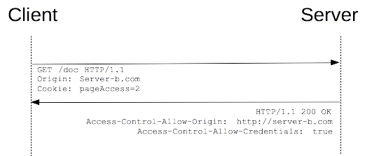

{{HTTPSidebar}}

Cross-Origin Resource Sharing ({{Glossary("CORS")}}) — механизм, использующий дополнительные {{Glossary("HTTP")}}-заголовки, чтобы дать возможность {{Glossary("user agent","агенту пользователя")}} получать разрешения на доступ к выбранным ресурсам с сервера на источнике (домене), отличном от того, что сайт использует в данный момент. Говорят, что агент пользователя делает запрос с другого источника **(cross-origin HTTP request),** если источник текущего документа отличается от запрашиваемого ресурса доменом, протоколом или портом.

Пример cross-origin запроса: HTML страница, обслуживаемая сервером с `http://domain-a.com`, запрашивает [` src`](/ru/docs/Web/HTML/Element/Img#Attributes) по адресу `http://domain-b.com/image.jpg`. Сегодня многие страницы загружают ресурсы вроде CSS-стилей, изображений и скриптов с разных доменов, соответствующих разным сетям доставки контента (Content delivery networks, CDNs).

В целях безопасности браузеры ограничивают cross-origin запросы, инициируемые скриптами. Например, {{domxref("XMLHttpRequest")}} и [Fetch API](/ru/docs/Web/API/Fetch_API) следуют _политике одного источника_ ([same-origin policy](/ru/docs/Web/Security/Same-origin_policy)). Это значит, что web-приложения, использующие такие API, могут запрашивать HTTP-ресурсы только с того домена, с которого были загружены, пока не будут использованы CORS-заголовки.


Механизм CORS поддерживает кросс-доменные запросы и передачу данных между браузером и web-серверами по защищённому соединению. Современные браузеры используют CORS в API-контейнерах, таких как {{domxref("XMLHttpRequest")}} или [Fetch](/ru/docs/Web/API/Fetch_API), чтобы снизить риски, присущие запросам с других источников.

## Кто должен читать данную статью?

На самом деле, все.

Конкретнее, эта статья для web-администраторов, разработчиков серверной стороны и front-end разработчиков. Современные браузеры поддерживают клиентские компоненты cross-origin обмена, включая заголовки и соблюдение правил политики. Но этот новый стандарт означает, что сервера также должны поддерживать новые заголовки запросов и ответов. Другая статья для разработчиков серверной части, описывающая [перспективы cross-origin обмена на стороне сервера (с примерами кода на PHP)](/ru/docs/Web/HTTP/Server-Side_Access_Control), к дополнительному прочтению.

## Какие запросы используют CORS?

Этот [стандарт cross-origin обмена](https://fetch.spec.whatwg.org/#http-cors-protocol) используется для разрешения кросс-сайтовых HTTP запросов для:

- Вызова {{domxref("XMLHttpRequest")}} или [Fetch](/ru/docs/Web/API/Fetch_API) APIs в кросс-сайт манере, как описано выше.
- Web Fonts (для кросс-доменного использования шрифтов в `@font-face` в рамках CSS), [чтобы серверы могли разворачивать TrueType шрифты, которые могут быть загружены только кросс-сайт и использованы web-сайтами, которым это разрешено.](https://www.w3.org/TR/css-fonts-3/#font-fetching-requirements)
- [WebGL текстуры](/ru/docs/Web/API/WebGL_API/Tutorial/Using_textures_in_WebGL).
- Фреймы с изображениями/видео, добавленными в канвас с помощью [`drawImage`](/ru/docs/Web/API/CanvasRenderingContext2D/drawImage).
- Стили (для [CSSOM](/ru/docs/Web/CSS/CSSOM_View) доступа).
- Скрипты (для отключённых исключений).

Эта статья описывает общие понятия Cross-Origin Resource Sharing и включает обсуждение необходимых HTTP заголовков.

## Обзор функциональности

Стандарт Cross-Origin Resource Sharing работает с помощью добавления новых [HTTP-заголовков](/ru/docs/Web/HTTP/Headers), которые позволяют серверам описывать набор источников, которым разрешено читать информацию, запрашиваемую web-браузером. В частности, для методов HTTP-запросов, которые могут привести к побочным эффектам над данными сервера (в частности, для HTTP методов, отличных от {{HTTPMethod("GET")}} или для {{HTTPMethod("POST")}} запросов, использующих определённые [MIME-](/ru/docs/Web/HTTP/Basics_of_HTTP/MIME_types)типы), спецификация требует, чтобы браузеры "предпроверяли" запрос, запрашивая поддерживающие методы с сервера с помощью метода HTTP-запроса {{HTTPMethod("OPTIONS")}} и затем, поверх "подтверждения" с сервера, отсылали фактический запрос с фактическим методом HTTP-запроса. Сервера также могут оповещать клиентов должны ли "полномочия" (включая [Cookies](/ru/docs/Web/HTTP/Cookies) и HTTP Authentication данные) быть отправлены с запросом.

Следующая секция описывает сценарии, а также предоставляет анализ использования HTTP-заголовков.

## Примеры сценариев управления доступом

Здесь мы рассмотрим три сценария, которые иллюстрируют как Cross-Origin Resource Sharing работает. Каждый сценарий использует объект {{domxref("XMLHttpRequest")}}, который может быть использован для межсайтового взаимодействия, в любом, поддерживающем данный объект, браузере.

Фрагменты JavaScript-кода, включённые в эти секции (а также фрагменты кода, отвечающие за корректную обработку межсерверных запросов, которые запускаются на сервере) могут быть испытаны "в действии" на <http://arunranga.com/examples/access-control/>, и будут работать в браузерах, которые поддерживают {{domxref("XMLHttpRequest")}}.

Обсуждение Cross-Origin Resource Sharing с точки зрения сервера (включая фрагменты кода на PHP) может быть найдено в статье [Server-Side Access Control (CORS)](/ru/docs/Web/HTTP/Server-Side_Access_Control).

### Простые запросы

Некоторые запросы не заставляют срабатывать {{Glossary("Preflight_request","CORS preflight")}}. Они называются _простыми запросами_ согласно устаревшей [спецификации CORS (англ.)](https://www.w3.org/TR/2014/REC-cors-20140116/#terminology), тогда как [спецификация Fetch](https://fetch.spec.whatwg.org/), которая в настоящее время определяет CORS, не использует данный термин.

«Простой запрос» — это запрос, удовлетворяющий следующим условиям:

- Допустимые методы для запроса:

  - {{HTTPMethod("GET")}}
  - {{HTTPMethod("HEAD")}}
  - {{HTTPMethod("POST")}}

- Кроме заголовков, которые автоматически проставляются user-agent'ом (например, {{HTTPHeader("Connection")}}, {{HTTPHeader("User-Agent")}}, или [любой другой заголовок с именем, определённым в спецификации метода Fetch в секции "Запрещённые имена заголовков (которые нельзя изменить программно)"](https://fetch.spec.whatwg.org/#forbidden-header-name)), допустимыми заголовками, которые могут быть проставлены вручную, являются [те заголовки, которые определены спецификацией метода Fetch как "CORS-безопасные заголовки запроса"](https://fetch.spec.whatwg.org/#cors-safelisted-request-header), такие как:

  - {{HTTPHeader("Accept")}}
  - {{HTTPHeader("Accept-Language")}}
  - {{HTTPHeader("Content-Language")}}
  - {{HTTPHeader("Content-Type")}} (но учитывайте примечание ниже)

- Допустимыми значениями заголовка {{HTTPHeader("Content-Type")}} являются:

  - `application/x-www-form-urlencoded`
  - `multipart/form-data`
  - `text/plain`

- Не должны быть зарегистрированы обработчики событий на любой объект {{domxref("XMLHttpRequestUpload")}} используемый в запросе; это достигается использованием свойства {{domxref("XMLHttpRequest.upload")}}.
- В запросе не должен использоваться объект типа {{domxref("ReadableStream")}}.

> **Примечание:** These are the same kinds of cross-site requests that web content can already issue, and no response data is released to the requester unless the server sends an appropriate header. Therefore, sites that prevent cross-site request forgery have nothing new to fear from HTTP access control.

> **Примечание:** WebKit Nightly и Safari Technology Preview устанавливают дополнительные ограничения на значения, допустимые в заголовках {{HTTPHeader("Accept")}}, {{HTTPHeader("Accept-Language")}}, и {{HTTPHeader("Content-Language")}}. Если любой из этих заголовков имеет "нестандартное" значение, WebKit/Safari используют предварительный запрос. Значения, которые WebKit/Safari считают "нестандартными" для этих заголовков, перечислены только в следующих проблемах WebKit: [Require preflight for non-standard CORS-safelisted request headers Accept, Accept-Language, and Content-Language](https://bugs.webkit.org/show_bug.cgi?id=165178), [Allow commas in Accept, Accept-Language, and Content-Language request headers for simple CORS](https://bugs.webkit.org/show_bug.cgi?id=165566), и [Switch to a blacklist model for restricted Accept headers in simple CORS requests](https://bugs.webkit.org/show_bug.cgi?id=166363). Во всех других браузерах подобных дополнительных ограничений нет, потому что они не являются частью спецификации.

Например, представьте, что содержимое домена `http://foo.example` хочет обратиться к содержимому `http://bar.other`. На домене `http://foo.example` может использоваться следующий Javascript код:

```js
const xhr = new XMLHttpRequest();
const url = "https://bar.other/resources/public-data/";

xhr.open("GET", url);
xhr.onreadystatechange = someHandler;
xhr.send();
```

Это приведёт к простому обмену запросами между клиентом и сервером, используя CORS заголовки для обработки привилегий:


Посмотрим, что браузер отправит в таком случае на сервер, а также проверим ответ сервера:

```
GET /resources/public-data/ HTTP/1.1
Host: bar.other
User-Agent: Mozilla/5.0 (Macintosh; U; Intel Mac OS X 10.5; en-US; rv:1.9.1b3pre) Gecko/20081130 Minefield/3.1b3pre
Accept: text/html,application/xhtml+xml,application/xml;q=0.9,*/*;q=0.8
Accept-Language: en-us,en;q=0.5
Accept-Encoding: gzip,deflate
Accept-Charset: ISO-8859-1,utf-8;q=0.7,*;q=0.7
Connection: keep-alive
Referer: http://foo.example/examples/access-control/simpleXSInvocation.html
Origin: http://foo.example


HTTP/1.1 200 OK
Date: Mon, 01 Dec 2008 00:23:53 GMT
Server: Apache/2.0.61
Access-Control-Allow-Origin: *
Keep-Alive: timeout=2, max=100
Connection: Keep-Alive
Transfer-Encoding: chunked
Content-Type: application/xml

[XML Data]
```

Строчки 1 - 10 это заголовки отправленного запроса. Самым интересующим здесь для нас заголовком является {{HTTPHeader("Origin")}}, указанный на 10 строке. Данный заголовок указывает, что запрос пришёл из содержимого домена `http://foo.example`.

Строчки 13 - 22 показывают HTTP-ответ от сервера на домен `http://bar.other`. В ответ сервер возвращает {{HTTPHeader("Access-Control-Allow-Origin")}} заголовок, указанный на 16 строке. Использование заголовков {{HTTPHeader("Origin")}} header и {{HTTPHeader("Access-Control-Allow-Origin")}} показывает протокол контроля доступа в простейшем виде. В этом случае, сервер отвечает с `Access-Control-Allow-Origin: *` что означает, что к ресурсу может получить доступ с **любого** домена кросс-сайтовым способом. Владелец ресурса `http://bar.other` может ограничить доступ к ресурсу для запросов только с `http://foo.example`, указав:

`Access-Control-Allow-Origin: http://foo.example`

Отметьте, никакой домен, кроме `http://foo.example` (определён ORIGIN: заголовок в запросе, как в 10 строке выше), не может получить доступ к ресурсу кросс-сайтовым способом. Заголовок `Access-Control-Allow-Origin` должен содержать значение, которое было отправлено в заголовке `Origin` запроса.

### Предварительные запросы

В отличии от ["простых запросов"](/ru/docs/Web/HTTP/Access_control_CORS#Simple_requests), "предварительные" запросы сначала отправляют HTTP-запрос методом {{HTTPMethod("OPTIONS")}} к ресурсу на другом домене, чтобы определить, является ли фактический запрос безопасным для отправки. Кросс-сайтовые запросы предварительно просматриваются таким образом, так как они могут быть причастны к пользовательским данным.

В частности, запрос предварительно просматривается, если выполняется **любое из следующих условий:**

- **Если** в запросе используется любой из следующих методов:

  - {{HTTPMethod("PUT")}}
  - {{HTTPMethod("DELETE")}}
  - {{HTTPMethod("CONNECT")}}
  - {{HTTPMethod("OPTIONS")}}
  - {{HTTPMethod("TRACE")}}
  - {{HTTPMethod("PATCH")}}

- **Или если**, кроме заголовков, автоматически устанавливаемых пользовательским агентом (например, {{HTTPHeader ("Connection")}}, {{HTTPHeader ("User-Agent")}}, [или любым другим заголовком с именем, определённым в спецификации Fetch как "имя запрещённого заголовка"](https://fetch.spec.whatwg.org/#forbidden-header-name)), запрос включает любые заголовки, отличные от [тех, которые спецификация Fetch определяет как "заголовок запроса CORS-безопасный заголовок запроса"](https://fetch.spec.whatwg.org/#forbidden-header-name), а именно:

  - {{HTTPHeader("Accept")}}
  - {{HTTPHeader("Accept-Language")}}
  - {{HTTPHeader("Content-Language")}}
  - {{HTTPHeader("Content-Type")}} (но учтите дополнительные требования ниже)
  - {{HTTPHeader("Last-Event-ID")}}
  - [`DPR`](http://httpwg.org/http-extensions/client-hints.html#dpr)
  - [`Save-Data`](http://httpwg.org/http-extensions/client-hints.html#save-data)
  - [`Viewport-Width`](http://httpwg.org/http-extensions/client-hints.html#viewport-width)
  - [`Width`](http://httpwg.org/http-extensions/client-hints.html#width)

- **Или если** заголовок {{HTTPHeader("Content-Type")}} содержит значение, отличное от следующих:

  - `application/x-www-form-urlencoded`
  - `multipart/form-data`
  - `text/plain`

- **Или если** один или больше обработчиков событий зарегистрированы на объекте {{domxref("XMLHttpRequestUpload")}}, который используется в запросе.
- **Или если** объект {{domxref("ReadableStream")}} используется в запросе.

Ниже приведён пример запроса, который будет предварительно просмотрен.

```js
var invocation = new XMLHttpRequest();
var url = 'http://bar.other/resources/post-here/';
var body = '<?xml version="1.0"?><person><name>Arun</name></person>';

function callOtherDomain(){
  if(invocation)
    {
      invocation.open('POST', url, true);
      invocation.setRequestHeader('X-PINGOTHER', 'pingpong');
      invocation.setRequestHeader('Content-Type', 'application/xml');
      invocation.onreadystatechange = handler;
      invocation.send(body);
    }
}

......
```

В примере выше, 3 строка создаёт XML тело, чтобы отправить `POST` запросом на строке 8. Также, на строке 9, "кастомизированный" (не стандартный) заголовок HTTP запроса установлен (`X-PINGOTHER: pingpong`). Такие заголовки не являются частью протокола HTTP/1.1, но, как правило, полезны для веб-приложений. Так как запрос использует Content-Type `application/xml`, и так как установлен кастомизированный заголовок, этот запрос просматривается.


> **Примечание:** как описано ниже, фактический `POST` запрос не включает `Access-Control-Request-*` заголовки; они нужны только для `OPTIONS` запроса.

Давайте посмотрим на полный обмен между клиентом и сервером. Первый обмен - это _предварительный_ _запрос/ответ_:

```
OPTIONS /resources/post-here/ HTTP/1.1
Host: bar.other
User-Agent: Mozilla/5.0 (Macintosh; U; Intel Mac OS X 10.5; en-US; rv:1.9.1b3pre) Gecko/20081130 Minefield/3.1b3pre
Accept: text/html,application/xhtml+xml,application/xml;q=0.9,*/*;q=0.8
Accept-Language: en-us,en;q=0.5
Accept-Encoding: gzip,deflate
Accept-Charset: ISO-8859-1,utf-8;q=0.7,*;q=0.7
Connection: keep-alive
Origin: http://foo.example
Access-Control-Request-Method: POST
Access-Control-Request-Headers: X-PINGOTHER, Content-Type


HTTP/1.1 200 OK
Date: Mon, 01 Dec 2008 01:15:39 GMT
Server: Apache/2.0.61 (Unix)
Access-Control-Allow-Origin: http://foo.example
Access-Control-Allow-Methods: POST, GET, OPTIONS
Access-Control-Allow-Headers: X-PINGOTHER, Content-Type
Access-Control-Max-Age: 86400
Vary: Accept-Encoding, Origin
Content-Encoding: gzip
Content-Length: 0
Keep-Alive: timeout=2, max=100
Connection: Keep-Alive
Content-Type: text/plain
```

Как только предварительный запрос завершён, отправляется настоящий запрос:

```
POST /resources/post-here/ HTTP/1.1
Host: bar.other
User-Agent: Mozilla/5.0 (Macintosh; U; Intel Mac OS X 10.5; en-US; rv:1.9.1b3pre) Gecko/20081130 Minefield/3.1b3pre
Accept: text/html,application/xhtml+xml,application/xml;q=0.9,*/*;q=0.8
Accept-Language: en-us,en;q=0.5
Accept-Encoding: gzip,deflate
Accept-Charset: ISO-8859-1,utf-8;q=0.7,*;q=0.7
Connection: keep-alive
X-PINGOTHER: pingpong
Content-Type: text/xml; charset=UTF-8
Referer: http://foo.example/examples/preflightInvocation.html
Content-Length: 55
Origin: http://foo.example
Pragma: no-cache
Cache-Control: no-cache

<?xml version="1.0"?><person><name>Arun</name></person>


HTTP/1.1 200 OK
Date: Mon, 01 Dec 2008 01:15:40 GMT
Server: Apache/2.0.61 (Unix)
Access-Control-Allow-Origin: http://foo.example
Vary: Accept-Encoding, Origin
Content-Encoding: gzip
Content-Length: 235
Keep-Alive: timeout=2, max=99
Connection: Keep-Alive
Content-Type: text/plain

[Some GZIP'd payload]
```

Строки 1 - 12 выше представляют предварительный запрос с {{HTTPMethod("OPTIONS")}} методом. Браузер определяет, что ему нужно отправить это, основываясь на параметрах запроса, которые использовались во фрагменте кода JavaScript выше, чтобы сервер мог ответить, допустимо ли отправить запрос с фактическими параметрами запроса. OPTIONS - это метод HTTP/1.1, который используется для определения дополнительной информации от серверов, и является {{Glossary("safe")}} методом, что означает, что его нельзя использовать для изменения ресурса. Обратите внимание, что вместе с запросом OPTIONS отправляются два других заголовка запроса (строки 10 и 11 соответственно):

```
Access-Control-Request-Method: POST
Access-Control-Request-Headers: X-PINGOTHER, Content-Type
```

Заголовок {{HTTPHeader ("Access-Control-Request-Method")}} уведомляет сервер как часть предварительного запроса о том, что при отправке фактического запроса он будет отправлен методом запроса `POST`. Заголовок {{HTTPHeader ("Access-Control-Request-Headers")}} уведомляет сервер о том, что при отправке фактического запроса он будет отправлен с пользовательскими заголовками `X-PINGOTHER` и Content-Type. Теперь у сервера есть возможность определить, хочет ли он принять запрос в этих обстоятельствах.

Строки 14 - 26 выше - это ответ, который сервер отправляет обратно, указывая, что метод запроса (`POST`) и заголовки запроса (`X-PINGOTHER`) являются приемлемыми. В частности, давайте посмотрим на строки 17-20:

```
Access-Control-Allow-Origin: http://foo.example
Access-Control-Allow-Methods: POST, GET, OPTIONS
Access-Control-Allow-Headers: X-PINGOTHER, Content-Type
Access-Control-Max-Age: 86400
```

Сервер отвечает с `Access-Control-Allow-Methods` и сообщает, что `POST`, `GET`, и `OPTIONS` являются жизнеспособными методами для запроса соответствующего ресурса. Обратите внимание, что этот заголовок похож на заголовок ответа {{HTTPHeader("Allow")}}, но используется строго в контексте контроля доступа.

Сервер также отправляет `Access-Control-Allow-Headers` со значением "`X-PINGOTHER, Content-Type`", подтверждая, что это разрешённые заголовки, которые будут использоваться с фактическим запросом. Как и `Access-Control-Allow-Methods`, `Access-Control-Allow-Headers` представляет собой список допустимых заголовков через запятую.

Наконец, {{HTTPHeader("Access-Control-Max-Age")}} даёт значение в секундах, в течение которого можно кешировать ответ на предварительный запрос без отправки другого предварительного запроса. В этом случае, 86400 секунды - это 24 часа. Обратите внимание, что каждый браузер имеет [максимальное внутреннее значение](/ru/docs/Web/HTTP/Headers/Access-Control-Max-Age), которое имеет приоритет, когда `Access-Control-Max-Age` больше.

#### Предварительные запросы и переадресации

Большинство браузеров в настоящее время не поддерживают следующие переадресации для предварительных запросов. Если переадресация происходит для предварительного запроса, большинство современных браузеров сообщат об ошибке, такой как следующее.

> Запрос был перенаправлен на 'https\://example.com/foo', который запрещён для запросов из разных источников, требующих предварительной проверки

> Запрос требует предварительной проверки, которая запрещена для перенаправления между источниками

Протокол CORS изначально требовал такого поведения, но впоследствии [был изменён, чтобы больше не требовать его.](https://github.com/whatwg/fetch/commit/0d9a4db8bc02251cc9e391543bb3c1322fb882f2) Однако большинство браузеров ещё не реализовали это изменение и все ещё демонстрируют поведение, которое требовалось изначально.

Поэтому, пока браузеры не догонят спецификацию, вы можете обойти это ограничение, выполнив одно или оба из следующих действий:

- изменить поведение на стороне сервера, чтобы избежать предварительной проверки и/или избежать переадресации — если у вас есть контроль над сервером, к которому делается запрос
- изменить запрос так, чтобы это был [простой запрос](#Simple_requests), который не вызывает предварительную проверку

Но если невозможно внести эти изменения, то возможен другой способ:

1. Сделайте [простой запрос](/ru/docs/Web/HTTP/Access_control_CORS#Simple_requests) для определения (используя [Response.url](/ru/docs/Web/API/Response/url) для Fetch API, или [XHR.responseURL](/ru/docs/Web/API/XMLHttpRequest/responseURL), чтобы определить, на каком URL завершится настоящий предварительный запрос).
2. Сделайте другой запрос ("настоящий" запрос), используя URL адрес, полученный вами из [Response.url](/ru/docs/Web/API/Response/url) или [XMLHttpRequest.responseURL](/ru/docs/Web/API/XMLHttpRequest/responseURL) на первом этапе.

Однако, если запрос инициирует предварительную проверку из-за наличия в запросе заголовка `Authorization`, вы не сможете обойти ограничение, используя описанные выше шаги. И вы вообще не сможете обойти это, если у вас нет контроля над сервером, на который делается запрос.

### Запросы с учётными данными

Наиболее интересная возможность, предоставляемая как {{domxref("XMLHttpRequest")}}, так и [Fetch](/ru/docs/Web/API/Fetch_API) и CORS - это возможность делать "проверенные" запросы, которые осведомлены о файлах [HTTP cookie](/ru/docs/Web/HTTP/Cookies) и информации HTTP аутентификации. По умолчанию, в кросс-сайтовых {{domxref("XMLHttpRequest")}} или [Fetch](/ru/docs/Web/API/Fetch_API) вызовах, браузеры **не** отправляют учётные данные. Конкретный флаг должен быть установлен для объекта {{domxref("XMLHttpRequest")}} или конструктора {{domxref("Request")}} при его вызове.

В этом примере контент, изначально загруженный из `http://foo.example,` выполняет простой GET запрос к ресурсу `http://bar.other,` который устанавливает файлы cookie. Содержимое на foo.example может содержать такой JavaScript:

```js
var invocation = new XMLHttpRequest();
var url = "http://bar.other/resources/credentialed-content/";

function callOtherDomain() {
  if (invocation) {
    invocation.open("GET", url, true);
    invocation.withCredentials = true;
    invocation.onreadystatechange = handler;
    invocation.send();
  }
}
```

В строке 7 показан флаг {{domxref("XMLHttpRequest")}}, который должен быть установлен для выполнения вызова с помощью файлов cookie, а именно логическое значение `withCredentials`. По умолчанию вызов выполняется без файлов cookie. Поскольку это простой запрос `GET,` он не является предварительным, но браузер **отклоняет** любой ответ, который не имеет заголовка {{HTTPHeader("Access-Control-Allow-Credentials")}}`: true`, и **не** создаёт ответ, доступный для вызова веб-контента.



Вот пример обмена между клиентом и сервером:

```
GET /resources/access-control-with-credentials/ HTTP/1.1
Host: bar.other
User-Agent: Mozilla/5.0 (Macintosh; U; Intel Mac OS X 10.5; en-US; rv:1.9.1b3pre) Gecko/20081130 Minefield/3.1b3pre
Accept: text/html,application/xhtml+xml,application/xml;q=0.9,*/*;q=0.8
Accept-Language: en-us,en;q=0.5
Accept-Encoding: gzip,deflate
Accept-Charset: ISO-8859-1,utf-8;q=0.7,*;q=0.7
Connection: keep-alive
Referer: http://foo.example/examples/credential.html
Origin: http://foo.example
Cookie: pageAccess=2


HTTP/1.1 200 OK
Date: Mon, 01 Dec 2008 01:34:52 GMT
Server: Apache/2.0.61 (Unix) PHP/4.4.7 mod_ssl/2.0.61 OpenSSL/0.9.7e mod_fastcgi/2.4.2 DAV/2 SVN/1.4.2
X-Powered-By: PHP/5.2.6
Access-Control-Allow-Origin: http://foo.example
Access-Control-Allow-Credentials: true
Cache-Control: no-cache
Pragma: no-cache
Set-Cookie: pageAccess=3; expires=Wed, 31-Dec-2008 01:34:53 GMT
Vary: Accept-Encoding, Origin
Content-Encoding: gzip
Content-Length: 106
Keep-Alive: timeout=2, max=100
Connection: Keep-Alive
Content-Type: text/plain


[text/plain payload]
```

Также в строке 11 содержится Cookie, предназначенный для контента ресурса `http://bar.other`. В случае если `http://bar.other` не ответит полем {{HTTPHeader("Access-Control-Allow-Credentials")}}`: true` (строка 19), то ответ от сервера будет проигнорирован и не станет доступным для веб-контента.

#### Запросы с учётными данными и wildcards

В процессе ответа на запрос с учётными данными сервер **обязан** указать точный источник в поле заголовка `Access-Control-Allow-Origin` вместо спецсимвола "`*`".

Из-за того что заголовки запроса в примере выше включают заголовок `Cookie`, запрос провалился бы, если бы значение заголовка `Control-Allow-Origin` было "\*". Но он не провалился: потому что значение заголовка `Access-Control-Allow-Origin` - "`http://foo.example`" (действительный источник), а не спецсимвол "`*`", контент, удостоверяющий полномочия, возвращается в вызывающий веб-контент.

Отметьте, что заголовок ответа `Set-Cookie` в примере выше также устанавливает дополнительные куки. В случае неудачи, возникает исключение, в зависимости от используемого API.

## Заголовки HTTP ответов

Эта секция содержит список заголовков HTTP ответов, которые сервер шлёт в ответ на запрос доступа, как описано в спецификации совместного использования ресурсов между разными источниками. В предыдущей секции это описано в действии.

### Access-Control-Allow-Origin

Возвращаемый ресурс может иметь один заголовок {{HTTPHeader("Access-Control-Allow-Origin")}}, синтаксис которого:

```
Access-Control-Allow-Origin: <origin> | *
```

`Access-Control-Allow-Origin` определяет либо один источник, что указывает браузеру разрешить этому источнику доступ к ресурсу; либо — для запросов без учётных данных — значение "`*`", которое говорит браузеру разрешить запросы из любых источников.

Например, чтобы разрешить `http://mozilla.org` доступ к ресурсу, можно указать:

```
Access-Control-Allow-Origin: http://mozilla.org
```

Если сервер возвращает название хоста, вместо "\*", также может быть указан заголовок Vary со значением Origin, чтобы показать клиентам, что ответы с сервера будут отличаться в зависимости от значения заголовка запроса Origin.

### Access-Control-Expose-Headers

The {{HTTPHeader("Access-Control-Expose-Headers")}} header lets a server whitelist headers that browsers are allowed to access. For example:

```
Access-Control-Expose-Headers: X-My-Custom-Header, X-Another-Custom-Header
```

This allows the `X-My-Custom-Header` and `X-Another-Custom-Header` headers to be exposed to the browser.

### Access-Control-Max-Age

The {{HTTPHeader("Access-Control-Max-Age")}} header indicates how long the results of a preflight request can be cached. For an example of a preflight request, see the above examples.

```
Access-Control-Max-Age: <delta-seconds>
```

The `delta-seconds` parameter indicates the number of seconds the results can be cached.

### Access-Control-Allow-Credentials

The {{HTTPHeader("Access-Control-Allow-Credentials")}} header Indicates whether or not the response to the request can be exposed when the `credentials` flag is true. When used as part of a response to a preflight request, this indicates whether or not the actual request can be made using credentials. Note that simple `GET` requests are not preflighted, and so if a request is made for a resource with credentials, if this header is not returned with the resource, the response is ignored by the browser and not returned to web content.

```
Access-Control-Allow-Credentials: true
```

[Credentialed requests](#Requests_with_credentials) are discussed above.

### Access-Control-Allow-Methods

The {{HTTPHeader("Access-Control-Allow-Methods")}} header specifies the method or methods allowed when accessing the resource. This is used in response to a preflight request. The conditions under which a request is preflighted are discussed above.

```
Access-Control-Allow-Methods: <method>[, <method>]*
```

An example of a [preflight request is given above](#Preflighted_requests), including an example which sends this header to the browser.

### Access-Control-Allow-Headers

The {{HTTPHeader("Access-Control-Allow-Headers")}} header is used in response to a [preflight request](#Preflighted_requests) to indicate which HTTP headers can be used when making the actual request.

```
Access-Control-Allow-Headers: <field-name>[, <field-name>]*
```

## The HTTP request headers

This section lists headers that clients may use when issuing HTTP requests in order to make use of the cross-origin sharing feature. Note that these headers are set for you when making invocations to servers. Developers using cross-site {{domxref("XMLHttpRequest")}} capability do not have to set any cross-origin sharing request headers programmatically.

### Origin

The {{HTTPHeader("Origin")}} header indicates the origin of the cross-site access request or preflight request.

```
Origin: <origin>
```

The origin is a URI indicating the server from which the request initiated. It does not include any path information, but only the server name.

> **Примечание:** The `origin` can be the empty string; this is useful, for example, if the source is a `data` URL.

Note that in any access control request, the {{HTTPHeader("Origin")}} header is **always** sent.

### Access-Control-Request-Method

The {{HTTPHeader("Access-Control-Request-Method")}} is used when issuing a preflight request to let the server know what HTTP method will be used when the actual request is made.

```
Access-Control-Request-Method: <method>
```

Examples of this usage can be [found above.](#Preflighted_requests)

### Access-Control-Request-Headers

The {{HTTPHeader("Access-Control-Request-Headers")}} header is used when issuing a preflight request to let the server know what HTTP headers will be used when the actual request is made.

```
Access-Control-Request-Headers: <field-name>[, <field-name>]*
```

Examples of this usage can be [found above](#Preflighted_requests).

## Specifications

| Specification                                   | Status             | Comment                                                                          |
| ----------------------------------------------- | ------------------ | -------------------------------------------------------------------------------- |
| {{SpecName('Fetch', '#cors-protocol', 'CORS')}} | {{Spec2('Fetch')}} | New definition; supplants [W3C CORS](https://www.w3.org/TR/cors/) specification. |

## Browser compatibility

{{Compat("http.headers.Access-Control-Allow-Origin")}}

### Compatibility notes

- Internet Explorer 8 and 9 expose CORS via the `XDomainRequest` object, but have a full implementation in IE 10.
- While Firefox 3.5 introduced support for cross-site XMLHttpRequests and Web Fonts, certain requests were limited until later versions. Specifically, Firefox 7 introduced the ability for cross-site HTTP requests for WebGL Textures, and Firefox 9 added support for Images drawn on a canvas using `drawImage`.

## See also

- [Code Samples Showing `XMLHttpRequest` and Cross-Origin Resource Sharing](https://arunranga.com/examples/access-control/)
- [Cross-Origin Resource Sharing From a Server-Side Perspective (PHP, etc.)](/ru/docs/Web/HTTP/Server-Side_Access_Control)
- [Cross-Origin Resource Sharing specification](http://www.w3.org/TR/cors/)
- {{domxref("XMLHttpRequest")}}
- [Fetch API](/ru/docs/Web/API/Fetch_API)
- [Using CORS with All (Modern) Browsers](http://www.kendoui.com/blogs/teamblog/posts/11-10-03/using_cors_with_all_modern_browsers.aspx)
- [Using CORS - HTML5 Rocks](http://www.html5rocks.com/en/tutorials/cors/)
- [Stack Overflow answer with "how to" info for dealing with common problems](https://stackoverflow.com/questions/43871637/no-access-control-allow-origin-header-is-present-on-the-requested-resource-whe/43881141#43881141):

  - How to avoid the CORS preflight
  - How to use a CORS proxy to get around _"No Access-Control-Allow-Origin header"_
  - How to fix _"Access-Control-Allow-Origin header must not be the wildcard"_
