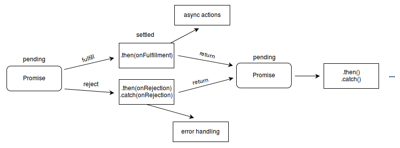

{{jsSidebar("JavaScript Guide")}} {{PreviousNext("Web/JavaScript/Guide/Grammar_and_types", "Web/JavaScript/Guide/Loops_and_iteration")}}

JavaScript поддерживает компактный набор инструкций, особенно управляющих инструкций, которые вы можете использовать, чтобы реализовать интерактивность в вашем приложении. В данной главе даётся обзор этих инструкций.

Более подробная информация об инструкциях, рассмотренных в данной главе, содержится в [справочнике по JavaScript](/ru/docs/Web/JavaScript/Reference/Statements). Точка с запятой (`;`) используется для разделения инструкций в коде.

Любое выражение (expression) в JavaScript является также инструкцией (statement). Чтобы получить более подробную информацию о выражениях, прочитайте [Выражения и операторы](/ru/docs/Web/JavaScript/Guide/Expressions_and_Operators).

## Инструкция block

Инструкция block является фундаментальной и используется для группировки других инструкций. Блок ограничивается фигурными скобками:

```
{ statement_1; statement_2; ... statement_n; }
```

Блок обычно используется с управляющими инструкциями (например, `if`, `for`, `while`).

```js
while (x < 10) {
  x++;
}
```

В вышеприведённом примере `{ x++; }` является блоком.

**Обратите внимание:** в JavaScript **отсутствует** область видимости блока до ECMAScript2015. Переменные, объявленные внутри блока, имеют область видимости функции (или скрипта), в которой находится данный блок, вследствие чего они сохранят свои значения при выходе за пределы блока. Другими словами, блок не создаёт новую область видимости. "Автономные" (standalone) блоки в JavaScript могут продуцировать полностью отличающийся результат, от результата в языках C или Java. Например:

```js
var x = 1;
{
  var x = 2;
}
console.log(x); // выведет 2
```

В вышеприведённом примере инструкция `var x` внутри блока находится в той же области видимости, что и инструкция `var x` перед блоком. В C или Java эквивалентный код выведет значение 1.

Начиная с ECMAScript 6, оператор `let` позволяет объявить переменную в области видимости блока. Чтобы получить более подробную информацию, прочитайте {{jsxref("Statements/let", "let")}}.

## Условные инструкции

Условная инструкция — это набор команд, которые выполняются, если указанное условие является истинным. JavaScript поддерживает две условные инструкции: `if...else` и `switch`.

### Инструкция if...else

Используйте оператор `if` для выполнения инструкции, если логическое условия истинно. Используйте опциональный `else`, для выполнения инструкции, если условие ложно. Оператор if выглядит так:

```js
if (condition) {
  statement_1;
} else {
  statement_2;
}
```

Здесь `condition` может быть любым выражением, вычисляемым как истинное (true) или ложное (false). Чтобы получить более подробную информацию о значениях `true` и `false`, прочитайте [Boolean](/ru/docs/Web/JavaScript/Reference/Global_Objects/Boolean#Description). Если условие оценивается как `true`, то выполняется `statement_1`, в противном случае - `statement_2`. Блоки `statement_1` и `statement_2` могут быть любыми блоками, включая также вложенные инструкции `if`.

Также вы можете объединить несколько инструкций, пользуясь `else if` для получения последовательности проверок условий:

```
if (condition_1) { statement_1;} else if (condition_2) { statement_2;} else if (condition_n) { statement_n; } else { statement_last;}
```

В случае нескольких условий только первое логическое условие, которое вычислится истинным (true), будет выполнено. Используйте блок (`{ ... }`) для группировки нескольких инструкций. Применение блоков является хорошей практикой, особенно когда используются вложенные инструкции `if`:

```
if (condition) {
  statement_1_runs_if_condition_is_true;
  statement_2_runs_if_condition_is_true;
} else {
  statement_3_runs_if_condition_is_false;
  statement_4_runs_if_condition_is_false;
}
```

Нежелательно использовать простые присваивания в условном выражении, т.к. присваивание может быть спутано с равенством при быстром просмотре кода. Например, не используйте следующий код:

```js-nolint example-bad
if (x = y) {
  /* ... */
}
```

Если вам нужно использовать присваивание в условном выражении, то распространённой практикой является заключение операции присваивания в дополнительные скобки. Например:

```js example-good
if ((x = y)) {
  /* ... */
}
```

#### Ложные значения

Следующие значения являются {{Glossary("Falsy", "ложными")}}:

- `false`
- `undefined`
- `null`
- `0`
- `NaN`
- пустая строка ( `""` )

Все остальные значения, включая все объекты, будут восприняты как истина при передаче в условное выражение.

Не путайте примитивные логические значения `true` и `false` со значениями true и false объекта {{jsxref("Boolean")}}. Например:

```js
var b = new Boolean(false);
if (b) // это условие true
if (b == true) // это условие false
```

В следующем примере функция `checkData` возвращает `true`, если число символов в объекте `Text` равно трём; в противном случае функция отображает окно alert и возвращает `false`.

```js
function checkData() {
  if (document.form1.threeChar.value.length == 3) {
    return true;
  } else {
    alert(
      "Enter exactly three characters. " +
        document.form1.threeChar.value +
        " is not valid.",
    );
    return false;
  }
}
```

### Инструкция switch

Инструкция `switch` позволяет сравнить значение выражения с различными вариантами и при совпадении выполнить соответствующий код. Инструкция имеет следующий вид:

```
switch (expression) {
   case label_1:
      statements_1
      [break;]
   case label_2:
      statements_2
      [break;]
   ...
   default:
      statements_default
      [break;]
}
```

Сначала производится поиск ветви `case` с меткой `label`, совпадающей со значением выражения `expression`. Если совпадение найдено, то соответствующий данной ветви код выполняется до оператора `break`, который прекращает выполнение `switch` и передаёт управление дальше. В противном случае управление передаётся необязательной ветви `default` и выполняется соответствующий ей код. Если ветвь `default` не найдена, то программа продолжит выполняться со строчки, следующей за инструкцией `switch`. По соглашению ветвь `default` является последней ветвью, но следовать этому соглашению необязательно.

Если оператор `break` отсутствует, то после выполнения кода, который соответствует выбранной ветви, начнётся выполнение кода, который следует за ней.

В следующем примере если `fruittype` имеет значение `"Bananas"`, то будет выведено сообщение `"Bananas are $0.48 a pound."` и оператор `break` прекратит выполнение `switch`. Если бы оператор `break` отсутствовал, то был бы также выполнен код, соответствующий ветви `"Cherries"`, т.е. выведено сообщение `"Cherries are $3.00 a pound."`.

```js
switch (fruittype) {
  case "Oranges":
    console.log("Oranges are $0.59 a pound.");
    break;
  case "Apples":
    console.log("Apples are $0.32 a pound.");
    break;
  case "Bananas":
    console.log("Bananas are $0.48 a pound.");
    break;
  case "Cherries":
    console.log("Cherries are $3.00 a pound.");
    break;
  case "Mangoes":
    console.log("Mangoes are $0.56 a pound.");
    break;
  case "Papayas":
    console.log("Mangoes and papayas are $2.79 a pound.");
    break;
  default:
    console.log("Sorry, we are out of " + fruittype + ".");
}
console.log("Is there anything else you'd like?");
```

## Инструкции обработки исключений

Инструкция `throw` используется, чтобы выбросить исключение, а инструкция `try...catch`, чтобы его обработать.

### Типы исключений

Практически любой объект может быть выброшен как исключение. Тем не менее, не все выброшенные объекты создаются равными. Обычно числа или строки выбрасываются как исключения, но часто более эффективным является использование одного из типов исключений, специально созданных для этой цели:

- [Исключения ECMAScript](/ru/docs/Web/JavaScript/Reference/Global_Objects/Error#Error_types)
- {{domxref("DOMException")}} и {{domxref("DOMError")}}

### Инструкция throw

Используйте инструкцию `throw`, чтобы выбросить исключение. При выбросе исключения нужно указать выражение, содержащее значение, которое будет выброшено:

```
throw expression;
```

Вы можете выбросить любое выражение, а не только выражения определённого типа. В следующем примере выбрасываются исключения различных типов:

```js
throw "Error2"; // string
throw 42; // number
throw true; // boolean
throw {
  toString: function () {
    return "I'm an object!";
  },
}; // object
```

> **Примечание:** Вы можете выбросить объект как исключение. Вы можете обращаться к свойствам данного объекта в блоке `catch`.

> **Примечание:** В следующем примере объект `UserException` выбрасывается как исключение:

```js
function UserException(message) {
  this.message = message;
  this.name = "UserException";
}

UserException.prototype.toString = function () {
  return this.name + ': "' + this.message + '"';
};

throw new UserException("Value too high");
```

### Инструкция try...catch

Инструкция `try...catch` состоит из блока `try`, который содержит одну или несколько инструкций, и блок `catch`, которые содержит инструкции, определяющие порядок действий при выбросе исключения в блоке `try`. Иными словами, если в блоке `try` будет выброшено исключение, то управление будет передано в блок `catch`. Если в блоке `try` не возникнет исключений, то блок `catch` будет пропущен. Блок `finally` будет выполнен после окончания работы блоков `try` и `catch`, вне зависимости от того, было ли выброшено исключение.

В следующем примере вызывается функция `getMonthName`, которая возвращает название месяца по его номеру. Если месяца с указанным номером не существует, то функция выбросит исключение `"InvalidMonthNo"`, которое будет перехвачено в блоке `catch`:

```js
function getMonthName(mo) {
  mo = mo - 1; // Adjust month number for array index (1 = Jan, 12 = Dec)
  var months = [
    "Jan",
    "Feb",
    "Mar",
    "Apr",
    "May",
    "Jun",
    "Jul",
    "Aug",
    "Sep",
    "Oct",
    "Nov",
    "Dec",
  ];
  if (months[mo]) {
    return months[mo];
  } else {
    throw "InvalidMonthNo"; //throw keyword is used here
  }
}

try {
  // statements to try
  monthName = getMonthName(myMonth); // function could throw exception
} catch (e) {
  monthName = "unknown";
  logMyErrors(e); // pass exception object to error handler -> your own
}
```

#### Блок `catch`

Используйте блок `catch`, чтобы обработать исключения, сгенерированные в блоке `try`.

```
catch (catchID) { statements }
```

JavaScript создаёт идентификатор `catchID`, которому присваивается перехваченное исключение, при входе в блок `catch`; данный идентификатор доступен только в пределах блока `catch` и уничтожается при выходе из него.

В следующем примере выбрасывается исключение, которое перехватывается в блоке `catch`:

```js
try {
  throw "myException";
} catch (e) {
  console.error(e);
}
```

#### Блок `finally`

Блок `finally` содержит код, который будет выполнен после окончания работы блоков `try` и `catch`, но до того, как будет выполнен код, который следует за инструкцией `try...catch`. Блок `finally` выполняется вне зависимости от того, было ли выброшено исключение. Блок `finally` выполняется даже в том случае, если исключение не перехватывается в блоке `catch`.

В следующем примере открывается файл, затем в блоке `try` происходит вызов функции `writeMyFile`, который может выбросить исключение. Если возникает исключение, то оно обрабатывается в блоке `catch`. В любом случае файл будет закрыт функцией `closeMyFile`, вызов которой находится в блоке `finally`.

```js
openMyFile();
try {
  writeMyFile(theData);
} catch (e) {
  handleError(e);
} finally {
  closeMyFile();
}
```

Если блок `finally` возвращает значение, то данное значение становится возвращаемым значением всей связки `try-catch-finally`. Значения, возвращаемые блоками `try` и `catch`, будут проигнорированы.

```js
function f() {
  try {
    console.log(0);
    throw "bogus";
  } catch (e) {
    console.log(1);
    return true; // приостанавливается до завершения блока `finally`
    console.log(2); // не выполняется
  } finally {
    console.log(3);
    return false; // заменяет предыдущий `return`
    console.log(4); // не выполняется
  }
  // `return false` выполняется сейчас
  console.log(5); // не выполняется
}
f(); // отображает 0, 1, 3 и возвращает `false`
```

Замена возвращаемых значений блоком `finally` распространяется в том числе и на исключения, которые выбрасываются или перевыбрасываются в блоке `catch`:

```js
function f() {
  try {
    throw "bogus";
  } catch (e) {
    console.log('caught inner "bogus"');
    throw e; // приостанавливается до завершения блока `finally`
  } finally {
    return false; // заменяет предыдущий `throw`
  }
  // `return false` выполняется сейчас
}

try {
  f();
} catch (e) {
  // Не выполняется, т.к. `throw` в `catch `заменяется на `return` в `finally`
  console.log('caught outer "bogus"');
}

// В результате отображается сообщение caught inner "bogus"
// и возвращается значение `false`
```

#### Вложенные инструкции `try...catch`

Вы можете вкладывать инструкции `try...catch` друг в друга. Если внутренняя инструкция `try...catch` не имеет блока `catch`, то она должна иметь блок finally, кроме того исключение будет перехвачено во внешнем блоке `catch`. Для получения большей информации ознакомьтесь с вложенными [try-блоками](/ru/docs/Web/JavaScript/Reference/Statements/try...catch#Nested_try-blocks).

### Использование объекта Error

В зависимости от типа ошибки вы можете использовать свойства `name` и `message`, чтобы получить более подробную информацию. Свойство `name` содержит название ошибки (например, `DOMException` или `Error`), свойство `message` — описание ошибки.

Если вы выбрасываете собственные исключения, то чтобы получить преимущество, которое предоставляют эти свойства (например, если ваш блок `catch` не делает различий между вашими исключениями и системными), используйте конструктор `Error`. Например:

```js
function doSomethingErrorProne() {
  if (ourCodeMakesAMistake()) {
    throw new Error("The message");
  } else {
    doSomethingToGetAJavascriptError();
  }
}

try {
  doSomethingErrorProne();
} catch (e) {
  console.log(e.name); // 'Error'
  console.log(e.message); // 'The message' или JavaScript error message
}
```

## Объект Promise

Начиная с ECMAScript2015, JavaScript поддерживает объект {{jsxref("Promise")}}, который используется для отложенных и асинхронных операций.

Объект `Promise` может находиться в следующих состояниях:

- _ожидание (pending)_: начальное состояние, не выполнено и не отклонено.
- _выполнено (fulfilled)_: операция завершена успешно.
- _отклонено (rejected)_: операция завершена с ошибкой.
- _заданный (settled)_: промис выполнен или отклонен, но не находится в состоянии ожидания.



### Загрузка изображения при помощи XHR

Простой пример использования объектов `Promise` и [`XMLHttpRequest`](/ru/docs/Web/API/XMLHttpRequest) для загрузки изображения доступен в репозитории MDN [promise-test](https://github.com/mdn/js-examples/tree/master/promises-test) на GitHub. Вы также можете [посмотреть его в действии](https://mdn.github.io/js-examples/promises-test/). Каждый шаг прокомментирован, что позволяет вам разобраться в архитектуре `Promise` и XHR. Здесь приводится версия без комментариев:

```js
function imgLoad(url) {
  return new Promise(function (resolve, reject) {
    var request = new XMLHttpRequest();
    request.open("GET", url);
    request.responseType = "blob";
    request.onload = function () {
      if (request.status === 200) {
        resolve(request.response);
      } else {
        reject(
          Error(
            "Image didn't load successfully; error code:" + request.statusText,
          ),
        );
      }
    };
    request.onerror = function () {
      reject(Error("There was a network error."));
    };
    request.send();
  });
}
```

{{PreviousNext("Web/JavaScript/Guide/Grammar_and_types", "Web/JavaScript/Guide/Loops_and_iteration")}}
