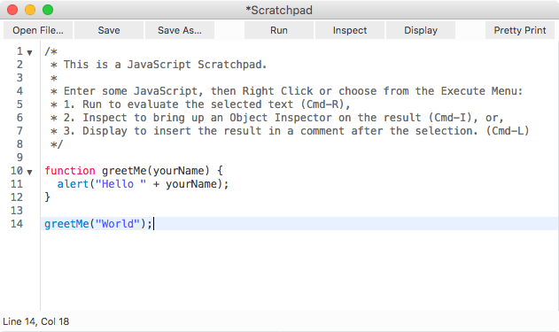

{{jsSidebar("JavaScript Guide")}} {{PreviousNext("Web/JavaScript/Guide", "Web/JavaScript/Guide/Values,_variables,_and_literals")}}

Данная глава является введением в JavaScript и рассматривает некоторые его фундаментальные концепции.

## Что вам уже следует знать?

В данном руководстве предполагается, что вы имеете:

- Общее понимание Internet и World Wide Web ({{Glossary("WWW")}}).
- Хорошее знание HyperText Markup Language ({{Glossary("HTML")}}).
- Некоторый опыт программирования. Если вы являетесь новичком в программировании, то ознакомьтесь с руководствами, приведёнными на странице по [JavaScript](/ru/docs/Web/JavaScript).

## Где можно найти информацию о JavaScript?

Документация по JavaScript на MDN включает:

- [Изучение Web](/ru/docs/Learn) предоставляет информацию для начинающих и вводит в базовые концепции программирования и Internet.
- [Руководство по JavaScript](/ru/docs/Web/JavaScript/Guide) (данное руководство) предоставляет обзор JavaScript и его объектов.
- [Справочник по JavaScript](/ru/docs/Web/JavaScript/Reference) предоставляет подробную информацию по JavaScript.

Если вы являетесь новичком в JavaScript, то начните с [Изучение Web](/ru/docs/Learn) и [Руководство по JavaScript](/ru/docs/Web/JavaScript/Guide). Как только вы освоите фундаментальные концепции, используйте [Справочник по JavaScript](/ru/docs/Web/JavaScript/Reference) для того, чтобы получить более подробную информацию о конкретных объектах или операторах.

## Что такое JavaScript?

JavaScript — это кросс-платформенный, объектно-ориентированный скриптовый язык, являющийся небольшим и легковесным. Внутри среды исполнения JavaScript может быть связан с объектами данной среды и предоставлять программный контроль над ними.

JavaScript включает стандартную библиотеку объектов, например, `Array`, `Date` и `Math`, а также базовый набор языковых элементов, например, операторы и управляющие конструкции. Ядро JavaScript может быть расширено для различных целей путём добавления в него новых объектов, например:

- JavaScript на стороне клиента расширяет ядро языка, предоставляя объекты для контроля браузера и его Document Object Model (DOM). Например, клиентские расширения позволяют приложению размещать элементы в форме HTML и обрабатывать пользовательские события, такие как щелчок мыши, ввод данных в форму и навигация по страницам.
- JavaScript на стороне сервера расширяет ядро языка, предоставляя объекты для запуска JavaScript на сервере. Например, расширение на стороне сервера позволяет приложению соединяться с базой данных, обеспечивать непрерывность информации между вызовами приложения или выполнять манипуляции над файлами на сервере.

## JavaScript и Java

JavaScript и Java похожи в одних отношениях, но фундаментально отличны в других. Javascript напоминает Java, но не имеет статической типизации и строгой проверки типов, которыми обладает Java. JavaScript следует большей части синтаксиса Java в выражениях, соглашениях об именовании и основного потока управления конструкциями, поэтому он был переименован из LiveScript в JavaScript.

В отличие от системы скомпилированных классов Java, построенной на объявлениях, JavaScript поддерживает систему исполнения, основанную на небольшом числе типов данных, представляющих числовые, логические и строковые значения. JavaScript имеет объектную модель на базе прототипов вместо более общей модели на базе классов. Модель объектов на базе прототипов предоставляет динамическое наследование, т.е. то, что наследуется, может отличаться для отдельных объектов. JavaScript также поддерживает функции без каких-либо специальных декларативных требований. Функции могут быть свойствами объектов, выполняться как свободно-типизированные методы.

По сравнению с Java, JavaScript является языком с очень свободной формой. Вам не надо объявлять переменные, классы и методы. Вам не надо беспокоиться о том, являются ли методы публичными (public), приватными (private) или защищёнными (protected), а также вам не надо реализовывать интерфейсы. Переменные, параметры и возвращаемые функциями типы не являются явно типизированными.

Java — это язык программирования, основанный на классах и предназначенный для быстрого выполнения и безопасности типов. Безопасность типов означает, например, что вы не можете привести тип integer к типу object reference или получить доступ к приватной памяти, изменяя байт-код Java. Ориентированная на классы модель Java означает, что программы состоят исключительно из классов и их методов. Наследование классов и строгая типизация в Java обычно требуют тесно связанные иерархии объектов. Эти требования делают программирование на Java более комплексным, чем программирование на JavaScript.

По духу JavaScript происходит от небольших, динамически типизированных языков, таких как HyperTalk и dBASE. Эти скриптовые языки предлагают инструменты программирования для гораздо более широкой аудитории благодаря более простому синтаксису, специализированной встроенной функциональности и минимальным требованиям для создания объектов.

| JavaScript                                                                                                                                                                           | Java                                                                                                                                                                              |
| ------------------------------------------------------------------------------------------------------------------------------------------------------------------------------------ | --------------------------------------------------------------------------------------------------------------------------------------------------------------------------------- |
| Объектно-ориентированный. Нет различий между типами объектов. Наследование реализовано через механизм прототипов, свойства и методы могут быть добавлены в любой объект динамически. | На базе классов. Объекты делятся на классы и экземпляры с наследованием через классовую иерархию. Классы и экземпляры не могут иметь динамически добавленные свойства или методы. |
| Типы данных переменных не объявляются (динамическая типизация).                                                                                                                      | Типы данных переменных должны быть объявлены (статическая типизация).                                                                                                             |
| Не может автоматически записывать на жёсткий диск.                                                                                                                                   | Может автоматически записывать на жёсткий диск.                                                                                                                                   |

Для получения дополнительной информации о различиях между JavaScript и Java, прочитайте [Details of the object model](/ru/docs/Web/JavaScript/Guide/Details_of_the_Object_Model).

## JavaScript и спецификация ECMAScript

JavaScript стандартизирован европейской ассоциацией [Ecma International](http://www.ecma-international.org/), деятельность которой посвящена стандартизации информационных и коммуникационных систем (изначально ECMA являлся акронимом European Computer Manufacturers Association). Эта стандартизированная версия JavaScript, называемая ECMAScript, работает одинаково во всех приложениях, поддерживающих стандарт. Компании могут использовать открытый стандарт языка, чтобы разработать собственную реализацию JavaScript. Стандарт ECMAScript задокументирован в спецификации ECMA-262.

Стандарт ECMA-262 также утверждён [ISO](http://www.iso.org/iso/home.html) (International Organization for Standardization) как ISO-16262. Вы можете найти спецификацию на [сайте Ecma International](http://www.ecma-international.org/publications/standards/Ecma-262.htm). Спецификация ECMAScript не описывает Document Object Model (DOM), которая стандартизирована [World Wide Web Consortium (W3C)](http://www.w3.org/). DOM определяет способ для доступа к объектам HTML документа из вашего скрипта. Чтобы получить более точное представление о различных технологиях, используемых при программировании на JavaScript, прочитайте [Обзор JavaScript](/ru/docs/Web/JavaScript/JavaScript_technologies_overview).

### Документация JavaScript против спецификации ECMAScript

Спецификация ECMAScript — это набор требований, касающихся реализации ECMAScript. Она предназначена для реализации языковых возможностей, соответствующих стандарту, в вашей реализации ECMAScript или движке (например, SpiderMonkey в Firefox или V8 в Google Chrome).

Документ ECMAScript не предназначен для помощи программистам в создании скриптов; чтобы получить информацию о том, как писать скрипты, используйте документацию JavaScript.

Спецификация ECMAScript использует терминологию и синтаксис, которые могут быть незнакомы JavaScript-программистам. Хотя описание языка может отличаться в ECMAScript, но сам язык остаётся таким же. JavaScript поддерживает всю функциональность, описанную в спецификации ECMAScript.

Документация JavaScript описывает аспекты языка, являющиеся подходящими для JavaScript-программиста.

## Начинаем знакомство с JavaScript

Все, что вам нужно для знакомства с JavaScript — это современный браузер. Данное руководство включает некоторые возможности JavaScript, которые на данный момент доступны только в последних версиях Firefox, поэтому рекомендуется использовать последнюю версию Firefox.

В Firefox встроены два инструмента, полезных для экспериментирования с JavaScript: Web Console и Scratchpad.

### Web Console

[Web Console](/ru/docs/Tools/Web_Console) отображает информацию о текущей загруженной веб-странице, а также включает [командную строку](/ru/docs/Tools/Web_Console#The_command_line_interpreter), которую вы можете использовать, чтобы выполнить выражения JavaScript на текущей странице.

Чтобы открыть Web Console, выберите "Web Console" из меню "Web Developer", которое находится под меню "Tools" в Firefox. Консоль появится в нижней части окна браузера. Вдоль нижней части консоли размещается командная строка, которую вы можете использовать для ввода JavaScript, результат выполнения появится на панели выше:


```
function greetMe(yourName) {
  alert('Hello ' + yourName);
}
console.log(eval('3 + 5'));
```

### Scratchpad

Web Console отлично подходит для выполнения одиночных строк JavaScript, но хотя вы можете выполнить и несколько строк, это не очень удобно, к тому же вы не можете сохранить ваш код, используя Web Console. Поэтому для более комплексных примеров [Scratchpad](/ru/docs/Tools/%D0%A7%D0%B5%D1%80%D0%BD%D0%BE%D0%B2%D0%B8%D0%BA) является более подходящим инструментом.

Чтобы открыть Scratchpad(<kbd>Shift</kbd>+<kbd>F4</kbd>), выберите "Scratchpad" из меню "Web Developer", которое находится под меню "Tools" в Firefox. Блокнот будет открыт в отдельном окне, вы можете использовать его для создания и выполнения JavaScript в браузере. Вы также можете сохранять ваши скрипты на жёсткий диск, а потом загружать их.

Если вы выберете "Display", то код в вашем блокноте будет выполнен в браузере, а результат вставлен обратно в блокнот как комментарий:



### Hello world

Чтобы начать писать JavaScript-код откройте Scratchpad и напишите свой первый "Hello World!" код:

```js
(function () {
  "use strict";
  /* Start of your code */
  function greetMe(yourName) {
    alert("Hello " + yourName);
  }

  greetMe("World");
  /* End of your code */
})();
```

Выберите код на панели и зажмите Ctrl + R, чтобы открыть код в браузере! На следующих страницах мы изучим синтаксис и возможности JS, чтобы вы могли написать более сложное приложение. Не забывайте добавлять перед кодом `(function(){"use strict";` и `})();` после. вы узнаете, что это означает, а пока считайте, что это —

1. Значительно улучшает производительность

2. Предотвращает структуры, которые могут запутать вас на начальном этапе.

3. Предотвращает взаимодействие фрагментов кода, выполняемых в консоли.

{{PreviousNext("Web/JavaScript/Guide", "Web/JavaScript/Guide/Grammar_and_types")}}
