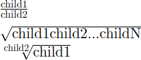

{{PreviousMenuNext("Web/MathML/Tutorials/For_beginners/Text_containers", "Web/MathML/Tutorials/For_beginners/Scripts", "Web/MathML/Tutorials/For_beginners")}}

В этой статье рассказывается, как на основе текстовых контейнеров создавать более сложные выражения MathML, вкладывая друг в друга дроби и корни.

## Поддеревья элементов \<mfrac>, \<msqrt> и \<mroot>

В статье о [начале работы с MathML](/ru/docs/Web/MathML/Tutorials/For_beginners/Getting_started) уже рассматривался элемент `<mfrac>` для описания дроби. В следующем простом примере к нему добавлены новые элементы для корней — `<msqrt>` и `<mroot>`:

```html
<math>
  <mfrac>
    <mtext>дочерний элемент 1</mtext>
    <mtext>дочерний элемент 2</mtext>
  </mfrac>
</math>
<br />
<math>
  <msqrt>
    <mtext>дочерний элемент 1</mtext>
    <mtext>дочерний элемент 2</mtext>
    <mtext>...</mtext>
    <mtext>дочерний элемент N</mtext>
  </msqrt>
</math>
<br />
<math>
  <mroot>
    <mtext>дочерний элемент 1</mtext>
    <mtext>дочерний элемент 2</mtext>
  </mroot>
</math>
```

Ниже показан снимок результата отображения в браузере:



- Элемент `<mfrac>` отображается как дробь: первый дочерний элемент (числитель) располагается над вторым (знаменателем), а между ними проводится горизонтальная черта.
- Элемент `<msqrt>` отображается как квадратный корень: его дочерние элементы располагаются так же, как в [`<mrow>`](/ru/docs/Web/MathML/Tutorials/For_beginners/Getting_started#группировка_с_помощью_элемента_mrow), перед ними ставится знак корня √, а сверху проводится черта, охватывающая всё содержимое.
- Наконец, элемент `<mroot>` отображается как корень n-й степени: первый элемент находится под знаком корня, а второй используется как показатель степени корня и отображается слева в виде верхнего индекса.

### Вложение разных элементов

Следующее упражнение поможет проверить понимание связи между поддеревом MathML и его визуальным представлением. Документ содержит формулу MathML. Отметьте все варианты, описывающие поддеревья этой формулы. После выполнения можно изучить исходный код формулы MathML и проверить ответ.

```html hidden
<!doctype html>
<html lang="ru">
  <head>
    <meta charset="utf-8" />
    <title>Моя страница с математическими символами</title>
    <link
      rel="stylesheet"
      href="https://fred-wang.github.io/MathFonts/LatinModern/mathfonts.css" />
  </head>
  <body>
    <p>
      <math>
        <mfrac id="mfrac1">
          <msqrt id="msqrt1">
            <mn>2</mn>
          </msqrt>
          <mroot id="mroot1">
            <mn>4</mn>
            <mn>3</mn>
          </mroot>
        </mfrac>
        <mo>+</mo>
        <mroot id="mroot2">
          <mn>5</mn>
          <mfrac id="mfrac2">
            <mn>6</mn>
            <mn>7</mn>
          </mfrac>
        </mroot>
        <mo>+</mo>
        <msqrt id="msqrt2">
          <mn>8</mn>
          <mo>−</mo>
          <mn>9</mn>
        </msqrt>
      </math>
    </p>

    <ol id="options">
      <li>
        <input
          type="checkbox"
          data-comment="Проверьте порядок дочерних элементов mfrac!" />
        Элемент mfrac, первым дочерним элементом которого является mroot, а
        вторым — msqrt.
      </li>
      <li>
        <input
          type="checkbox"
          data-highlight="mroot2"
          data-comment="Корень из пяти степени «шесть седьмых»." />
        Элемент mroot, первым дочерним элементом которого является mn, а вторым
        — mfrac.
      </li>
      <li>
        <input
          type="checkbox"
          data-comment="В этой формуле нет дроби внутри квадратного корня!" />
        Элемент msqrt, содержащий элемент mfrac.
      </li>
      <li>
        <input
          type="checkbox"
          data-comment="Квадратный корень из двух."
          data-highlight="msqrt1" />
        Элемент msqrt с одним дочерним элементом mn.
      </li>
      <li>
        <input
          type="checkbox"
          data-comment="Проверьте порядок дочерних элементов mroot!" />
        Элемент mroot, первым дочерним элементом которого является mfrac, а
        вторым — mn.
      </li>
      <li>
        <input
          type="checkbox"
          data-comment="Квадратный корень из выражения «восемь минус девять»."
          data-highlight="msqrt2" />
        Элемент msqrt со следующими дочерними элементами: mn, mo, mn.
      </li>
      <li>
        <input
          type="checkbox"
          data-comment="Квадратный корень из двух, делённый на кубический корень из четырёх."
          data-highlight="mfrac1" />
        Элемент mfrac, первым дочерним элементом которого является msqrt, а
        вторым — mroot.
      </li>
      <li>
        <input
          type="checkbox"
          data-comment="У mfrac должно быть ровно два дочерних элемента!" />
        Элемент mfrac со следующими дочерними элементами: msqrt, mn, msqrt.
      </li>
      <li>
        <input
          type="checkbox"
          data-comment="У mroot должно быть ровно два дочерних элемента!" />
        Элемент mroot с одним дочерним элементом mn.
      </li>
      <li>
        <input
          type="checkbox"
          data-comment="Дробь шесть седьмых."
          data-highlight="mfrac2" />
        Элемент mfrac с двумя дочерними элементами mn.
      </li>
      <li>
        <input
          type="checkbox"
          data-comment="В этой формуле нет квадратного корня, содержащего больше двух чисел!" />
        Элемент msqrt с пятью дочерними элементами mn.
      </li>
      <li>
        <input
          type="checkbox"
          data-highlight="mroot1"
          data-comment="Кубический корень из четырёх." />
        Элемент mroot с двумя дочерними элементами mn.
      </li>
    </ol>
    <p>
      <strong id="comment"></strong>
    </p>
    <p>
      <strong id="status"></strong>
    </p>
  </body>
</html>
```

```css hidden
math {
  font-family: "Latin Modern Math", "STIX Two Math", math;
  font-size: 200%;
}
math .highlight {
  background: pink;
}
math [id] .highlight {
  background: lightblue;
}
p {
  padding: 0.5em;
}
```

```js hidden
const options = document.getElementById("options");
const comment = document.getElementById("comment");
const checkboxes = Array.from(options.getElementsByTagName("input"));
const status = document.getElementById("status");
function verifyOption(checkbox) {
  const mathml = checkbox.dataset.highlight
    ? document.getElementById(checkbox.dataset.highlight)
    : null;
  if (checkbox.checked) {
    comment.textContent = checkbox.dataset.comment;
    if (mathml) {
      mathml.classList.add("highlight");
    } else {
      checkbox.checked = false;
    }
  } else {
    comment.textContent = "";
    if (mathml) {
      mathml.classList.remove("highlight");
    }
  }
  const finished = checkboxes.every(
    (checkbox) => !!checkbox.checked === !!checkbox.dataset.highlight,
  );
  status.textContent = finished
    ? "Поздравляем, все правильные варианты отмечены!"
    : "";
}
checkboxes.forEach((checkbox) => {
  checkbox.addEventListener("change", () => {
    verifyOption(checkbox);
  });
});
```

{{ EmbedLiveSample('nesting_different_elements', 700, 600, "", "") }}

## Растягивающиеся знаки корня

Как было показано выше, верхняя черта элементов `<msqrt>` и `<mroot>` растягивается по горизонтали, охватывая их содержимое. Сам знак корня √ также растягивается по вертикали до высоты содержимого.

```html hidden
<link
  rel="stylesheet"
  href="https://fred-wang.github.io/MathFonts/LatinModern/mathfonts.css" />
```

```html
<math display="block">
  <mroot>
    <msqrt>
      <mfrac>
        <mn>1</mn>
        <mn>2</mn>
      </mfrac>
    </msqrt>
    <mn>3</mn>
  </mroot>
</math>
```

{{ EmbedLiveSample('Stretchy_radical_symbols', 700, 200, "", "") }}

> [!WARNING]
> Для такого растяжения обычно требуются специальные [математические шрифты](/ru/docs/Web/MathML/Guides/Fonts). В предыдущем примере используются [веб-шрифты](/ru/docs/Learn_web_development/Core/Text_styling/Web_fonts).

## Дроби без черты

Некоторые математические понятия записываются с помощью обозначений, похожих на дроби. К ним относятся, например, [биномиальные коэффициенты](https://ru.wikipedia.org/wiki/Биномиальный_коэффициент) и [символы Лежандра](https://ru.wikipedia.org/wiki/Символ_Лежандра). Для разметки таких обозначений подходит элемент `<mfrac>`. Если горизонтальная черта не нужна, элементу `<mfrac>` следует добавить атрибут `linethickness="0"`:

```html hidden
<link
  rel="stylesheet"
  href="https://fred-wang.github.io/MathFonts/LatinModern/mathfonts.css" />
```

```html
<math display="block">
  <mrow>
    <mo>(</mo>
    <mfrac linethickness="0">
      <mn>3</mn>
      <mn>2</mn>
    </mfrac>
    <mo>)</mo>
  </mrow>
  <mo>=</mo>
  <mn>3</mn>
  <mo>≠</mo>
  <mfrac>
    <mn>3</mn>
    <mn>2</mn>
  </mfrac>
</math>
```

{{ EmbedLiveSample('Fraction_without_bar', 700, 200, "", "") }}

> [!NOTE]
> Хотя атрибут `linethickness` позволяет задать произвольную толщину черты, лучше сохранить значение по умолчанию, вычисляемое на основе параметров математического шрифта.

## Итоги

В этой статье было показано, как создавать дроби и корни с помощью элементов `<mfrac>`, `<msqrt>` и `<mroot>`. Были рассмотрены особенности этих элементов: дробная черта и знак корня, а также использование атрибута `linethickness` для отображения дробей без черты. Следующая статья продолжает знакомство с основными математическими обозначениями и посвящена [индексам](/ru/docs/Web/MathML/Tutorials/For_beginners/Scripts).

## Смотрите также

- [Элемент `<mfrac>`](/ru/docs/Web/MathML/Reference/Element/mfrac)
- [Элемент `<msqrt>`](/ru/docs/Web/MathML/Reference/Element/msqrt)
- [Элемент `<mroot>`](/ru/docs/Web/MathML/Reference/Element/mroot)

{{PreviousMenuNext("Web/MathML/Tutorials/For_beginners/Text_containers", "Web/MathML/Tutorials/For_beginners/Scripts", "Web/MathML/Tutorials/For_beginners")}}
