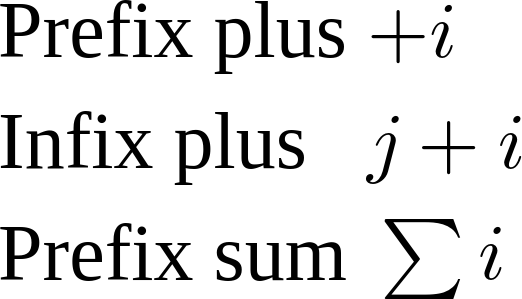

{{PreviousMenuNext("Web/MathML/Tutorials/For_beginners/Getting_started", "Web/MathML/Tutorials/For_beginners/Fractions_and_roots", "Web/MathML/Tutorials/For_beginners")}}

После знакомства с основами MathML внимание уделяется текстовым контейнерам (переменным, числам, операторам и так далее), из которых строятся формулы MathML.

## Математические символы Unicode

В математических формулах используется множество специальных символов, например греческие буквы (Δ), готические буквы (𝔄), буквы с двойным штрихом (ℂ), бинарные операторы (≠), стрелки (⇒), знаки интеграла (∮), знаки суммирования (∑), логические символы (∀), ограничители (⌊) и многие другие. Обзор таких символов приведён в статье Википедии [«Математические знаки и символы в Юникоде»](https://ru.wikipedia.org/wiki/Математические_знаки_и_символы_в_Юникоде).

Поскольку большинство этих символов не входит в блок Unicode «Основная латиница», рекомендуется указывать [кодировку документа](/ru/docs/Learn_web_development/Core/Structuring_content/Webpage_metadata#specifying_your_documents_character_encoding) и подключать подходящие [веб-шрифты](/ru/docs/Learn_web_development/Core/Text_styling/Web_fonts). Ниже приведён простой шаблон с кодировкой UTF-8 и шрифтом [Latin Modern Math](/ru/docs/Web/MathML/Guides/Fonts#fonts_with_a_math_table):

```html
<!doctype html>
<html lang="ru">
  <head>
    <meta charset="utf-8" />
    <title>Моя страница с математическими символами</title>
    <link
      rel="stylesheet"
      href="https://fred-wang.github.io/MathFonts/LatinModern/mathfonts.css" />
  </head>
  <body>
    <p>∀A∊𝔰𝔩(n,𝔽),TrA=0</p>
  </body>
</html>
```

```css
p {
  font-family: "Latin Modern Math", math;
}
```

{{ EmbedLiveSample('Unicode_characters_for_mathematics', 700, 100, "", "") }}

## Немного о семантике

В статье о [начале работы с MathML](/ru/docs/Web/MathML/Tutorials/For_beginners/Getting_started) было показано, что текст в формулах MathML помещается в специальные контейнеры, такие как `<mn>` и `<mo>`. Любой текст в формуле MathML должен находиться внутри такого контейнера, называемого _токен-элементом_. В MathML предусмотрено несколько токен-элементов, позволяющих различать смысл текстового содержимого:

- Элемент `<mi>` представляет идентификатор: символьное имя или произвольный текст. Примеры: `<mi>x</mi>` (переменная), `<mi>cos</mi>` (имя функции) и `<mi>π</mi>` (символьная константа).
- Элемент `<mn>` представляет числовой литерал или другие данные, которые должны отображаться как числовой литерал. Примеры: `<mn>2</mn>` (целое число), `<mn>0.123</mn>` (десятичное число) и `<mn>0xFFEF</mn>` (шестнадцатеричное значение).
- Элемент `<mo>` представляет оператор или любое содержимое, которое должно отображаться как оператор. Например, `<mo>+</mo>` (бинарная операция), `<mo>≤</mo>` (бинарное отношение), `<mo>∑</mo>` (знак суммирования) и `<mo>[</mo>` (ограничитель).
- Элемент `<mtext>` используется для произвольного текста, например коротких слов в формулах: `<mtext>если<mtext>` или `<mtext>переходит в</mtext>`.

### Самостоятельное задание: распознавание токен-элементов

Ниже приведён более сложный пример, утверждающий, что модуль вещественного числа равен этому числу тогда и только тогда, когда оно неотрицательно. Попробуйте найти разные токен-элементы и определить их назначение. При нажатии соответствующий текст выделяется и появляется подтверждающее сообщение.

```html hidden live-sample___recognize_token_elements
<!doctype html>
<html lang="ru">
  <head>
    <meta charset="utf-8" />
    <title>Моя страница с математическими символами</title>
    <link
      rel="stylesheet"
      href="https://fred-wang.github.io/MathFonts/LatinModern/mathfonts.css" />
  </head>
  <body>
    <math display="block">
      <mrow>
        <mrow>
          <mo>|</mo>
          <mi>x</mi>
          <mo>|</mo>
        </mrow>
        <mo>=</mo>
        <mi>x</mi>
      </mrow>
      <mtext>&nbsp;тогда и только тогда, когда&nbsp;</mtext>
      <mrow>
        <mi>x</mi>
        <mo>≥</mo>
        <mn>0</mn>
      </mrow>
    </math>
    <input type="button" id="clearOutput" value="Сбросить" />
    <div id="output"></div>
  </body>
</html>
```

```css hidden live-sample___recognize_token_elements
.highlight {
  color: red;
}
math {
  font-size: 200%;
}
```

```js hidden live-sample___recognize_token_elements
const tokenElements = Array.from(
  document.querySelectorAll("mi, mo, mn, mtext"),
);
const outputDiv = document.getElementById("output");
function clearHighlight() {
  tokenElements.forEach((token) => {
    token.classList.remove("highlight");
  });
}
tokenElements.forEach((token) => {
  token.addEventListener("click", () => {
    clearHighlight();
    token.classList.add("highlight");
    outputDiv.insertAdjacentHTML(
      "beforeend",
      `<p><strong>Выбран элемент <code>&lt;${token.tagName}&gt;</code>.</strong></p>`,
    );
  });
});
document.getElementById("clearOutput").addEventListener("click", () => {
  clearHighlight();
  outputDiv.textContent = "";
});
```

{{ EmbedLiveSample('recognize_token_elements', 700, 400, "", "") }}

В завершение изучите исходный код MathML и проверьте свои предположения:

```xml
<math display="block">
  <mrow>
    <mrow>
      <mo>|</mo>
      <mi>x</mi>
      <mo>|</mo>
    </mrow>
    <mo>=</mo>
    <mi>x</mi>
  </mrow>
  <mtext>&nbsp;тогда и только тогда, когда&nbsp;</mtext>
  <mrow>
    <mi>x</mi>
    <mo>≥</mo>
    <mn>0</mn>
  </mrow>
</math>
```

> [!NOTE]
> Иногда трудно решить, какой токен-элемент использовать для конкретного текста. На практике ошибочный выбор не должен приводить к серьёзным проблемам, поскольку браузеры обычно одинаково обрабатывают все токен-элементы — как при визуальном отображении, так и для вспомогательных технологий. Однако элементы `<mi>` и `<mo>` обладают особыми отличительными свойствами, которые рассматриваются в следующих разделах.

## Автоматическое выделение \<mi> курсивом

Одна из математических типографских традиций — выделять переменные курсивом. Поэтому элементы `<mi>` с одним символом могут автоматически отображаться курсивом. Это относится ко всем буквам латинского и греческого алфавитов. Сравните отображение двух элементов `<mi>` в следующей формуле:

```html
<math>
  <mi>sin</mi>
  <mi>x</mi>
</math>
```

{{ EmbedLiveSample('Automatic italicization of <mi>', 700, 50) }}

> [!NOTE]
> В [этой таблице спецификации MathML Core](https://w3c.github.io/mathml-core/#italic-mappings) приведён полный список символов, которые выделяются курсивом, вместе с соответствующими курсивными символами.

## Отмена автоматического выделения \<mi> курсивом

Чтобы отменить применяемое по умолчанию выделение курсивом, элементу `<mi>` можно добавить атрибут `mathvariant="normal"`.
Сравните отображение прописных букв гамма в следующей формуле:

```html
<math>
  <mi>Γ</mi>
  <mi mathvariant="normal">Γ</mi>
</math>
```

{{ EmbedLiveSample('Reverting automatic italicization of <mi>', 700, 50) }}

> [!NOTE]
> Хотя это преобразование можно применить, обычно достаточно использовать нужные [математические буквенно-цифровые символы](https://en.wikipedia.org/wiki/Mathematical_Alphanumeric_Symbols) (англ.).

## Свойства операторов \<mo>

MathML содержит [словарь операторов](https://w3c.github.io/mathml-core/#operator-dictionary-human), который определяет свойства элементов `<mo>` по умолчанию в зависимости от их содержимого и положения в контейнере (префиксного, инфиксного или постфиксного). Рассмотрим конкретный пример:

```html
<table>
  <tbody>
    <tr>
      <td>Префиксный плюс</td>
      <td>
        <math>
          <mo>+</mo>
          <mi>i</mi>
        </math>
      </td>
    </tr>
    <tr>
      <td>Инфиксный плюс</td>
      <td>
        <math>
          <mi>j</mi>
          <mo>+</mo>
          <mi>i</mi>
        </math>
      </td>
    </tr>
    <tr>
      <td>Префиксный знак суммы</td>
      <td>
        <math>
          <mo>∑</mo>
          <mi>i</mi>
        </math>
      </td>
    </tr>
  </tbody>
</table>
```

Пример должен отображаться примерно так же, как на снимке экрана ниже. Обратите внимание на интервалы между элементами `<mi>i</mi>` и предшествующими им `<mo>`: у префиксного плюса интервала нет, у инфиксного плюса он есть, а у префиксного знака суммирования он немного меньше.



У операторов есть много других свойств, которые подробнее рассматриваются далее. Пока достаточно помнить, что для символов из словаря операторов следует использовать контейнер `<mo>`, а подвыражения нужно правильно группировать с помощью элементов `<mrow>`, чтобы средства рендеринга MathML могли корректно их обработать.

### Найдите отличия

Теперь, после знакомства с особенностями `<mi>` и `<mo>`, перепишите элемент `<p>` из [примера в начале страницы](#математические_символы_unicode), используя MathML. Сравните результат в браузере с текстовой версией и объясните различия.

```html
<!doctype html>
<html lang="ru">
  <head>
    <meta charset="utf-8" />
    <title>Моя страница с математическими символами</title>
    <link
      rel="stylesheet"
      href="https://fred-wang.github.io/MathFonts/LatinModern/mathfonts.css" />
  </head>
  <body>
    <p class="text">∀A∊𝔰𝔩(n,𝔽),TrA=0</p>
    <p>
      <math>
        <mo>∀</mo>
        <mrow>
          <mi>A</mi>
          <mo>∊</mo>
          <mrow>
            <mi>𝔰𝔩</mi>
            <mrow>
              <mo>(</mo>
              <mi>n</mi>
              <mo>,</mo>
              <mi>𝔽</mi>
              <mo>)</mo>
            </mrow>
          </mrow>
        </mrow>
        <mo>,</mo>
        <mrow>
          <mrow>
            <mi>Tr</mi>
            <mi>A</mi>
          </mrow>
          <mo>=</mo>
          <mn>0</mn>
        </mrow>
      </math>
    </p>
    <input id="showSolution" type="button" value="Показать решение" />
    <div id="solution"></div>
  </body>
</html>
```

```css hidden
div {
  padding: 0.5em;
}

.text {
  font-family: "Latin Modern Math", math;
}
```

```js hidden
document.getElementById("showSolution").addEventListener(
  "click",
  () => {
    document.getElementById("solution").insertAdjacentHTML(
      "beforeEnd",
      `<ul>
      <li><strong>Элементы <code>&lt;mi&gt;</code> с переменными «A» и «n» отображаются курсивом</strong>. При этом элементы <code>&lt;mi&gt;</code> с несколькими символами «𝔰𝔩» или с символом «𝔽» по-прежнему отображаются прямым шрифтом.</li>
      <li><strong>Возле элементов <code>&lt;mo&gt;</code> с символами «∀», «∊», «=» или запятой автоматически добавляются интервалы</strong>. Однако перед некоторыми из них интервала нет, а возле круглых скобок интервалы не добавляются вовсе.</li>
    </ul>`,
    );
  },
  { once: true },
);
```

{{ EmbedLiveSample('spot_the_difference', 700, 500, "", "") }}

> [!NOTE]
> Очевидное отличие состоит в том, что с MathML исходный код стал гораздо объёмнее. Это руководство предназначено для изучения языка, но на практике содержимое MathML обычно не пишут вручную. Дополнительную информацию можно найти на странице [«Создание MathML»](/ru/docs/Web/MathML/Guides/Authoring).

### Распознавание растягивающихся операторов

Для некоторых операторов словарь задаёт по умолчанию свойство _растяжимости_ и соответствующую _ось растяжения_. Например, оператор может по умолчанию растягиваться по вертикали до максимальной высоты нерастягивающихся соседних элементов внутри своего контейнера `<mrow>`. После небольшого изменения [предыдущего упражнения](#самостоятельное_задание_распознавание_токен-элементов) некоторые операторы стали растягиваться по вертикали. Попробуйте их найти.

```html hidden
<!doctype html>
<html lang="ru">
  <head>
    <meta charset="utf-8" />
    <title>Моя страница с растягивающимися операторами</title>
    <link
      rel="stylesheet"
      href="https://fred-wang.github.io/MathFonts/LatinModern/mathfonts.css" />
  </head>
  <body>
    <math display="block">
      <mrow>
        <mrow>
          <mo>|</mo>
          <mfrac>
            <mn>1</mn>
            <mi>x</mi>
          </mfrac>
          <mo>|</mo>
        </mrow>
        <mo>=</mo>
        <mfrac>
          <mn>1</mn>
          <mrow>
            <mo>|</mo>
            <mi>x</mi>
            <mo>|</mo>
          </mrow>
        </mfrac>
        <mo>=</mo>
        <mfrac>
          <mn>1</mn>
          <mi>x</mi>
        </mfrac>
      </mrow>
      <mtext>&nbsp;тогда и только тогда, когда&nbsp;</mtext>
      <mrow>
        <mi>x</mi>
        <mo>≥</mo>
        <mn>0</mn>
      </mrow>
    </math>
    <input type="button" id="clearOutput" value="Сбросить" />
    <div id="output"></div>
  </body>
</html>
```

```css hidden
.highlight {
  color: red;
}
math {
  font-size: 200%;
}
```

```js hidden
const tokenElements = Array.from(
  document.querySelectorAll("mi, mo, mn, mtext"),
);
const stretchyMoElements = Array.from(
  document.getElementsByTagName("mo"),
).slice(0, 2);
const outputDiv = document.getElementById("output");
function clearHighlight() {
  tokenElements.forEach((token) => {
    token.classList.remove("highlight");
  });
}
tokenElements.forEach((token) => {
  token.addEventListener("click", () => {
    clearHighlight();
    token.classList.add("highlight");
    let message = "";
    let tagName = `<code>&lt;${token.tagName}&gt;</code>`;
    if (token.tagName !== "mo") message = `Нет, это элемент ${tagName}!`;
    else if (!stretchyMoElements.includes(token))
      message = `Нет, это элемент ${tagName}, но он не растянут по вертикали.`;
    else
      message = `Верно, этот элемент ${tagName} растянут до высоты соседнего элемента <code>&lt;mfrac&gt;</code>.`;
    outputDiv.insertAdjacentHTML(
      "beforeend",
      `<p><strong>${message}</strong></p>`,
    );
  });
});
document.getElementById("clearOutput").addEventListener("click", () => {
  clearHighlight();
  outputDiv.textContent = "";
});
```

{{ EmbedLiveSample('recognizing_stretchy_operators', 700, 400, "", "") }}

Завершив упражнение, изучите его исходный код:

```xml
<math display="block">
  <mrow>
    <mrow>
      <mo>|</mo>
      <mfrac>
        <mn>1</mn>
        <mi>x</mi>
      </mfrac>
      <mo>|</mo>
    </mrow>
    <mo>=</mo>
    <mfrac>
      <mn>1</mn>
      <mrow>
        <mo>|</mo>
        <mi>x</mi>
        <mo>|</mo>
      </mrow>
    </mfrac>
    <mo>=</mo>
    <mfrac>
      <mn>1</mn>
      <mi>x</mi>
    </mfrac>
  </mrow>
  <mtext>&nbsp;тогда и только тогда, когда&nbsp;</mtext>
  <mrow>
    <mi>x</mi>
    <mo>≥</mo>
    <mn>0</mn>
  </mrow>
</math>
```

> [!WARNING]
> Для такого растяжения обычно требуются специальные [математические шрифты](/ru/docs/Web/MathML/Guides/Fonts). В предыдущем примере используются [веб-шрифты](/ru/docs/Learn_web_development/Core/Text_styling/Web_fonts).

## Итоги

В этой статье были рассмотрены _токен-элементы_, используемые как текстовые контейнеры, и различия в их семантике: `<mi>` (идентификаторы), `<mn>` (числа), `<mo>` (операторы) и `<mtext>` (произвольный текст). Также состоялось знакомство со специальными символами Unicode, часто встречающимися в математических формулах, и некоторыми особенностями поведения элементов `<mi>` и `<mo>`. В следующей статье показано, как с помощью токен-элементов создавать более сложные выражения, такие как [дроби и корни](/ru/docs/Web/MathML/Tutorials/For_beginners/Fractions_and_roots).

## Смотрите также

- [Элемент `<mi>`](/ru/docs/Web/MathML/Reference/Element/mi)
- [Элемент `<mn>`](/ru/docs/Web/MathML/Reference/Element/mn)
- [Элемент `<mo>`](/ru/docs/Web/MathML/Reference/Element/mo)
- [Элемент `<mtext>`](/ru/docs/Web/MathML/Reference/Element/mtext)

{{PreviousMenuNext("Web/MathML/Tutorials/For_beginners/Getting_started", "Web/MathML/Tutorials/For_beginners/Fractions_and_roots", "Web/MathML/Tutorials/For_beginners")}}
