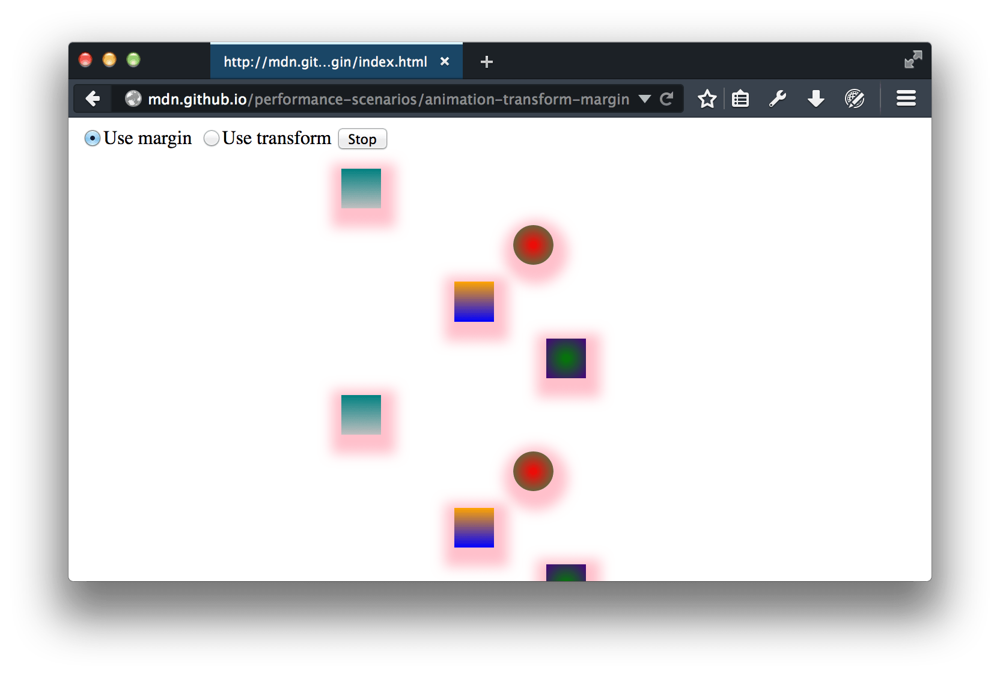
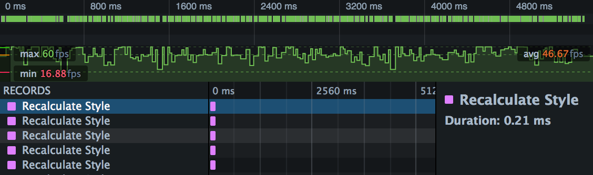
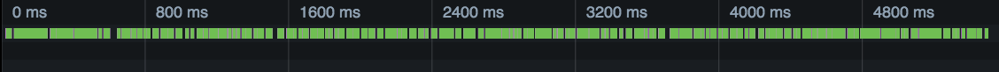
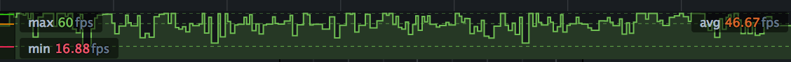
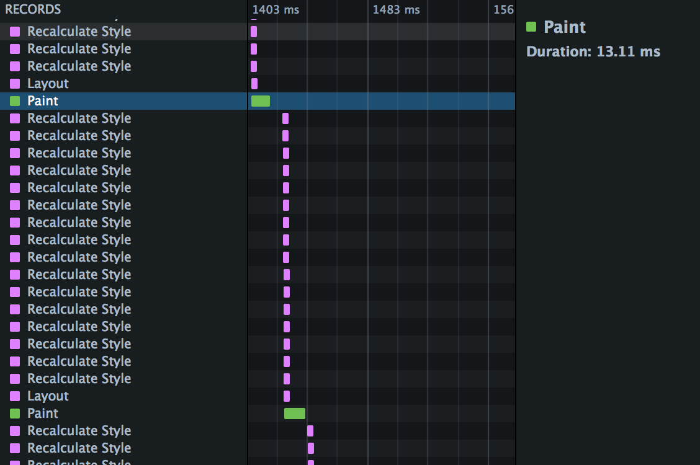
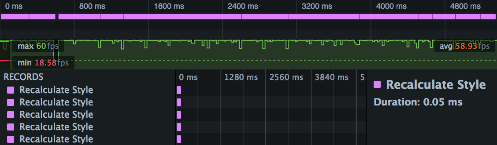
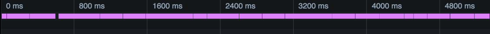
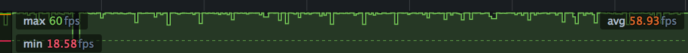
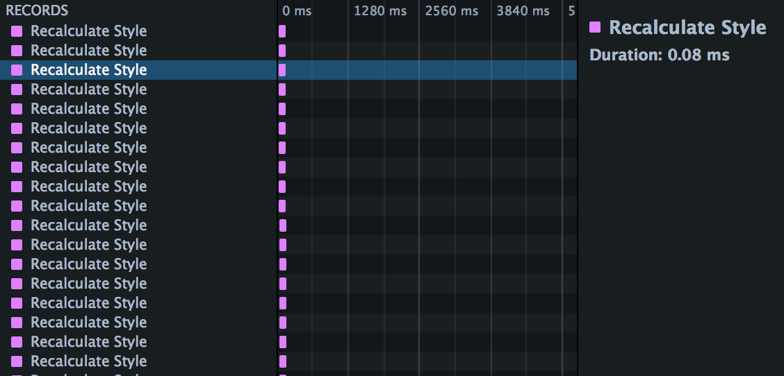

Анимация в Вебе может быть сделана с помощью {{domxref('SVGAnimationElement', 'SVG')}}, {{domxref('window.requestAnimationFrame','JavaScript')}}, включая {{htmlelement('canvas')}} и {{domxref('WebGL_API', 'WebGL')}}, CSS {{cssxref('animation')}}, {{htmlelement('video')}}, анимированных GIF и даже с помощью анимированных PNG и других типов изображений. Производительность CSS-анимации может отличаться от одного CSS-свойства к другому, а попытка анимировать некоторые "дорогие" CSS-свойства может привести к зависаниям ({{glossary('jank')}}), даже несмотря на то, что браузер борется за то, чтобы смягчить частоту смены кадров {{glossary('frame rate')}}.

Для анимированных медиа, таких как видео и GIF, основная проблема производительности - это размер файлов. Скачивание больших по объёму файлов не может не повлиять на производительность системы или на то, как эту систему воспринимает пользователь.

Анимации, основанные на коде, будь то CSS, SVG, \<canvas>, webGL или другие JavaScript анимации, могут нести проблемы производительности сами в себе, даже если файлы этого кода скачиваются быстро. Такие анимации могут потреблять всё время CPU и приводить к зависаниям.

Несомненно, производительность каждой конкретной системы - очень чувствительная тема. Улучшив клиентскую производительность, вы сможете не только ускорить работу приложения, но даже затронете физический аспект - сможете сэкономить заряд батареи мобильных устройств и / или понизите температуру устройства. Поэтому очень важно владеть инструментами для измерения производительности. Они помогут вам понять всю работу, которую проводит браузер, пока рендерит ваше приложение и поможет избежать и диагностировать проблемы, когда они происходят.

Пользователи ожидают, что взаимодействие с интерфейсом будет плавным, а интерфейс будет отзывчивым. Анимация помогает улучшить восприятие приложения, сделав его быстрым и отзывчивым; но анимация так же может замедлить его и привести к зависаниям, если она сделана неумело. Отзывчивые интерфейсы должны иметь частоту смены кадров, равную [60 кадров в секунду (fps)](/ru/docs/Tools/Performance/Frame_rate). В то время, как не всегда возможно поддерживать такую частоту, очень важно поддерживать быструю и устойчивую смену кадров для анимации.

Мы рассмотрим, как можно использовать инструменты браузера для инспектирования частоты смены кадров. Так же, мы обсудим некоторые подсказки, как организовать и поддерживать быструю и стабильную смену кадров.

Графики [frame rate](/ru/docs/Tools/Performance/Frame_rate) и [waterfall](/ru/docs/Tools/Performance/Waterfall) из встроенных инструментов браузера дают информацию о том, как браузер выполняет работу по анимации. Используя эти инструменты, вы можете измерить fps приложения и диагностировать узкие места, в которых fps уменьшается.

С помощью [CSS-анимации](/ru/docs/Web/Guide/CSS/Using_CSS_animations) вы указываете [ключевые кадры (keyframes)](/ru/docs/Web/CSS/@keyframes), каждый из которых использует определённые CSS-свойства, чтобы определить внешний вид элемента в конкретный (ключевой) момент анимации. Браузер создаёт анимации с помощью плавных переходов от одного ключевого кадра к следующему.

Если сравнивать анимацию с помощью JavaScript и CSS, вы увидите, что CSS-анимации проще создать. Более того, CSS-анимации гарантируют лучшую производительность, так как они автоматически делегируют некоторые задачи браузеру. Например, в случае CSS браузер сам решает, когда нужно отрендерить кадр, а когда пропустить кадр, если это необходимо.

Однако, стоимость изменения разных CSS-свойств варьируется. Общепринято, что 60 кадров в секунду - это достаточная частота, чтобы анимация выглядела мягкой и плавной. Несложный подсчёт говорит, что при частоте 60 кадров в секунду, браузер имеет лишь 16.7 миллисекунд, чтобы выполнить все скрипты, пересчитать стили, скомпоновать слои и отрисовать новый кадр. Отсюда следует, что медленные скрипты и анимация дорогих CSS-свойств может может привести к [зависаниям](/ru/docs/Glossary/Jank), так как браузер все ещё будет пытаться вычислить все 60 кадров.

Стоит заметить, что 60 кадров в секунду - это стандартная частота обновления экрана. Существуют экраны с гораздо большим FPS. Например, экраны игровых ноутбуков или iPad Pro 2018 имеют частоту смены кадров, равную 120 fps и выше. Для таких устройств производители браузеров ограничивают частоту 60-ю кадрами в секунду, но с помощью некоторых опций этот лимит можно убрать. И в этом случае, на формирование каждого кадра устройство будет отводить лишь 8.6 миллисекунд.

## Этапы рендеринга

Процесс, используемый браузером для отображения анимации CSS-свойств, может быть представлен как последовательность этапов из следующего изображения:

1. **Recalculate Style**: когда любое CSS-свойство для элемента изменяется, браузер должен заново вычислить результирующий набор свойств.
2. **Layout**: затем браузер использует вычисленные стили для того, чтобы понять позицию и геометрию элементов - как изменённого, так и рядом лежащих. Эта операция называется "layout", но иногда её так же называют "reflow".
3. **Paint**: наконец, браузер должен перерисовать элементы на экране. Но этот этап не обязательно должен быть простым, как на изображении. Страница может быть разделена на слои, каждый из которых перерисовывается независимо, а только после этого они комбинируются в процессе, который называется композицией "Composition".

Процессы, которые браузер использует для отрисовывания изменений на элементе \<canvas> отличаются. В случае \<canvas>, Layout не происходит. Скорее, страница будет перерисована с помощью JavaScript canvas API.

В любом случае, вычисление каждого следующего кадра должно происходить достаточно быстро, чтобы успеть попасть в частоту обновления экрана, чтобы не было зависаний.

## Стоимость CSS-свойств

На всех этапах рендеринга изменение некоторых свойств является более затратным, других - менее:

| Тип свойства                                                                                                                                                       | Стоимость                                                                                                                                                                                                                                                       | Примеры                                                                                                                                                                                                           |
| ------------------------------------------------------------------------------------------------------------------------------------------------------------------ | --------------------------------------------------------------------------------------------------------------------------------------------------------------------------------------------------------------------------------------------------------------- | ----------------------------------------------------------------------------------------------------------------------------------------------------------------------------------------------------------------- |
| Свойства, затрагивающие геометрию или позицию элемента, запускают **весь** процесс заново: новое вычисление стилей, layout и перерисовку.                          |                | [`left`](/ru/docs/Web/CSS/left) [`max-width`](/ru/docs/Web/CSS/max-width) [`border-width`](/ru/docs/Web/CSS/border-width) [`margin-left`](/ru/docs/Web/CSS/margin-left) [`font-size`](/ru/docs/Web/CSS/font-size) |
| Свойства, не затрагивающие геометрию и позиционирование элементов, но не лежащие в отдельном слое, запускают только вычисление стилей и перерисовку, но не Layout. |          | [`color`](/ru/docs/Web/CSS/color)                                                                                                                                                                                 |
| Свойства, которые рендерятся в отдельном слое не запускают даже repaint, так как результат обновления обрабатывается на этапе композиции.                          |    | [`transform`](/ru/docs/Web/CSS/transform) [`opacity`](/ru/docs/Web/CSS/opacity)                                                                                                                                   |

> **Примечание:** На Веб-сайте [CSS Triggers](http://csstriggers.com/) хорошо показано, какие CSS-свойства вызывают те или иные этапы обновления в разных браузерах.

## Пример: margin против transform

В этом разделе мы увидим, как инструмент [Waterfall](/ru/docs/Tools/Performance/Waterfall) может указать на разницу между анимацией [`margin`](/ru/docs/Web/CSS/margin) и [`transform`](/ru/docs/Web/CSS/transform).

Задумка этого сценария не в том, чтобы убедить вас, что анимация через `margin` - это всегда плохая идея. Сценарий нужен, чтобы продемонстрировать, как инструменты могут помочь вам понять работу браузера и как вы можете применить эти знания для оптимизации.

Если вы хотите самостоятельно разобраться с этим примером, вы можете найти демо [здесь](http://mdn.github.io/performance-scenarios/animation-transform-margin/index.html). Демо выглядит так:

На экране всего два контрола: кнопка "start / stop" для запуска и остановки анимации и радио-кнопки для выбора свойства, с помощью которого происходит анимация: `margin`, или `transform`.

Так же на странице есть некоторое количество элементов со свойствами [`linear-gradient`](/ru/docs/Web/CSS/linear-gradient) и [`box-shadow`](/ru/docs/Web/CSS/box-shadow) Мы обращаем внимание именно на эти два свойства, так как они относительно дорогие.

Так же существует видео-версия анализа и оптимизации этой страницы.

{{EmbedYouTube("Tvu6_j8Qzfk")}}

### Анимация свойства margin

Оставим включённой опцию "Use margin" и начнём анимацию. В это же время откроем "Performance tool" и нажмём кнопку "записать" (make a recording). Нам понадобится лишь пара секунд записи.

Откройте первую запись. Точное содержимое, которое вы увидите, зависит от вашего устройства, системной нагрузки и окружения, но, в целом это должно выглядеть так:

На экране показаны три отдельных секции: (a) обзор этапов рендеринга (Waterfall), (b) частота кадров, и (c) детали на временной шкалы.

#### Обзор этапов рендеринга на временной шкале (Waterfall)

Сейчас здесь показаны ужатые этапы рендеринга [Waterfall](/ru/docs/Tools/Performance/Waterfall). Как видите, большая часть графика заполнена зелёным цветом - это говорит нам о том, что [мы тратим много ресурсов на отрисовывание](/ru/docs/Tools/Performance/Timeline#timeline-color-coding).

#### Частота кадров (Frame Rate)

Эта секция показывает [частоту кадров](/ru/docs/Tools/Performance/Frame_rate). Средняя частота на примере - 46.67fps. Это ниже, чем желаемые 60fps. Однако, ещё хуже то, что частота кадров нестабильна - есть этапы, где частота кадров снижается до 20 и даже до 10 fps. Маловероятно, что вы увидите здесь плавную анимацию, особенно если добавите какое-то взаимодействие с пользователем.

#### Этапы рендеринга в деталях (Waterfall)

Оставшаяся часть записей показа в секции "Waterfall view". Если вы пролистаете этот список, вы увидите что-то наподобие этого:

Это шаги рендеринга ([rendering waterfall](/ru/docs/Tools/Performance/Scenarios/Animating_CSS_properties#The_CSS_rendering_waterfall)). Для каждого кадра анимации мы вычисляем стили для каждого элемента, потом вычисляем Layout, а затем перерисовываем все элементы.

Из таблицы видно, что особый урон производительности наносит перерисовка Paint (зелёные полосы). Например, выделенный этап Paint занял 13.11мс. Учитывая, что весь бюджет рендеринга - 16.7мс, неудивительно, что мы увидели падения fps.

Вы можете поэкспериментировать с некоторыми свойствами. Например, попробуйте убрать box-shadow с помощью инспектора страницы ([Page / Element Inspector](/ru/docs/Tools/Page_Inspector/How_to/Examine_and_edit_CSS)), замерьте производительность и посмотрите, как это отразилось на производительности. Затраты на Paint уменьшатся значительно. Но они все ещё есть. Мы ещё вернёмся к этому вопросу позже, когда будем изучать использование [`transform`](/ru/docs/Web/CSS/transform) вместо [`margin`](/ru/docs/Web/CSS/margin). Вы увидите, что от затрат на этот этап можно избавиться полностью.

### Анимация свойства transform

Теперь, переключитесь на "Use transform" и запишите новые данные. Это должно выглядеть примерно так:

#### Обзор этапов рендеринга на временной шкале (Waterfall)

В сравнении с [версией, которая использует margin](/ru/docs/Tools/Performance/Scenarios/Animating_CSS_properties#Waterfall_overview), мы видим намного меньше зелёного, но намного больше фиолетового цвета. Это говорит о том, что вместо paint мы теперь тратим ресурсы на этапы [layout или style recalculation](/ru/docs/Tools/Performance/Waterfall#timeline-color-coding).

#### Частота кадров (Frame Rate)

В сравнении с [версией, которая использует margin](/ru/docs/Tools/Performance/Scenarios/Animating_CSS_properties#Frame_rate), показатели fps здесь выглядят достаточно хорошо. Средняя частота кадров близка к 60fps, а стабильность fps, за исключением падения fps в начале значительно выросла.

#### Этапы рендеринга в деталях (Waterfall)

В этой секции мы видим объяснения тому, что fps значительно улучшился. Мы больше не тратим время на layout и перерисовку элементов:

Здесь, используя `transform`, мы заметно улучшили производительность приложения. А инструменты разработчика помогли нам это сделать.
