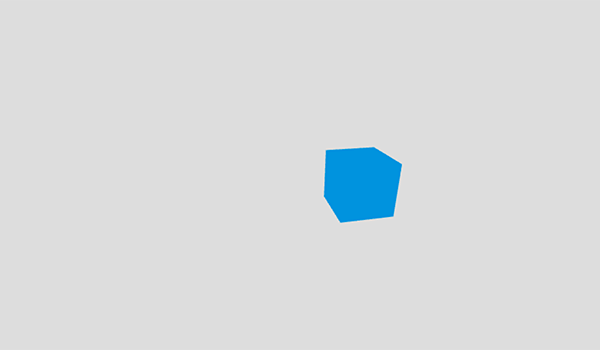

着色器使用 GLSL（OpenGL 着色语言），这是一种语法类似于 C 语言的特殊 OpenGL 着色语言。GLSL 由图形管线直接执行。[着色器有多种类型](https://wikis.khronos.org/opengl/Shader)，但在 Web 上创建图形时通常使用两种：顶点着色器和片段（像素）着色器。顶点着色器将形状的位置转换为 3D 绘制坐标。片段着色器计算形状的颜色和其他属性的渲染结果。

GLSL 不像 JavaScript 那样直观。GLSL 是强类型语言，且需要进行大量向量和矩阵运算。它很快就会变得十分复杂。在本文中，我们将创建一个渲染立方体的简单代码示例。为简化基础代码，我们将使用 Three.js API。

正如你可能在[基本原理](/zh-CN/docs/Games/Techniques/3D_on_the_web/Basic_theory)一文中所记得的，顶点是 3D 坐标系中的一个点。顶点可以且通常会有其他属性。3D 坐标系定义了空间，而顶点则帮助定义该空间中的形状。

## 着色器类型

着色器本质上是绘制屏幕内容所需的函数。着色器在针对这类操作进行了优化的 [GPU](https://zh.wikipedia.org/wiki/圖形處理器)（图形处理器）上运行。使用 GPU 处理着色器可将部分数值计算工作从 CPU 卸载出去，使 CPU 能将处理能力专注于执行代码等其他任务。

### 顶点着色器

顶点着色器操作 3D 空间中的坐标，并且每个顶点都会调用一次。顶点着色器的目的是设置 `gl_Position` 变量，这是一个特殊的全局 GLSL 内置变量。`gl_Position` 用于存储当前顶点的位置。

`void main()` 函数是定义 `gl_Position` 变量的标准方式。`void main()` 内的所有代码都将由顶点着色器执行。顶点着色器会产生一个变量，其中包含如何将顶点的 3D 空间位置投影到 2D 屏幕上的信息。

### 片段着色器

片段（或纹理）着色器为正在处理的每个像素定义 RGBA（红、绿、蓝、alpha）颜色，每个像素都会调用一次片段着色器。片段着色器的目的是设置 `gl_FragColor` 变量。`gl_FragColor` 和 `gl_Position` 一样，也是 GLSL 内置变量。

计算结果是一个包含 RGBA 颜色信息的变量。

## 示例

让我们构建一个简单的示例，说明这些着色器如何工作。请先阅读 [Three.js 教程](/zh-CN/docs/Games/Techniques/3D_on_the_web/Building_up_a_basic_demo_with_Three.js)，了解场景、对象和材质的概念。

> [!NOTE]
> 请记住，你不必使用 Three.js 或其他库来编写着色器，纯 [WebGL](/zh-CN/docs/Web/API/WebGL_API)（Web 图形库）已经足够。这里使用 Three.js 是为了让基础代码更简单、更易于理解，以便你专注于着色器代码。Three.js 和其他 3D 库为你抽象了许多内容，如果要使用原生 WebGL 创建这样的示例，你必须编写大量额外代码才能使它实际运行。

### 环境设置

要开始使用 WebGL 着色器，请按照[使用 Three.js 构建基本示例](/zh-CN/docs/Games/Techniques/3D_on_the_web/Building_up_a_basic_demo_with_Three.js)中的环境设置步骤操作，以确保 Three.js 能够正常工作。

### HTML 结构

以下是我们将使用的 HTML 结构。

```html
<!doctype html>
<html lang="zh-CN">
  <head>
    <meta charset="utf-8" />
    <title>MDN 游戏：着色器演示</title>
    <style>
      html,
      body,
      canvas {
        margin: 0;
        padding: 0;
        width: 100%;
        height: 100%;
        font-size: 0;
      }
    </style>
    <script src="three.min.js"></script>
  </head>
  <body>
    <script id="vertexShader" type="x-shader/x-vertex">
      // 顶点着色器代码在这里
    </script>
    <script id="fragmentShader" type="x-shader/x-fragment">
      // 片段着色器代码在这里
    </script>
    <script>
      // 场景设置在这里
    </script>
  </body>
</html>
```

它包含文档 {{htmlelement("title")}} 等基本信息，以及用于设置 {{htmlelement("canvas")}} 元素 `width` 和 `height` 的 CSS。Three.js 会将该元素插入页面，使其占满视口。{{htmlelement("head")}} 中的 {{htmlelement("script")}} 元素将 Three.js 库引入页面；我们将在 {{htmlelement("body")}} 标签中的三个脚本标签内编写代码：

1. 第一个将包含顶点着色器。
2. 第二个将包含片段着色器。
3. 第三个将包含用于生成场景的 JavaScript 代码。

继续阅读前，请将这些代码复制到新的文本文件中，并在工作目录中将其保存为 `index.html`。我们将在该文件中创建一个简单的立方体场景，以说明着色器的工作方式。

### 立方体源代码

我们可以复用[使用 Three.js 构建基本示例](/zh-CN/docs/Games/Techniques/3D_on_the_web/Building_up_a_basic_demo_with_Three.js)中立方体的源代码。渲染器、相机和灯光等大多数组件将保持不变，但我们将使用着色器设置立方体的颜色和位置，而非使用基本材质。

前往 [GitHub 上的 cube.html 文件](https://github.com/end3r/MDN-Games-3D/blob/gh-pages/Three.js/cube.html)，复制第二个 {{htmlelement("script")}} 元素中的所有 JavaScript 代码，然后将其粘贴到当前示例的第三个 `<script>` 元素中。保存后在浏览器中加载 `index.html`，你应该会看到一个蓝色立方体。

### 顶点着色器代码

让我们继续编写一个简单的顶点着色器，在 body 的第一个 `<script>` 标签中添加以下代码：

```glsl
void main() {
  gl_Position = projectionMatrix * modelViewMatrix * vec4(position.x+10.0, position.y, position.z+5.0, 1.0);
}
```

结果 `gl_Position` 是通过将模型视图矩阵和投影矩阵分别与每个向量相乘计算得出的，从而获得最终的顶点位置。

> [!NOTE]
> 你可以通过[顶点处理](/zh-CN/docs/Games/Techniques/3D_on_the_web/Basic_theory#顶点处理)部分了解更多关于*模型*、*视图*和*投影变换*的内容，也可以查看本文末尾的链接以进一步学习。

`projectionMatrix` 和 `modelViewMatrix` 均由 Three.js 提供。向量携带新的 3D 位置，因此原始立方体会通过着色器沿 `x` 轴移动 10 个单位，并沿 `z` 轴移动 5 个单位。我们可以忽略第四个参数，让其保持默认值 `1.0`；它用于操作 3D 空间中顶点位置的裁剪，但本例不需要使用它。

### 纹理着色器代码

现在，我们将纹理着色器添加到代码中，在 body 的第二个 `<script>` 标签中添加以下代码：

```glsl
void main() {
  gl_FragColor = vec4(0.0, 0.58, 0.86, 1.0);
}
```

这将设置 RGBA 颜色以复现当前的浅蓝色。前三个浮点值（范围从 `0.0` 到 `1.0`）分别代表红、绿、蓝通道，第四个值为 alpha 透明度（范围从 `0.0`（完全透明）到 `1.0`（完全不透明））。

### 应用着色器

要将新创建的着色器实际应用于立方体，请先注释掉 `basicMaterial` 定义：

```js
// const basicMaterial = new THREE.MeshBasicMaterial({color: 0x0095DD});
```

然后，创建 [`shaderMaterial`](https://threejs.org/docs/#Reference/Materials/ShaderMaterial)：

```js
const shaderMaterial = new THREE.ShaderMaterial({
  vertexShader: document.getElementById("vertexShader").textContent,
  fragmentShader: document.getElementById("fragmentShader").textContent,
});
```

此着色器材质从脚本中获取代码，并将其应用到分配了该材质的对象上。

接着，在定义立方体的代码行中，将 `basicMaterial` 替换为新创建的 `shaderMaterial`：

```js
// const cube = new THREE.Mesh(boxGeometry, basicMaterial);
const cube = new THREE.Mesh(boxGeometry, shaderMaterial);
```

Three.js 会编译并运行附加到获得该材质的网格上的着色器。在本例中，立方体将同时应用顶点和纹理着色器。就是这样，你已经创建了最简单的着色器！立方体应如下图所示：



它看起来和 Three.js 立方体示例完全相同，但略微不同的位置和相同的蓝色都是通过着色器实现的。

## 最终代码

### HTML

```html
<script src="https://end3r.github.io/MDN-Games-3D/Shaders/js/three.min.js"></script>
<script id="vertexShader" type="x-shader/x-vertex">
  void main() {
      gl_Position = projectionMatrix * modelViewMatrix * vec4(position.x+10.0, position.y, position.z+5.0, 1.0);
  }
</script>
<script id="fragmentShader" type="x-shader/x-fragment">
  void main() {
      gl_FragColor = vec4(0.0, 0.58, 0.86, 1.0);
  }
</script>
```

### JavaScript

```js
const WIDTH = window.innerWidth;
const HEIGHT = window.innerHeight;

const renderer = new THREE.WebGLRenderer({ antialias: true });
renderer.setSize(WIDTH, HEIGHT);
renderer.setClearColor(0xdddddd, 1);
document.body.appendChild(renderer.domElement);

const scene = new THREE.Scene();

const camera = new THREE.PerspectiveCamera(70, WIDTH / HEIGHT);
camera.position.z = 50;
scene.add(camera);

const boxGeometry = new THREE.BoxGeometry(10, 10, 10);

const shaderMaterial = new THREE.ShaderMaterial({
  vertexShader: document.getElementById("vertexShader").textContent,
  fragmentShader: document.getElementById("fragmentShader").textContent,
});

const cube = new THREE.Mesh(boxGeometry, shaderMaterial);
scene.add(cube);
cube.rotation.set(0.4, 0.2, 0);

function render() {
  requestAnimationFrame(render);
  renderer.render(scene, camera);
}
render();
```

### CSS

```css
body {
  margin: 0;
  padding: 0;
  font-size: 0;
}
canvas {
  width: 100%;
  height: 100%;
}
```

### 结果

{{ EmbedLiveSample('最终代码', '100%', '400') }}

## 总结

本文介绍了着色器最基础的知识。示例的功能不多，但你还可以使用着色器实现许多很酷的效果。请在 [ShaderToy](https://www.shadertoy.com/) 上查看一些精彩示例，从中获取灵感并学习其源代码。

## 参见

- [学习 WebGL](https://web.archive.org/web/20180624211158/http://learningwebgl.com/blog/?page_id=1217)——了解 WebGL 基础知识
- [WebGL Fundamentals 上的 WebGL 着色器和 GLSL](https://webglfundamentals.org/webgl/lessons/webgl-shaders-and-glsl.html)——了解 GLSL 专项信息
