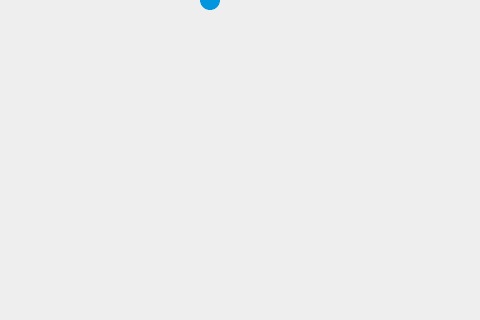

{{PreviousNext("Games/Tutorials/2D_Breakout_game_pure_JavaScript/Move_the_ball", "Games/Tutorials/2D_Breakout_game_pure_JavaScript/Paddle_and_keyboard_controls")}}

这是 [Gamedev Canvas 教程](/zh-CN/docs/Games/Tutorials/2D_Breakout_game_pure_JavaScript) 10 个步骤中的**第 3 步**。在你完成了本节教程之后，你可以在 [Gamedev-Canvas-workshop/lesson3.html](https://github.com/end3r/Gamedev-Canvas-workshop/blob/gh-pages/lesson03.html) 看到源码。

看到小球在移动确实很棒，但它很快就会从屏幕上消失，这限制了我们玩游戏的乐趣！为了解决这个问题，我们将实现一些碰撞检测功能（相关内容将在[后续步骤](/zh-CN/docs/Games/Tutorials/2D_Breakout_game_pure_JavaScript/Collision_detection)进行更详细的讲解），让小球能够从画布的四个边缘弹回来。

## 简单的碰撞检测

为了检测碰撞，我们将检查球是否接触（碰到）墙壁，如果接触，则相应地改变其运动方向。

为了进行计算，让我们定义一个名为 `ballRadius` 的变量，用于存储绘制圆的半径并用于计算。请将以下内容添加到你的代码中，位置在现有变量声明的下方：

```js
const ballRadius = 10;
```

现在更新绘制球的 `drawBall()` 函数如下：

```js
ctx.arc(x, y, ballRadius, 0, Math.PI * 2);
```

### 从顶部和底部弹起

有四面墙可以让球反弹——我们先关注顶部那面墙。我们需要在每一帧检查球是否触碰到画布的顶部边缘——如果是，我们就反转球的运动方向，使其开始向相反方向移动，并保持在可见边界内。考虑到坐标系以左上角为原点，我们可以编写如下代码：

```js
if (y + dy < 0) {
  dy = -dy;
}
```

如果球的位置的 `y` 值小于零，则通过将其设置为自身的负值来改变 `y` 轴上的运动方向。如果球原本以每帧 2 像素的速度向上移动，现在它将以 -2 像素的速度“向上”移动，这实际上相当于以每帧 2 像素的速度向下移动。

上面的代码处理了球从顶边弹回的情况，现在让我们来考虑底边的情况：

```js
if (y + dy > canvas.height) {
  dy = -dy;
}
```

如果球的 `y` 坐标大于画布的高度（请记住，我们是从左上角开始计算 `y` 值的，因此顶边从 0 开始，底边位于 320 像素处，即画布的高度），则像之前那样反转 `y` 轴的移动方向，使球从底边反弹回来。

我们可以将这两条语句合并为一条，以简化代码：

```js
if (y + dy > canvas.height || y + dy < 0) {
  dy = -dy;
}
```

如果这两个条件中有任何一个为`true`，则反转球的运动方向。

### 从左边和右边反弹

上下两边的边界我们已经处理好了，接下来考虑左右两边。其实原理非常相似，你只需要将代码中的 `y` 替换为 `x` 并重复相关操作即可：

```js
if (x + dx > canvas.width || x + dx < 0) {
  dx = -dx;
}

if (y + dy > canvas.height || y + dy < 0) {
  dy = -dy;
}
```

你应该把上面的代码块插入到 `draw()` 函数中，就在闭合的大括号之前。

### 球部分消失在墙上！

此时测试一下你的代码，你会大吃一惊——现在我们已经实现了一个能从画布的四个边缘全部弹回的球！不过，我们还遇到另一个问题——当球撞到每面墙壁时，它会在改变方向之前稍微陷进去一点：



这是因为我们计算的是墙壁与球体中心的碰撞点，而实际上应该计算的是球体周长与墙壁的碰撞点。球体应该在刚接触墙壁时就弹开，而不是等到已经有一半陷入墙壁时才弹开，因此让我们稍微调整一下代码，加入这一逻辑。请将你最后添加的代码更新为以下内容：

```js
if (x + dx > canvas.width - ballRadius || x + dx < ballRadius) {
  dx = -dx;
}
if (y + dy > canvas.height - ballRadius || y + dy < ballRadius) {
  dy = -dy;
}
```

当球心与墙壁边缘之间的距离正好等于球的半径时，球就会改变运动方向。从一侧边缘的宽度中减去半径，再将该数值加到另一侧边缘上，这样就能实现正确的碰撞检测——球会像预期那样从墙壁上弹开。

## 比较你的代码

让我们再次将这一部分的最终代码与你的代码进行对比，并试着运行一下：

```html hidden
<canvas id="myCanvas" width="480" height="320"></canvas>
<button id="runButton">开始游戏</button>
```

```css hidden
canvas {
  background: #eeeeee;
}
button {
  display: block;
}
```

```js
const canvas = document.getElementById("myCanvas");
const ctx = canvas.getContext("2d");
const ballRadius = 10;
let x = canvas.width / 2;
let y = canvas.height - 30;
let dx = 2;
let dy = -2;

function drawBall() {
  ctx.beginPath();
  ctx.arc(x, y, ballRadius, 0, Math.PI * 2);
  ctx.fillStyle = "#0095DD";
  ctx.fill();
  ctx.closePath();
}

function draw() {
  ctx.clearRect(0, 0, canvas.width, canvas.height);
  drawBall();

  if (x + dx > canvas.width - ballRadius || x + dx < ballRadius) {
    dx = -dx;
  }
  if (y + dy > canvas.height - ballRadius || y + dy < ballRadius) {
    dy = -dy;
  }

  x += dx;
  y += dy;
}

function startGame() {
  setInterval(draw, 10);
}

const runButton = document.getElementById("runButton");
runButton.addEventListener("click", () => {
  startGame();
  runButton.disabled = true;
});
```

{{embedlivesample("比较你的代码", 600, 360)}}

> [!NOTE]
> 尝试修改你的代码，在每次碰到墙壁时都要把球的颜色改成随机的颜色。

## 下一步

现在，我们的球既能在游戏板上移动，又能停留在上面。在教程第四步中，我们将探讨如何实现可控制的球板——请参阅[球板和键盘控制](/zh-CN/docs/Games/Tutorials/2D_Breakout_game_pure_JavaScript/Paddle_and_keyboard_controls)。

{{PreviousNext("Games/Tutorials/2D_Breakout_game_pure_JavaScript/Move_the_ball", "Games/Tutorials/2D_Breakout_game_pure_JavaScript/Paddle_and_keyboard_controls")}}
