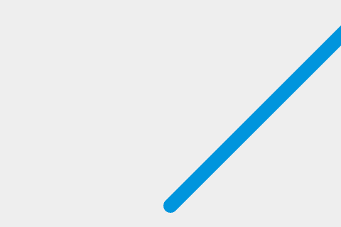

{{PreviousNext("Games/Tutorials/2D_Breakout_game_pure_JavaScript/Create_the_Canvas_and_draw_on_it", "Games/Tutorials/2D_Breakout_game_pure_JavaScript/Bounce_off_the_walls")}}

这是 [Gamedev Canvas 教程](/zh-CN/docs/Games/Tutorials/2D_Breakout_game_pure_JavaScript) 10 个步骤中的**第 2 步**。在你完成了本节教程之后，你可以在 [Gamedev-Canvas-workshop/lesson2.html](https://github.com/end3r/Gamedev-Canvas-workshop/blob/gh-pages/lesson02.html) 看到源码。

从上一节中你已经知道如何去绘制一个球。现在让我们使它动起来。从技术上讲，我们将在画布上绘制一个球，之后让它消失，然后在一个稍微不用的位置上再绘制一个一样的球。就想电影里的每一帧动起来的感觉。

## 定义绘制循环

为了在每一帧中持续更新画布上的绘图，我们需要定义一个绘图函数，该函数将反复执行，每次执行时使用一组不同的变量值来更改精灵的位置等。你可以使用 JavaScript 的定时函数来反复执行该函数。稍后的教程中，我们可以体会到 {{domxref("Window.requestAnimationFrame", "requestAnimationFrame()")}} 如何帮助我们进行绘制，但我们先从 {{domxref("Window.setInterval", "setInterval()")}} 开始来创建一些循环逻辑。

删除 HTML 文件中除前两行以外的所有 JavaScript 代码，并在其下方添加以下内容。`draw()` 函数将在 `setInterval` 中每 10 毫秒执行一次：

```js
function draw() {
  // 用于绘制的代码
}
setInterval(draw, 10);
```

得益于 `setInterval` 的无限性，`draw()` 函数将每 10 毫秒就会被调用，除非我们停止它。现在，我们来绘制小球吧，在 `draw()` 函数中添加以下内容：

```js
ctx.beginPath();
ctx.arc(50, 50, 10, 0, Math.PI * 2);
ctx.fillStyle = "#0095DD";
ctx.fill();
ctx.closePath();
```

现在，尝试更新你的代码，球会在每一帧画面重新绘制。

## 让球动起来

目前你可能不会注意到球体正在不断被重绘，因为它没有移动。让我们改变这一点。首先，我们不再使用硬编码的位置 (50,50)，而是将起始点定义在画布的底部中央位置，并将其存储在名为 `x` 和 `y` 的变量中，然后利用这些变量来确定圆的绘制位置。

首先，在 `draw()` 函数上方添加以下两行代码，以定义 `x` 和 `y`：

```js
let x = canvas.width / 2;
let y = canvas.height - 30;
```

接下来更新 `draw()` 函数，在 {{domxref("CanvasRenderingContext2D.arc()","arc()")}} 方法中使用 `x` 和 `y` 变量，如下面高亮行所示：

```js
function draw() {
  ctx.beginPath();
  ctx.arc(x, y, 10, 0, Math.PI * 2);
  ctx.fillStyle = "#0095DD";
  ctx.fill();
  ctx.closePath();
}
```

现在到了最重要的部分：我们想要在每一帧都被绘制出来之后，给 `x` 和 `y` 添加一个较小的值，让它看起来像是在移动。让我们将这些值定义为 `dx` 和 `dy`，并将它们的值分别设为 2 和 -2。在你的 x 和 y 变量声明下方添加以下内容：

```js
let dx = 2;
let dy = -2;
```

最后一步是在每一帧中使用 `dx` 和 `dy` 变量更新 `x` 和 `y`，这样在每次更新时，球都会被绘制在新的位置上。请在你的 `draw()` 函数中添加以下两行代码（如下所示）：

```js
function draw() {
  ctx.beginPath();
  ctx.arc(x, y, 10, 0, Math.PI * 2);
  ctx.fillStyle = "#0095DD";
  ctx.fill();
  ctx.closePath();
  x += dx;
  y += dy;
}
```

再次保存代码，并在浏览器中尝试。虽然看起来球身后留下了尾迹，但程序运行正常：



## 在每一帧更新之前清空画布

球移动时留下了轨迹，因为我们在每一帧上都画了一个新的圆，而没有去掉之前的一个圆。不要担心，因为有一个方法来清空画布的内容：{{domxref("CanvasRenderingContext2D.clearRect()","clearRect()")}}。该方法有四个参数：矩形左上角的 `x` 和 `y` 坐标，以及矩形的右下角的 `x` 和 `y` 坐标。在这个矩形覆盖的整个区域里，之前所画的任何内容将被清除。

将下列高亮显示行添加到 `draw()` 函数：

```js
function draw() {
  ctx.clearRect(0, 0, canvas.width, canvas.height);
  ctx.beginPath();
  ctx.arc(x, y, 10, 0, Math.PI * 2);
  ctx.fillStyle = "#0095DD";
  ctx.fill();
  ctx.closePath();
  x += dx;
  y += dy;
}
```

保存你的代码并再次尝试，这次你将看到球移动后没有留下轨迹。每隔 10 毫秒，画布就会被清除，蓝色的圆圈 (我们的球) 将被绘制在一个给定的位置上，而 `x` 和 `y` 的值将在下一个帧被更新。

## 保持代码整洁

在接下来的几篇文章中，我们将在 `draw()` 函数中添加越来越多的命令，因此尽可能保持简单和整洁是很好的。让我们从把绘制球的代码移至一个单独的函数。

用以下两个函数替换现有的 `draw()` 函数：

```js
function drawBall() {
  ctx.beginPath();
  ctx.arc(x, y, 10, 0, Math.PI * 2);
  ctx.fillStyle = "#0095DD";
  ctx.fill();
  ctx.closePath();
}

function draw() {
  ctx.clearRect(0, 0, canvas.width, canvas.height);
  drawBall();
  x += dx;
  y += dy;
}
```

## 比较你的代码

你可以在下面的实时演示中查看本文的代码，并使用它来更好地了解其工作原理：

> [!NOTE]
> 这些页面上的实时示例会自动运行，因此我们添加了一个“开始游戏”按钮。这有助于避免游戏自动开始，从而减少频繁触发警报或其他事件的情况。

```html
<canvas id="myCanvas" width="480" height="320"></canvas>
<button id="runButton">开始游戏</button>
```

```css
canvas {
  background: #eeeeee;
}
button {
  display: block;
}
```

```js
const canvas = document.getElementById("myCanvas");
const ctx = canvas.getContext("2d");
let x = canvas.width / 2;
let y = canvas.height - 30;
const dx = 2;
const dy = -2;

function drawBall() {
  ctx.beginPath();
  ctx.arc(x, y, 10, 0, Math.PI * 2);
  ctx.fillStyle = "#0095DD";
  ctx.fill();
  ctx.closePath();
}

function draw() {
  ctx.clearRect(0, 0, canvas.width, canvas.height);
  drawBall();
  x += dx;
  y += dy;
}

function startGame() {
  setInterval(draw, 10);
}

const runButton = document.getElementById("runButton");
runButton.addEventListener("click", () => {
  startGame();
  runButton.disabled = true;
});
```

{{embedlivesample("比较你的代码", 600, 350)}}

> [!NOTE]
> 尝试改变移动球的速度，或者移动球的方向。

## 下一步

我们已经画了我们的球，并将其移动，但它仍然消失在画布的边缘。在第三章中，我们将探讨如何使其[从墙壁反弹](/zh-CN/docs/Games/Tutorials/2D_Breakout_game_pure_JavaScript/Bounce_off_the_walls)。

{{PreviousNext("Games/Tutorials/2D_Breakout_game_pure_JavaScript/Create_the_Canvas_and_draw_on_it", "Games/Tutorials/2D_Breakout_game_pure_JavaScript/Bounce_off_the_walls")}}
