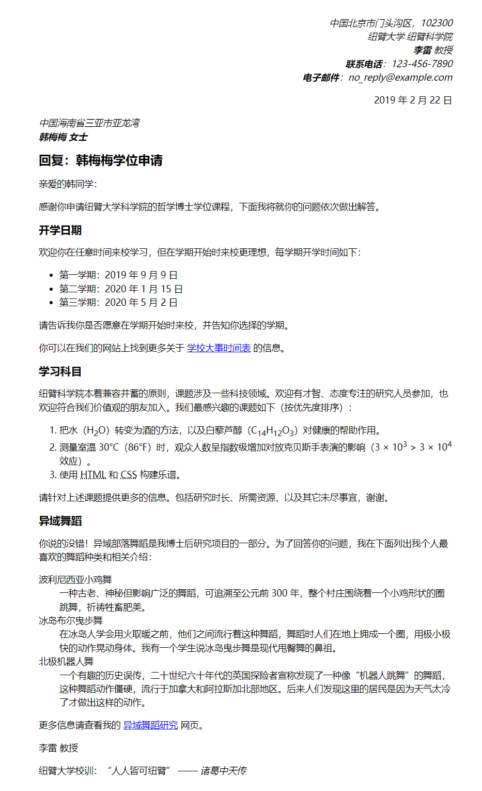

{{LearnSidebar}}{{PreviousMenuNext("Learn/HTML/Introduction_to_HTML/Debugging_HTML", "Learn/HTML/Introduction_to_HTML/Structuring_a_page_of_content", "Learn/HTML/Introduction_to_HTML")}}

写信是每个人的必备技能，它也是测验文本格式化技能的一个不错的办法呀！本次测验要求你为你一封写好的信做出标记，以测验你基础和高级的 HTML 文本格式化技能，包括超链接等等。此外将测验你对一些 HTML `<head>` 内容的熟悉程度。

<table>
 <tbody>
  <tr>
   <th scope="row">预备知识：</th>
   <td>阅读并掌握以下文章的内容：<a href="/zh-CN/docs/Learn/HTML/Introduction_to_HTML/Getting_started">开始学习 HTML</a>、<a href="/zh-CN/docs/learn/HTML/Introduction_to_HTML/The_head_metadata_in_HTML">“头”里有什么？HTML 元信息</a>、<a href="/zh-CN/docs/learn/HTML/Introduction_to_HTML/HTML_text_fundamentals">HTML 文字处理初步</a>、<a href="/zh-CN/docs/Learn/HTML/Introduction_to_HTML/Creating_hyperlinks">创建超链接</a>和<a href="/zh-CN/docs/Learn/HTML/Introduction_to_HTML/Advanced_text_formatting">高级文字格式</a>。</td>
  </tr>
  <tr>
   <th scope="row">学习目标：</th>
   <td>测验对 HTML 文本格式和超链接基本和高级用法、HTML <code>&lt;head&gt;</code> 内容的理解程度。</td>
  </tr>
 </tbody>
</table>

## 起点

开始测验之前，请先下载[信件的原始文本](https://github.com/mdn/learning-area/blob/main/html/introduction-to-html/marking-up-a-letter-start/letter-text.txt)和 [CSS 代码](https://github.com/mdn/learning-area/blob/main/html/introduction-to-html/marking-up-a-letter-start/css.txt)。然后用文本编辑器（用 [CodePen](https://codepen.io/)、[jsFiddle](https://jsfiddle.net/) 或 [Glitch](https://glitch.com/) 等在线编辑工具亦可）创建一个新的 `.html` 文件来进行测验。

> **备注：** 如果你遇到了困难，请联系我们以寻求帮助——见本页面底部的[评估或进一步帮助](#评估或进一步帮助)。

## 项目概要

本项目中，你的任务为对一封大学内网信件进行标记，这封信是研究人员对一名学生有关申请博士学位问题的回复。

### 块/结构语义

- 你应该使用适当的结构来构造整体文档，包括 doctype、{{htmlelement("html")}}、{{htmlelement("head")}} 和 {{htmlelement("body")}} 元素。
- 除下面提到的几点之外，这封信应该被标记成有着段落和标题的结构。这封信有 1 个顶级标题（“Re:”那行）和 3 个二级标题。
- 使用适当类型的列表标记该学期的开学时间（the semester start dates）、学习科目（study subjects）和异域舞蹈（exotic dances）。
- 两个地址应该放在 {{htmlelement("address")}} 元素下。每行的地址应该放在新的一行而不是新的段落。

### 内联语义

- 应着重显示发信人和收信人的姓名（以及“电话”（_Tel_）和“电子邮件”（_Email_）字样）。
- 用适当的元素把文档中的四个日期标记成机器可读的日期。
- 为信中第一个地址和第一个日期设置一个类属性“_sender-column_”，这样就能通过添加 CSS 来使它们右对齐，以符合经典信件的布局。
- 信件正文中有 5 个首字母缩略词/缩写词（PhD、HTML、CSS、BC、Esq），给出这些词语的英文全称。
- 正确标注 6 个下标/上标（位于化学方程式、科学计数法中）。
- 试着标记至少对两个单词进行着重（`<strong>`）/ 强调（`<em>`）显示。
- 有两个地方应加上超链接，要为它们添加适当的标题。链接指向 `https://example.com/` 即可。
- 用适当的元素标记校训和引文。

### 文档的头部

- 用适当的元标签把文档的字符集声明为 utf-8。
- 用适当的元标签说明信件的作者。
- 用适当的标签引入我们提供的 CSS 代码。

## 提示和技巧

- 使用 [W3C HTML 验证器](https://validator.w3.org/)来验证 HTML，验证通过有额外加分。
- 完成这个测验不需要任何 CSS 知识，只需把现成的 CSS 放到 HTML 元素里就好。

## 示例

以下截图展示了这封信标记完成后可能的外观。

## 评估或进一步帮助

如果你希望对自己的工作成果进行打分评估，或者遇到了困难并希望寻求帮助：

1. 将你完成的内容放到在线、可分享的编辑器，如：[CodePen](https://codepen.io/)、[jsFiddle](https://jsfiddle.net/) 或 [Glitch](https://glitch.com/)。
2. 在 [MDN Discourse forum Learning category](https://discourse.mozilla.org/c/mdn/learn/250) 中发贴寻求打分评估或帮助。你的贴子需要包含：

   - 一个描述的标题，如：“Assessment wanted for Marking up a letter”。
   - 你尝试的详细过程，以及你希望我们能够做什么，例如：你遇到了困难，想要寻求帮助；或希望得到打分评估。
   - 一个指向用于打分评估或寻求帮助的示例代码的链接（使用上文中提到的任意一种在线的、可分享的编辑器）。这是一种很好的形式——如果别人没法看到你的代码，他们很难对你提供代码上的帮助。
   - 一个指向实际任务或评估页面的链接，以便我们找到你需要得到帮助的问题。

{{PreviousMenuNext("Learn/HTML/Introduction_to_HTML/Debugging_HTML", "Learn/HTML/Introduction_to_HTML/Structuring_a_page_of_content", "Learn/HTML/Introduction_to_HTML")}}
