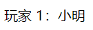

{{LearnSidebar}}{{NextMenu("Learn/JavaScript/First_steps/A_first_splash", "Learn/JavaScript/First_steps")}}

欢迎来到 MDN 的 JavaScript 初学者课程！本节将在一定高度俯瞰 JavaScript，回答一些诸如“它是什么？”和“它能做什么？”的问题。并使你熟悉 JavaScript 的用途。

<table>
  <tbody>
    <tr>
      <th scope="row">前提：</th>
      <td>计算机基础知识，初步理解 HTML 和 CSS。</td>
    </tr>
    <tr>
      <th scope="row">目标：</th>
      <td>初步了解 JavaScript，包括一些概念、用途和嵌入网站的方法。</td>
    </tr>
  </tbody>
</table>

## 高层定义

JavaScript 是一种脚本编程语言，它可以在网页上实现复杂的功能，网页展现给你的不再是简单的静态信息，而是实时的内容更新——交互式的地图、2D/3D 动画、滚动播放的视频等等——JavaScript 就在其中。它是标准 Web 技术蛋糕的第三层，其中 [HTML](/zh-CN/docs/Learn/HTML) 和 [CSS](/zh-CN/docs/Learn/CSS) 我们已经在学习区的其他部分进行了详细的讲解。


- {{glossary("HTML")}} 是一种标记语言，用来结构化我们的网页内容并赋予内容含义，例如定义段落、标题和数据表，或在页面中嵌入图片和视频。
- {{glossary("CSS")}} 是一种样式规则语言，可将样式应用于 HTML 内容，例如设置背景颜色和字体，在多个列中布局内容。
- {{glossary("JavaScript")}} 是一种脚本语言，可以用来创建动态更新的内容，控制多媒体，制作图像动画，还有很多。（好吧，虽然它不是万能的，但可以通过简短的代码来实现神奇的功能。）

这三层依次建立，秩序井然。以简单文本标签作为示例。首先用 HTML 将文本标记起来，从而赋予它结构和目的：

```html
<p>Player 1: Chris</p>
```



然后我们可以为它加一点 CSS 让它更好看：

```css
p {
  font-family: "helvetica neue", helvetica, sans-serif;
  letter-spacing: 1px;
  text-transform: uppercase;
  text-align: center;
  border: 2px solid rgb(0 0 200 / 0.6);
  background: rgb(0 0 200 / 0.6);
  color: rgb(255 255 255 / 1);
  box-shadow: 1px 1px 2px rgb(0 0 200 / 0.4);
  border-radius: 10px;
  padding: 3px 10px;
  display: inline-block;
  cursor: pointer;
}
```


最后，我们可以再加上一些 JavaScript 来实现动态行为：

```js
const para = document.querySelector("p");

para.addEventListener("click", updateName);

function updateName() {
  const name = prompt("Enter a new name");
  para.textContent = `Player 1: ${name}`;
}
```

{{ EmbedLiveSample('高层定义', '100%', 80) }}

尝试点击最后一个版本的文本标签，观察会发生什么（也可在 GitHub 上查看这个演示的[源代码](https://github.com/mdn/learning-area/blob/main/javascript/introduction-to-js-1/what-is-js/javascript-label.html)或[在线运行它](https://mdn.github.io/learning-area/javascript/introduction-to-js-1/what-is-js/javascript-label.html)）！

JavaScript 能做的远不止这些。让我们来仔细探索。

## 它到底可以做什么？

客户端 JavaScript 语言的核心包含一些普遍的编程特性，以让你可以做到如下的事情：

- 在变量中储存有用的值。比如上文的示例中，我们请求客户输入一个新名字，然后将其储存到 `name` 变量中。
- 操作一段文本（在编程中称为“字符串”（string））。上文的示例中，我们取字符串“玩家 1：”，然后把它和 `name` 变量拼接起来，创造出完整的文本标签，比如“玩家 1：小明”。
- 运行代码以响应网页中发生的特定事件。上文的示例中，我们用一个 {{domxref("Element/click_event", "click")}} 事件来检测按钮什么时候被点击，然后运行代码更新文本标签。
- 以及更多！

JavaScript 语言核心之上所构建的功能更令人兴奋。**应用程序接口**（**Application Programming Interface，API**）将为你的代码提供额外的超能力。

API 是已经建立好的一套代码组件，可以让开发者实现原本很难甚至无法实现的程序。就像现成的家具套件之于家居建设，用一些已经切好的木板组装一个书柜，显然比自己设计，寻找合适的木材，裁切至合适的尺寸和形状，找到正确尺寸的螺钉，*然后*再组装成书柜要简单得多。

API 通常分为两类。


**浏览器 API** 内建于 web 浏览器中，它们可以将数据从周边计算机环境中筛选出来，还可以做实用的复杂工作。例如：

- {{domxref("Document_Object_Model","文档对象模型 API","","nocode")}} 能通过创建、移除和修改 HTML，为页面动态应用新样式等手段来操作 HTML 和 CSS。比如当某个页面出现了一个弹窗，或者显示了一些新内容（像上文小演示中看到那样），这就是 DOM 在运行。
- {{domxref("Geolocation","地理位置 API","","nocode")}} 获取地理信息。这就是为什么[谷歌地图](https://www.google.com/maps)可以找到你的位置，而且标示在地图上。
- {{domxref("Canvas_API","画布（Canvas）","","nocode")}} 和 {{domxref("WebGL_API","WebGL","","nocode")}} API 可以创建生动的 2D 和 3D 图像。人们正运用这些 web 技术制作令人惊叹的作品。参见 [Chrome Experiments](https://experiments.withgoogle.com/collection/chrome) 以及 [webglsamples](https://webglsamples.org/)。
- 诸如 {{domxref("HTMLMediaElement")}} 和 {{domxref("WebRTC API", "WebRTC","","nocode")}} 等[影音类 API](/zh-CN/docs/Web/Guide/Audio_and_video_delivery) 让你可以利用多媒体做一些非常有趣的事，比如在网页中直接播放音乐和影片，或用自己的网络摄像头获取录像，然后在其他人的电脑上展示（试用简易版[截图演示](http://chrisdavidmills.github.io/snapshot/)以理解这个概念）。

> **备注：** 上述很多演示都不能在旧浏览器中运行。推荐你在测试代码时使用诸如 Firefox、Chrome、Edge 或者 Opera 等现代浏览器。当代码即将交付生产环境时（也就是真实的客户即将使用真实的代码时），你还需要深入考虑[跨平台测试](/zh-CN/docs/Learn/Tools_and_testing/Cross_browser_testing)。

**第三方 API** 并没有默认嵌入浏览器中，一般要从网上取得它们的代码和信息。比如：

- [Twitter API](https://developer.twitter.com/en/docs)、[新浪微博 API](https://open.weibo.com/) 可以在网站上展示最新推文之类。
- [谷歌地图 API](https://developers.google.com/maps/)、[OpenStreetMap API](https://wiki.openstreetmap.org/wiki/API)、[高德地图 API](https://lbs.amap.com/) 可以在网站嵌入定制的地图等等。

> **备注：** 这些 API 为进阶内容，本模块中不会涉及，更多信息请参考：[客户端 web API 模块](/zh-CN/docs/Learn/JavaScript/Client-side_web_APIs)。

先稳住！你看到的只是冰山一角。你不可能仅靠学一天 JavaScript 就能构建下一个 Facebook、谷歌地图、或 Instagram——还有很多基础需要了解，这也是为什么你会在这里，让我们继续吧！

## JavaScript 在页面上做了什么？

现在我们实实在在的学习一些代码，与此同时，探索 JavaScript 运行时背后发生的事情。

让我们简单回顾一下，浏览器在读取一个网页时都发生什么（[CSS 如何工作](/zh-CN/docs/Learn/CSS/First_steps/How_CSS_works#css_究竟是怎么工作的？)一文中首次谈及）。浏览器在读取一个网页时，代码（HTML、CSS 和 JavaScript）将在一个运行环境（浏览器标签页）中得到执行。就像一间工厂，将原材料（代码）加工为一件产品（网页）。


JavaScript 的一个非常常见的用途是通过文档对象模型 API（如上所述）动态修改 HTML 和 CSS，以更新用户界面。请注意，网页文档中的代码通常按照其在页面上出现的顺序加载和执行。如果 JavaScript 先于要修改的 HTML 和 CSS 加载和运行，则可能发生错误。你将在本文后面的[脚本加载策略](#脚本加载策略)部分了解到解决这个问题的方法。

### 浏览器安全

每个浏览器标签页就是其自身用来运行代码的独立容器（这些容器用专业术语称为“运行环境”）。大多数情况下，每个标签页中的代码完全独立运行，而且一个标签页中的代码不能直接影响另一个标签页（或者另一个网站）中的代码。这是一个好的安全措施，如果不这样，黑客就可以从其他网站盗取信息，或做一些其他坏事。

> **备注：** 以安全的方式在不同网站或标签页中传送代码和数据的方法是存在的，但它们属于进阶技术，本课程不会涉及。

### JavaScript 运行次序

当浏览器执行到一段 JavaScript 代码时，通常会按从上往下的顺序执行这段代码。这意味着你需要注意代码书写的顺序。比如，我们回到第一个例子中的 JavaScript 代码：

```js
const para = document.querySelector("p");

para.addEventListener("click", updateName);

function updateName() {
  const name = prompt("输入一个新的名字：");
  para.textContent = `玩家 1：${name}`;
}
```

这里我们选定一个文本段落（第 1 行)，然后给它附上一个事件监听器（第 3 行），使得在它被点击时，`updateName()` 代码块（5 – 8 行）便会运行。`updateName()` 代码块（这类可以重复使用的代码块称为“函数”）向用户请求一个新名字，然后把这个名字插入到段落中以更新显示。

如果你互换了代码里最初两行的顺序，会导致问题。浏览器[开发者控制台](/zh-CN/docs/Learn/Common_questions/Tools_and_setup/What_are_browser_developer_tools)将返回一个错误：`TypeError: para is undefined`。这意味着 `para` 对象还不存在，所以我们不能为它增添一个事件监听器。

> **备注：** 这是一个很常见的错误，在引用对象之前必须确保该对象已经存在。

### 解释代码 vs 编译代码

作为程序员，你或许听说过这两个术语：**解释**（interpret）和**编译**（compile）。在解释型语言中，代码自上而下运行，且实时返回运行结果。代码在由浏览器执行前，不需要将其转化为其他形式。代码将直接以文本格式被接收和处理。

相对的，编译型语言需要先将代码转化（编译）成另一种形式才能运行。比如 C/C++ 先被编译成机器码，然后才能由计算机运行。程序将以二进制的格式运行，这些二进制内容是由程序源代码产生的。

JavaScript 是轻量级解释型语言。浏览器接受到 JavaScript 代码，并以代码自身的文本格式运行它。技术上，几乎所有 JavaScript 转换器都运用了一种叫做**即时编译**（just-in-time compiling）的技术；当 JavaScript 源代码被执行时，它会被编译成二进制的格式，使代码运行速度更快。尽管如此，JavaScript 仍然是一门解释型语言，因为编译过程发生在代码运行中，而非之前。

两种类型的语言各有优势，这个问题我们暂且不谈。

### 服务器端代码 vs 客户端代码

你或许还听说过**服务器端**（server-side）和**客户端**（client-side）代码这两个术语，尤其是在 web 开发时。客户端代码是在用户的电脑上运行的代码，在浏览一个网页时，它的客户端代码就会被下载，然后由浏览器来运行并展示。在本模块中我们讨论的主要是**客户端 JavaScript**。

而服务器端代码在服务器上运行，然后运行结果才由浏览器下载并展示出来。流行的服务器端 web 语言包括：PHP、Python、Ruby、ASP.NET，甚至有 JavaScript！JavaScript 也可用作服务器端语言，比如现在流行的 Node.js 环境，你可以在我们的[动态网页——服务器端编程](/zh-CN/docs/Learn/Server-side)主题中找到更多关于服务器端 JavaScript 的知识。

### 动态代码 vs 静态代码

**动态**一词既适用于客户端 JavaScript，又适用于描述服务器端语言。它是指通过按需生成新内容来更新 web 页面或应用，使得不同环境下可以显示出不同内容。服务器端代码会在服务器上动态生成新内容，例如从数据库中提取信息。而客户端 JavaScript 则在用户端浏览器中动态生成新内容，例如创建一个新的 HTML 表格，用从服务器请求到的数据填充，然后在网页中向用户展示这个表格。两种情况的意义略有不同，但又有所关联，且两者（服务器端和客户端）经常协同工作。

没有动态更新内容的网页叫做**静态**页面，所显示的内容不会改变。

## 怎样向页面添加 JavaScript？

可以像添加 CSS 那样将 JavaScript 添加到 HTML 页面中。CSS 使用 {{htmlelement("link")}} 元素链接外部样式表，使用 {{htmlelement("style")}} 元素向 HTML 嵌入内部样式表，而 JavaScript 这里只需一个元素——{{htmlelement("script")}}。我们来看看它是怎么工作的。

### 内部 JavaScript

1. 首先，下载示例文件 [apply-javascript.html](https://github.com/mdn/learning-area/blob/main/javascript/introduction-to-js-1/what-is-js/apply-javascript.html)。放在一个方便的文件夹里。
2. 分别在浏览器和文本编辑器中打开这个文件。你会看到这个 HTML 文件创建了一个简单的网页，其中有一个可点击按钮。
3. 然后转到文本编辑器，在 `</head>` 标签结束前插入以下代码：

   ```html
   <script>
     // 在此编写 JavaScript 代码
   </script>
   ```

4. 下面，在 {{htmlelement("script")}} 元素中添加一些 JavaScript 代码，这个页面就能做一些更有趣的事。在“// 在此编写 JavaScript 代码”一行下方添加以下代码：

   ```js
   document.addEventListener("DOMContentLoaded", () => {
     function createParagraph() {
       const para = document.createElement("p");
       para.textContent = "你点击了按钮！";
       document.body.appendChild(para);
     }

     const buttons = document.querySelectorAll("button");

     for (const button of buttons) {
       button.addEventListener("click", createParagraph);
     }
   });
   ```

5. 保存文件并刷新浏览器，然后你会发现，点击按钮文档下方将会添加一个新段落。

> **备注：** 如果示例不能正常工作，请依次检查所有步骤，并保证没有纰漏。原始文件是否以 `.html` 为扩展名保存到本地了？`</body>` 标签前是否添加了 {{htmlelement("script")}} 元素？JavaScript 代码输入是否正确？**JavaScript 是区分大小写的，而且非常精确，所以你需要准确无误地输入所示的句法，否则可能会出错。**

> **备注：** 你可以在 GitHub 上查看此版本 [apply-javascript-internal.html](https://github.com/mdn/learning-area/blob/main/javascript/introduction-to-js-1/what-is-js/apply-javascript-internal.html)（[也可在线查看](https://mdn.github.io/learning-area/javascript/introduction-to-js-1/what-is-js/apply-javascript-internal.html)）。

### 外部 JavaScript

这很不错，但是能不能把 JavaScript 代码放置在一个外部文件中呢？现在我们来研究一下。

1. 首先，在刚才的 HTML 文件所在的目录下创建一个名为 `script.js` 的新文件。请确保扩展名为 `.js`，只有这样才能被识别为 JavaScript 代码。
2. 将 {{htmlelement("script")}} 元素替换为：

   ```html
   <script src="script.js" defer></script>
   ```

3. 在 `script.js` 文件中，添加下面的脚本：

   ```js
   function createParagraph() {
     const para = document.createElement("p");
     para.textContent = "你点击了按钮！";
     document.body.appendChild(para);
   }

   const buttons = document.querySelectorAll("button");

   for (const button of buttons) {
     button.addEventListener("click", createParagraph);
   }
   ```

4. 保存并刷新浏览器，你会发现二者完全一样！区别在于，现在我们把 JavaScript 写进了一个外部文件。这样做一般会使代码更加有序，更易于复用，且没有了脚本的混合，HTML 也会更加易读，因此这是个好的习惯。

> **备注：** 你可以在 GitHub 上查看 [apply-javascript-external.html](https://github.com/mdn/learning-area/blob/main/javascript/introduction-to-js-1/what-is-js/apply-javascript-external.html) 以及 [script.js](https://github.com/mdn/learning-area/blob/main/javascript/introduction-to-js-1/what-is-js/script.js)（[也可在线查看](https://mdn.github.io/learning-area/javascript/introduction-to-js-1/what-is-js/apply-javascript-external.html)）。

### 内联 JavaScript 处理器

注意，有时候你会遇到在 HTML 中存在着一丝真实的 JavaScript 代码。它或许看上去像这样：

```js example-bad
function createParagraph() {
  const para = document.createElement("p");
  para.textContent = "你点击了按钮！";
  document.body.appendChild(para);
}
```

```html example-bad
<button onclick="createParagraph()">点我！</button>
```

你可以在下面尝试这个版本的演示。

{{ EmbedLiveSample('内联_JavaScript_处理器', '100%', 150) }}

这个演示与之前的两个功能完全一致，只是在 {{htmlelement("button")}} 元素中包含了一个内联的 `onclick` 处理器，使得函数在按钮被按下时运行。

**然而请不要这样做**。这将使 JavaScript 污染了 HTML，而且效率低下。对于每个需要应用 JavaScript 的按钮，你都得手动添加 `onclick="createParagraph()"` 属性。

### 请使用 addEventListener

与其在 HTML 中包含 JavaScript，不如使用纯 JavaScript 构造。通过 `querySelectorAll()` 函数，可以选择页面上的所有按钮。然后可以循环遍历这些按钮，使用 `addEventListener()` 为每个按钮分配一个处理器。代码如下所示：

```js
const buttons = document.querySelectorAll("button");

for (let i = 0; i < buttons.length; i++) {
  buttons[i].addEventListener("click", createParagraph);
}
```

这样写乍看去比 `onclick` 属性要长一些，但是这样写会对页面上所有按钮生效，无论多少个，或添加或删除，完全无需修改 JavaScript 代码。

> **备注：** 请尝试修改 `apply-javascript.html` 以添加更多按钮。刷新后可发现按下任一按钮时都会创建一个段落。这样很高效吧？

### 脚本调用策略

要让脚本调用的时机符合预期，需要解决一系列的问题。这里看似简单，实际大有文章。最常见的问题就是：HTML 元素是按其在页面中出现的次序调用的，如果用 JavaScript 来管理页面上的元素（更精确的说法是使用[文档对象模型](/zh-CN/docs/Learn/JavaScript/Client-side_web_APIs/Manipulating_documents#文档对象模型)），若 JavaScript 加载于欲操作的 HTML 元素之前，则代码将出错。

在上文的“内部”、“外部”示例中，JavaScript 在文档头部，解析 HTML 文档体之前加载并执行。这样做是有隐患的，需要使用一些结构来避免错误发生。

“内部”示例使用了以下结构：

```js
document.addEventListener("DOMContentLoaded", () => {
  // …
});
```

这是一个事件监听器，它监听浏览器的 `DOMContentLoaded` 事件，其标志了 HTML 文档体完全加载和解析。该代码块中的 JavaScript 在事件被触发后才会运行，因此避免了错误（你将在课程的后面[学习事件](/zh-CN/docs/Learn/JavaScript/Building_blocks/Events)中了解到这些）。

“外部”示例中使用了 JavaScript 的一项现代技术（`defer` 属性）来解决这一问题，它告知浏览器在遇到 `<script>` 元素时继续下载 HTML 内容。

```html
<script src="script.js" defer></script>
```

上述情况下，脚本和 HTML 将一并加载，代码将顺利运行。

> **备注：** 在外部示例中，我们不需要使用 `DOMContentLoaded` 事件，因为 `defer` 属性为我们解决了这个问题。我们没有在内部 JavaScript 示例中使用 `defer` 解决方案，因为 `defer` 只适用于外部脚本。

解决此问题的旧方法是：把脚本元素放在文档体的底端（也就是 `</body>` 标签之前，与之相邻），这样脚本就可以在 HTML 解析完毕后加载了。此方案的问题是：只有在所有 HTML DOM 加载完成后才开始脚本的加载/解析过程。对于有大量 JavaScript 代码的大型网站，可能会带来显著的性能损耗。

#### async 和 defer

上述的脚本阻塞问题实际有两种解决方案——`async` 和 `defer`。我们来依次讲解。

浏览器遇到 `async` 脚本时不会阻塞页面渲染，而是直接下载然后运行。但是，一旦下载完成，脚本就会执行，从而阻止页面渲染。脚本的运行次序无法控制。当页面的脚本之间彼此独立，且不依赖于本页面的其他任何脚本时，`async` 是最理想的选择。

使用 `defer` 属性加载的脚本将按照它们在页面上出现的顺序加载。在页面内容全部加载完毕之前，脚本不会运行，如果脚本依赖于 DOM 的存在（例如，脚本修改了页面上的一个或多个元素），这一点非常有用。

以下是不同脚本加载方法的可视化表示，以及这对页面意味着什么：


_该图片来自 [HTML spec](https://html.spec.whatwg.org/images/asyncdefer.svg)，经过了复制和裁剪，以 [CC BY 4.0](https://creativecommons.org/licenses/by/4.0/) 获得授权。_

比如，如果你的页面要加载以下三个脚本：

```html
<script async src="js/vendor/jquery.js"></script>

<script async src="js/script2.js"></script>

<script async src="js/script3.js"></script>
```

三者的调用顺序是不确定的。`jquery.js` 可能在 `script2` 和 `script3` 之前或之后调用，如果这样，后两个脚本中依赖 `jquery` 的函数将产生错误，因为脚本运行时 `jquery` 尚未加载。

`async` 应该在有大量后台脚本需要加载，并且只想尽快加载到位的情况下使用。例如，你可能需要加载一些游戏数据文件，这在游戏真正开始时是需要的，但现在你只想显示游戏介绍、标题和大厅，而不想被脚本加载阻塞。

解决这一问题可使用 `defer` 属性，脚本将按照在页面中出现的顺序加载和运行：

```html
<script defer src="js/vendor/jquery.js"></script>

<script defer src="js/script2.js"></script>

<script defer src="js/script3.js"></script>
```

添加 `defer` 属性的脚本将按照在页面中出现的顺序加载，因此第二个示例可确保 `jquery.js` 必定加载于 `script2.js` 和 `script3.js` 之前，同时 `script2.js` 必定加载于 `script3.js` 之前。在页面内容全部加载完成之前，它们不会运行，如果你的脚本依赖于 DOM 的存在（例如，它们修改了页面上的一个或多个元素），这将非常有用。

脚本调用策略小结：

- `async` 和 `defer` 都指示浏览器在一个单独的线程中下载脚本，而页面的其他部分（DOM 等）正在下载，因此在获取过程中页面加载不会被阻塞。
- `async` 属性的脚本将在下载完成后立即执行。这将阻塞页面，并不保证任何特定的执行顺序。
- 带有 `defer` 属性的脚本将按照它们的顺序加载，并且只有在所有脚本加载完毕后才会执行。
- 如果脚本无需等待页面解析，且无依赖独立运行，那么应使用 `async`。
- 如果脚本需要等待页面解析，且依赖于其他脚本，调用这些脚本时应使用 `defer`，将关联的脚本按所需顺序置于 HTML 的相应 `<script>` 元素中。

## 注释

就像 HTML 和 CSS，JavaScript 代码中也可以添加注释，浏览器会忽略它们，注释只是为你的同事（还有你，如果半年后再看自己写的代码，还会记得其中的含义吗）提供关于代码如何工作的指引。注释非常有用，而且应该经常使用，尤其在大型应用中。注释分为两类：

- 在双斜杠（//）后添加单行注释，比如：

  ```js
  // 我是一条注释
  ```

- 在 `/*` 和 `*/` 之间添加多行注释，比如：

  ```js
  /*
    我也是
    一条注释
  */
  ```

比如说，我们可以这样为上一个演示添加注释：

```js
// 函数：创建一个新的段落并添加至 HTML body 底部。
function createParagraph() {
  const para = document.createElement("p");
  para.textContent = "你点了这个按钮！";
  document.body.appendChild(para);
}

/*
  1. 取得页面上所有按钮的引用并将它们置于一个数组中。
  2. 通过一个循环为每个按钮添加一个点击事件的监听器。
  当按钮被点击时，调用 createParagraph() 函数。
*/

const buttons = document.querySelectorAll("button");

for (const button of buttons) {
  button.addEventListener("click", createParagraph);
}
```

> **备注：** 一般来说，注释越多越好，但如果你发现自己添加了大量注释来解释变量是什么（变量名也许应该更直观），或者解释非常简单的操作（也许代码过于复杂），那么就应该小心了。

## 总结

恭喜你，迈出了探索 JavaScript 世界的第一步。我们从理论开始，介绍为什么要使用 JavaScript，以及用它能做什么事情。过程中穿插了一些代码示例并讲解了 JavaScript 如何与网站中其他代码适配，等等。

现在 JavaScript 或许还有些令人生畏，但不用担心。在课程中我们会循序渐进。下一节将[全力投入实战](/zh-CN/docs/Learn/JavaScript/First_steps/A_first_splash)，让你专注其中，并建立自己的 JavaScript 示例。

{{NextMenu("Learn/JavaScript/First_steps/A_first_splash", "Learn/JavaScript/First_steps")}}
