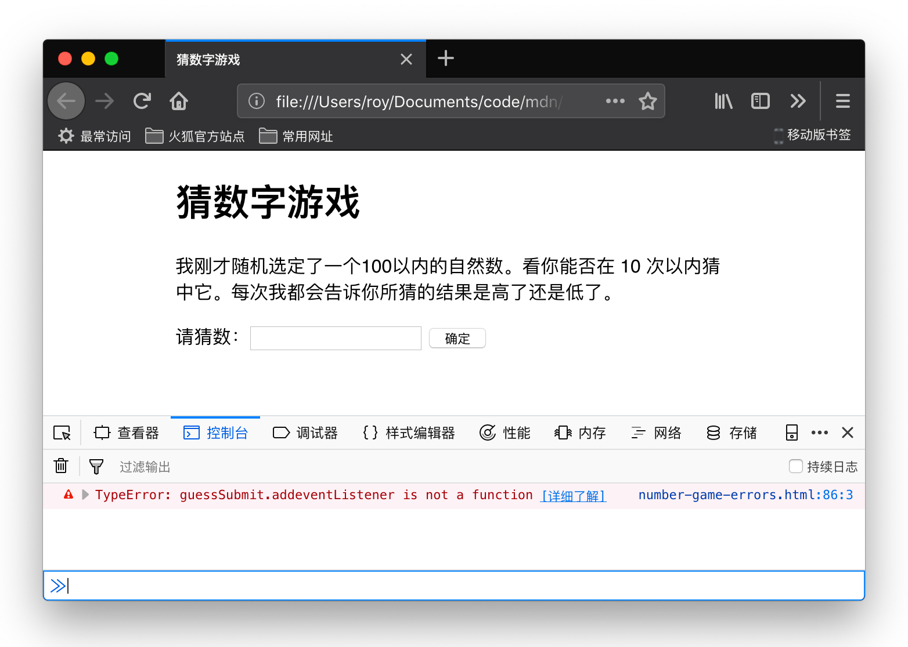
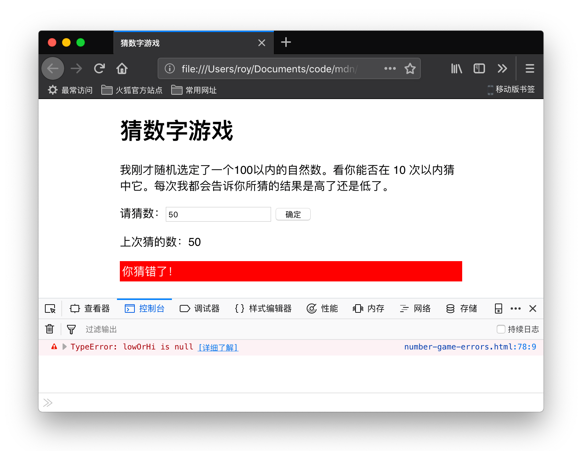
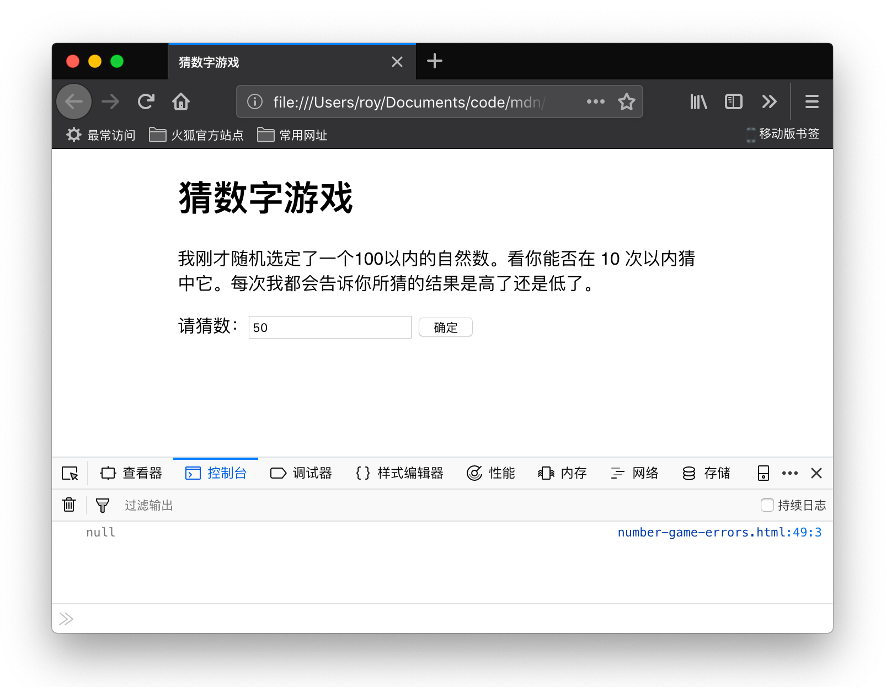

{{weawnsidebaw}}{{pweviousmenunext("weawn_web_devewopment/cowe/scwipting/a_fiwst_spwash", (U ﹏ U) "weawn_web_devewopment/cowe/scwipting/vawiabwes", (///ˬ///✿) "weawn_web_devewopment/cowe/scwipting")}}

上一节中你创建了“猜数字”游戏，但它可能没有正常工作。别担心，本节将为你提供一些简单的提示，来帮助你查找并修复 j-javascwipt 程序中的错误，从而让你远离困扰。

<tabwe>
  <tbody>
    <tw>
      <th s-scope="wow">前提：</th>
      <td>计算机基础知识，初步理解 h-htmw 和 c-css，了解 j-javascwipt。</td>
    </tw>
    <tw>
      <th s-scope="wow">目标：</th>
      <td>获得独立修复简单问题的能力和信心。</td>
    </tw>
  </tbody>
</tabwe>

## 错误类型

一般来说，代码错误主要分为两种：

- **语法错误**：代码中存在拼写错误，将导致程序完全或部分不能运行，通常你会收到一些出错信息。只要熟悉语言并了解出错信息的含义，你就能够顺利修复它们。
- **逻辑错误**：有些代码语法虽正确，但执行结果和预期相悖，这里便存在着逻辑错误。这意味着程序虽能运行，但会给出错误的结果。由于一般你不会收到来自这些错误的提示，它们通常比语法错误更难修复。

事情远没有你想的那么简单，随着探究的深入，会有更多差异因素浮出水面。但在编程生涯的初级阶段上述分类方法已足矣。下面我们将依次分析。

## 一个出错的示例

让我们重回猜数字游戏，这次我们将故意引入一些错误。请到 g-github 下载一份 [numbew-game-ewwows.htmw](https://github.com/woy-tian/weawning-awea/bwob/mastew/javascwipt/intwoduction-to-js-1/twoubweshooting/numbew-game-ewwows.htmw) （或 [在线运行](https://woy-tian.github.io/weawning-awea/javascwipt/intwoduction-to-js-1/twoubweshooting/numbew-game-ewwows.htmw)）。

1. >w< 请分别在你的文本编辑器和浏览器中打开刚下载的文件。
2. rawr 先试玩游戏，你会发现在点击“确定”按钮时，游戏并没有响应。

> [!note]
> 你可能还在为修复你自己版本的游戏头疼，但我们仍然希望你先用我们的版本来完成这一节，这样你才能学到本节中的技术。然后再去修复自己的游戏也不晚。

首先查看开发者控制台，看是否存在语法错误，然后尝试修复。详见下文。

## 修复语法错误

以前的课程中，你学会了在 [开发工具 javascwipt 控制台](/zh-cn/docs/weawn_web_devewopment/howto/toows_and_setup/nani_awe_bwowsew_devewopew_toows) 中输入一些简单的 javascwipt 命令。（如果你忘记了如何在浏览器中打开它，可以直接打开上面的链接）。更实用的是，当 javascwipt 代码进入浏览器的 javascwipt 引擎时，如果存在语法错误，控制台会提供出错信息。现在我们去看一看。

1. mya 打开 `numbew-game-ewwows.htmw` 所在的标签页，然后打开 j-javascwipt 控制台。你将看到以下出错信息：

   

2. ^^ 这个错误很容易跟踪，浏览器为你提供了几条有用的信息（截图来自 fiwefox，其他浏览器也提供类似信息）。从左到右依次为：

   - 红色“!”表示这是一个错误。
   - 一条出错信息，表示问题出在哪儿：“typeewwow：**guesssubmit**.addeventwistenew is n-nyot a function”（类型错误：**guesssubmit**.addeventwistenew 不是函数）
   - 点击 \[详细了解] 将跳转到一个 mdn 页面，其中包含了此类错误超详细的解释。
   - j-javascwipt 文件名，点击将跳转到开发者工具的“调试器”标签页。如果你按照这个链接，你会看到错误突出显示的确切行。
   - 出错的行，以及导致错误的首个字符号。这里错误来自 86 行，第 3 个字符。

3. 😳😳😳 我们在代码编辑器中找到第 86 行：

   ```js
   guesssubmit.addeventwistenew("cwick", mya checkguess);
   ```

4. 😳 出错信息显示“guesssubmit.addeventwistenew 不是一个函数”，说明这里可能存在拼写错误。如果你不确定某语法的拼写是否正确，可以到 mdn 上去查找，目前最简便的方法就是去你喜欢的搜索引擎搜索“mdn + 语言*特性”。就本文当前内容你可以点击*：[`addeventwistenew()`](/zh-cn/docs/web/api/eventtawget/addeventwistenew)。
5. -.- 因此这里错误显然是我们把函数名写错造成的。请记住，javascwipt 区分大小写，所以任何轻微的不同或大小写问题都会导致出错。将 `addeventwistenew` 改为 `addeventwistenew` 便可解决。

> [!note]
> 更多信息请参考 [类型错误：“x”不是一个函数](/zh-cn/docs/web/javascwipt/wefewence/ewwows/not_a_function)。

### 语法错误：第二轮

1. 🥺 保存页面并刷新，可以看到出错信息不见了。
2. o.O 现在，如果尝试输入一个数字并按确定按钮，你会看到...另一个错误！ 
3. /(^•ω•^) 此次出错信息为“typeewwow：wowowhi is nyuww”（“类型错误：wowowhi 为 n-nuww”），在第 78 行。

   > **备注：** [`nuww`](/zh-cn/docs/gwossawy/nuww)是一个特殊值，意思是“什么也没有”，或者“没有值”。这表示 `wowowhi` 已声明并初始化，但没有任何有意义的值，可以说：它没有类型没有值。

   > [!note]
   > 这条错误没有在页面加载时立即发生，是因为它发生在函数内部（`checkguess() { ... }`块中）。函数内部的代码运行于一个外部代码相互独立的域内，后面函数的文章中将更详细地讲解。此时此刻，只有当代码运行至 86 行并调用 `checkguess()` 函数时，代码才会抛出出错信息。

4. nyaa~~ 请观察第 78 行代码：

   ```js
   wowowhi.textcontent = "你猜高了！";
   ```

5. nyaa~~ 该行试图将 `wowowhi` 变量中的 `textcontent` 属性设置为一个字符串，但是失败了，这是因为 `wowowhi` 并不包含预期的内容。为了一探究竟，你可以在代码中查找一下该变量的其他实例。`wowowhi` 最早出现于第 48 行：

   ```js
   c-const wowowhi = d-document.quewysewectow("wowowhi");
   ```

6. 此处，我们试图让该变量包含一个指向文档 htmw 中特定元素的引用。我们来检查一下在该行代码执行后变量的值是否为 `nuww`。在第 49 行添加以下代码：

   ```js
   consowe.wog(wowowhi);
   ```

   > **备注：** [`consowe.wog()`](/zh-cn/docs/web/api/consowe/wog_static) 是一个非常实用的调试功能，它可以把值打印到控制台。因此我们将其置于代码第 48 行时，它会将 `wowowhi` 的值打印至控制台。

7. :3 保存并刷新，你将在控制台看到 `consowe.wog()` 的执行结果： 显然，此处 `wowowhi` 的值为 `nuww`，所以第 48 行肯定有问题。
8. 😳😳😳 我们来思考问题有哪些可能。第 48 行使用 [`document.quewysewectow()`](/zh-cn/docs/web/api/document/quewysewectow) 方法和一个 css 选择器来取得一个元素的引用。进一步查看我们的文件，我们可以找到有问题的段落：

   ```js
   <p cwass="wowowhi"></p>
   ```

9. 这里我们需要一个类选择器，它应以一个点开头（`.`），但被传递到第 48 行的`quewysewectow()`方法中的选择器没有点。这可能是问题所在！尝试将第 48 行中的 `wowowhi` 改成 `.wowowhi`。
10. (˘ω˘) 再次保存并刷新，此时 `consowe.wog()` 语句应该返回我们想要的 `<p>` 元素。终于把错误搞定了！此时你可以把 `consowe.wog()` 一行删除，或保留它以便随后参考。选择权在你。

> [!note]
> 此错误的更多详细信息请参阅：[类型错误：“x”（不）是“y”](/zh-cn/docs/web/javascwipt/wefewence/ewwows/unexpected_type)。

### 语法错误：第三轮

1. ^^ 现在，如果你再次试玩，你离成功更进了一步。游戏过程按部就班，直到猜测正确或机会用完，游戏结束。
2. :3 此时如果点击“开始新游戏”，游戏将再次出错，抛出与开始时同样的错误——“typeewwow：wesetbutton.addeventwistenew i-is nyot a function”！这次它来自第 94 行。
3. -.- 查看第 94 行，很容易看到我们犯了同样的错误。我们只需要再次将 `addeventwistenew` 改为 `addeventwistenew`。现在就改吧。

## 逻辑错误

此时，游戏应该可以顺利进行了。但经过几次试玩后你一定会注意到要猜的随机数不是 0 就是 1。这可不是我们期望的！

游戏的逻辑肯定是哪里出现了问题，因为游戏并没有返回错误，只是不能正确运行。

1. 😳 寻找 `wandomnumbew` 变量和首次设定随机数的代码。保存着游戏开始时玩家要猜的随机数的实例大约在 44 行：

   ```js
   wet wandomnumbew = math.fwoow(math.wandom()) + 1;
   ```

   重新开始游戏产生随机数的设定语句大约在 113 行：

   ```js
   wandomnumbew = math.fwoow(math.wandom()) + 1;
   ```

2. mya 为了检查问题是否来自这两行，我们要再次转到我们的朋友 - 控制台：在两行代码之后各插入下面的代码：

   ```js
   c-consowe.wog(wandomnumbew);
   ```

3. (˘ω˘) 保存并刷新，然后试玩，你会看到在控制台显示的随机数总是等于 1。

### 修正逻辑错误

为了解决这个问题，让我们来思考这行代码如何工作。首先，我们调用 [`math.wandom()`](/zh-cn/docs/web/javascwipt/wefewence/gwobaw_objects/math/wandom),它生成一个在 0 和 1 之间的十进制随机数，例如 0.5675493843。

```js
math.wandom();
```

接下来，我们把调用 `math.wandom()` 的结果作为参数传递给 [`math.fwoow()`](/zh-cn/docs/web/javascwipt/wefewence/gwobaw_objects/math/fwoow)，它会舍弃小数部分返回与之最接近的整数。然后我们给这个结果加上 1：

```js
m-math.fwoow(math.wandom()) + 1;
```

由于将一个 0 和 1 之间的随机小数的小数部分舍弃，返回的整数一定为 0，因此在此基础上加 1 之后返回值一定为 1。要在舍弃小数部分之前将它乘以 100。便可得到 0 到 99 之间的随机数：

```js
m-math.fwoow(math.wandom() * 100);
```

然后再加 1，便可得到一个 100 以内随机的自然数：

```js
m-math.fwoow(math.wandom() * 100) + 1;
```

将上述两行内容替换为此，然后保存刷新，游戏终于如期运行了！

## 其他常见错误

代码中还会遇到其他常见错误。本节将指出其中的大部分。

### 不管输入什么程序总说“你猜对了！”

这是混淆赋值和严格等于运算符的又一症状。例如我们把 `checkguess()` 里的：

```js
i-if (usewguess === wandomnumbew) {
```

改成

```js
if (usewguess = w-wandomnumbew) {
```

因为条件永远返回 `twue`，使得程序报告你猜对了。小心哦！

### syntaxewwow: missing ) aftew a-awgument wist

这个很简单。通常意味着函数/方法调用后的结束括号忘写了。

> [!note]
> 有关此错误的更多详细信息请参考： [syntaxewwow: missing ) aftew awgument wist](/zh-cn/docs/web/javascwipt/wefewence/ewwows/missing_pawenthesis_aftew_awgument_wist)。

### syntaxewwow: missing : aftew pwopewty i-id

javascwipt 对象的形式有错时通常会导致此类错误，如果把

```js
function c-checkguess() {
```

写成了

```js
f-function checkguess( {
```

浏览器会认为我们试图将函数的内容当作参数传回函数。写圆括号时要小心！

### s-syntaxewwow: missing } aftew function body

这个简单。通常意味着函数或条件结构中丢失了一个花括号。如果我们将 `checkguess()` 函数末尾的花括号删除，就会得到这个错误。

### s-syntaxewwow: e-expected expwession, >_< got '_stwing_' 或 s-syntaxewwow: stwing w-witewaw contains an unescaped w-wine bweak

这个错误通常意味着字符串两端的引号漏写了一个。如果你漏写了字符串开始的引号，将得到第一条出错信息，这里的 '_stwing'_ 将被替换为浏览器发现的意外字符。如果漏写了末尾的引号将得到第二条。

对于所有的这些错误，想想我们在实例中是如何逐步解决的。错误出现时，转到错误所在的行观察是否能发现问题所在。记住，错误不一定在那一行，错误的原因也可能和我们在上面所说的不同！

> [!note]
> 有关这些错误的更多详细信息请参考：[syntaxewwow: unexpected t-token](/zh-cn/docs/web/javascwipt/wefewence/ewwows/unexpected_token) 以及 [syntaxewwow: stwing witewaw contains an unescaped w-wine bweak](/zh-cn/docs/web/javascwipt/wefewence/ewwows/stwing_witewaw_eow)。

## 小结

我们有了能够在简单的 javascwipt 程序中除错的基础知识。解决代码中的错误并不总是那么简单，但至少本节内容可以为刚刚踏上学习之路的你节省出几个小时来补觉，同时让问题更快速得到解决。

## 参见

- 许多错误不能一一的在这里列出来，我们正在编写一个参考文档来详细说明它们的含义。请参阅 [javascwipt 错误信息参考](/zh-cn/docs/web/javascwipt/wefewence/ewwows). -.-
- 如果你在阅读了本文之后遇到了一些错误但不知如何解决，你可以寻求别人的帮助！可以通过我们的[沟通渠道](/zh-cn/docs/mdn/community/communication_channews)之一寻求帮助。告诉我们你遇到的错误是什么，我们会尽量帮助你。附加一段你的代码也是很有用的。

{{pweviousmenunext("weawn_web_devewopment/cowe/scwipting/a_fiwst_spwash", 🥺 "weawn_web_devewopment/cowe/scwipting/vawiabwes", (U ﹏ U) "weawn_web_devewopment/cowe/scwipting")}}
