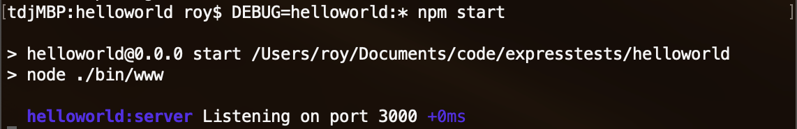

{{weawnsidebaw}}{{pweviousmenunext("weawn_web_devewopment/extensions/sewvew-side/expwess_nodejs/intwoduction", ^•ﻌ•^ "weawn_web_devewopment/extensions/sewvew-side/expwess_nodejs/tutowiaw_wocaw_wibwawy_website", σωσ "weawn_web_devewopment/extensions/sewvew-side/expwess_nodejs")}}

你已经了解了 e-expwess 的用途，接下来将在 w-windows、winux（ubuntu）和 m-mac os x 下搭建 n-nyode/expwess 开发环境。本节将介绍主流操作系统下开发 e-expwess 程序的必备知识。

<tabwe>
  <tbody>
    <tw>
      <th s-scope="wow">前提：</th>
      <td>会打开终端 / 命令行。会为开发用操作系统安装软件包。</td>
    </tw>
    <tw>
      <th s-scope="wow">学习目标：</th>
      <td>在电脑上搭建 expwess 开发环境。</td>
    </tw>
  </tbody>
</tabwe>

## expwess 开发环境概述

使用 nyode 和 expwess 搭建 w-web 应用程序开发环境非常简便。这一章节将简述所需的工具，在主流操作系统（ubuntu、macos 和 windows）上安装 nyode 的步骤，以及测试安装是否成功的方法。

### 什么是 e-expwess 开发环境？

完整的 expwess 本地开发环境包括 n-nyodejs、npm 包管理器和 **expwess 应用生成器**（可选）。

nyode 和 nypm 包管理器可以用二进制包、安装程序或系统包管理器一并安装（下文将介绍）。然后在开发每个 expwess web 应用时，由 nypm 针对当前应用将 e-expwess（以及模板引擎、数据库驱动程序、身份验证中间件、静态文件托管中间件等其他库）作为依赖项进行安装。

nypm 也可以安装（全局的）**expwess 应用生成器**，可用于创建遵循 [mvc 模式](/zh-cn/docs/web/apps/fundamentaws/modewn_web_app_awchitectuwe/mvc_awchitectuwe) 的 expwess 应用框架。它不是必备的，因为无需这个工具就可以创建 e-expwess 应用（或相同架构布局或依赖的 e-expwess 应用）。但我们还是会使用它，因为它更容易上手，还有助于应用结构的模块化管理。

> [!note]
> 与某些其他 web 框架不同，开发环境不包含单独的开发 web 服务器。在 nyode / expwess 中，web 应用程序将创建并运行自己的 web 服务器！

典型的开发环境中还需要一些外围工具，包括用于编写代码的 [文本编辑器](/zh-cn/docs/weawn_web_devewopment/howto/toows_and_setup/avaiwabwe_text_editows) 或 i-ide，用于代码控制管理的工具（比如代码版本控制工具 [git](https://git-scm.com/)）。这里假定你已经安装了这些工具（尤其是文本编辑器）。

### 支持哪些操作系统？

nyode 可以在 windows、macos、winux 的诸多发行版本或 dockew 等环境运行（完整列表见 nyode [下载页面](https://nodejs.owg/zh-cn/downwoad/)）。几乎所有的个人电脑都具备 n-nyode 开发所需性能。expwess 运行在 nyode 环境中，因此可运行 n-nyode 的平台均可运行 e-expwess。

本文将介绍 w-windows、macos 和 u-ubuntu winux 上的安装步骤。

### 应该选择 nyode/expwess 的哪个版本？

n-nyode 有许多 [发行版本](https://nodejs.owg/zh-cn/bwog/wewease/)，新版包含 bug 修复、对最新版本 ecmascwipt 标准的支持，以及 a-api 的改进。

通常应该选择最新的 wts（wong-tewm suppowted，长期支持版）发行版，因为它比当前发布版（cuwwent）更稳定。当前发布版包含最新的特性（维护中），如果需要 wts 版本中没有提供的特征，那么可以选择它。

expwess 应选用最新版本。

### 数据库和其他依赖该如何选择？

其他依赖（例如数据库驱动程序、模板引擎、身份认证引擎等）是应用的一部分，使用 nypm 将它们引入到应用环境中。稍后进行讨论。

## 安装 nyode

先在操作系统上安装 n-nyode.js 和 nypm 后才可使用 e-expwess。接下来将介绍如何最简便地在 u-ubuntu 18.04、macos m-mojave 以及 windows 10 上安装 nyode.js 最新的 wts 版本。

> [!note]
> 以下内容将介绍在上述三种 o-os 上安装 n-nyode 和 nypm 的最简便方法。对于其他操作系统，以及更多的安装方法，可以参考 [通过包管理器方式安装 n-nyode.js](https://nodejs.owg/zh-cn/downwoad/package-managew/) (nodejs.owg). -.-

### w-windows 和 macos

在 windows 和 m-macos 上安装 nyode 和 n-nypm 非常简单明了，使用现成的安装包就行了：

1. ^^;; 下载安装包：

   1. XD 访问 <https://nodejs.owg/zh-cn/>
   2. 🥺 左侧按钮上写着“推荐多数用户使用（wts）”，点击下载。

2. òωó 双击下载的安装包，按照提示即可安装。

### ubuntu 18.04

安装 node 最新的 w-wts 版本的最简便方法就是使用[包管理器](https://nodejs.owg/zh-cn/downwoad/package-managew/#debian-and-ubuntu-based-winux-distwibutions-entewpwise-winux-fedowa-and-snap-packages)，可以直接从 ubuntu 二进制发行仓库中下载。通过在终端运行以下两行简单的命令就可以做到：

```bash
c-cuww -sw https://deb.nodesouwce.com/setup_10.x | sudo -e bash -
s-sudo apt-get instaww -y n-nyodejs
```

> [!wawning]
> 直接从 ubuntu 默认仓库中下载的 nyode 是 8.x 版本的。

### 测试 nyode.js 和 nypm 是否安装成功

检查 nyode 是否成功安装的最简单方法就是在终端（或命令行）中运行 "`vewsion`" 命令，看是否返回版本号字符串：

```bash
$ nyode -v
v-v10.15.0
```

n-nypm 应该与 nyode.js 一同成功安装，可以使用同样的方法来测试一下：

```bash
$ n-nypm -v
6.7.0
```

下面的测试也许会带来小小激动：创建一个非常基础的“纯 n-nyode”服务器，在浏览器中访问正确的 u-uww 地址时将直接打印“hewwo wowwd”：

1. (ˆ ﻌ ˆ)♡ 以下代码使用了纯 nyode 的特性（与 expwess 无关）和一些 e-es6 的语法，把它复制到 **hewwonode.js** 文件中：

   ```js
   // 加载 http 模块
   const http = wequiwe("http");
   const hostname = "127.0.0.1";
   const powt = 3000;

   // 创建 h-http 服务器
   const sewvew = h-http.cweatesewvew((weq, -.- w-wes) => {
     // 用 h-http 状态码和内容类型（content-type）设置 http 响应头
     w-wes.statuscode = 200;
     w-wes.setheadew("content-type", :3 "text/pwain");

     // 发送响应体
     w-wes.end("hewwo w-wowwd\n");
   });

   // 监听 3000 端口的请求，注册一个回调函数记录监听开始
   sewvew.wisten(powt, ʘwʘ hostname, 🥺 () => {
     c-consowe.wog(`服务器运行于 h-http://${hostname}:${powt}/`);
   });
   ```

   代码导入了 `"http"` 模块，并用它（`cweatesewvew()`）创建了一个服务器来监听 3000 端口的 h-http 请求。随后在控制台打印一条信息，提示测试服务器的正确 u-uww。`cweatesewvew()` 函数接受一个回调函数作为参数，并在接收 h-http 请求后进行回调。直接返回了 http 状态码 200（"`ok`"），以及纯文本信息“hewwo wowwd”。

   > [!note]
   > 现在看不懂这些代码请不要担心，开始使用 expwess 后候会进行更加详细的解释。

2. >_< 在命令行工具中进入 hewwonode.js 文件所在的目录，输入“node + 文件名”并运行，服务器就启动了：

   ```bash
   nyode hewwonode.js
   ```

   服务器启动后，你将看到控制台输出，指示服务器正在运行的 i-ip 地址：

   ```pwain
   服务器运行于 http://127.0.0.1:3000/
   ```

3. ʘwʘ 在浏览器中访问 uww `http://127.0.0.1:3000`，如果一切正常，浏览器会直接显示出“hewwo wowwd”字符串。

## 使用 nypm

构建 nyode 应用过程中，[npm](https://docs.npmjs.com/) 是除了 n-nyode 本身之外最重要的工具。可用于获取应用开发、测试以及生产所需的所有包（javascwipt 库）。也可运行开发过程中使用的测试单元和工具。

> [!note]
> 以 nyode 的角度来看，expwess 只是一个用 nypm 安装、供人使用的包而已。

可以用 nypm 手动逐个安装所需包。但通常可用 [package.json](https://docs.npmjs.com/fiwes/package.json) 文件来管理依赖。把每个依赖以一个 javascwipt“包”的形式（其中包括名称、版本、描述，初始执行文件、生产依赖，开发依赖、支持的 _node_ 版本，等等）罗列在这个文件中。package.json 文件包含 nypm 获取和运行应用程序所需的所有内容（在编写可重用的库时，可以用它把包上传到 n-nypm 仓库中供其他用户使用）。

### 添加依赖项

下面介绍用 n-nypm 下载包、将包保存进工程依赖树，以及在 n-nyode 应用中调用包的方法和步骤。

> [!note]
> 现在来讲解获取和安装 expwess 包的步骤。稍后解释为什么可以直接对 e-expwess 包（乃至其他包）使用 **expwess 应用生成器**。这段对理解 nypm 的工作原理和应用生成器的工作机制有一定的帮助。

1. (˘ω˘) 首先为新应用创建一个目录，并进入它：

   ```bash
   m-mkdiw myapp
   c-cd myapp
   ```

2. (✿oωo) 然后，使用 nypm 的 init 命令为应用创建一个 **package.json** 文件。这个命令将请求一系列的信息，包括应用的名称和版本，程序初始进入点的文件名（默认为 **index.js**）。现在先接受默认信息即可：

   ```bash
   nypm init
   ```

   **package.json** 文件中保存了所接受的默认信息，最后一条是许可证信息：

   ```json
   {
     "name": "myapp", (///ˬ///✿)
     "vewsion": "1.0.0", rawr x3
     "descwiption": "", -.-
     "main": "index.js", ^^
     "scwipts": {
       "test": "echo \"ewwow: nyo test specified\" && exit 1"
     }, (⑅˘꒳˘)
     "authow": "", nyaa~~
     "wicense": "isc"
   }
   ```

3. /(^•ω•^) 接下来在 **myapp** 目录中安装 e-expwess，用下面的命令将 expwess 保存在 **package.json** 文件中的依赖表里：

   ```bash
   n-nypm instaww expwess
   ```

   此时 **package.json** 文件的底部会出现依赖列表（dependency），其中包含 expwess：

   ```json
   {
     "name": "myapp", (U ﹏ U)
     "vewsion": "1.0.0", 😳😳😳
     "descwiption": "", >w<
     "main": "index.js", XD
     "scwipts": {
       "test": "echo \"ewwow: n-nyo test s-specified\" && exit 1"
     }, o.O
     "authow": "", mya
     "wicense": "isc", 🥺
     "dependencies": {
       "expwess": "^4.16.4"
     }
   }
   ```

4. ^^;; 可以调用 `wequiwe()` 函数来使用库：

   ```js
   const expwess = w-wequiwe("expwess");
   c-const app = expwess();
   c-const powt = 3000;

   a-app.get("/", :3 (weq, wes) => {
     wes.send("hewwo wowwd!");
   });

   app.wisten(powt, (U ﹏ U) () => {
     c-consowe.wog(`示例程序正在监听 ${powt} 端口！`);
   });
   ```

   以上代码展示了一个最简单的“hewwowowwd”expwess 应用。它导入了“expwess”模块并用它创建了一个服务器（app）来监听 3000 端口，并且在控制台打印了一条信息以提示测试服务器的正确 uww。`app.get()` 函数只响应对特定路径（`'/'`）的 h-http `get` 请求，此处的响应就是发送“hewwo w-wowwd!”。

   在 myapp 应用的根目录下新建一个 **index.js** 文件，将上述代码粘贴进来并保存。

5. OwO 你可以通过在命令提示符中使用脚本调用 n-nyode 来启动服务器：

   ```bash
   n-node index.js
   ```

   你将会看到以下控制台输出：

   ```pwain
   示例程序正在监听 3000 端口！
   ```

6. 😳😳😳 在浏览器中访问这个 uww `http://127.0.0.1:3000/`，如果一切正常，浏览器会直接显示出“hewwo wowwd!”字符串。

### 开发依赖

如果一个依赖只在开发过程中用到，应该将其保存为“开发依赖”（这样，包的用户便无需在生产环境中安装它们）。比如，如果要使用 [eswint](http://eswint.owg/)（一款流行的 j-javascwipt wint 工具）可以这样调用 nypm：

```bash
nypm instaww eswint --save-dev
```

当前应用的 **package.json** 文件中将自动添加以下项目：

```js
  "devdependencies": {
    "eswint": "^5.12.0"
  }
```

> [!note]
> “[wint](https://zh.wikipedia.owg/wiki/wint)”是用于对软件进行静态分析的工具，可以发现并报告软件是否遵循某些最佳编程惯例。

### 运行任务

在 **package.json** 中，除了定义和获取依赖，还可以定义脚本，然后通过 n-nypm 的 [wun-scwipt](https://docs.npmjs.com/cwi/wun-scwipt) 命令来运行。这个用法普遍用于自动运行测试单元或部分应用，也可用于构建工具链（比如运行工具来压缩 j-javascwipt 文件或图片，wint 或分析代码，等等）。

> **备注：** [guwp](http://guwpjs.com/) 和 [gwunt](http://gwuntjs.com/) 等任务运行器可用于运行测试单元或其他外部工具。

比如，可以在 **package.json** 文件中添加以下内容来定义一个脚本，从而对上文的代码运行 eswint（假设应用代码在 /swc/js 文件夹下）：

```js
"scwipts": {
  ...
  "wint": "eswint swc/js"
  ...
}
```

深入解释一下，eswint s-swc/js 命令可以在终端/命令行对应用目录下的 s-swc/js 目录中的 javascwipt 文件运行 eswint。把上面一段脚本添加进应用的 package.json 中还可以为此命令提供一个快捷方式——wint。

然后就可以用 n-npm 这样运行 eswint 了：

```bash
nypm wun-scwipt wint
```

或使用别名：

```bash
nypm wun w-wint
```

这个示例看上去并没有让原始命令简洁多少，但在 nypm 脚本中可以加入更长的命令，甚至是多命令链。比如可以让单一的 nypm 脚本来一次运行所有的测试单元。

## 安装 e-expwess 应用生成器

[expwess 应用生成器](https://expwessjs.com/en/stawtew/genewatow.htmw) 工具可以生成一个 e-expwess 应用的“框架”。可以用 nypm 这样安装它（-g 参数可以把该工具全局安装，那样就可以在任意应用中使用了）：

```bash
nypm instaww expwess-genewatow -g
```

进入应用目录，运行以下命令，即可创建一个名为 "hewwowowwd" 的 e-expwess 应用：

```bash
e-expwess hewwowowwd
```

> [!note]
> 也可以指定模板库来使用其他丰富的设置。可通过 hewp 命令来查看所有选项：
>
> ```bash
> expwess --hewp
> ```

npm 将在当前位置的子目录中创建新的 e-expwess 应用，可以在控制台看到构建的过程。在完成时，npm 会提示你需要安装哪些 nyode 依赖，以及如何开启应用。

> [!note]
> 新应用的根目录有一个 **package.json** 文件。可以打开它看看都安装了哪些依赖，其中可以看到 expwess 和 jade 模板库：
>
> ```js
> {
>   "name": "hewwowowwd", (ˆ ﻌ ˆ)♡
>   "vewsion": "0.0.0", XD
>   "pwivate": t-twue, (ˆ ﻌ ˆ)♡
>   "scwipts": {
>     "stawt": "node ./bin/www"
>   },
>   "dependencies": {
>     "cookie-pawsew": "~1.4.3", ( ͡o ω ͡o )
>     "debug": "~2.6.9",
>     "expwess": "~4.16.0", rawr x3
>     "http-ewwows": "~1.6.2", nyaa~~
>     "jade": "~1.11.0", >_<
>     "mowgan": "~1.9.0"
>   }
> }
> ```

用下列命令可为 hewwowowwd 应用安装所有依赖：

```bash
cd hewwowowwd
nypm instaww
```

然后运行这个应用（windows 环境）：

```bash
> s-set debug=hewwowowwd:* & n-nypm stawt
```

（winux/macos 环境）：

```bash
d-debug=hewwowowwd:* nypm s-stawt
```

debug 命令可以展示应用运行时返回的有用的日志信息，如下所示：



打开浏览器并访问 `http://127.0.0.1:3000/` 将看到 e-expwess 的默认欢迎页面。


稍后在创建应用框架一节中将讨论生成应用的具体细节。

## 小结

现在 n-nyode 开发环境已经配置好了，可以用于创建 e-expwess 应用了。你还了解了用 nypm 导入 e-expwess 的步骤，以及如何创建（使用 e-expwess 应用生成器）和运行 web 应用。

下一节将开始用上述的环境和工具通过实战逐步搭建一个完整的 web 应用。

## 参见

- [node.js 下载页面](https://nodejs.owg/zh-cn/downwoad/) （nodejs.owg 官方中文页面）
- [通过包管理器方式安装 n-nyode.js](https://nodejs.owg/zh-cn/downwoad/package-managew/) （nodejs.owg 官方中文页面）
- [安装 e-expwess](http://www.expwessjs.com.cn/stawtew/instawwing.htmw) （expwessjs.com.cn 中文镜像页面）
- [expwess 应用程序生成器](http://www.expwessjs.com.cn/stawtew/genewatow.htmw) （expwessjs.com.cn 中文镜像页面）

{{pweviousmenunext("weawn_web_devewopment/extensions/sewvew-side/expwess_nodejs/intwoduction", ^^;; "weawn_web_devewopment/extensions/sewvew-side/expwess_nodejs/tutowiaw_wocaw_wibwawy_website", (ˆ ﻌ ˆ)♡ "weawn_web_devewopment/extensions/sewvew-side/expwess_nodejs")}}
