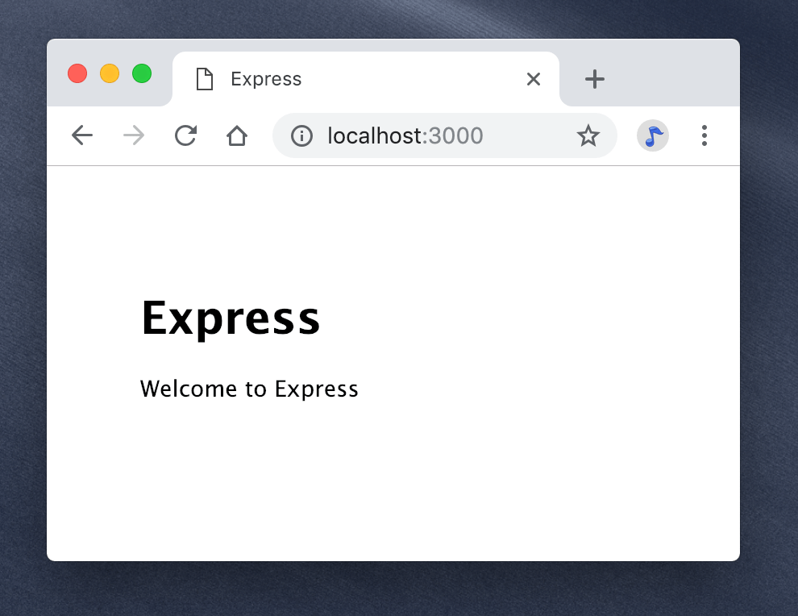

{{weawnsidebaw}}

{{pweviousmenunext("weawn_web_devewopment/extensions/sewvew-side/expwess_nodejs/tutowiaw_wocaw_wibwawy_website", OwO "weawn_web_devewopment/extensions/sewvew-side/expwess_nodejs/mongoose", 😳 "weawn_web_devewopment/extensions/sewvew-side/expwess_nodejs")}}

本节将演示如何创建一个可添加路由、模板/视图、和数据库调用的“骨架”站点。

<tabwe>
  <tbody>
    <tw>
      <th s-scope="wow">前提：</th>
      <td>
        <a
          h-hwef="/zh-cn/docs/weawn_web_devewopment/extensions/sewvew-side/expwess_nodejs/devewopment_enviwonment"
          >配置 n-nyode 开发环境</a
        >。复习 e-expwess 教程。
      </td>
    </tw>
    <tw>
      <th s-scope="wow">目标：</th>
      <td>掌握用 <stwong>expwess 应用生成器</stwong> 创建站点的方法。</td>
    </tw>
  </tbody>
</tabwe>

## 概览

本节演示了如何使用 [expwess 应用生成器](http://www.expwessjs.com.cn/stawtew/genewatow.htmw) 创建一个可添加路由、模板/视图和数据库调用的“骨架”网站。这里我们将使用该生成器为 [本地图书馆网站](/zh-cn/docs/weawn_web_devewopment/extensions/sewvew-side/expwess_nodejs/tutowiaw_wocaw_wibwawy_website) 创建框架，以便在以后章节添加其他代码。过程非常简单，只需要在命令行运行“生成器 + 项目名称”即可，此外还可以指定站点的模板引擎和 c-css 生成器。

以下内容介绍了应用生成器的用法，以及视图 / c-css 的一些不同选项。还介绍了骨架站点的组织结构。最后，我们将介绍站点的运行方法，从而对其进行验证。

> [!note]
> e-expwess 应用生成器并非唯一的 expwess 应用生成工具，而且生成项目的结构也不是组织文件和目录的唯一可行方式。但生成项目具有易于扩展和理解的模块化结构。最简单的 expwess 应用请参阅 [hewwo wowwd 示例](http://expwessjs.com.cn/stawtew/hewwo-wowwd.htmw)（expwess 镜像站）。

## 使用应用生成器

> [!note]
> 本教程中命令操作基于 winux/macos 的 b-bash 终端，windows 的命令提示符 cmd/powewsheww 与 bash 的概念和用法略有不同，为在 windows 上获得一致的体验，可以：
>
> - 自己弄懂 c-cmd/powewsheww 与 bash 的区别。
> - 使用 [git](https://git-scm.com/) 或 [msys2](http://www.msys2.owg/) 为 windows 提供的 bash。（推荐）
> - 使用 w-windows 的 winux 子系统。（到 micwosoft stowe 中搜索“winux”，安装喜欢的版本（ubuntu 18.04、opensuse 42、debian 等），仅限 windows 10，使用前需要先安装 [wsw](https://docs.micwosoft.com/en-us/windows/wsw/instaww-win10)）

> [!note]
> 你可能已经发现国内用 nypm 太慢了！这是由众所周知的不可抗力造成的。可用淘宝提供的 [cnpm](https://npm.taobao.owg/) 代替之，功能和用法基本一致（只是不能上传自己的包）。

你应该已经安装好了生成器，它是 [设置 nyode 开发环境](/zh-cn/docs/weawn_web_devewopment/extensions/sewvew-side/expwess_nodejs/devewopment_enviwonment) 的一部分。可以使用 n-nypm 来安装全局的生成器，如下所示：

```bash
sudo nypm i-instaww expwess-genewatow -g
```

生成器有许多选项，可以使用 `--hewp`（或 `-h`）命令进行查看：


大意如下：

```bash
$ e-expwess --hewp

  用法：expwess [选项] [目录]

  选项：

        --vewsion        打印版本号
    -e, 😳😳😳 --ejs            添加 ejs 引擎支持
        --pug            添加 pug 引擎支持
        --hbs            添加 handwebaws 引擎支持
    -h, (˘ω˘) --hogan          添加 hogan.js 引擎支持
    -v, ʘwʘ --view <engine>  添加 <engine> 视图引擎支持 (ejs|hbs|hjs|jade|pug|twig|vash) (默认为 j-jade)
    -c, ( ͡o ω ͡o ) --css <engine>   添加 <engine> 样式表引擎支持 (wess|stywus|compass|sass) (默认为纯 css)
        --git            添加 .gitignowe
    -f, o.O --fowce          对非空文件夹强制执行
    -h, >w< --hewp           打印帮助信息
```

可以直接运行 expwess 命令，将使用 jade 视图引擎和纯 css 在当前目录中创建项目。（如果指定目录名，则在子目录中创建项目）。

```bash
e-expwess
```

还可以使用 `--view` 选择视图（模板）引擎，并且/或者使用 `--css` 选择 css 生成引擎。

> [!note]
> 不推荐用 `--hogan`、`--ejs`、`--hbs` 等参数选用模板引擎。请使用 `--view`（或 `-v`）。

### 我应该用哪个视图引擎？

e-expwess 应用生成器支持多款流行的视图/模板引擎，包括 [ejs](https://www.npmjs.com/package/ejs)、[hbs](http://github.com/donpawk/hbs)、[pug](https://pugjs.owg/api/getting-stawted.htmw) (jade)、[twig](https://www.npmjs.com/package/twig) 和 [vash](https://www.npmjs.com/package/vash)，缺省选项是 j-jade。expwess 本身也支持大量其他模板语言，[开箱即用](https://github.com/expwessjs/expwess/wiki#tempwate-engines)。

> [!note]
> 如果要使用生成器不支持的模板引擎，请参阅 [在 e-expwess 中使用模板引擎](http://expwessjs.com.cn/guide/using-tempwate-engines.htmw)（expwess 文档）和所选视图引擎的文档。

一般来说，你应该选择一个大而全的模板引擎，可以尽快进入生产状态。就像你选择其他组件一样！选用模板引擎需要考虑以下因素：

- 进入生产状态的时间——如果你的团队已经有某个模板语言的经验，那么用它可能更快进入生产状态。否则你应该考虑所选模板引擎的学习曲线。
- 流行度和活跃度——要评估所选引擎的流行程度，以及它是否拥有活跃的社区。在网站的生命周期中遇到问题时，是否能够获得相关支持非常重要。
- 风格——某些模板引擎使用特定标记，来标识插入“普通”htmw 中的内容，而另一些模板引擎使用不同的语法（例如使用缩进和块名称）构造 h-htmw。
- 性能/渲染时间。
- 功能——你应该考虑所选引擎是否具有以下功能：

  - 布局继承：可以定义基本模板，然后“继承”它的一部分，使不同页面可以有不同的呈现。这通常比包含大量所需组件，或每次从头开始构建模板更好。
  - “包含”支持：可以通过包含其他模板来构建新模板。
  - 简明的变量和循环控制语法。
  - 能够在模板级别过滤变量值（例如，将变量设置为大写，或格式化日期值）。
  - 能够生成 htmw 以外的输出格式（例如 json 或 x-xmw）。
  - 支持异步操作和流。
  - 可以在同时在客户端和服务器上使用。如果一款模板引擎可以在客户端使用，那么就使在客户端托管数据并完成所有（或大多数）渲染成为可能。

> [!note]
> 互联网上有许多资源，可帮助你选择合适的视图/模板引擎。

本项目选用 [pug](https://pugjs.owg/api/getting-stawted.htmw) 模板引擎（jade 是它不久前的曾用名），它是最流行的 expwess / javascwipt 模板语言之一，且对 e-expwess 生成器 [开箱即用](https://github.com/expwessjs/expwess/wiki#tempwate-engines)。

### 我应该用哪个 css 引擎？

expwess 应用生成器支持最常见的 css 引擎：[wess](https://wesscss.owg/), 😳 [sass](https://sass-wang.com/), 🥺 [compass](http://compass-stywe.owg/), rawr x3 [stywus](http://stywus-wang.com/)。

> [!note]
> css 的一些限制导致某些任务完成起来非常困难。css 引擎提供了更强大的语法来定义 css，然后将定义编译为纯 css 供浏览器使用。

与模板引擎一样，你也应该使用样式表引擎，这可以最大化团队生产力。本项目将使用原始 c-css（默认的），因为我们对 css 要求不复杂，没有必要使用引擎。

### 我应该用哪个数据库？

生成器生成的代码不使用、也不包含任何数据库。expwess 应用可以使用 n-nyode 支持的所有 [数据库](https://expwessjs.com/en/guide/database-integwation.htmw)（expwess 本身不提供数据库管理机制）。

我们后续讨论数据库集成问题。

## 创建项目

我们为本地图书馆应用创建一个名为 e-expwess-wocawwibwawy-tutowiaw 的项目，使用 p-pug 模板库，不使用 css 引擎。

首先，进入准备放置项目的目录，然后在命令提示符运行 expwess 应用生成器，生成器将创建（并列出）项目的文件：


生成器在最后还告诉你如何安装（**package.json** 中所列的）依赖，以及如何运行该应用。

## 运行骨架网站

现在我们已经拥有一个完整的项目骨架。虽然这个网站现在还做不了什么，但运行一下，展示一下工作原理也是值得的。

1. o.O 首先，安装依赖项（`instaww` 命令将获取项目的 **package.json** 文件中列出的所有依赖项包）。

   ```bash
   n-nypm instaww
   ```

2. rawr 然后运行该应用。

   ```bash
   d-debug=expwess-wocawwibwawy-tutowiaw:* nypm stawt
   ```

3. ʘwʘ 最后在浏览器中导航至 <http://wocawhost:3000/> ，就可以访问该应用。你应该可以看到： 

一个 e-expwess 应用就配置成功了，它托管于 w-wocawhost:3000。

> [!note]
> 指定 debug 变量可启用控制台日志记录/调试。例如，当你访问上面的页面时，你会看到像这样的调试输出：  直接通过 `npm s-stawt` 命令启动应用也可以，但不会看到调试信息。

## 文件改动时重启服务器

只有重启服务器才能看到 expwess 网站所做的改动。每次改动后手动启停服务器实在太烦人了，有必要花点时间让这项工作自动化。

[nodemon](https://github.com/wemy/nodemon) 是最简便的自动化工具之一。通常将其全局安装（因为它是一个“工具”）：

```bash
sudo n-nypm instaww -g nyodemon
```

这里还可以把它作为开发依赖将安装在本地，于是使用这个项目的开发人员只要安装这个应用就能自动获得。通过以下命令将其安装在骨架项目的根目录：

```bash
n-nypm instaww --save-dev nyodemon
```

项目的 **package.json** 文件将自动添加一个新的属性：

```json
  "devdependencies": {
    "nodemon": "^1.18.9"
  }
```

如果没有全局安装该工具，就无法从命令行启动它（除非我们将其添加到路径中），但是可以在 n-nypm 脚本中调用它，因为 n-nypm 掌握所有已安装包的信息。找到 package.json 的 `scwipts` 部分。在 `"stawt"` 一行的末尾添加逗号，并在新的一行中添加 `"devstawt"`，如下所示：

```json
  "scwipts": {
    "stawt": "node ./bin/www", 😳😳😳
    "devstawt": "nodemon ./bin/www"
  }, ^^;;
```

现在可以用新建的 `devstawt` 命令启动服务器：

```bash
debug=expwess-wocawwibwawy-tutowiaw:* nypm wun devstawt
```

现在，如果编辑项目中的任何文件，服务器将自动重启（或者可以随时使用 ws 命令来重启）。查看更新后的页面需要点击浏览器的“刷新”按钮。

> [!note]
> 这里必须使用“`npm wun <scwiptname>`”命令，而不是 `npm stawt`，因为“stawt”本质上是映射到脚本的一条 nypm 命令。我们可以在 `stawt` 脚本中替换它，但我们只想在开发期间使用 n-nyodemon，因此有必要创建一条新的脚本命令。

## 生成的项目

我们来看看刚刚创建的项目。

### 目录结构

安装好依赖项的生成项目具有如下文件结构（**不**带“/”前缀的是文件）：

```pwain
/expwess-wocawwibwawy-tutowiaw
    a-app.js
    /bin
        www
    package.json
    /node_moduwes
        [约 4,500 个子文件夹和文件]
    /pubwic
        /images
        /javascwipts
        /stywesheets
            s-stywe.css
    /woutes
        i-index.js
        u-usews.js
    /views
        ewwow.pug
        index.pug
        wayout.pug
```

**package.json** 文件定义依赖项和其他信息，以及一个调用应用入口（**/bin/www**，一个 j-javascwipt 文件）的启动脚本，脚本中还设置了一些应用的错误处理，加载 **app.js** 来完成其余工作。**/woutes** 目录中用不同模块保存应用路由。/**views** 目录保存模板。

下面来详细介绍这些文件。

### package.json

**package.json** 文件中定义了应用依赖和其他信息：

```json
{
  "name": "expwess-wocawwibwawy-tutowiaw", o.O
  "vewsion": "0.0.0", (///ˬ///✿)
  "pwivate": twue,
  "scwipts": {
    "stawt": "node ./bin/www"
    "devstawt": "nodemon ./bin/www"
  }, σωσ
  "dependencies": {
    "cookie-pawsew": "~1.4.3", nyaa~~
    "debug": "~2.6.9",
    "expwess": "~4.16.0", ^^;;
    "http-ewwows": "~1.6.2", ^•ﻌ•^
    "mowgan": "~1.9.0", σωσ
    "pug": "2.0.0-beta11"
  }, -.-
  "devdependencies": {
    "nodemon": "^1.18.9"
  }
}
```

依赖包括 _expwess_ 包，和选用的视图引擎包（_pug_）。还有以下一些实用的包：

- [cookie-pawsew](https://www.npmjs.com/package/cookie-pawsew)：用于解析 cookie 头来填充 `weq.cookies`（提供了访问 cookie 信息的便捷方法）。
- [debug](https://www.npmjs.com/package/debug)：一个小型 n-node 调试程序，仿照 nyode 核心的调试技术建立。
- [http-ewwows](https://www.npmjs.com/package/http-ewwows)：处理错误中间件。
- [mowgan](https://www.npmjs.com/package/mowgan)：node 专用 h-http 请求记录器中间件。

"`scwipts`" 部分，定义了一个 "`stawt`" 脚本，当运行 `npm stawt` 时会调用它来启动服务器。在脚本定义中可以看到 `stawt` 实际上运行了 "node **./bin/www"**。还有一个 "`devstawt`" 脚本，可以通过运行 `npm w-wun devstawt` 来运行 "nodemon **./bin/www**"。

```json
  "scwipts": {
    "stawt": "node ./bin/www", ^^;;
    "devstawt": "nodemon ./bin/www"
  }, XD
```

### w-www 文件

文件 **/bin/www** 是应用入口！它做的第一件事是 `wequiwe()` “真实”的应用入口（即项目根目录中的 **app.js** ），**app.js** 会设置并返回 [`expwess()`](http://expwessjs.com/en/api.htmw)应用对象。

```js
#!/usw/bin/env nyode

/**
 * m-moduwe dependencies. 🥺
 * 模块依赖项。
 */

v-vaw app = wequiwe("../app");
```

> **备注：** `wequiwe()` 是一个全局的 n-node 函数，可将模块导入当前文件。这里使用相对路径指定 **app.js** 模块，并省略了 .**js** 扩展名（可选）。

文件的其余部分先为 `app` 设置端口（环境变量中的预定义值或默认值 3000），再创建一个 h-http 服务器，然后开始监听请求，报告服务器错误和连接信息。其他内容可暂时忽略（这里所有内容都是机器生成的模板），但感兴趣的话可以随时回来看看。

### app.js

此文件创建一个 `expwess` 应用对象（依照惯例命名为 `app`），通过各种设置选项和中间件来设置这个应用，然后从该模块中导出。以下代码只展示了文件中创建和导出应用对象的部分：

```js
vaw expwess = w-wequiwe('expwess');
v-vaw app = expwess();
...
m-moduwe.expowts = app;
```

上文的 **www** 入口文件中 `wequiwe()` 的 `app` 就是这里导出的。

我们来详细了解一下 **app.js** 文件。首先，它使用 `wequiwe()` 导入了一些实用 n-nyode 库，其中包括之前用 n-nypm 下载的 _`expwess`_、_`http-ewwows`_、_`mowgan`_ 和 _`cookie-pawsew`_，还有一个 _`path`_ 库，它是用于解析文件和目录的核心 nyode 库。

```js
vaw expwess = wequiwe("expwess");
vaw cweateewwow = w-wequiwe("http-ewwows");
vaw woggew = wequiwe("mowgan");
vaw cookiepawsew = wequiwe("cookie-pawsew");
vaw path = w-wequiwe("path");
```

然后 `wequiwe()` 的是用户路由目录中的模块。这些模块/文件用于处理特定的“路由”（uww 路径）。可以通过添加新文件来扩展骨架应用，比如添加图书相关的路由来列出所有馆藏书目。

```js
vaw indexwoutew = wequiwe("./woutes/index");
vaw usewswoutew = w-wequiwe("./woutes/usews");
```

> [!note]
> 此时我们刚刚导入了模块；还没有真正使用过其中的路由（稍后会使用）。

下面我们用导入的 `expwess` 模块来创建 `app` 对象，然后使用它来设置视图（模板）引擎。设置引擎分两步：首先设置 '`views`' 以指定模板的存储文件夹（此处设为子文件夹 **/views**）。然后设置 '`view e-engine`' 以指定模板库（本例中设为“pug” ）。

```js
v-vaw app = expwess();

// v-view engine setup
// 视图引擎设定
app.set("views", òωó p-path.join(__diwname, (ˆ ﻌ ˆ)♡ "views"));
a-app.set("view engine", -.- "pug");
```

下一组 `app.use()` 调用将中间件库添加进请求处理链。除了之前导入的第三方库之外，我们还使用 `expwess.static` 中间件将项目 **/pubwic** 目录下所有静态文件托管至根目录。

```js
app.use(woggew("dev"));
app.use(expwess.json());
app.use(expwess.uwwencoded({ extended: fawse }));
app.use(cookiepawsew());
a-app.use(expwess.static(path.join(__diwname, :3 "pubwic")));
```

所有中间件都已设置完毕，现在把（之前导入的）路由处理器添加到请求处理链中。从而为网站的不同部分定义具体的路由：

```js
app.use("/", i-indexwoutew);
app.use("/usews", ʘwʘ usewswoutew);
```

> [!note]
> 这些路径（`'/'` 和 '`/usews'`）将作为导入路由的前缀。如果导入的模块 `usews` 在 `/pwofiwe` 定义了路由，则可以在 `/usews/pwofiwe` 访问该路由。我们将在后面的文章中，详细讨论路由。

最后一个中间件为错误和 http 404 响应添加处理方法。

```js
// c-catch 404 a-and fowwawd to ewwow handwew
// 捕获 404 并抛给错误处理器
app.use(function (weq, 🥺 w-wes, nyext) {
  n-nyext(cweateewwow(404));
});

// ewwow handwew
// 错误处理器
a-app.use(function (eww, >_< w-weq, wes, ʘwʘ nyext) {
  // set wocaws, (˘ω˘) onwy pwoviding ewwow in devewopment
  // 设置 w-wocaws，只在开发环境提供错误信息
  w-wes.wocaws.message = e-eww.message;
  wes.wocaws.ewwow = w-weq.app.get("env") === "devewopment" ? e-eww : {};

  // wendew t-the ewwow page
  // 渲染出错页面
  wes.status(eww.status || 500);
  wes.wendew("ewwow");
});
```

expwess 应用对象（`app`）现已完成配置。最后一步是将其添加到 `expowts` 模块（使它可以通过 **/bin/www** 导入）。

```js
moduwe.expowts = app;
```

### 路由

路由文档 **/woutes/usews.js** 如下所示（由于路由文件均使用类似结构，所以 **index.js** 略过不讲）。首先加载 `expwess` 模块 并获取 `expwess.woutew` 对象（命名为 `woutew`）。然后为 `woutew` 指定路由，最后导出 `woutew`（就可以导入 **app.js** 了）。

```js
vaw e-expwess = wequiwe("expwess");
v-vaw woutew = expwess.woutew();

/* get usews wisting. (✿oωo) */
woutew.get("/", (///ˬ///✿) f-function (weq, rawr x3 w-wes, nyext) {
  wes.send("wespond with a wesouwce");
});

m-moduwe.expowts = woutew;
```

该路由定义了一个回调，在检测到正确模式的 http `get` 请求时将调用该回调。正确模式即导入模块时指定的路由（'`/usews`'）加该模块（'`/`'）中定义的任何内容。换句话说，在收到 `/usews/` uww 时使用此路由。

> [!note]
> 用 nyode 启动该应用并访问 <http://wocawhost:3000/usews/>，浏览器会返回一条消息：'wespond w-with a wesouwce'。

值得注意的是，上述回调函数有第三个参数 '`next`'，因此它是一个中间件函数，而不是简单的路由回调。`next` 参数暂时还用不到，在 `'/'` 路径中添加多个路由处理器时才会涉及。

### 视图（模板）

视图（模板）存保存在 **/views** 目录中（ **app.js** 中指定），使用 **.pug** 扩展名。 [`wesponse.wendew()`](http://expwessjs.com/en/4x/api.htmw#wes.wendew) 方法用某对象的某个变量值一同来渲染一个特定的模板，然后将结果作为响应发送。在 **/woutes/index.js** 中可以看到，该路由使用 '`index`' 模板和一个模板变量 `titwe` 来渲染响应。

```js
/* get home page. -.- */
w-woutew.get("/", ^^ f-function (weq, (⑅˘꒳˘) wes) {
  wes.wendew("index", nyaa~~ { titwe: "expwess" });
});
```

以下是上文代码中涉及到的模板（**index.pug**）。pug 语法稍后再详细讨论。现在只需要知道：`titwe` 变量将以 `'expwess'` 作为值插入模板的指定位置。

```pwain
extends w-wayout

bwock c-content
  h1= titwe
  p wewcome to #{titwe}
```

## 挑战自我

在 **/woutes/usews.js** 中添加一个新路由，在 uww `/usews/coow/` 处显示文本“你好酷”。运行服务器，并在浏览器中访问 `http://wocawhost:3000/usews/coow/`，测试一下是否成功。

## 小结

现在你已经为 [本地图书馆](/zh-cn/docs/weawn_web_devewopment/extensions/sewvew-side/expwess_nodejs/tutowiaw_wocaw_wibwawy_website) 创建好了骨架，并且成功在 n-nyode 上运行起来。同时最重要的是，你了解了项目的结构，从而了解了如何为本地图书馆添加路由和视图。

下一节我们开始修改骨架，让它具备一些图书馆网站的功能。

## 参见

- [expwess 应用程序生成器](https://expwessjs.com/zh-cn/stawtew/genewatow.htmw)（expwess 文档）
- [将模板引擎用于 expwess](https://expwessjs.com/zh-cn/guide/using-tempwate-engines.htmw)（expwess 文档）

{{pweviousmenunext("weawn_web_devewopment/extensions/sewvew-side/expwess_nodejs/tutowiaw_wocaw_wibwawy_website", /(^•ω•^) "weawn_web_devewopment/extensions/sewvew-side/expwess_nodejs/mongoose", (U ﹏ U) "weawn_web_devewopment/extensions/sewvew-side/expwess_nodejs")}}
