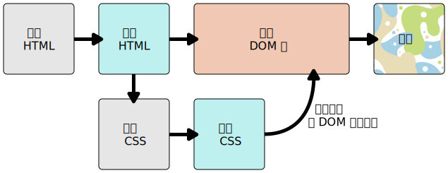

{{PreviousMenuNext("Learn_web_development/Getting_started/Web_standards/The_web_standards_model", "Learn_web_development/Getting_started/Soft_skills", "Learn_web_development/Getting_started/Web_standards")}}

在上一篇文章中，我们介绍了构建网站所用的[各类技术](/zh-CN/docs/Learn_web_development/Getting_started/Web_standards/The_web_standards_model#现代_web_技术概述)。本文将深入讲解这些技术（在[万维网是如何工作的](/en-US/docs/Learn_web_development/Getting_started/Web_standards/How_the_web_works)这一篇中提及）是如何被浏览器渲染出来的——当浏览器收到构成网页的代码文件和其他资源后，它们如何被组合成用户最终看到并与之交互的完整页面？

<table>
  <tbody>
    <tr>
      <th scope="row">前提：</th>
      <td>
        对你使用的操作系统、网页浏览器及基本网络技术有初步了解。
      </td>
    </tr>
    <tr>
      <th scope="row">学习成果：</th>
      <td>
        <ul>
          <li>了解 HTTP 响应中可能包含哪些类型的文件。</li>
          <li>理解浏览器如何将这些文件组合并渲染成用户可见的网页。</li>
          <li>认识浏览器作为开发环境的两面性：既充满挑战，又极具魅力。</li>
        </ul>
      </td>
    </tr>
  </tbody>
</table>

## HTTP 响应中通常包含哪些文件？

回顾上一篇介绍的现代网页技术，一个网页请求的 HTTP 响应中通常会包含以下一种或多种文件类型：

- **HTML 文件**：定义网页的内容与结构。
- **CSS 文件**：控制网页的样式与布局。
- **JavaScript 文件**：实现网页的交互行为。
- **媒体资源**：如图片、视频、音频、[PDF](/zh-CN/docs/Glossary/PDF) 或 [SVG](/zh-CN/docs/Glossary/SVG)，可直接嵌入页面或由浏览器展示。
- **其他类型文件**：例如 Word 文档、PowerPoint 幻灯片等，浏览器无法直接处理，通常会调用系统中相应的应用程序打开。

## 网页渲染过程

当用户访问一个新网页（比如点击链接或输入网址）时，浏览器会发出多个 HTTP 请求，并接收到 HTTP 响应中的多个文件。浏览器会处理这些文件，将它们组合成一个可交互的网页。这个过程称为**渲染**。

下面我们从高层次来理解浏览器渲染网页的基本步骤。注意，不同浏览器的实现细节可能有所不同，但核心流程大致相似。

## 处理 HTML

浏览器首先收到 HTML 文件，并将其解析成一棵**DOM 树**（**文档对象模型**）。DOM 以树状结构在内存中表示整个 HTML 文档的层次关系。例如下面这段简单的 HTML：

```html
<p>
  Let's use:
  <span>HTML</span>
  <span>CSS</span>
  <span>JavaScript</span>
</p>
```

每个标签、属性和文本都会成为树结构中的一个 **DOM 节点**。节点之间通过父子、兄弟关系相互关联。节点通过其与其他 DOM 节点的关系来定义。某些元素是子节点的父节点，而子节点之间存在兄弟节点关系。以上面的 HTML 为例，浏览器将解析此 HTML 并据此创建以下 DOM 树：

```plain
P
├─ "Let's use:"
├─ SPAN
|  └─ "HTML"
├─ SPAN
|  └─ "CSS"
└─ SPAN
    └─ "JavaScript"
```

在这棵 DOM 树中，`<p>` 元素对应的节点为父节点。其子节点包含一个文本节点和三个 `<span>` 元素对应的节点。而这些 SPAN 节点同样也是一些文本节点的父节点。浏览器渲染的 DOM 树大概长这样：

{{EmbedLiveSample('处理 HTML', '100%', 55)}}

```css hidden
p {
  margin: 0;
}
```

在解析 HTML 过程中，如果遇到以下元素，浏览器通常会发起额外的 HTTP 请求来获取外部资源：

- {{htmlelement("link")}} 引用的外部 [CSS](/zh-CN/docs/Learn_web_development/Core/Styling_basics) 样式表。
- {{htmlelement("script")}} 引用的外部 [JavaScript](/zh-CN/docs/Learn_web_development/Core/Scripting) 文件。
- {{htmlelement("img")}}、{{htmlelement("video")}}、{{htmlelement("audio")}} 等用于引用希望嵌入网页的媒体文件的元素。

## 解析 CSS 并渲染页面

接下来，浏览器按照以下步骤处理 CSS：

1. 解析所有 CSS（包括 HTML 自带以及外部引用的样式表），并根据应用的 HTML 元素将 CSS 的样式规则放入不同的“桶”（映射到 DOM 树中叫做**结点**），并按需将样式附加到对应的不同的元素中（这一中间步骤形成**渲染树**）。
2. 在应用规则后呈现渲染树应当展现的结构。包括任何图像等将要嵌入网页的媒体文件。
3. 将布局后的节点实际显示到屏幕上（这一步叫做**绘制**）。

整个过程可参考以下示意图：



回到之前的例子，

```html hidden
<p>
  Let's use:
  <span>HTML</span>
  <span>CSS</span>
  <span>JavaScript</span>
</p>
```

回到我们的示例，假设在 HTML 文件中发现了以下 CSS 代码：

```css
span {
  border: 1px solid black;
  background-color: lime;
}
```

CSS 中唯一一个规则是 `<span>` 的选择器，所以浏览器可以很快的处理！浏览器会将这个样式应用到每一个 `<span>` 节点，绘制出带边框和绿色背景的效果

更新后的效果大概长这样：

{{EmbedLiveSample('解析 CSS 并渲染页面', '100%', 90)}}

## 处理 JavaScript

CSS 处理完成后，浏览器开始执行 JavaScript。JavaScript 可能在 HTML 中内联，也可能来自外部文件。它能够动态修改 DOM 或样式，因此执行时机往往会影响最终渲染结果。

继续之前的例子，假设我们在 HTML 文件中找到了以下 JavaScript 代码：

```html hidden
<p>
  Let's use:
  <span>HTML</span>
  <span>CSS</span>
  <span>JavaScript</span>
</p>
```

```css hidden
span {
  border: 1px solid black;
  background-color: lime;
}
```

```js
const spans = document.querySelectorAll("span");
spans.forEach((span) => {
  const reversedText = span.textContent.split("").reverse().join("");
  span.textContent = reversedText;
});
```

你无需精确理解这段 JavaScript 的工作原理，但从高层次来看，它会遍历 DOM 中的所有 SPAN 节点，并将它们子文本节点中的字符顺序进行反转。

最终输出如下：

{{EmbedLiveSample('处理 JavaScript', '100%', 90)}}

## 其他渲染相关步骤

除了上述核心流程，渲染过程中还会发生一些其他步骤，不过我们不会在此处全部提及。一个重要的步骤是**构建无障碍树**：浏览器会基于 DOM 生成一份辅助技术（如屏幕阅读器）专用的树状结构，帮助视障用户理解页面内容。

我们将在后续的[无障碍考虑](/zh-CN/docs/Learn_web_development/Core/Accessibility)模块中详细介绍这一点。

## 浏览器作为开发环境：棘手_但_并存魅力

前端开发有时会让人感到棘手，因为浏览器环境具有很大的不确定性。你无法完全控制用户使用的设备、浏览器版本、网络状况、屏幕尺寸等因素，因此很难保证所有用户都能获得完全一致的体验。

这也使得浏览器被称为一个“充满挑战”的编程环境。应对这种挑战的最佳方式，是遵循上一篇文章中提到的[网页最佳实践](/zh-CN/docs/Learn_web_development/Getting_started/Web_standards/The_web_standards_model#web_best_practices)，并采用渐进增强、优雅降级等开发策略。

与此同时，浏览器也是一个“极具魅力”的环境，原因包括：

- **开放与可访问**：Web 天生就是开放、可链接的，易于分享和传播。
- **无需安装**：用户只需一个链接即可访问应用，无需下载安装包。
- **即时更新**：开发者更新代码后，用户刷新页面即可获得最新版本。
- **活跃的社区**：Web 技术生态丰富，学习资源众多，社区氛围友好，容易获得帮助。

## 参见

- [何时以及如何向浏览器报告缺陷报告](/zh-CN/docs/Learn_web_development/Howto/Web_mechanics/File_browser_bugs)
  - 如果浏览器中某些功能未按预期运行，可能是浏览器存在缺陷。本文将说明如何判断是否存在缺陷，以及如何提交缺陷报告。

{{PreviousMenuNext("Learn_web_development/Getting_started/Web_standards/The_web_standards_model", "Learn_web_development/Getting_started/Soft_skills", "Learn_web_development/Getting_started/Web_standards")}}
