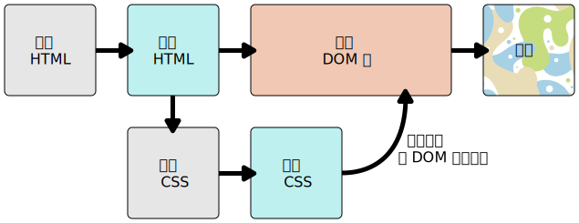

{{PreviousMenuNext("Learn_web_development/Getting_started/Web_standards/The_web_standards_model", "Learn_web_development/Getting_started/Soft_skills", "Learn_web_development/Getting_started/Web_standards")}}

在上一篇文章中，我们介绍了构建网站所用的[各类技术](/zh-CN/docs/Learn_web_development/Getting_started/Web_standards/The_web_standards_model#现代_web_技术概述)。本文将深入讲解这些技术（在[万维网是如何工作的](/zh-CN/docs/Learn_web_development/Getting_started/Web_standards/How_the_web_works)这一篇中提及）是如何被浏览器渲染出来的——当浏览器收到构成网页的代码文件和其他资源后，它们如何被组合成用户最终看到并与之交互的完整页面？

<table>
  <tbody>
    <tr>
      <th scope="row">前提：</th>
      <td>
        对你使用的操作系统、网页浏览器及基本 web 技术有初步了解。
      </td>
    </tr>
    <tr>
      <th scope="row">学习成果：</th>
      <td>
        <ul>
          <li>了解 HTTP 响应中可能包含哪些类型的文件。</li>
          <li>理解浏览器如何将这些文件组合并渲染成用户可见的网页。</li>
          <li>认识浏览器作为开发环境的两面性：既充满挑战，又极具魅力。</li>
        </ul>
      </td>
    </tr>
  </tbody>
</table>

## HTTP 响应中通常包含哪些文件？

回顾上一篇介绍的现代网页技术，一个网页请求的 HTTP 响应中通常会包含以下一种或多种文件类型：

- HTML 文件：定义网页的内容与结构。
- CSS 文件：控制网页的样式与布局。
- JavaScript 文件：实现网页的交互行为。
- 媒体资源：如图片、视频、音频、[PDF](/zh-CN/docs/Glossary/PDF) 或 [SVG](/zh-CN/docs/Glossary/SVG)，可直接嵌入页面或由浏览器展示。
- 其他类型文件：例如 Word 文档、PowerPoint 幻灯片、Open Office 文件等，浏览器无法直接处理，通常会调用系统中相应的应用程序打开。

## 网页渲染过程

当用户访问一个新网页（比如点击链接或输入网址）时，浏览器会发出多个 HTTP 请求，并接收到 HTTP 响应中的多个文件。浏览器会处理这些文件，将它们组合成一个可交互的网页。这个过程称为**渲染**。

下面我们从高层次来理解浏览器渲染网页的基本步骤。注意，不同浏览器的实现细节可能有所不同，但核心流程大致相似。

## 处理 HTML

浏览器首先收到 HTML 文件，并将其解析成一棵**DOM 树**（**文档对象模型**）。DOM 以树状结构在内存中表示整个 HTML 文档的层次关系。例如下面这段简单的 HTML：

```html
<p>
  Let's use:
  <span>HTML</span>
  <span>CSS</span>
  <span>JavaScript</span>
</p>
```

每个标签、属性和文本都会成为树结构中的一个 **DOM 节点**。节点之间通过父子、兄弟关系相互关联。节点通过其与其他 DOM 节点的关系来定义。某些元素是子节点的父节点，而子节点之间存在兄弟节点关系。以上面的 HTML 为例，浏览器将解析此 HTML 并据此创建以下 DOM 树：

```plain
P
├─ "Let's use:"
├─ SPAN
|  └─ "HTML"
├─ SPAN
|  └─ "CSS"
└─ SPAN
    └─ "JavaScript"
```

在这棵 DOM 树中，`<p>` 元素对应的节点为父节点。其子节点包含一个文本节点和三个 `<span>` 元素对应的节点。而这些 SPAN 节点同样也是一些文本节点的父节点。浏览器渲染的 DOM 树大概长这样：

{{EmbedLiveSample('处理 HTML', '100%', 55)}}

```css hidden
p {
  margin: 0;
}
```

在解析 HTML 过程中，如果遇到以下元素，浏览器会发起额外的 HTTP 请求来获取外部资源：

- {{htmlelement("link")}} 引用的外部 [CSS](/zh-CN/docs/Learn_web_development/Core/Styling_basics) 样式表。
- {{htmlelement("script")}} 引用的外部 [JavaScript](/zh-CN/docs/Learn_web_development/Core/Scripting) 文件。
- {{htmlelement("img")}}、{{htmlelement("video")}}、{{htmlelement("audio")}} 等用于引用希望嵌入网页的媒体文件的元素。

## 解析 CSS 并渲染页面

接下来，浏览器按照以下步骤处理 CSS：

1. 解析所有页面中的 CSS（包括 HTML 自带以及外部引用的样式表），并根据应用的 HTML 元素将 CSS 的样式规则放入不同的“桶”（映射到 DOM 树中叫做**节点**），并按需将样式附加到对应的不同的元素中（这一中间步骤形成渲染树）。
2. 在应用规则后呈现渲染树应当展现的结构。包括任何图像等将要嵌入网页的媒体文件。
3. 将布局后的节点实际显示到屏幕上（这一步叫做绘制）。

整个过程可参考以下示意图：



回到我们的示例，假设在 HTML 文件中发现了以下 CSS 代码：

```html hidden
<p>
  Let's use:
  <span>HTML</span>
  <span>CSS</span>
  <span>JavaScript</span>
</p>
```

```css
span {
  border: 1px solid black;
  background-color: lime;
}
```

CSS 中唯一一个规则是 `span` 选择器，所以浏览器可以很快的处理！浏览器会将这条规则应用到 DOM 树的三个 SPAN 节点，绘制出带黑色边框和柠檬绿背景的效果，最后将最终的视觉呈现绘制到屏幕上。

更新后的效果大概长这样：

{{EmbedLiveSample('解析 CSS 并渲染页面', '100%', 90)}}

## 处理 JavaScript

在处理完 CSS 之后，页面上发现的任何 JavaScript（无论是包含在 HTML 文件中，还是从外部脚本文件中获取的）都会被解析、解释、编译并执行。这发生在最终页面渲染完成之前某个时间点——毕竟某些 JavaScript 可能会影响渲染过程，例如向 DOM 添加节点或修改现有节点。

继续之前的例子，假设我们在 HTML 文件中找到了以下 JavaScript 代码：

```html hidden
<p>
  Let's use:
  <span>HTML</span>
  <span>CSS</span>
  <span>JavaScript</span>
</p>
```

```css hidden
span {
  border: 1px solid black;
  background-color: lime;
}
```

```js
const spans = document.querySelectorAll("span");
spans.forEach((span) => {
  const reversedText = span.textContent.split("").reverse().join("");
  span.textContent = reversedText;
});
```

你无需精确理解这段 JavaScript 的工作原理，但从高层次来看，它会遍历 DOM 中的所有 SPAN 节点，并将它们子文本节点中的字符顺序进行反转。

最终输出如下：

{{EmbedLiveSample('处理 JavaScript', '100%', 90)}}

## 其他渲染相关步骤

除了上述核心流程，渲染过程中还会发生一些其他步骤，不过我们不会在此处全部提及。一个重要的步骤是构建无障碍树：浏览器会基于 DOM 生成一份辅助技术（如屏幕阅读器）专用的树状结构，帮助视障用户理解页面内容。

我们将在后续的[无障碍考虑](/zh-CN/docs/Learn_web_development/Core/Accessibility)模块中详细介绍这一点。

## 浏览器：棘手*但*超赞的变成环境

前端 web 开发有时令人沮丧，有人甚至认为浏览器是非常棘手的编程环境。这是因为与其他编程环境不同，你很难保证代码在目标环境中的运行效果。无法预先知晓用户可能使用的所有操作系统、浏览器、语言、地理位置、网络连接、CPU、GPU、内存、电池寿命等组合，因此无法保证所有用户都能获得完美的体验。

现代浏览器虽已相当一致地实现了 web 标准，但仍存在诸多不确定性需要应对。作为 web 开发者，你需要接受这种不确定性，采用防御性编程方式，并谨慎使用功能特性。这需要遵循前文所述的[最佳实践](/zh-CN/docs/Learn_web_development/Getting_started/Web_standards/The_web_standards_model#web_最佳实践)。

从积极方面看，web 同样是一个绝佳的编程环境，原因有很多。

- 首先，它在设计之初就考虑了普适访问性。web 的基本状态是可访问且可链接的，而这些基础特性在其他环境中往往难以实现。
- 通过网络分发应用程序既简单又强大。无需让用户经历复杂的安装流程：只需指向一个网址，他们就能立即使用。
- 应用更新通常直截了当。多数情况下，访客只需刷新浏览器标签页即可看到新版应用。无需担心引导访客定期下载安装软件更新。
- web 社区充满活力且乐于助人。正如稍后的[研究与学习](/zh-CN/docs/Learn_web_development/Getting_started/Soft_skills/Research_and_learning)文章所述，这里有大量求助渠道和优质学习资源可供利用。

## 参见

- [何时以及如何向浏览器报告缺陷报告](/zh-CN/docs/Learn_web_development/Howto/Web_mechanics/File_browser_bugs)
  - 如果浏览器中某些功能未按预期运行，可能是浏览器存在缺陷。本文将说明如何判断是否存在缺陷，以及如何提交缺陷报告。

{{PreviousMenuNext("Learn_web_development/Getting_started/Web_standards/The_web_standards_model", "Learn_web_development/Getting_started/Soft_skills", "Learn_web_development/Getting_started/Web_standards")}}
